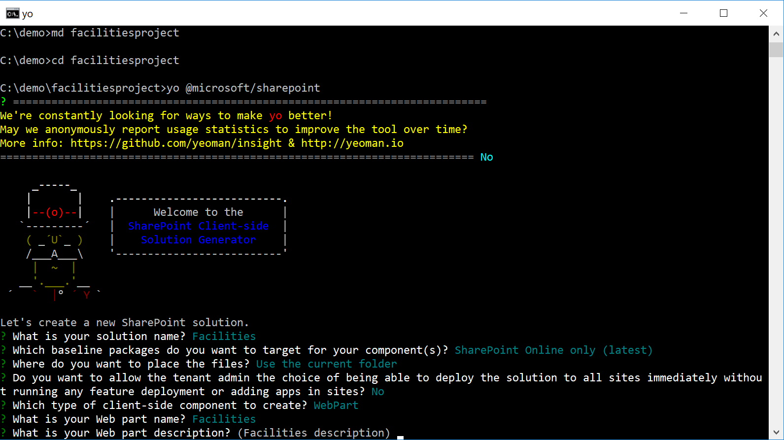
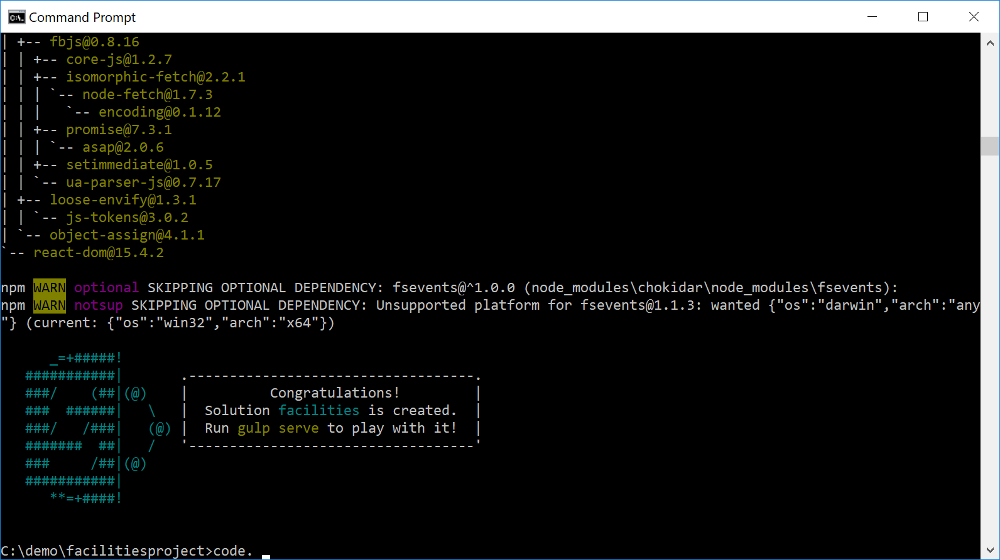
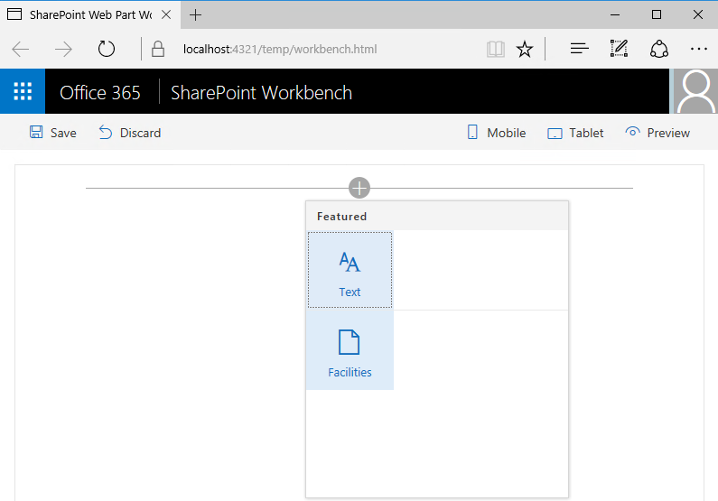
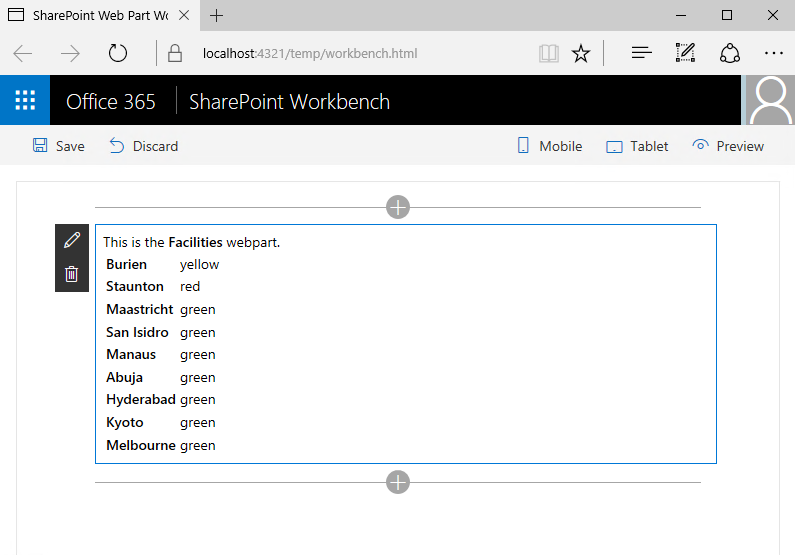
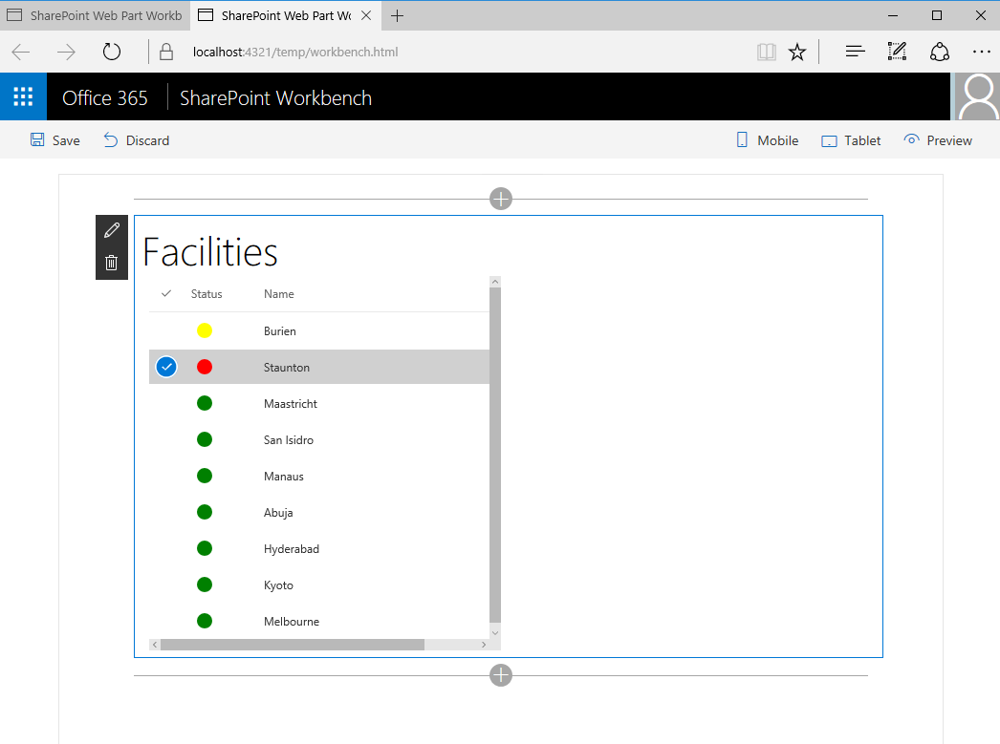
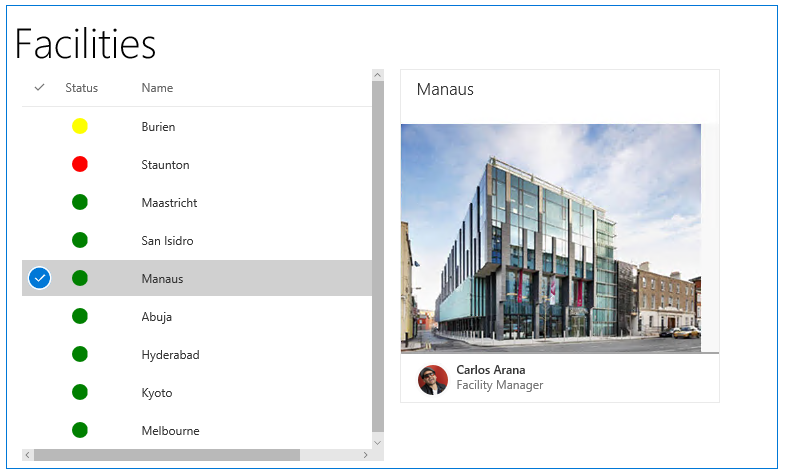

# Build a SharePoint Framework Web Part
 
### Introduction

In this walkthrough, we’ll create a full SharePoint Framework web part from scratch.  The scenario is that we work in facilities for a major company, and want to display a list of facilities, their overall status, and a list of issues coming from a SharePoint list.

You can find a full, final version of this web part at https://github.com/mammerla/spfx-basic-webpart.

### Create your First Project

Open up a command prompt. Use Start, search for "Command Prompt", and select that application.

Within c:\demo, create a folder and run Yeoman:

``` md facilitiesproject
cd facilitiesproject
yo @microsoft/sharepoint 
```
 

Enter "Facilities" for Solution Name.  
Select "SharePoint Online only (latest)".  
Select "Use the current folder" 
Select No for "Do you want to allow the tenant admin the choice..".  
Choose a web part and name it "Facilities".  
Accept the default description.
Select the React framework.




Note that it may take around 3 minutes for the project to download and create resources.  While you wait, you may want to find out more about SharePoint development at https://dev.office.com/sharepoint. 
 


### Start Visual Studio Code
Now we’ll start Visual Studio Code, pointed at the root folder of your project.  This will open the entire folder that you can browse within Visual Studio Code, and is where we’ll do the editing.  At the command prompt, enter:
 
```
code .
``` 

 
### Run your first project
Note that the first time you run a SharePoint Framework project, you’ll need to trust some development certificates in order for the debug experience to work.  Enter the following command:
 
```
gulp trust-dev-cert
```

Select yes to the "Do you trust this certificate" prompt that shows up.
At the command prompt, run the following command:

```
gulp serve
```

This will run the Gulp in a continuous ‘streaming’ mode, so as changes are made, they will be picked up, re-compiled, and re-opened in your default browser.  When compilation is complete, the SharePoint Workbench will open within your web browser window.  You can then use the Web Part Picker to add your Hello World Part to the page.
 

### Start Retrieving Data

Now, we’ll start to add some useful functionality to the web part. We want to pull in some data and render it inline on the control.
 
### Add a State Object and Use it in Your Part

Locate your React Component which will render our list of Facilities. Within Visual Studio code, in the src/webparts/facilities/components folder, open up Facilities.tsx.

At the top of the file, above "export default class Facilities…", paste in the following lines of code.

```
export interface IFacilitiesState
{
  items?: any[];
}
```

Also, update the following line (the type definition) to replace void with IFacilitiesState.  Change this:

```
export default class Facilities extends React.Component<IFacilitiesProps, void> {
```

to:

```
export default class Facilities extends React.Component<IFacilitiesProps, IFacilitiesState> {
```

### Add a Data Retrieval Constructor
 
Add a Data Retrieval constructor, above the public render() function.  This will fetch our facilities data from a web service, and update the React Component State object.

``` 
constructor(props: { description : string })
  {
    super(props);
    this.state = { items: new Array() };
    let self = this;
  fetch("https://spawesome.blob.core.windows.net/facilities/facilities.json",  
           { "credentials": "omit" } )
      .then((response) => response.json())
      .then((responseData) => {                 
          self.setState( {
                    items: responseData,
                });
      });
  }
 ```

### Add the following render markup.  

Note that in React we can mix markup with code. Within the render() function, replace "return ( … );" with the following:

```
   return (
      <div className={styles.container}>
        <div>This is the <b>{this.props.description}</b> webpart.</div>
        <table>
          <tbody>
      {
        this.state.items.map(function(object, i)
        {
         return <tr><td><b>{object.name}</b></td><td>{object.status}</td></tr>;
        })
      }
          </tbody>
        </table>
      </div>
    );
```

Now, save facilities.tsx to let gulp serve recompile and run the project.  Within your web browser, you should see a very basic list of facilities, along with a text description of their status.
 





### Improve the Appearance of the Web Part

This web part works, but could stand to look better.  Let’s use Office UI Fabric to improve the experience. 
 
#### Add Office UI Fabric React to your project

Run the following command from the prompt to add Office UI Fabric Libraries to your project.  

```
npm i office-ui-fabric-react@2.28.0 --save
```

(note: you may need to hit Ctrl-C to stop gulp serve in your existing command prompt window.   Re-run gulp serve in the command prompt after running the command prompt.)

This command may take two minutes to run.
 
#### Add Imports for Office UI Fabric 

Back in Visual Studio Code, add Imports for Office UI Fabric into Facilities.tsx, beneath the existing import statements (around line #7).

```
import
{
  DetailsList
} from 'office-ui-fabric-react';
```

Add the following line to IFacilitiesState, beneath the "items?: any[];" line, to support tracking a selected item:
   selectedItem?: any;
 

 
### Update the Render Function

Completely replace the following code, starting at the top of the existing render function – and all the way to the end of the file, with the following, into Facilities.tsx:
 
```
public render(): JSX.Element {
    return (
      <div className={styles.container}>
        <div className="ms-font-su"> { this.props.description }</div>
 
        <div className="ms-Grid">
          <div className="ms-Grid-row">
            <div className="ms-Grid-col ms-u-sm6 ms-u-md4 ms-u-lg6">
              <DetailsList    items={ this.state.items }
                              onItemInvoked={ (item, index) => this.setState( { selectedItem: item } ) }
                              onRenderItemColumn={ _renderItemColumn }
                              columns={
                                [
                                  {
                                    key: "status",
                                    name: "Status",
                                    fieldName: "status",
                                    minWidth: 60
                                  },
                                  {
                                    key: "name",
                                    name: "Name",
                                    fieldName: "name",
                                    minWidth: 300
                                  }
                                ] } />
            </div>
          </div>
        </div>
      </div>
    );
  } 
}
 
function _renderItemColumn(item, index, column)
{
  const fieldContent = item[column.fieldName];
 
  switch (column.key)
  {
    case 'status':
      return <div style={ { backgroundColor: fieldContent, borderRadius: "16px", width: "16px", marginLeft: "6px" } }>&nbsp;</div>;
 
    default:
      return <span>{ fieldContent }</span>;
  }
}
```

Now, let the project run and compile via Gulp Serve.  You should be able to see a much nicer list of facilities.



 
Now, let’s add a new React Component to Show Facility Details
 
We’d like to have it so that when a user double-clicks on a facility, we show more detilas.  Let’s add a new component that does this.
 
Add a new React component called "facility.tsx" to the "facilities" folder. 

```
import * as React from 'react'; 
import { 
  EnvironmentType 
} from '@microsoft/sp-core-library'; 
import styles from './Facilities.module.scss'; 
import { 
  IWebPartContext 
} from '@microsoft/sp-webpart-base';
import {
  SPHttpClient,
  SPHttpClientResponse   
} from '@microsoft/sp-http';
import 
{ 
  DocumentCard, 
  DocumentCardPreview, 
  DocumentCardActivity, 
  DocumentCardTitle 
} from 'office-ui-fabric-react'; 
 
export interface IFacilityState { 
} 
 
export interface IFacilityProps { 
  context?: IWebPartContext; 
  item?: any; 
} 
export default class Facility extends React.Component<IFacilityProps, IFacilityState> { 
  constructor(props: { context : IWebPartContext }) 
  { 
    super(props); 
  } 
  public render(): JSX.Element { 
    return ( 
      <div> 
        <DocumentCard> 
          <DocumentCardTitle title={ this.props.item ? this.props.item.name : '' } /> 
          <DocumentCardPreview previewImages={ [ 
            this.props.item ? 
            { 
              previewImageSrc: "https://spawesome.blob.core.windows.net/facilities/" + this.props.item.name.toLowerCase() + ".jpg" 
            } : '' 
          ]}/> 
          <DocumentCardActivity 
            activity='Facility Manager' 
            people={ 
                   this.props.item ? 
                    [ 
                      { 
                        name: this.props.item.facilitiesManagerName, 
                        profileImageSrc: 'https://spawesome.blob.core.windows.net/resources/avatar-' + this.props.item.facilitiesManagerAlias + '.png' 
                      } 
                    ] : null 
                  } 
                /> 
        </DocumentCard> 
      </div> 
    ); 
  } 
} 
```

Now add our Facility component to our Facilities list.  
Add the following to the top of Facilities.tsx:

```
import Facility from './Facility';
 
import {
  IWebPartContext
} from '@microsoft/sp-webpart-base';
```

And add the Facility detail React Component to the set of Facilities
 
Add the following to Facilities.tsx, beneath the <div> that holds <DetailsList … />:

```
            <div className="ms-Grid-col ms-u-sm6 ms-u-md8 ms-u-lg6"> 
              <Facility item={this.state.selectedItem}  /> 
            </div>
```

Now, save Facilities.tsx and Facility.tsx.  Let gulp serve recompile your project, and refresh the SharePoint Workbench in your web browser.  Now, as you double click on Facilities, you should see a preview of the part:
 


 
That’s it!  Now you have a function Facilities Report web part!
 