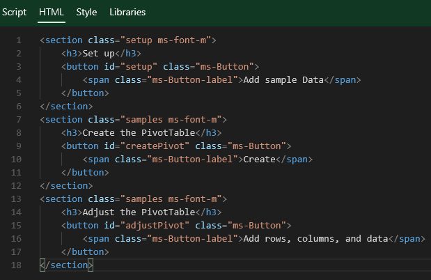
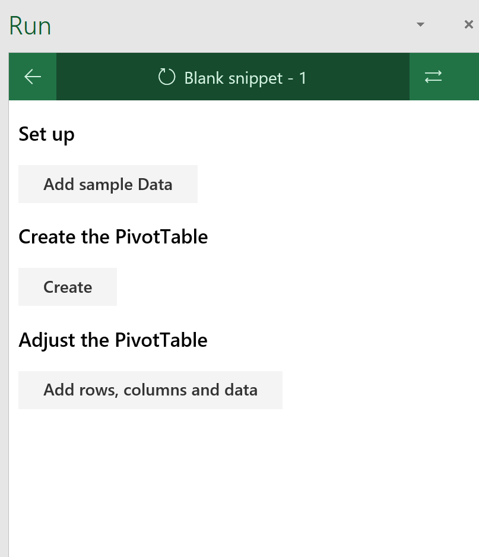
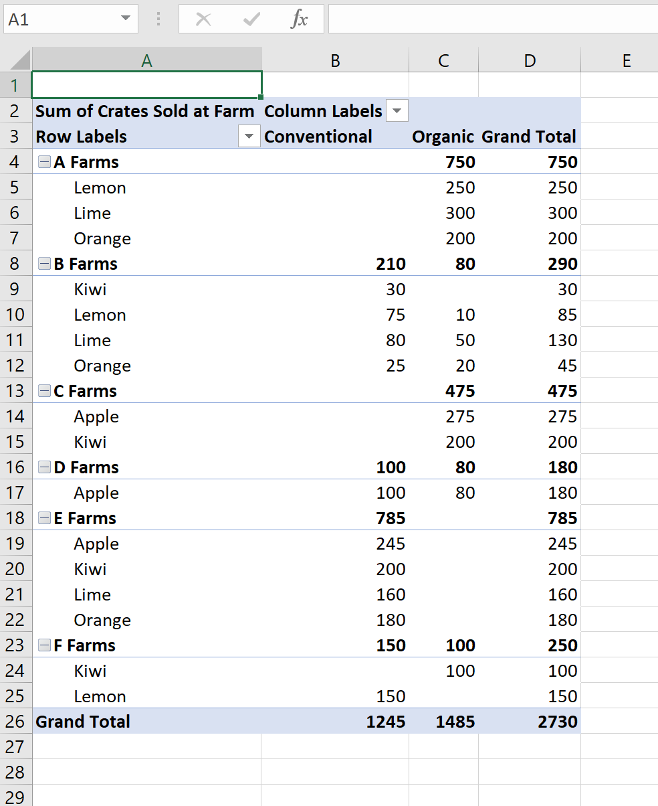

# New in the Excel JavaScript API: Creating Data Analysis Web Add-ins for Excel using PivotTables.

During this lab you will learn the basics on how to create PivotTables with the Excel JavaScript API. This lab uses hard-coded sample data from a separate worksheet, but the add-in could pull the information from numerous sources. The raw data worksheet looks like this:

## 

## Preparation

This lab is done with Script Lab. Script Lab is an add-in for developing and testing other add=ins. Within Excel, you can test, build, and share your solutions. Script Lab is available from the Add-ins Store.

## 

## Step 1: Setup your snippet in Script Lab

You'll prepare Script Lab to setup your sample. We will link the correct libraries, write an HTML front-end, and code the program logic in TypeScript.

### Step 1.1: Create a new Script Lab snippet

Click on the **Code** button on the **Script Lab** ribbon tab. That opens a task pane like this one:


### Step 1.2: Use beta libraries

In order to use the PivotTable API, you need to reference the Office.js beta library and type definitions. Click on the **Libraries** tab and change the first two lines to:

```
https://appsforoffice.microsoft.com/lib/beta/hosted/office.js
https://appsforoffice.microsoft.com/lib/beta/hosted/office.d.ts
```

### Step 1.3: Setup HTML Page

Now, click on the **HTML** tab and add three buttons. These will be used to insert sample data, create a PivotTable, and add hierarchies to the PivotTable. Replace the contents of the **HTML** tab with the following:

```html
<section class="setup ms-font-m">
    <h3>Set up</h3>
    <button id="setup" class="ms-Button">
        <span class="ms-Button-label">Add sample Data</span>
    </button>
</section>
<section class="samples ms-font-m">
    <h3>Create the PivotTable</h3>
    <button id="createPivot" class="ms-Button">
        <span class="ms-Button-label">Create</span>
    </button>
</section>
<section class="samples ms-font-m">
    <h3>Adjust the PivotTable</h3>
    <button id="adjustPivot" class="ms-Button">
        <span class="ms-Button-label">Add rows, columns, and data</span>
    </button>
</section>
```

Your **HTML** tab should look like this:


### Step 1.4 : Add  Event handlers for each button.

Now click on the **Script** tab on the Script Lab task pane and add an event handler for each button.

Replace the existing code with the following:

```typescript
$("#setup").click(() => tryCatch(setup));
$("#createPivot").click(() => tryCatch(createPivot));
$("#adjustPivot").click(() => tryCatch(adjustPivot));

async function setup() {
    await Excel.run(async (context) => {
        // TODO-1: Fill a worksheet with sample data
    });
}

async function createPivot() {
    await Excel.run(async (context) => {
        // TODO-2: Create a PivotTable
    });
}

async function adjustPivot() {
    await Excel.run(async (context) => {
        // TODO-3: Add hierarachies to the PivotTable
    });
}

/** Default helper for invoking an action and handling errors. */
async function tryCatch(callback) {
    try {
        await callback();
    }
    catch (error) {
        OfficeHelpers.UI.notify(error);
        OfficeHelpers.Utilities.log(error);
    }
}
```
## Step 2: Create your PivotTable 

Step 2.1: Insert sample data

Reaplce `TODO-1` with the following:

```typescript
        const sheetData = await OfficeHelpers.ExcelUtilities
            .forceCreateSheet(context.workbook, "Data");
        const sheetPivot = await OfficeHelpers.ExcelUtilities
            .forceCreateSheet(context.workbook, "Pivot");

        const data = [["Farm", "Type", "Classification", "Crates Sold at Farm", "Crates Sold Wholesale"],
        ["A Farms", "Lime", "Organic", 300, 2000],
        ["A Farms", "Lemon", "Organic", 250, 1800],
        ["A Farms", "Orange", "Organic", 200, 2200],
        ["B Farms", "Lime", "Conventional", 80, 1000],
        ["B Farms", "Lemon", "Conventional", 75, 1230],
        ["B Farms", "Orange", "Conventional", 25, 800],
        ["B Farms", "Orange", "Organic", 20, 500],
        ["B Farms", "Lemon", "Organic", 10, 770],
        ["B Farms", "Kiwi", "Conventional", 30, 300],
        ["B Farms", "Lime", "Organic", 50, 400],
        ["C Farms", "Apple", "Organic", 275, 220],
        ["C Farms", "Kiwi", "Organic", 200, 120],
        ["D Farms", "Apple", "Conventional", 100, 3000],
        ["D Farms", "Apple", "Organic", 80, 2800],
        ["E Farms", "Lime", "Conventional", 160, 2700],
        ["E Farms", "Orange", "Conventional", 180, 2000],
        ["E Farms", "Apple", "Conventional", 245, 2200],
        ["E Farms", "Kiwi", "Conventional", 200, 1500],
        ["F Farms", "Kiwi", "Organic", 100, 150],
        ["F Farms", "Lemon", "Conventional", 150, 270]];

        const range = sheetData.getRange("A1:E21");
        range.values = data;
        range.format.autofitColumns();

        sheetPivot.activate();

        await context.sync();
```

Step 2.2: Create the base PivotTable

Replace `TODO-2` with the following:

```typescript
        const rangeToAnalyze = context.workbook.worksheets.getItem("Data").getRange("A1:E21");
        const rangeToPlacePivot = context.workbook.worksheets.getItem("Pivot").getRange("A2");
        context.workbook.worksheets.getItem("Pivot").pivotTables.add("Farm Sales", rangeToAnalyze, rangeToPlacePivot);

        await context.sync();
```

Step 2.3: Add row, column, and data hierarchies

Replace `TODO-3` with the following:

```typescript
		const pivotTable = context.workbook.worksheets.getActiveWorksheet().pivotTables.getItem("Farm Sales");

		//add row hierarchies
		pivotTable.rowHierarchies.add(pivotTable.hierarchies.getItem("Farm"));
		pivotTable.rowHierarchies.add(pivotTable.hierarchies.getItem("Type"));

		// add column hierarchies
		pivotTable.columnHierarchies.add(pivotTable.hierarchies.getItem("Classification");

		// add data hierarchies
		const myValue = pivotTable.dataHierarchies.add(pivotTable.hierarchies.getItem("Crates Sold at Farm"));
		myValue.summarizeBy = Excel.AggregationFunction.sum;

		await context.sync();
```

## Step 3: Run your sample!

Click on the **Run** tab on the “Script Lab” ribbon.


You should see a Task Pane with the HTML you created in the previous step.




Click the buttons in top/down order and you will see a PivotTable like this one:



