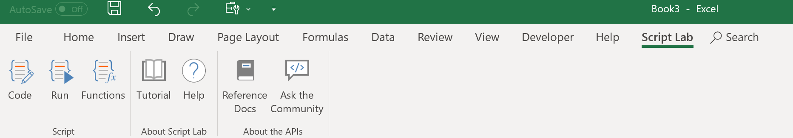
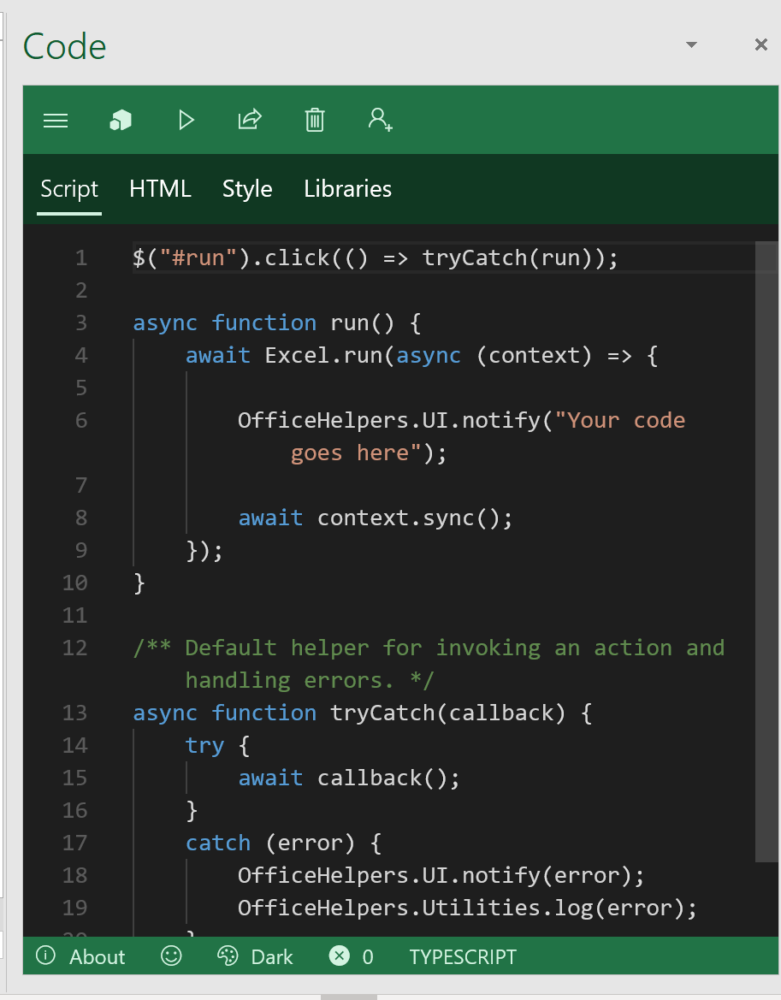
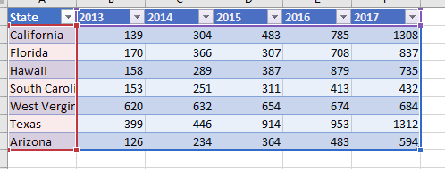

# Use the new Office JavaScript Chart and Events APIs to build an interactive data visualization
This hands-on-lab introduces you to creating an interactive Excel add-in. You will customize chart elements and learn how to instrument event handlers.

## Preparation

### Lab tips

**Tip #1**  
At the top of this pane are two tabs: **Instructions** and **Resources**. 

- The **Resources** tab contains the Windows 10 login credentials that you'll need for this lab's startup screen.

- The **Instructions** tab within this pane contains these lab instructions. Switch back to the **Instructions** tab after you've acquired the necessary login credentials from the **Resources** tab.

**Tip #2**  
This pane is resizeable. For an optimal viewing experience, you may wish to resize this pane to be wider than its default width.

**Tip #3**  
To copy/paste code from a code block into Script Lab, click the **[T]** button that appears next to the code block. *Avoid* clicking anywhere within a code block, as doing so will also copy/paste the code into the active application.

### Excel and ScriptLab

This lab is done with Script Lab. Script Lab is an add-in for developing and testing other add-ins. Within Excel, you can test, build, and share your solutions. Script Lab is available from the Add-ins Store.

Open Excel to begin. You will be prompted to sign in to Office. That is not necessary for the lab. Please dismiss the login window.

Select **Blank Workbook** to begin. 



## Step 1: Setup your sample in Script Lab

You'll prepare Script Lab to code and run your sample. We'll write an HTML front-end and code the program logic in TypeScript. 
Open a blank workbook in Excel to begin. 

Go to the **Script Lab** ribbon tab and select **Code**. Once Script Lab loads in the pane, select the `+` icon to create a new add-in snippet. That opens a task pane like this one: 
 


### Step 1.1: Create buttons in HTML

You will start with the user interface. The lab sample needs to do four tasks, each of which will become a button:

1. Insert sample data.
2. Create a chart.
3. Register the events with event handlers.
4. Customize the chart. This will be hidden by default and shown when the chart is activated.

This UI is written in HTML. In Script Lab, select the **HTML** tab. Here, you create the four buttons. Replace the contents of the HTML tab with the following:

```html
<b>Step 1: Insert sample data</b>
<p>
<button id="run" class="ms-Button">
    <span class="ms-Button-label">Insert data</span>
</button>
<p>
<b>Step 2: Create a chart</b>
<p>
<button id="create" class="ms-Button">
    <span class="ms-Button-label">Create chart</span>
</button>
<p>
<b>Step 3: Register chart activate/deactivate events</b>
<p>
<button id="register" class="ms-Button">
    <span class="ms-Button-label">Register event</span>
</button>
<p>
<b>Step 4: Show the customize button when chart is activated</b>
<p>
<button id="customize" class="ms-Button" style="display:none">
    <span class="ms-Button-label">Customize chart</span>
</button>
```

### Step 1.2: Add script template

Select the **Script** tab in Script Lab. Replace the text with the following:

```typescript
// TODO-1: Add button click bindings

// TODO-2: Setup up the sample table

// TODO-3: Create the chart

// TODO-4: Adjust the chart data labels

// TODO-5a: Register the chart activated and deactivated events

// TODO-5b: Add event handler logic


/** Default helper for invoking an action and handling errors. */
async function tryCatch(callback) {
    try {
        await callback();
    }
    catch (error) {
        OfficeHelpers.UI.notify(error);
        OfficeHelpers.Utilities.log(error);
    }
}
```

## Step 2: Add the data and chart

### Step 2.1: Bind button clicks

The HTML creates buttons for the user to click. Your script needs to receive and handle those clicks. Replace the `TODO-1` comment with the following code:

```typescript
$("#run").click(() => tryCatch(run));
$("#create").click(() => tryCatch(createChart));
$("#register").click(() => tryCatch(register));
$("#customize").click(() => tryCatch(customize));
```

### Step 2.2: Insert sample data



This lab uses hard-coded sample data, but the add-in could pull the information from numerous sources. You will insert a table filled with the relevant information.
Replace `TODO-2` with the following code:

```typescript
async function run() {
    await Excel.run(async (context) => {
        let sheet = context.workbook.worksheets.getActiveWorksheet();
        let expensesTable = sheet.tables.add('A1:F1', true);
        expensesTable.getHeaderRowRange().values = [
            ["State", "2013", "2014", "2015", "2016", "2017"]
        ];

        expensesTable.rows.add(null, [
        ["California", 139, 304, 483, 785, 1308],
        ["Florida", 170, 366, 307, 708, 837],
        ["Hawaii", 158, 289, 387, 879, 735],
        ["South Carolina", 153, 251, 311, 413, 432],
        ["West Virginia", 620, 632, 654, 674, 684],
        ["Texas", 399, 446, 914, 953, 1312],
        ["Arizona", 126, 234, 364, 483, 594]]);
        
        await context.sync();

    });
}
```

### Step 2.3 Create a chart


Now, create a chart named "cost" using the sample data. The following code will create the chart and set some basic properties. Replace `TODO-3` with the following:

```typescript
async function createChart() {
    await Excel.run(async (context) => {

        let sheet = context.workbook.worksheets.getActiveWorksheet();
        var chart = sheet.charts.add(Excel.ChartType.lineMarkers, sheet.getRange("A1:F8"), Excel.ChartSeriesBy.rows);
        chart.axes.categoryAxis.setCategoryNames(sheet.getRange("B1:F1"));
        
        chart.title.text = "Cost of sales in States";
        chart.name = "cost";

        chart.width = 485;
        chart.height = 350;
		
        await context.sync();
    });
}
```

### Step 2.4 Customize the chart

Let's give the users an option to customize the chart's data labels after selecting the chart. You'll handle the chart activation events soon, but for now, replace `TODO-4` with the following code:

```typescript
async function customize() {
    await Excel.run(async (context) => {
        let chart = context.workbook.worksheets.getActiveWorksheet().charts.getItem("cost");

        //add data label
        chart.dataLabels.position = "Center";
        chart.dataLabels.separator = "\n";
        chart.dataLabels.format.font.color = "#000000";
    });
}
```

## Step 3: Add event logic

Events allow your add-in to programmatically react to changes to the chart. These changes could come from a user clicking in the worksheet or other add-ins.

You now have a chart based on the sample data. We want an option to customize this chart to appear when the chart is activated. This takes the form of the **Customize chart** button. We also want that button to disappear when the chart is deactivated.

The next few steps create the event handlers and attach them to the chart.

### Step 3.1: Register the event

Charts fire events when activated and deactivated. For our purposes, this will be when a user clicks on the chart using the Excel UI.
First, add the handlers to the chart. These functions are called when the events happen. Replace `TODO-5a` with the following code:

```typescript
async function register(event) {
    await Excel.run(async (context) => {
        let chart = context.workbook.worksheets.getActiveWorksheet().charts.getItem("cost");
        chart.onActivated.add(chartActivated);
        chart.onDeactivated.add(chartDeactivated);
    });
}
```

### Step 3.2: Write the event handlers

Now, implement the functions you attached to the chart. These functions toggle the **Customize chart** button's visibility. Replace `TODO-5b` with the following:

```typescript
async function chartActivated(event) {
    await Excel.run(async (context) => {
        document.getElementById("customize").style.display = "block";
    });
}

async function chartDeactivated(event) {
    await Excel.run(async (context) => {
        document.getElementById("customize").style.display = "none";
    });
}
```

## Step 4: Running the sample

Select the **Run** button on the “Script Lab” ribbon tab.


You should see a Task Pane with the HTML you created in the previous step.


Follow the steps listed in the Run pane. Remember to select the chart to see the final button. The resulting chart should look like this after the **Customize chart** button is pressed:


## Next steps
Congratulations! You’ve completed the lab! Please explore the other samples in Script Lab. Click on the menu button and go to **Samples** to learn about the different ways you can use the Excel JavaScript APIs in your add-ins.

To learn more about events, visit [Work with Events using the Excel JavaScript API](https://docs.microsoft.com/office/dev/add-ins/excel/excel-add-ins-events).

To learn more about charts, visit [Work with Charts using the Excel JavaScript API](https://docs.microsoft.com/office/dev/add-ins/excel/excel-add-ins-charts).

Visit our [JavaScript API reference](https://docs.microsoft.com/javascript/office/requirement-sets/excel-api-requirement-sets) for more information about the latest Excel APIs.
