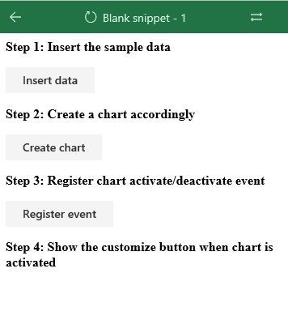

# Using new JS Chart and Events API to build interactive data visualization
This hands on lab will show you a simple introduction of creating an interactive add-in when user moves the selecting focus to a chart and customizing the chart elements

## Preparation
This expriment can be done within ScriptLab. ScriptLab is a swiss knife for Excel JS APIs that you can test, build and share your solution fast and convenient. If you are not familliar with it, you can follow the instructions below. 

1. In your Excel, shift to "Insert" tab and click "My Add-ins" button. 
2. In the store tab, you'll see scriplab on the top of the list. Or you can search "Script Lab".
3. Click "Add" button and lauch it from ribbon.
4. under the Libraries tab, change the JS file URL to
https://appsforoffice.microsoft.com/lib/**beta**/hosted/office.js

## Exercise 1
In this exercise, you'll create a sample worksheet and insert some fake data.

***Step 1.1 Create buttons in HTML***

Draw four buttons on the page. 

-  Insert data
2. Create chart
3. Register event
4. Customize button (Hide by default, show only when chart is activated)



You can use any technic you are familiar with. 

Sample code:

```html
<b>Step 1: Insert the sample data</b>
<p><p/>
<button id="run" class="ms-Button">
    <span class="ms-Button-label">Insert data</span>
</button>
<p><p/>
<b>Step 2: Create a chart accordingly</b>
<p><p/>
<button id="create" class="ms-Button">
    <span class="ms-Button-label">Create chart</span>
</button>
<p><p/>
<b>Step 3: Register chart activate/deactivate event</b>
<p><p/>
	<button id="register" class="ms-Button">
    <span class="ms-Button-label">Register event</span>
</button>
<p><p/>
<b>Step 4: Show the customize button when chart is activated</b>
<p><p/>
	<button id="customize" class="ms-Button" style="display:none">
    <span class="ms-Button-label">Customize chart</span>
</button>
```
On top of JS file, bind your button click event to the JS call:

```javascript
$("#run").click(() => tryCatch(run));
$("#create").click(() => tryCatch(createChart));
$("#register").click(() => tryCatch(register));
$("#customize").click(() => tryCatch(customize));
```

***Step 1.2 Insert sample data***

Let's insert the following data into a worksheet.

```
["State", "2013", "2014", "2015", "2016", "2017"]
["California", 139, 304, 483, 785, 1308],
["Florida", 170, 366, 307, 708, 837],
["Hawaii", 158, 289, 387, 879, 735],
["South Carolina", 153, 251, 311, 413, 432],
["West Verginia", 620, 632, 654, 674, 684],
["Texas", 399, 446, 914, 953, 1312],
["Arizona", 126, 234, 364, 483, 594]
```

Your workbook may look like:


JS code sample:

```javascript
async function run() {
    await Excel.run(async (context) => {
        let sheet = context.workbook.worksheets.getActiveWorksheet();
        let expensesTable = sheet.tables.add('A1:F1', true);
        expensesTable.getHeaderRowRange().values = [
            ["State", "2013", "2014", "2015", "2016", "2017"]
        ];

        expensesTable.rows.add(null, [
        ["California", 139, 304, 483, 785, 1308],
        ["Florida", 170, 366, 307, 708, 837],
        ["Hawaii", 158, 289, 387, 879, 735],
        ["South Carolina", 153, 251, 311, 413, 432],
        ["West Verginia", 620, 632, 654, 674, 684],
        ["Texas", 399, 446, 914, 953, 1312],
        ["Arizona", 126, 234, 364, 483, 594]]);
        
        await context.sync();

    });
}
```

## Exercise 2
***Step 2.1 Create a chart***

Create a chart of the data range with charts.add()


JS sample code:

```javascript
async function createChart() {
    await Excel.run(async (context) => {

        let sheet = context.workbook.worksheets.getActiveWorksheet();
        var chart = sheet.charts.add(Excel.ChartType.lineMarkers, sheet.getRange("A1:F8"), Excel.ChartSeriesBy.rows);
        chart.axes.categoryAxis.setCategoryNames(sheet.getRange("B1:F1"));
        
        chart.title.text = "Cost of sales in States";
        chart.name = "cost";

        chart.width = 485;
        chart.height = 350;

        //Register events
        chart.onActivated.add(chartActivated);
        chart.onDeactivated.add(chartDeactivated);

    });
}
```


## Exercise 3


***Step 3.1 Register the event and bind event handlers to the chart.***  

JS sample code:
```javascript
async function register(event) {
    await Excel.run(async (context) => {
        let chart = context.workbook.worksheets.getActiveWorksheet().charts.getItem("cost");
        chart.onActivated.add(chartActivated);
        chart.onDeactivated.add(chartDeactivated);
    });
}
```


***Step 3.2 Change the visibility of button in event handler.*** 

Use these commands to control the visibility of Chart. When user activate the chart, show the button.

JS sample code:

```javascript
async function chartActivated(event) {
    await Excel.run(async (context) => {
        document.getElementById("customize").style.display = "block";
    });
}

async function chartDeactivated(event) {
    await Excel.run(async (context) => {
        document.getElementById("customize").style.display = "none";
    });
}
```


## Exercise 4
Add data labels to the chart and set properties:


JS sample code:

```javascript
async function customize() {
    await Excel.run(async (context) => {
        let chart = context.workbook.worksheets.getActiveWorksheet().charts.getItem("cost");

        //add data label
        chart.dataLabels.position = "Center";
        chart.dataLabels.separator = "\n";
        chart.dataLabels.format.font.color = "#000000";

    });
}
```

## Next steps
Congratulations! You’ve completed the experiments! If you want to learn more about new comming APIs, please move to our [Github](https://github.com/OfficeDev/office-js-docs/tree/ExcelJs_OpenSpec) for details.


## Appendix
[Reference anwser](https://gist.github.com/79f15944334e208361bbb1aa7229ec3f)