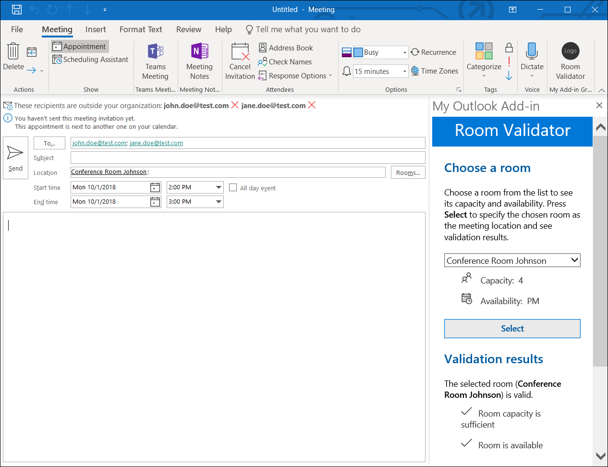
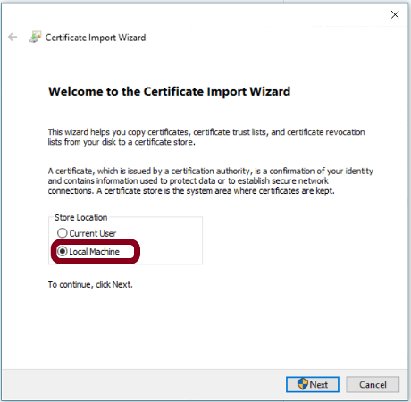
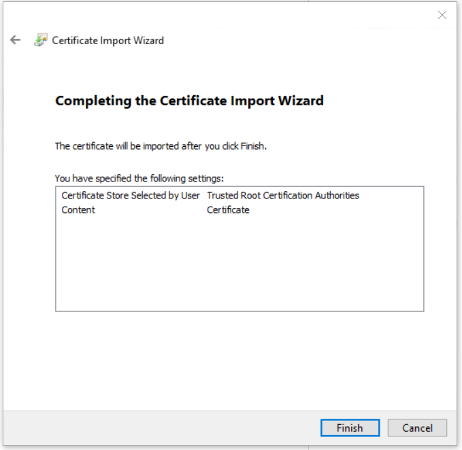
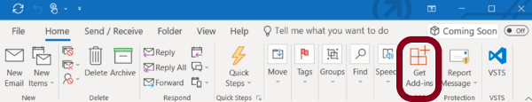
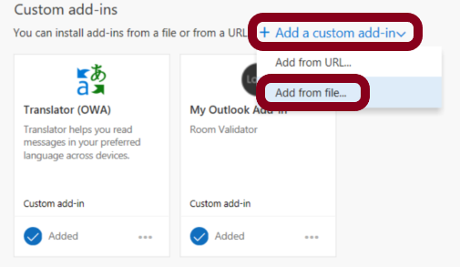
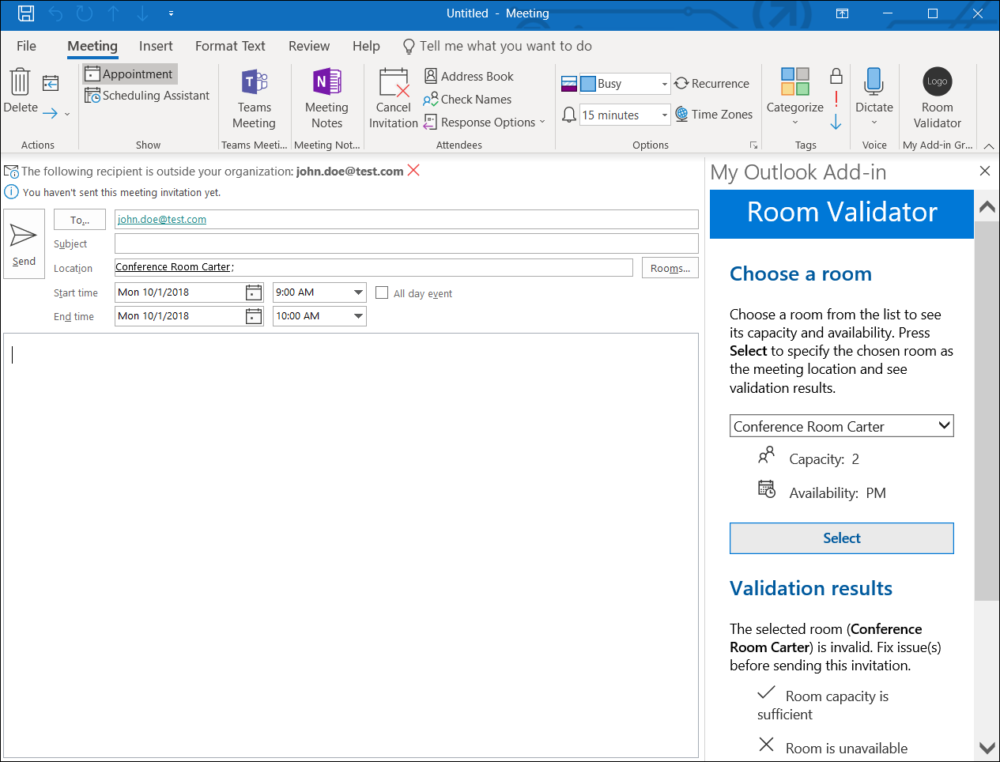

# Build an Outlook add-in with Office JavaScript APIs

Outlook add-ins are web applications built using standard web technologies and loaded within the Outlook client. In this lab, you'll use Outlook JavaScript APIs to build an event-driven add-in that can validate room availability and capacity as an organizer creates an appointment.



In this lab:

- [Create the add-in project](#create-the-add-in-project)
- [Update the code](#update-the-code)
- [Prepare to test your add-in](#prepare-to-test-your-add-in)
- [Try it out](#try-it-out)

## Create the add-in project

Complete the following steps to create the add-in project by using the **Yeoman generator for Office Add-ins**.

1. Use either File Explorer or the command prompt to create a folder on your local drive, and name the folder `my-outlook-addin`. This is where you'll create the add-in project.

1. Open a command prompt and navigate to your new folder. For example, if you created the `my-outlook-addin` folder at the root of `C:\`, run the following command from the command prompt to navigate to that folder.

    ```
    cd C:\my-outlook-addin
    ```

1. Use the **Yeoman generator for Office Add-ins** to create an Outlook Add-in project by running the following command from the command prompt. Answer the prompts as shown below:

    ```
    yo office
    ```

    - **Choose a project type:** `Office Add-in project using Jquery framework`
    - **Choose a script type:** `JavaScript`
    - **What do you want to name your add-in?:** `My Outlook Add-in`
    - **Which Office client application would you like to support?:** `Outlook`
    
    
    
    After you complete the wizard, the generator will create the project and install supporting Node components.

## Update the code

At this point, the **Yeoman generator for Office Add-ins** has created a very basic add-in project that you can use as a starting point for building your Outlook add-in. Next, update the code as described in this section to customize the functionality of the add-in.

### Step 1: Open add-in project folder in Visual Studio Code

In this lab, you'll use Visual Studio Code as your code editor. At the same command prompt that you just used to [create the add-in project](#create-the-add-in-project), run the following command to open Visual Studio Code:

```
code .
```

In the **Explorer** pane of Visual Studio Code, expand the **My Outlook Add-in** folder to show the files for your add-in project.

### Step 2: Customize the manifest

An add-in's manifest file defines its settings and capabilities. In this step, you'll customize XML markup in the manifest file to specify metadata for the Room Validator add-in and add a button to the ribbon that an appointment organizer can use to launch the add-in task pane.

1. In Visual Studio Code, open the file **my-outlook-add-in-manifest.xml**. 

1. Replace the entire contents of the file with the following XML markup, and save the file. Notice the following things about this markup:

    - The `Rule` element specifies the activation rule that should be evaluated for this add-in. In this case, the specified rule evaluates to `true` for an `Appointment` item.

    - The `ExtensionPoint` element defines the button on the ribbon that will open the add-in's task pane. In this case, the button will appear on the ribbon only for an appointment organizer.

    ```xml
    <?xml version="1.0" encoding="UTF-8"?>
    <OfficeApp
            xmlns="http://schemas.microsoft.com/office/appforoffice/1.1"
            xmlns:xsi="http://www.w3.org/2001/XMLSchema-instance"
            xmlns:bt="http://schemas.microsoft.com/office/officeappbasictypes/1.0"
            xmlns:mailappor="http://schemas.microsoft.com/office/mailappversionoverrides/1.0"
            xsi:type="MailApp">

    <Id>bac018a4-efdb-494b-aa48-dd7c9eec25c4</Id>
    <Version>1.0.0.0</Version>
    <ProviderName>Jane Doe</ProviderName>
    <DefaultLocale>en-US</DefaultLocale>
    <DisplayName DefaultValue="My Outlook Add-in" />
    <Description DefaultValue="Room Validator"/>
    <IconUrl DefaultValue="https://localhost:3000/assets/icon-32.png" />
    <HighResolutionIconUrl DefaultValue="https://localhost:3000/assets/hi-res-icon.png"/>
    <SupportUrl DefaultValue="https://localhost:3000" />

    <Hosts>
        <Host Name="Mailbox" />
    </Hosts>
    <Requirements>
        <Sets>
            <Set Name="Mailbox" MinVersion="1.1" />
        </Sets>
    </Requirements>
    <FormSettings>
        <Form xsi:type="ItemRead">
        <DesktopSettings>
            <SourceLocation DefaultValue="https://localhost:3000/index.html"/>
            <RequestedHeight>250</RequestedHeight>
        </DesktopSettings>
        </Form>
    </FormSettings>

    <Permissions>ReadWriteItem</Permissions>

    <!-- Rule: ItemType = Appointment -->
    <Rule xsi:type="RuleCollection" Mode="Or">
        <Rule xsi:type="ItemIs" ItemType="Appointment" FormType="Edit"/>
    </Rule>

    <DisableEntityHighlighting>false</DisableEntityHighlighting>

    <VersionOverrides xmlns="http://schemas.microsoft.com/office/mailappversionoverrides" xsi:type="VersionOverridesV1_0">
        <Requirements>
            <bt:Sets DefaultMinVersion="1.3">
                <bt:Set Name="Mailbox" />
            </bt:Sets>
        </Requirements>
        <Hosts>
            <Host xsi:type="MailHost">
                <DesktopFormFactor>
                    <FunctionFile resid="functionFile" />

                    <!-- Button for Appointment Organizer -->
                    <ExtensionPoint xsi:type="AppointmentOrganizerCommandSurface">
                        <OfficeTab id="TabDefault">
                            <Group id="apptComposeGroup">
                                <Label resid="groupLabel" />
                                <Control xsi:type="Button" id="apptComposeOpenPaneButton">
                                <Label resid="apptComposeButtonLabel" />
                                <Supertip>
                                    <Title resid="apptComposeSuperTipTitle" />
                                    <Description resid="apptComposeSuperTipDescription" />
                                </Supertip>
                                <Icon>
                                    <bt:Image size="16" resid="icon16" />
                                    <bt:Image size="32" resid="icon32" />
                                    <bt:Image size="80" resid="icon80" />
                                </Icon>
                                <Action xsi:type="ShowTaskpane">
                                    <SourceLocation resid="apptComposeTaskPaneUrl" />
                                </Action>
                                </Control>
                            </Group>
                        </OfficeTab>
                    </ExtensionPoint>

                </DesktopFormFactor>
            </Host>
        </Hosts>

        <Resources>
            <bt:Images>
                <bt:Image id="icon16" DefaultValue="https://localhost:3000/assets/icon-16.png"/>
                <bt:Image id="icon32" DefaultValue="https://localhost:3000/assets/icon-32.png"/>
                <bt:Image id="icon80" DefaultValue="https://localhost:3000/assets/icon-80.png"/>
            </bt:Images>
            <bt:Urls>
                <bt:Url id="functionFile" DefaultValue="https://localhost:3000/function-file/function-file.html"/>
                <bt:Url id="apptComposeTaskPaneUrl" DefaultValue="https://localhost:3000/index.html"/>
            </bt:Urls>
            <bt:ShortStrings>
                <bt:String id="groupLabel" DefaultValue="My Add-in Group"/>
                <bt:String id="customTabLabel"  DefaultValue="My Add-in Tab"/>
                <bt:String id="apptComposeButtonLabel" DefaultValue="Room Validator"/>
                <bt:String id="apptComposeSuperTipTitle" DefaultValue="Validate the choice of meeting room"/>
            </bt:ShortStrings>
            <bt:LongStrings>
                <bt:String id="apptComposeSuperTipDescription" DefaultValue="Opens a pane which validates that the selected meeting room is available at the chosen time and can accommodate the number of invited attendees."/>
            </bt:LongStrings>
        </Resources>
    </VersionOverrides>
    </OfficeApp>
    ```

### Step 3: Customize the HTML

The HTML markup in file **index.html** renders the user interface (UI) of the add-in task pane. In this step, you'll customize the HTML to create the task pane UI of the Room Validator add-in.

1. In Visual Studio Code, open the file **index.html**. 

1. Replace the entire contents of the `body` tag with the following HTML markup, and save the file.

    ```html
    <body class="ms-font-m ms-welcome">
        <header class="ms-welcome__header ms-bgColor-themePrimary ms-u-fadeIn500">
            <h1 class="ms-fontSize-xxl ms-fontWeight-regular ms-fontColor-white">Room Validator</h1>
        </header>
        <main id="app-body" class="ms-welcome__main" style="display: none;">

            <div id="appointment-details">
                <h2 class="ms-font-l ms-fontWeight-semibold ms-fontColor-neutralPrimaryAlt ms-u-slideUpIn20">Appointment details</h2>
                <br />
                <p class="ms-font-m ms-fontColor-neutralSecondaryAlt"><span class="ms-fontWeight-semibold">Total number of attendees:&#160;</span><label id="attendees-count"></label></p>
                <p class="ms-font-m ms-fontColor-neutralSecondaryAlt"><span class="ms-fontWeight-semibold">Start time:&#160;</span><label id="start-time"></label></p>
                <p class="ms-font-m ms-fontColor-neutralSecondaryAlt"><span class="ms-fontWeight-semibold">End time:&#160;</span><label id="end-time"></label></p>
                <br />
            </div>

            <h2 class="ms-font-xl ms-fontWeight-semibold ms-fontColor-themeDark ms-u-slideUpIn20">Choose a room</h2>
            <br />
            <p class="ms-font-m">Choose a room from the list to see its capacity and availability. Press <b>Select</b> to specify the chosen room as the meeting location and see validation results.</p>
            <br />
            <select id="room" class="ms-font-m">
                <option value="0n">-- Choose a room --</option>
                <option value="2a">Conference Room Adams</option>
                <option value="2p">Conference Room Carter</option>
                <option value="4a">Conference Room Ford</option>
                <option value="4p">Conference Room Johnson</option>
                <option value="6a">Conference Room Lincoln</option>
                <option value="6p">Conference Room Reagan</option>
                <option value="8a">Conference Room Truman</option>
                <option value="8p">Conference Room Wilson</option>
            </select>
            <ul class="ms-List ms-welcome__features ms-u-slideUpIn10">
                <li class="ms-ListItem">
                    <i class="ms-Icon ms-Icon--People"></i>
                    <span class="ms-font-m ms-fontColor-neutralPrimary">Capacity:&#160;&#160;</span><label id="room-capacity"></label>
                </li>
                <li class="ms-ListItem">
                        <i class="ms-Icon ms-Icon--DateTime"></i>
                        <span class="ms-font-m ms-fontColor-neutralPrimary">Availability:&#160;&#160;</span><label id="room-availability"></label>
                    </li>
            </ul>
            <br />
            <button id="select" class="ms-Button ms-bgColor-themeDark">
                <span class="ms-fontColor-themeDark ms-fontWeight-semibold">Select</span>
            </button>
            <br />

            <h2 class="ms-font-xl ms-fontWeight-semibold ms-fontColor-themeDark ms-u-slideUpIn20">Validation results</h2>
            <br />
            <label id="result-message"></label>
            <ul id="result-list" class="ms-List ms-welcome__features ms-u-slideUpIn10"></ul>
        </main>

        <script type="text/javascript" src="node_modules/jquery/dist/jquery.js"></script>
        <script type="text/javascript" src="node_modules/office-ui-fabric-js/dist/js/fabric.js"></script>
    </body>
    ```

### Step 4: Customize the CSS

The CSS code in file **app.css** specifies the custom styles that are used to render the task pane UI. In this step, you'll customize the CSS to specify the styles that are used by **index.html** to render the task pane UI of the Room Validator add-in.

1. In Visual Studio Code, open the file **app.css**.

1. Replace the entire contents of the file with the following code, and save the file.

    ```css
    html, body {
        width: 100%;
        height: 100%;
        margin: 0;
        padding: 0;
    }

    ul, p, h1, h2, h3, h4, h5, h6 {
        margin: 0;
        padding: 0;
    }

    .ms-welcome {
        position: relative;
        display: -webkit-flex;
        display: flex;
        -webkit-flex-direction: column;
        flex-direction: column;
        -webkit-flex-wrap: nowrap;
        flex-wrap: nowrap;
        min-height: 800px;
        min-width: 180px;
        overflow: auto;
        overflow-x: hidden;
    }

    .ms-welcome__header {
        min-height: 30px;
        padding: 0px;
        padding-bottom: 10px;
        display: -webkit-flex;
        display: flex;
        -webkit-flex-direction: column;
        flex-direction: column;
        -webkit-flex-wrap: nowrap;
        flex-wrap: nowrap;
        -webkit-align-items: center;
        align-items: center;
        -webkit-justify-content: flex-end;
        justify-content: flex-end;
    }

    .ms-welcome__header > h1 {
        margin-top: 10px;
        text-align: center;
    }

    .ms-welcome__main {
        display: -webkit-flex;
        display: flex;
        -webkit-flex-direction: column;
        flex-direction: column;
        -webkit-flex-wrap: nowrap;
        flex-wrap: nowrap;
        -webkit-align-items: center;
        align-items: left;
        -webkit-flex: 1 0 0;
        flex: 1 0 0;
        padding: 20px 20px;
    }

    .ms-welcome__main > h2 {
        width: 100%;
        text-align: left;
    }

    .ms-welcome__features.ms-List .ms-ListItem > .ms-Icon {
        font-size: 14pt;
    }

    .ms-welcome__features.ms-List .ms-ListItem > .ms-Icon {
        margin-right: 10px;
    }

    @media (min-width: 0) and (max-width: 350px) {
        .ms-welcome__features {
            width: 100%;
        }
    }
    ```

### Step 5: Customize the script

The content of file **src\index.js** specifies the script for the add-in. In this step, you'll specify code that enables the Room Validator add-in to validate room selection when an appointment organizer changes attendees or appointment time.

1. In Visual Studio Code, open the file **src\index.js**. 

1. Replace the entire contents of the file with the following code, and save the file.

    ```js
    'use strict';

    (function () {
        var attendeeCount = 0;

        Office.initialize = (reason) => {
            $('#app-body').show();
            $('#appointment-details').hide();

            $(document).ready(function () {

                // specify functions for UI events
                $('#select').click(processRoomSelection);
                $('#room').on('change', processRoomChange);

                // set initial message
                $('#result-message').html('Choose a room from the list above and then press <b>Select</b> to see validation results.');

                // get initial values for appointment time and number of attendees
                getAppointmentTime();
                getNumberOfAttendees();

                // TODO-1: register event handler for the Office.EventType.AppointmentTimeChanged event
                
                // TODO-2: register event handler for the Office.EventType.RecipientsChanged event
            });
        };

        // TODO-3: processApptTimeChange()

        // TODO-4: processRecipientChange()

        function getAppointmentTime() {
            // get start time and end time of the appointment
            var promise = new Promise(function(resolve, reject) {
                Office.context.mailbox.item.start.getAsync(
                    function (asyncResult) {
                        if (asyncResult.status == Office.AsyncResultStatus.Failed){
                            console.log(asyncResult.error.message);
                        }
                        else {
                            $('#start-time').html(asyncResult.value.toLocaleString());

                            Office.context.mailbox.item.end.getAsync(
                                function (asyncResult) {
                                    if (asyncResult.status == Office.AsyncResultStatus.Failed){
                                        console.log(asyncResult.error.message);
                                    }
                                    else {
                                        $('#end-time').html(asyncResult.value.toLocaleString());
                                        resolve();
                                    }
                                });
                        }
                    });
            });
            return promise;
        }

        function getNumberOfAttendees() {
            // get the total number of attendees
            var promise = new Promise(function(resolve, reject) {
                Office.context.mailbox.item.requiredAttendees.getAsync(
                    function (asyncResult) {
                        if (asyncResult.status == Office.AsyncResultStatus.Failed){
                            console.log(asyncResult.error.message);
                        }
                        else {
                            // add 1 to the number of required attendees, to account for the organizer
                            var requiredAttendees = asyncResult.value;
                            attendeeCount = requiredAttendees.length + 1;
                            $('#attendees-count').html(attendeeCount);

                            Office.context.mailbox.item.optionalAttendees.getAsync(
                                function (asyncResult) {
                                    if (asyncResult.status == Office.AsyncResultStatus.Failed){
                                        console.log(asyncResult.error.message);
                                    }
                                    else {
                                        var optionalAttendees = asyncResult.value;
                                        attendeeCount += optionalAttendees.length;
                                        $('#attendees-count').html(attendeeCount);
                                        resolve();
                                    }
                                }
                            );
                        }
                    }
                );
            });
            return promise;
        };

        function processRoomChange() {
            // get capacity of the room that's selected in the list and update UI element to display it
            getRoomCapacity();

            // get the availability period of the room that's selected in the list and update UI element to display it
            getRoomAvailabilityPeriod();
        }

        function processRoomSelection() {    
            validateRoomChoice();

            // set appointment location
            var roomLocation;
            if ($('#room').val().substring(0, 1) !== '0') {
                roomLocation = $('#room option:selected').text();
            } else {
                roomLocation = '';
            }

            Office.context.mailbox.item.location.setAsync(roomLocation, function (result) {
                if (result.status == Office.AsyncResultStatus.Failed) {
                    console.log(result.error.message);
                }
            });
        }

        function validateRoomChoice() {
            var roomCapacity = getRoomCapacity();
            var isRoomAvailable = getRoomAvailability();
            var isValid = true;

            getRoomAvailabilityPeriod();

            $('#result-list').empty();

            if ($('#room').val().substring(0, 1) !== '0') {
                // show validation result for room capacity 
                if (attendeeCount > roomCapacity) {
                    $('#result-list').append('<li class="ms-ListItem"><i class="ms-Icon ms-Icon--Cancel"></i>Room capacity is insufficient</li>');
                    isValid = false;
                } else {
                    $('#result-list').append('<li class="ms-ListItem"><i class="ms-Icon ms-Icon--Accept"></i>Room capacity is sufficient</li>');
                }

                // show validation result for room availability
                if (isRoomAvailable) {
                    $('#result-list').append('<li class="ms-ListItem"><i class="ms-Icon ms-Icon--Accept"></i>Room is available</li>');
                } else {
                    $('#result-list').append('<li class="ms-ListItem"><i class="ms-Icon ms-Icon--Cancel"></i>Room is unavailable</li>');
                    isValid = false;
                }

                // show message indicating validation results
                if (isValid === true) {
                    $('#result-message').html('The selected room (<b>' + $('#room option:selected').text() + '</b>) is valid.');
                } else {
                    $('#result-message').html('The selected room (<b>' + $('#room option:selected').text() + '</b>) is invalid. Fix issue(s) before sending this invitation.');
                }
            }
            else {
                $('#result-message').html('Choose a room from the list above and then press <b>Select</b> to see validation results.');
            }
        }

        function getRoomCapacity() {
            // Note: For simplicity, room capacity logic is hardcoded in this example code.
            // In a real-world implementation, room capacity data would likely be retrieved from a web service or database.

            // from value of selected list item, take first character (number = room capacity)
            var roomCapacity = $('#room').val().substring(0, 1);
            if (roomCapacity === '0') {
                $('#room-capacity').text('n/a');
            } else {
                $('#room-capacity').text(roomCapacity);
            }

            return roomCapacity;
        }

        function getRoomAvailabilityPeriod() {
            // Note: For simplicity, room availability logic is hardcoded in this example code.
            // In a real-world implementation, room availability data would likely be retrieved from a web service or database.

            // from value of selected DDL item, take second character
            //   a = available in the AM
            //   p = available in the PM
            var roomAvailability = $('#room').val().substring(1);
            if (roomAvailability === 'n') {
                $('#room-availability').text('n/a');
            } else if (roomAvailability === "a") {
                $('#room-availability').text('AM');
            } else {
                $('#room-availability').text('PM');
            }
        }

        function getRoomAvailability() {
            // Note: For simplicity, room availability logic is hardcoded in this example code.
            // In a real-world implementation, room availability data would likely be retrieved from a web service or database.
            
            // from value of selected DDL item, take second character 
            //   a = available in the AM
            //   p = available in the PM
            var roomAvailability = $('#room').val().substring(1);

            // determine whether start time and end time occur in the AM or PM
            var start = $('#start-time').text();
            var end = $('#end-time').text();
            var startPeriod = start.substring(start.length-2);
            var endPeriod = end.substring(end.length-2);

            // return availability result
            if ((roomAvailability === 'a' && startPeriod === 'AM' && endPeriod === 'AM') || (roomAvailability === 'p' && startPeriod === 'PM' && endPeriod === 'PM')) {
                return true;
            } else {
                return false;
            }
        }
    })();
    ```

1. Within **index.js**, find the comment labeled `TODO-1` and replace it with the following code to register an event handler for the `Office.EventType.AppointmentTimeChanged` event. This code specifies that when the appointment time changes, the `processApptTimeChange` function will run.

    ```js
    // register event handler for the Office.EventType.AppointmentTimeChanged event
    Office.context.mailbox.item.addHandlerAsync(Office.EventType.AppointmentTimeChanged, 
        processApptTimeChange,
        function (result) {
            if (result.status == Office.AsyncResultStatus.Failed) {
                console.log(result.error.message);
            }
        }
    );
    ```

1. Within **index.js**, find the comment labeled `TODO-2` and replace it with the following code to register an event handler for the `Office.EventType.RecipientsChanged` event. This code specifies that when recipients are added or removed, the `processRecipientChange` function will run.

    ```js
    // register event handler for the Office.EventType.RecipientsChanged event
    Office.context.mailbox.item.addHandlerAsync(Office.EventType.RecipientsChanged, 
        processRecipientChange,
        function (result) {
            if (result.status == Office.AsyncResultStatus.Failed) {
                console.log(result.error.message);
            }
        }
    );
    ```

1. Within **index.js**, find the comment labeled `TODO-3` and replace it with the following code. This is the event handler function that runs when the `Office.EventType.AppointmentTimeChanged` event occurs. The add-in retrieves the new appointment time, verifies whether the room is available at that time, and updates the task pane user interface to convey the result.

    ```js
    function processApptTimeChange(result) {
        // get new appointment time, then verify whether the selected room is available
        getAppointmentTime()
            .then(function() {
                validateRoomChoice();
            })
            .catch(function(e) {
                console.log(e);
            });
    };
    ```

1. Within **index.js**, find the comment labeled `TODO-4` and replace it with the following code. This is the event handler function that runs when the `Office.EventType.RecipientsChanged` event occurs. The add-in retrieves the new number of attendees, verifies whether the room capacity is sufficient for that number of attendees, and updates the task pane user interface to convey the result.

    ```js
    function processRecipientChange(result) {
        // get new number of attendees, then verify whether the room capacity is sufficient
        getNumberOfAttendees()
            .then(function() {
                validateRoomChoice();
            })
            .catch(function(e) {
                console.log(e);
            });
    }
    ```

1. Save the changes you've made to **index.js**. 

## Prepare to test your add-in

Now that the code changes are complete, you're *almost* ready to test your Room Validator add-in in Outlook. But first, prepare to test your add-in by completing the tasks described in this section.

### Start the web server

1. Open a command prompt and navigate to the root directory of your project. For example, if you created the `my-outlook-addin` folder at the root of `C:\`, and named your add-in `My Outlook Add-in` when you [created your add-in project](#create-the-add-in-project) using the **Yeoman generator for Office Add-ins**, run the following command from the command prompt to navigate to the root directory of your project.

    ```
    cd C:\my-outlook-addin\My Outlook Add-in
    ```

1. At the command prompt in the root directory of your project, run the following command to start the application web server at `https://localhost:3000`.

    ```
    npm start
    ```

### Trust the local web server's certificate

Office clients require that add-ins come from a trusted and secure location. Before you can test your add-in locally within Outlook, you must configure your workstation to trust the local web server's self-signed certificate. To do this, complete the following steps:

1. In File Explorer, navigate to the `certs` folder within your add-in project. For example, if you created the `my-outlook-addin` folder at the root of `C:\` and named your add-in `My Outlook Add-in` when you [created your add-in project](#create-the-add-in-project) using the **Yeoman generator for Office Add-ins**, navigate to the `C:\my-outlook-addin\My Outlook Add-in\certs` folder in File Explorer.

    

1. Within the `certs` folder, double-click on the file `ca.crt`. In the **Certificate** dialog window that opens, press **Install Certificate**.

    

1. In the **Certificate Import Wizard** dialog window, choose **Local Machine** and press **Next**. If prompted by the User Account control dialog window, answer **Yes**.

    

1. Select **Place all certificates in the following store** and then press **Browse**, select **Trusted Root Certification Authorities**, and press **OK**. Then press **Next** to advance to the final step of the certificate import process.

    

1. Press **Finish** to import the certificate.

    

### Sideload the add-in's manifest in Outlook

Now that your add-in application is running on a local web server and your workstation trusts the local web server's self-signed certificate, you can upload the add-in's manifest file to Outlook. The manifest file defines your add-in's settings and capabilities, providing Outlook with the information it requires to run your add-in.

1. Open Outlook and select **Get Add-ins** from the ribbon of the **Home** tab.

    

1. In the dialog window that opens, select **My add-ins**.

    

1. In the **Custom add-ins** section at the bottom of the dialog window, select **Add a custom add-in** and then choose **Add from file**.

    

1. In the **Choose File to Upload** dialog window, navigate to your project folder, select your add-in project's manifest file `my-outlook-add-in-manifest.xml`, and press **Open**. When the **Warning** dialog window appears, choose **Install**.

    

## Try it out

Now for the fun part -- it's time to try out the add-in that you've built. Use the Room Validator add-in to validate room availability and capacity as you create a meeting invitation.

1. Open Outlook 2016 and navigate to Calendar view.

1. In Calendar view, press **New Appointment** to create a new appointment.

1. In the ribbon of the appointment window, choose **Room Validator** to open the Room Validator task pane.

    

1. In the ribbon of the appointment window, choose **Invite Attendees** to add the **To...** recipients field to the appointment.

    

1. Specify meeting information as follows:
    
    - Add one recipient to the **To...** field. (You won't actually be sending this meeting invitation, so specify any recipient that you wish.)

    - Set **Start time** to **October 1, 2018** (10/1/2018) at **9:00 am**.

    - Set **End time** to **October 1, 2018** (10/1/2018) at **10:00 am**.

1. In the **Choose a room** section of the task pane, choose **Conference Room Carter** from the list and press **Select**. When you press **Select**, the conference room is specified in the appointment's **Location** field and the add-in determines whether the selected room is available and has capacity for the number of attendees specified in the invitation. 

    - The task pane shows that the capacity of the selected room is 2 and it's available only in the PM hours.
    - The meeting contains a total of 2 attendees (1 invitee + the organizer) and occurs in the AM hours.
    - The **Validation results** section of the task pane conveys that room capacity is sufficient, but the room is unavailable at the specified time.

    

1. Add another recipient to the **To...** field of the meeting invitation. 

    - The meeting now contains a total of 3 attendees (2 invitees + the organizer) and occurs in the AM hours.
    - When you add the new recipient, the **Validation results** section of the task pane automatically updates to convey that room capacity is insufficient and the room is unavailable at the specified time.

    

1. In the **Choose a room** section of the task pane, choose **Conference Room Johnson** from the list and press **Select**. When you press **Select**, the conference room is specified in the appointment's **Location** field and the add-in determines whether the selected room is available and has capacity for the number of attendees specified in the invitation. 

    - The task pane shows that the capacity of the selected room is 4 and it's available only in the PM hours.
    - The meeting still contains a total of 3 attendees (2 invitees + the organizer) and occurs in the AM hours.
    - The **Validation results** section of the task pane conveys that room capacity is sufficient, but that the room is unavailable at the specified time.
 
    

 1. Change the **Start time** of the meeting to **2:00pm**.
 
    - The meeting still contains a total of 3 attendees (2 invitees + the organizer), but now occurs in the PM hours.
    - When you change the time of the meeting, the **Validation results** section of the task pane automatically updates to convey that room capacity is sufficient and the room is available.

    

## Congratulations!

Congratulations, you've successfully created an Outlook add-in! To learn more about creating Outlook add-ins, check out the Outlook add-ins developer documentation at [https://aka.ms/outlook-add-ins-docs](https://aka.ms/outlook-add-ins-docs).
