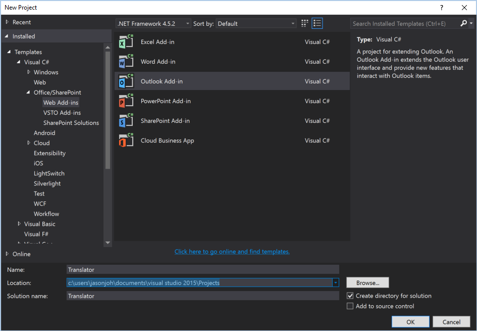
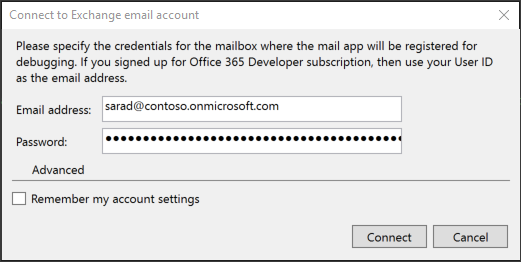
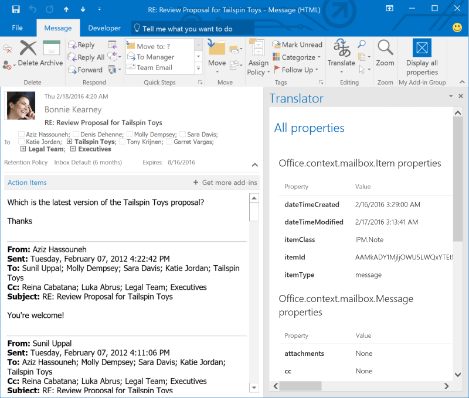
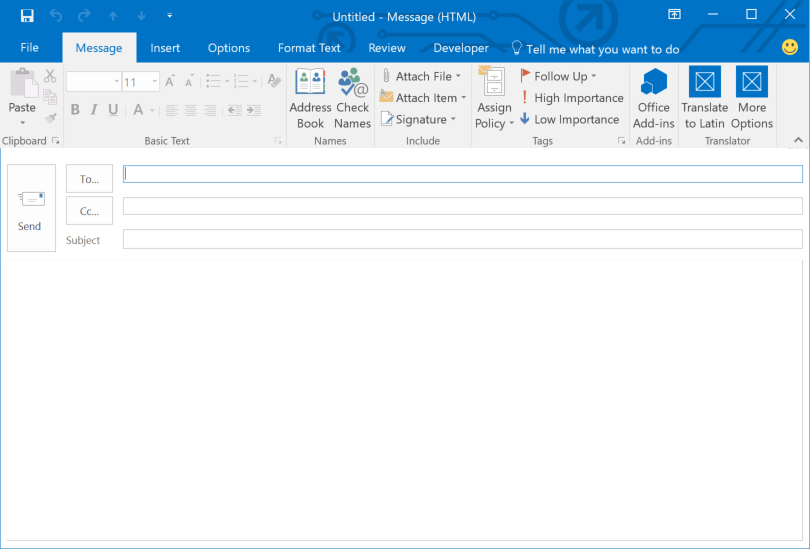

# Create your first Office add-in with the Outlook JavaScript APIs

In this lab, you will use Visual Studio to create your first Outlook add-in using the Outlook JavaScript APIs. The add-in will allow the user to translate parts of a message they are composing into different languages.

## Prerequisites

1. You must have an Office 365 tenant to
   complete this lab. If you do not have one, the lab for **O3651-7 Setting up
   your Developer environment in Office 365** shows you how to obtain a trial.
1. You must have Visual Studio 2015 with Update 1 installed.
1. You must have the Microsoft Office Developer Tools for Visual Studio 2015 installed.
1. You must have Outlook 2016 installed.

## Exercise 1: Create a new Outlook add-in project

In this exercise you will create a new project using the Outlook add-in template.

1. Launch Visual Studio 2015 and select **New**, **Project**.
  1. Expand **Templates**, **Visual C#**, **Office/SharePoint** ,**Web add-ins**. Select **Outlook Add-in**. Name the project **Translator** and click **OK**.
  
    
  
1. Run the app to verify it works.
  1. Press F5 to begin debugging.
  1. When prompted, enter the email address and password of your Office 365 account. Visual Studio will install the add-in for that user.
  
    
    
  1. With the app running, open Outlook 2016 and logon to the user's mailbox. You should see a **Display all propeties** button on the ribbon when you select or open a message.
  
    
    
Now that you've verified that the add-in is working, Exercise 1 is complete!

## Exercise 2: Add buttons to the new message ribbon

In this exercise you will add a button to do English-to-Spanish translation and a button to open a task pane, allowing the user to select start and end languages. 
  
1. Add the **Translator** button group to the new message ribbon.
  1. Open the **Translator/TranslatorManifest/Translator.xml** file.
  1. Locate the following line:
  
    ```xml
    <FunctionFile resid="functionFile" />
    ```
    
  1. Insert the following after that line:
  
    ```xml
    <!-- Message Compose -->
    <ExtensionPoint xsi:type="MessageComposeCommandSurface">
      <OfficeTab id="TabDefault">
        <Group id="msgComposeGroup">
          <Label resid="groupLabel"/>
          <!-- Add English to Spanish button here -->
          <!-- Add More Options button here -->
        </Group>
      </OfficeTab>
    </ExtensionPoint>
    ```
    
1. Add the **English to Spanish** button.
  1. Replace the `<!-- Add English to Spanish button here -->` line with the following:
    
    ```xml
    <Control xsi:type="Button" id="msgComposeEn-Es">
      <Label resid="englishSpanishLabel"/>
      <Supertip>
        <Title resid="englishSpanishTitle"/>
        <Description resid="englishSpanishDesc"/>
      </Supertip>
      <Icon>
        <bt:Image size="16" resid="icon16"/>
        <bt:Image size="32" resid="icon32"/>
        <bt:Image size="80" resid="icon80"/>
      </Icon>
      <Action xsi:type="ExecuteFunction">
        <FunctionName>translateEnglish2Spanish</FunctionName>
      </Action>
    </Control>
    ```
    
1. Add the **More Options** button.
  1. Replace the `<!-- Add More Options button here -->` line with the following:
  
    ```xml
    <Control xsi:type="Button" id="msgComposePaneButton">
      <Label resid="translatePaneButtonLabel"/>
      <Supertip>
        <Title resid="translatePaneButtonTitle"/>
        <Description resid="translatePaneButtonDesc"/>
      </Supertip>
      <Icon>
        <bt:Image size="16" resid="icon16"/>
        <bt:Image size="32" resid="icon32"/>
        <bt:Image size="80" resid="icon80"/>
      </Icon>
      <Action xsi:type="ShowTaskpane">
        <SourceLocation resid="translatePaneUrl"/>
      </Action>
    </Control>
    ```
    
1. Add resources for the new buttons.
  1. Locate the `<bt:Urls>` element within the `<Resources>` element in **Translator/TranslatorManifest/Translator.xml**.
  1. Add the following element after the last `<bt:Url>` element:
    
    ```xml
    <bt:Url id="translatePaneUrl" DefaultValue="~remoteAppUrl/TranslatePane.html"/>
    ```
  
  1. Locate the `<bt:ShortStrings>` element within the `<Resources>` element.
  1. Change the `DefaultValue` of the `<bt:String>` element with an `id` attribute of `groupLabel` to `Translator`.
    
    ```xml
    <bt:String id="groupLabel" DefaultValue="Translator"/>
    ```
  1. Add the following elements after the last `<bt:String>` element inside the `<bt:ShortStrings>` element:
  
    ```xml
    <bt:String id="englishSpanishLabel" DefaultValue="English to Spanish"/>
    <bt:String id="englishSpanishTitle" DefaultValue="Translate English to Spanish"/>
    <bt:String id="translatePaneButtonLabel" DefaultValue="More Options"/>
    <bt:String id="translatePaneButtonTitle" DefaultValue="Choose to and from language"/>
    ```
    
  1. Locate the `<bt:LongStrings>` element within the `<Resources>` element.
  1. Add the following elements after the last `<bt:String>` element inside the `<bt:LongStrings>` element:
  
    ```xml
    <bt:String id="englishSpanishDesc" DefaultValue="Translates the selected text from English to Spanish"/>
    <bt:String id="translatePaneButtonDesc" DefaultValue="Opens a window allowing you to choose a to and from language for translation"/>
    ```
    
  1. When you've made all of those changes, the `<Resources>` section of your file should look like the following:
  
    ```xml
    <Resources>
      <bt:Images>
        <bt:Image id="icon16" DefaultValue="~remoteAppUrl/Images/icon16.png"/>
        <bt:Image id="icon32" DefaultValue="~remoteAppUrl/Images/icon32.png"/>
        <bt:Image id="icon80" DefaultValue="~remoteAppUrl/Images/icon80.png"/>
      </bt:Images>
      <bt:Urls>
        <bt:Url id="functionFile" DefaultValue="~remoteAppUrl/Functions/FunctionFile.html"/>
        <bt:Url id="messageReadTaskPaneUrl" DefaultValue="~remoteAppUrl/MessageRead.html"/>
        <bt:Url id="translatePaneUrl" DefaultValue="~remoteAppUrl/TranslatePane.html"/>
      </bt:Urls>
      <bt:ShortStrings>
        <bt:String id="groupLabel" DefaultValue="Translator"/>
        <bt:String id="customTabLabel"  DefaultValue="My Add-in Tab"/>
        <bt:String id="paneReadButtonLabel" DefaultValue="Display all properties"/>
        <bt:String id="paneReadSuperTipTitle" DefaultValue="Get all properties"/>
        <bt:String id="englishSpanishLabel" DefaultValue="English to Spanish"/>
        <bt:String id="englishSpanishTitle" DefaultValue="Translate English to Spanish"/>
        <bt:String id="translatePaneButtonLabel" DefaultValue="More Options"/>
        <bt:String id="translatePaneButtonTitle" DefaultValue="Choose to and from language"/> 
      </bt:ShortStrings>
      <bt:LongStrings>
        <bt:String id="paneReadSuperTipDescription" DefaultValue="Opens a pane displaying all available properties. This is an example of a button that opens a task pane."/>
        <bt:String id="englishSpanishDesc" DefaultValue="Translates the selected text from English to Spanish"/>
        <bt:String id="translatePaneButtonDesc" DefaultValue="Opens a window allowing you to choose a to and from language for translation"/>
      </bt:LongStrings>
    </Resources>
    ```
    
1. Save your changes and press F5 to start debugging. Once the app starts, open Outlook 2016. (If it is still open from before, the add-in should refresh after a moment.) Create a new message. You should see the **English to Spanish** and **More Options** buttons on the ribbon:

  
  
Now that the buttons are showing up in Outlook, Exercise 2 is complete!
  
## Exercise 3: Add translation

In this exercise you will implement the functions to call the [Yandex Translate API](https://translate.yandex.com/developers) and replace selected text in the message that is being composed.

1. Obtain a free Yandex API key.
  1. Go to https://translate.yandex.com/developers in your browser.
  1. Under **Getting Started**, click the **Get a free API key** link.
  1. Register and get your API key. Copy this key, you will need it later.