# Deep Dive into Office Word Add-ins (using 1.2 and 1.3 Requirement Sets)
In this lab, you will get hands-on experience developing a Word add-in by using the 1.3 requirement set of the Word JavaScript API.

**Prerequisites:**
1. You must have Visual Studio 2015 & Update 1 installed.
2. You must have Office 2016 Preview installed, which you can obtain here: https://products.office.com/en-us/office-2016-preview. Make sure you are using the January Fork release (6741).
3. This lab requires you to use multiple starter files or an entire starter project from the GitHub location. You can either download the whole repo as a zip or clone the repo https://github.com/OfficeDev/TrainingContent.git, for those familiar with git.

##Exercise 1:Creating the Statement of Work Wizard Add-in Project and Hello World!
*In this exercise, you will create a new Office Add-in project in Visual Studio so that you can begin to write, test and debug a Word add-in. The user interface of the Office Add-in you will create in this lab will not be very complicated as it will just contain HTML buttons and JavaScript command handlers. You will also code your first  "Hello World!" sample!*

###Part 1: Create a basic Add-in
1. Launch Visual Studio 2015 as an administrator.
2. From the **File** menu, select the **New Project** command. When the **New Project** dialog appears, select the Word Add-in under Web Add-ins in the **Office/SharePoint** template folder as shown below. Name the new project **StatementOfWork** and click **OK** to create the new project.

	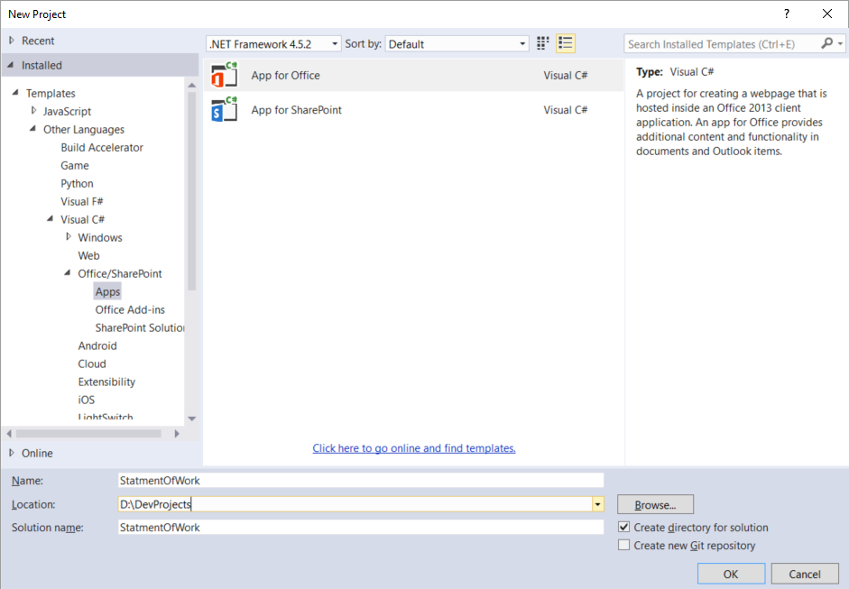


5. Take a look at the structure of the new Visual Studio solution after it has been created. At a high-level, the new solution has been created using two Visual Studio projects named **StatementOfWork** and **StatementOfWorkWeb**. You should also observe that the top project contains a top-level manifest for the add-in named **StatementOfWorkManifest**, which contains a single file named **StatementOfWork.xml**.

	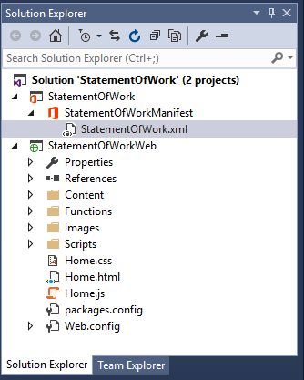

6. In the Solution Explorer, double-click on the node named **StatementOfWorkManifest** to open the add-in manifest file in the Visual Studio editor.   
7. Browse through the file and note the different options you can set for your Add-in, such as provider, version, Display Name.

8. Now, find the XML block that looks like this. Take a minute and read through it as it describes how add-ins can integrate with the Office UI. The example below demonstrates how an add-in can add a button to the Word ribbon's Home tab using Add-in commands. 

	```XML
        <!-- PrimaryCommandSurface==Main Office Ribbon. -->
            <ExtensionPoint xsi:type="PrimaryCommandSurface">
                <!-- Use OfficeTab to extend an existing Tab. Use CustomTab to create a new tab. -->
                <OfficeTab id="TabHome">
                <!-- Ensure you provide a unique id for the group. Recommendation for any IDs is to namespace using your company name. -->
                <Group id="Contoso.Group1">
                    <!-- Label for your group. resid must point to a ShortString resource. -->
                    <Label resid="Contoso.Group1Label" />
                    <!-- Icons. Required sizes 16,32,80, optional 20, 24, 40, 48, 64. Strongly recommended to provide all sizes for great UX. -->
                    <!-- Use PNG icons and remember that all URLs on the resources section must use HTTPS. -->
                    <Icon>
                    <bt:Image size="16" resid="Contoso.tpicon_16x16" />
                    <bt:Image size="32" resid="Contoso.tpicon_32x32" />
                    <bt:Image size="80" resid="Contoso.tpicon_80x80" />
                    </Icon>

                    <!-- Control. It can be of type "Button" or "Menu". -->
                    <Control xsi:type="Button" id="Contoso.TaskpaneButton">
                    <Label resid="Contoso.TaskpaneButton.Label" />
                    <Supertip>
                        <!-- ToolTip title. resid must point to a ShortString resource. -->
                        <Title resid="Contoso.TaskpaneButton.Label" />
                        <!-- ToolTip description. resid must point to a LongString resource. -->
                        <Description resid="Contoso.TaskpaneButton.Tooltip" />
                    </Supertip>
                    <Icon>
                        <bt:Image size="16" resid="Contoso.tpicon_16x16" />
                        <bt:Image size="32" resid="Contoso.tpicon_32x32" />
                        <bt:Image size="80" resid="Contoso.tpicon_80x80" />
                    </Icon>

                    <!-- This is what happens when the command is triggered (E.g. click on the Ribbon). Supported actions are ExecuteFuncion or ShowTaskpane. -->
                    <Action xsi:type="ShowTaskpane">
                        <TaskpaneId>ButtonId1</TaskpaneId>
                        <!-- Provide a url resource id for the location that will be displayed on the task pane. -->
                        <SourceLocation resid="Contoso.Taskpane.Url" />
                    </Action>
                    </Control>
                </Group>
                </OfficeTab>
            </ExtensionPoint>
	```
    
9. Let's modify the button to say "Statement of Work" instead of "Show Taskpane". Find the following element in the file.

	```XML
		<Title resid="Contoso.TaskpaneButton.Label" />
	```
10. This indicates that the label of the title is stored in a string resource named **Contoso.TaskpaneButton.Label**.
11. Scroll down until you find the **ShortString** string resource with that label.
12. (Optional)Now, set the DefaultValue attribute to *Statement of Work*. Your XML should look like this: 

	```XML
		<bt:String id="Contoso.TaskpaneButton.Label" DefaultValue="Statement of Work" />
	```
        
13. Press *F5* (or click the "Start" button) to try your changes. If you're prompted to installed a self-signed certificate for localhost, accept the two dialogs. You should see you add-in deploy in Word and a button appear on the Home Tab. If you didn't change the label this is what you will see. 

	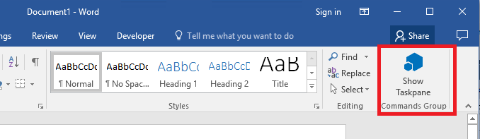

14. If you did change the label you should see the label you provided. However don't worry if you don't see the label updated, this is a known issue with this build. 
15. Switch back to Visual Studio and click the Stop Debugging button (or Shift+F5)

###Part 2: Understanding the Web Project files and preparing them for the lab.
8. There are other 2 very important files that are part of this project that are on the root of the StatementOfWorkWeb project. One of them is the  **Home.html** page which is opened by default in Visual Studio and represents the add-in's starting page. If not already opened please double click on it, you will see some HTML that begins like this: 

	````html
<head>
    <meta charset="UTF-8" />
    <meta http-equiv="X-UA-Compatible" content="IE=Edge" />
    <title>Word Addin with Commands Sample</title>

    <script src="/Scripts/jquery-1.9.1.js" type="text/javascript"></script>
    <script src="/Scripts/FabricUI/MessageBanner.js" type="text/javascript"></script>
    <script src="https://appsforoffice.microsoft.com/lib/1/hosted/office.js" type="text/javascript"></script>

    <!-- To enable offline debugging using a local reference to Office.js, use:                        -->
    <!-- <script src="/Scripts/Office/MicrosoftAjax.js" type="text/javascript"></script>  -->
    <!-- <script src="/Scripts/Office/1.1/office.js" type="text/javascript"></script>  -->

    <link href="Home.css" rel="stylesheet" type="text/css" />
    <script src="Home.js" type="text/javascript"></script>

    <!-- For the Office UI Fabric, go to http://aka.ms/office-ui-fabric to learn more. -->
    <link rel="stylesheet" href="https://appsforoffice.microsoft.com/fabric/2.1.0/fabric.min.css">
    <link rel="stylesheet" href="https://appsforoffice.microsoft.com/fabric/2.1.0/fabric.components.min.css">
    
    <!-- To enable the offline use of Office UI Fabric, use: -->
    <!-- link rel="stylesheet" href="/Content/fabric.min.css" -->
    <!-- link rel="stylesheet" href="/Content/fabric.components.min.css" -->
</head>
	````


9. There are important references included in the **Home.html** head element. One for our Office.js library**<script src="https://appsforoffice.microsoft.com/lib/1/hosted/office.js" type="text/javascript"></script>**, which enables the developer to interact with Word. There is also a reference to include  Office UI Fabric components, which are the styles you can use to make your add-in look great. Finally, there is also a reference to **Home.js** script on this page, which implements the logic of the add-in.
 

12. Lets examine the JavaScript code in **home.js**. Double-click **home.js** to open it in a code editor window.
13. Walk through the code in **Home.js**. It includes a simple example to highlight the largest word in the user selection. Note at the end of the file there is an **errorHandler** function we will reuse in the lab to handle errors, as well as a **showNotification** function to display messages from the lab.   

14. Lets clean up **Home.js** for our lab. Replace the content of the entire file with the following snippet. Your Home.js should look like this: 

	````javascript
/// <reference path="/Scripts/FabricUI/MessageBanner.js" />


(function () {
    "use strict";

    var messageBanner;

    // The initialize function must be run each time a new page is loaded.
    Office.initialize = function (reason) {
        $(document).ready(function () {
            // Initialize the FabricUI notification mechanism and hide it
            var element = document.querySelector('.ms-MessageBanner');
            messageBanner = new fabric.MessageBanner(element);
            messageBanner.hideBanner();

            // Add event handlers here.....
           
        });
    };


    //$$(Helper function for treating errors, $loc_script_taskpane_home_js_comment34$)$$
    function errorHandler(error) {
        // $$(Always be sure to catch any accumulated errors that bubble up from the Word.run execution., $loc_script_taskpane_home_js_comment35$)$$
        showNotification("Error:", error);
        console.log("Error: " + error);
        if (error instanceof OfficeExtension.Error) {
            console.log("Debug info: " + JSON.stringify(error.debugInfo));
        }
    }

    // Helper function for displaying notifications
    function showNotification(header, content) {
        $("#notificationHeader").text(header);
        $("#notificationBody").text(content);
        messageBanner.showBanner();
        messageBanner.toggleExpansion();
    }
})();

	````
15. Save your changes to **Home.js**. You will return to this source file after you have added your HTML layout to **Home.html**.
16. Now it's time to examine the HTML that has been added to the project to create the add-in's user interface. Double-click **Home.html** to open this file in a Visual Studio editor window. Examine the layout of HTML elements inside the **body** element. 


18. Update the **content-main** div within *Home.html* to match the following HTML layout, which adds a set of buttons to the add-in's layout. These are all the buttons you need for the lab.

	````html
   <div id="content-main">
        <div id="sowPanel" class="padding">
            <button class="ms-Button ms-Button--compound" id="addContentHelloWorld">
                <span class="ms-Button-label" id="button-text">Hello World!</span>
                <span class="ms-Button-description" id="button-desc">Just a simple Hello World!! This code writes the famous string.</span>
            </button><br><br>

            <button class="ms-Button ms-Button--compound" id="addContentStartingSOW">
                <span class="ms-Button-label" id="button-text">Step 1: Starting SOW</span>
                <span class="ms-Button-description" id="button-desc">Insert a starting document to play with. uses OOXML</span>
            </button><br><br>

            <button class="ms-Button ms-Button--compound" id="addPicture">
                <span class="ms-Button-label" id="button-text">Step 2: Fix Picture!</span>
                <span class="ms-Button-description" id="button-desc">How to insert or replace images in a document.</span>
            </button><br><br>

            <button class="ms-Button ms-Button--compound" id="addSearchAndTempletize">
                <span class="ms-Button-label" id="button-text">Step 3: Search and Templetize!</span>
                <span class="ms-Button-description" id="button-desc">Search for 'Contoso' and insert content controls to hold the customer name. </span>
            </button><br><br>

            <button class="ms-Button ms-Button--compound" id="addChangeCustomer">
                <span class="ms-Button-label" id="button-text">Step 4: Replace Customer!</span>
                <span class="ms-Button-description" id="button-desc">Set the customer name to 'Fabrikam' using content controls.</span>
            </button><br><br>

            <button class="ms-Button ms-Button--compound" id="addReuseContent">
                <span class="ms-Button-label" id="button-text">Step 5: Reuse Content!</span>
                <span class="ms-Button-description" id="button-desc">Reuse content by merging in another document</span>
            </button><br><br>

            <button class="ms-Button ms-Button--compound" id="addHighlights">
                <span class="ms-Button-label" id="button-text">Step 6: Highlight Word by Word!</span>
                <span class="ms-Button-description" id="button-desc">Shows how to get (as range) word by word of a paragraph.</span>
            </button><br><br>

            <button class="ms-Button ms-Button--compound" id="addOpenDoc">
                <span class="ms-Button-label" id="button-text">Step 7: Create a New Document!</span>
                <span class="ms-Button-description" id="button-desc">This samples shows how to create and open a new document.</span>
            </button><br><br>


        </div>
	````

19. Save and close **Home.html**.

22. Lets try the add-in one more time to see the progress. Press the **{F5}** key to run the project in the Visual Studio debugger. The debugger should launch Word 2016. NOTE: Once Word opens, make sure you launch your add-in by clicking on the **Show Taskpane** button on the ribbon. (and make sure to repeat this operation each time you F5)

23. After you click on this button you should see your Office Add-in in the task pane on the right side of a new Word document, as shown in the following screenshot.

	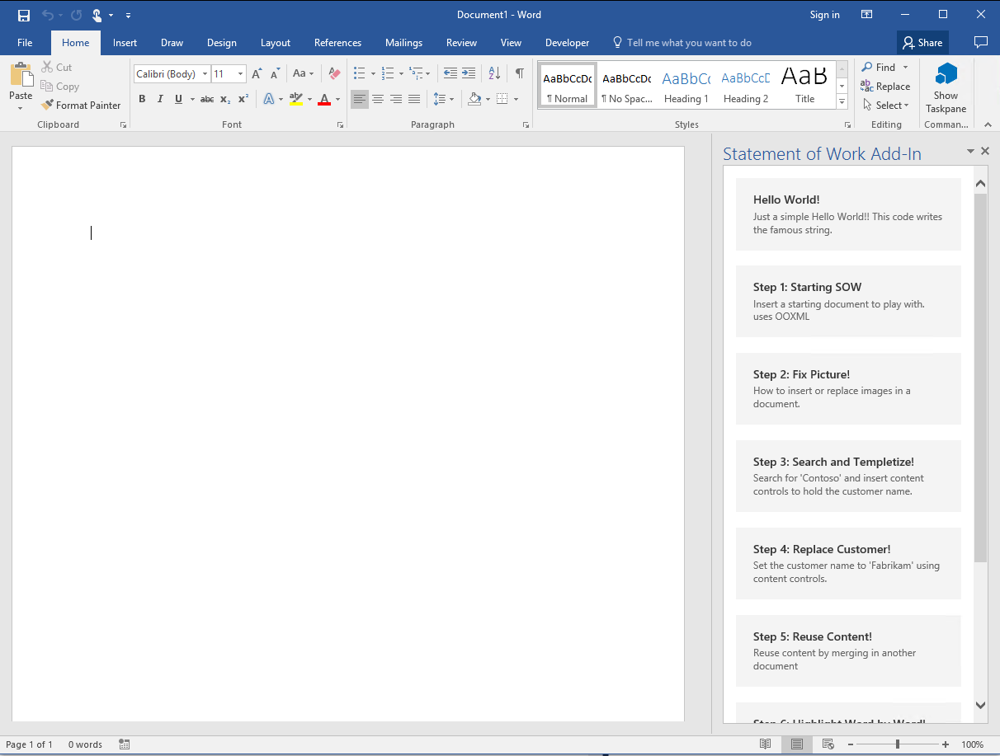

23. Close Word to terminate your debugging session and return to Visual Studio.
24. Return to the source file named **Home.js** or open it if it is not already open.
25. Create a function named **onaddContentHelloWorld** and add the following call to **body.insertText**. This method is replacing the entire body of the document with the "Hello World!" string (note that instead of "replace" the method can also insert at the "start" or "end" of the body). Also add a handler for success and error.

	````javascript
  function onaddContentHelloWorld() {
        // Hello World in the Word.js world!
        Word.run(function (context) {
            //this line replaces the body of the document with a friendly "Hello World!!!"
            context.document.body.insertText("Hello World!", "replace");
            return context.sync()

        }).then(function () {
            // if evertything was succesful, we sent an ok...
            showNotification("Task Complete!");
        })
          .catch(function (myError) {
              //otherwise we handle the exception here!
              showNotification("Error", myError.message);
          });
    }
	````

26. Finally, add a line of jQuery code into the add-in initialization logic to bind the click event of the **addContentHelloWorld** button to the **onaddContentHelloWorld** function (after the // Add event handlers here comment).

	````javascript
	Office.initialize = function (reason) {
		$(document).ready(function () {
		var element = document.querySelector('.ms-MessageBanner');
                messageBanner = new fabric.MessageBanner(element);
                messageBanner.hideBanner();
            // Add event handlers here....
            $('#addContentHellowWorld').click(onaddContentHellowWorld);
		});
	};
	````

27. When you are done, the **Home.js** file should match the following listing.

	````javascript
/// <reference path="/Scripts/FabricUI/MessageBanner.js" />


(function () {
    "use strict";

    var messageBanner;

    // The initialize function must be run each time a new page is loaded.
    Office.initialize = function (reason) {
        $(document).ready(function () {
            // Initialize the FabricUI notification mechanism and hide it
            var element = document.querySelector('.ms-MessageBanner');
            messageBanner = new fabric.MessageBanner(element);
            messageBanner.hideBanner();

            // Add event handlers here....
            $('#addContentHelloWorld').click(onaddContentHelloWorld);

     
        });
    };

  function onaddContentHelloWorld() {
        // Hello World in the Word.js world!
        Word.run(function (context) {
            //this line replaces the body of the document with a friendly "Hello World!!!"
            context.document.body.insertText("Hello World!", "replace");
            return context.sync()

        }).then(function () {
            // if evertything was succesful, we sent an ok...
            showNotification("Task Complete!");
        })
          .catch(function (myError) {
              //otherwise we handle the exception here!
              showNotification("Error", myError.message);
          });
    }

    //$$(Helper function for treating errors, $loc_script_taskpane_home_js_comment34$)$$
    function errorHandler(error) {
        // $$(Always be sure to catch any accumulated errors that bubble up from the Word.run execution., $loc_script_taskpane_home_js_comment35$)$$
        showNotification("Error:", error);
        console.log("Error: " + error);
        if (error instanceof OfficeExtension.Error) {
            console.log("Debug info: " + JSON.stringify(error.debugInfo));
        }
    }

    // Helper function for displaying notifications
    function showNotification(header, content) {
        $("#notificationHeader").text(header);
        $("#notificationBody").text(content);
        messageBanner.showBanner();
        messageBanner.toggleExpansion();
    }


})();
	````

28. Save your changes to **Home.js**.
29. Now test the functionality of the add-in. Press the **{F5}** key to begin a debugging session and after inserting the TaskPane  click the **Hello World** button. You should see that "Hello World" has been added into the cursor position of the Word document.

	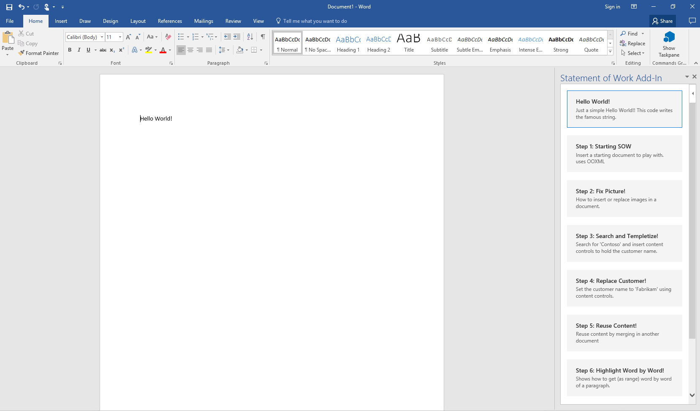

30. You have now successfully run and tested the add-in and its JavaScript logic using the Visual Studio debugger. Close Microsoft Word to stop the debugging session and return to Visual Studio.

## Exercise 2: Using OOXML to insert a starting Document

*In this exercise, you will continue working on the Visual Studio solution for the StatementOfWork add-in you created in the previous exercise. You will add additional JavaScript code to create a starting document using Office Open XML (OOXML).*
 
1. In Visual Studio, make sure you have the **StatementOfWork** project open.
2. In the Solution Explorer, double click on **Home.js** to open this JavaScript file in an editor window. 
3. Just below the **onaddContentHellowWorld** function, add seven new functions named **onaddContentStartingSOW**, **onFixPicture**, **onSearchAndTempletize**, **onaddChangeCustomer**, **onaaddReuseContent**, **onaddHighlights** and **onaddOpenDoc**.

	````javascript
 function onaddContentHellowWorld() {
        // Hello World in the Word.js world!
        Word.run(function (context) {
            //this line replaces the body of the document with a friendly "Hello World!!!"
            context.document.body.insertText("Hello World!", "replace");
            return context.sync()

        }).then(function () {
            // if everything was succesful, we sent an ok...
            showNotification("Task Complete!");
        })
          .catch(function (myError) {
              //otherwise we handle the exception here!
              showNotification("Error", myError.message);
          });
    }

    function onaddContentStartingSOW() {
    }
    function onFixPicture() {
    }
    function onSearchAndTempletize() {
    } 
    
    function onaddChangeCustomer() {
    }
    function onaaddReuseContent() {
    }

    function onaddHighlights() {
    }

    function onaddOpenDoc() {
    } 
	````

4. Go back to Office.initialize and provide the handlers for each button **click** event associating the buttons with the corresponding newly created functions.
   
	````javascript
	 Office.initialize = function (reason) {
        $(document).ready(function () {
            // Initialize the FabricUI notification mechanism and hide it
            var element = document.querySelector('.ms-MessageBanner');
            messageBanner = new fabric.MessageBanner(element);
            messageBanner.hideBanner();


            // Add event handlers here....
            $('#addContentHellowWorld').click(onaddContentHellowWorld);
            $('#addContentStartingSOW').click(onaddContentStartingSOW);
            $('#addPicture').click(onFixPicture);
            $('#addSearchAndTempletize').click(onSearchAndTempletize);
            $('#addChangeCustomer').click(onaddChangeCustomer);
            $('#addReuseContent').click(onaaddReuseContent);
            $('#addHighlights').click(onaddHighlights);
            $('#addOpenDoc').click(onaddOpenDoc);
     
        });
	    };
	````

5. Implement the **addContentStartingSOW** function to load the OOXML fragment with the starting document and then to write that OOXML to the Word document using the **body.insertOoxml** method by  using the code in the following listing. Note that there is  **getOOXMLForTemplate()** is a helping function used to load the needed  OOXML. 

	````javascript
function onaddContentStartingSOW() {
        Word.run(function (context) {
            // first lets get a pointer to the document body ....
            var body = context.document.body;
            // we will insert some OOXML with the initial template, and replace the existing content.
            var ooxmlText = getOOXMLForTemplate(); // this method returns some XML to be inserted.
            body.insertOoxml(ooxmlText, "replace");
            return context.sync()

        }).then(function () {
            // if evertything was succesful, we sent an ok...
            showNotification("Task Complete!");
        })
          .catch(function (myError) {
              //otherwise we handle the exception here!
              showNotification("Error", myError.message);
          });
    }
    
	````
5.1  Add the helper functions needed for the lab at the end of the **Home.js** page:
	````javascript
 //helper methods

    function getOOXMLForTemplate() {
        //retrieves the initial template! with OOXML we can achieve wonders!
        return ("<?xml version=\"1.0\" standalone=\"yes\"?>\r\n<?mso-application progid=\"Word.Document\"?>\r\n<pkg:package xmlns:pkg=\"http://schemas.microsoft.com/office/2006/xmlPackage\"><pkg:part pkg:name=\"/_rels/.rels\" pkg:contentType=\"application/vnd.openxmlformats-package.relationships+xml\" pkg:padding=\"512\"><pkg:xmlData><Relationships xmlns=\"http://schemas.openxmlformats.org/package/2006/relationships\"><Relationship Id=\"rId1\" Type=\"http://schemas.openxmlformats.org/officeDocument/2006/relationships/officeDocument\" Target=\"word/document.xml\"/></Relationships></pkg:xmlData></pkg:part><pkg:part pkg:name=\"/word/_rels/document.xml.rels\" pkg:contentType=\"application/vnd.openxmlformats-package.relationships+xml\" pkg:padding=\"256\"><pkg:xmlData><Relationships xmlns=\"http://schemas.openxmlformats.org/package/2006/relationships\"><Relationship Id=\"rId3\" Type=\"http://schemas.openxmlformats.org/officeDocument/2006/relationships/webSettings\" Target=\"webSettings.xml\"/><Relationship Id=\"rId2\" Type=\"http://schemas.openxmlformats.org/officeDocument/2006/relationships/settings\" Target=\"settings.xml\"/><Relationship Id=\"rId1\" Type=\"http://schemas.openxmlformats.org/officeDocument/2006/relationships/styles\" Target=\"styles.xml\"/><Relationship Id=\"rId5\" Type=\"http://schemas.openxmlformats.org/officeDocument/2006/relationships/theme\" Target=\"theme/theme1.xml\"/><Relationship Id=\"rId4\" Type=\"http://schemas.openxmlformats.org/officeDocument/2006/relationships/fontTable\" Target=\"fontTable.xml\"/></Relationships></pkg:xmlData></pkg:part><pkg:part pkg:name=\"/word/document.xml\" pkg:contentType=\"application/vnd.openxmlformats-officedocument.wordprocessingml.document.main+xml\"><pkg:xmlData><w:document xmlns:wpc=\"http://schemas.microsoft.com/office/word/2010/wordprocessingCanvas\" xmlns:cx=\"http://schemas.microsoft.com/office/drawing/2014/chartex\" xmlns:cx1=\"http://schemas.microsoft.com/office/drawing/2015/9/8/chartex\" xmlns:mc=\"http://schemas.openxmlformats.org/markup-compatibility/2006\" xmlns:o=\"urn:schemas-microsoft-com:office:office\" xmlns:r=\"http://schemas.openxmlformats.org/officeDocument/2006/relationships\" xmlns:m=\"http://schemas.openxmlformats.org/officeDocument/2006/math\" xmlns:v=\"urn:schemas-microsoft-com:vml\" xmlns:wp14=\"http://schemas.microsoft.com/office/word/2010/wordprocessingDrawing\" xmlns:wp=\"http://schemas.openxmlformats.org/drawingml/2006/wordprocessingDrawing\" xmlns:w10=\"urn:schemas-microsoft-com:office:word\" xmlns:w=\"http://schemas.openxmlformats.org/wordprocessingml/2006/main\" xmlns:w14=\"http://schemas.microsoft.com/office/word/2010/wordml\" xmlns:w15=\"http://schemas.microsoft.com/office/word/2012/wordml\" xmlns:w16se=\"http://schemas.microsoft.com/office/word/2015/wordml/symex\" xmlns:wpg=\"http://schemas.microsoft.com/office/word/2010/wordprocessingGroup\" xmlns:wpi=\"http://schemas.microsoft.com/office/word/2010/wordprocessingInk\" xmlns:wne=\"http://schemas.microsoft.com/office/word/2006/wordml\" xmlns:wps=\"http://schemas.microsoft.com/office/word/2010/wordprocessingShape\" mc:Ignorable=\"w14 w15 w16se wp14\"><w:body><w:tbl><w:tblPr><w:tblStyle w:val=\"LayoutTable\"/><w:tblW w:w=\"5000\" w:type=\"pct\"/><w:tblInd w:w=\"0\" w:type=\"dxa\"/><w:tblBorders><w:bottom w:val=\"single\" w:sz=\"8\" w:space=\"0\" w:color=\"9CC2E5\" w:themeColor=\"accent1\" w:themeTint=\"99\"/></w:tblBorders><w:tblCellMar><w:bottom w:w=\"360\" w:type=\"dxa\"/></w:tblCellMar><w:tblLook w:val=\"04A0\" w:firstRow=\"1\" w:lastRow=\"0\" w:firstColumn=\"1\" w:lastColumn=\"0\" w:noHBand=\"0\" w:noVBand=\"1\"/><w:tblDescription w:val=\"Company info\"/></w:tblPr><w:tblGrid><w:gridCol w:w=\"7488\"/><w:gridCol w:w=\"1872\"/></w:tblGrid><w:tr w:rsidR=\"00474418\" w:rsidTr=\"007451F5\"><w:tc><w:tcPr><w:tcW w:w=\"4000\" w:type=\"pct\"/><w:tcBorders><w:top w:val=\"nil\"/><w:left w:val=\"nil\"/><w:bottom w:val=\"single\" w:sz=\"8\" w:space=\"0\" w:color=\"9CC2E5\" w:themeColor=\"accent1\" w:themeTint=\"99\"/><w:right w:val=\"nil\"/></w:tcBorders><w:vAlign w:val=\"bottom\"/><w:hideMark/></w:tcPr><w:p w:rsidR=\"00474418\" w:rsidRDefault=\"00474418\" w:rsidP=\"007451F5\"><w:pPr><w:pStyle w:val=\"Name\"/><w:ind w:left=\"0\" w:right=\"0\"/></w:pPr><w:r><w:t>Microsoft</w:t></w:r></w:p><w:p w:rsidR=\"00474418\" w:rsidRDefault=\"00474418\" w:rsidP=\"007451F5\"><w:pPr><w:pStyle w:val=\"NoSpacing\"/><w:ind w:left=\"0\" w:right=\"0\"/></w:pPr><w:r><w:t>1 Redmond  Way</w:t></w:r><w:r><w:br/><w:t xml:space=\"preserve\">Redmond, WA, 98052 </w:t></w:r></w:p></w:tc><w:tc><w:tcPr><w:tcW w:w=\"1000\" w:type=\"pct\"/><w:tcBorders><w:top w:val=\"nil\"/><w:left w:val=\"nil\"/><w:bottom w:val=\"single\" w:sz=\"8\" w:space=\"0\" w:color=\"9CC2E5\" w:themeColor=\"accent1\" w:themeTint=\"99\"/><w:right w:val=\"nil\"/></w:tcBorders><w:vAlign w:val=\"center\"/><w:hideMark/></w:tcPr><w:p w:rsidR=\"00474418\" w:rsidRDefault=\"00474418\" w:rsidP=\"007451F5\"><w:pPr><w:pStyle w:val=\"NoSpacing\"/><w:jc w:val=\"center\"/></w:pPr><w:r><w:rPr><w:noProof/><w:lang w:eastAsia=\"en-US\"/></w:rPr><w:drawing><wp:inline distT=\"0\" distB=\"0\" distL=\"0\" distR=\"0\" wp14:anchorId=\"45721A09\" wp14:editId=\"455DB0B9\"><wp:extent cx=\"690245\" cy=\"327660\"/><wp:effectExtent l=\"0\" t=\"0\" r=\"0\" b=\"0\"/><wp:docPr id=\"1\" name=\"Picture 1\" descr=\"Logo\"/><wp:cNvGraphicFramePr><a:graphicFrameLocks xmlns:a=\"http://schemas.openxmlformats.org/drawingml/2006/main\" noChangeAspect=\"1\"/></wp:cNvGraphicFramePr><a:graphic xmlns:a=\"http://schemas.openxmlformats.org/drawingml/2006/main\"><a:graphicData uri=\"http://schemas.openxmlformats.org/drawingml/2006/picture\"><pic:pic xmlns:pic=\"http://schemas.openxmlformats.org/drawingml/2006/picture\"><pic:nvPicPr><pic:cNvPr id=\"0\" name=\"Picture 1\" descr=\"Logo\"/><pic:cNvPicPr><a:picLocks noChangeAspect=\"1\" noChangeArrowheads=\"1\"/></pic:cNvPicPr></pic:nvPicPr><pic:blipFill><a:blip><a:extLst><a:ext uri=\"{28A0092B-C50C-407E-A947-70E740481C1C}\"><a14:useLocalDpi xmlns:a14=\"http://schemas.microsoft.com/office/drawing/2010/main\" val=\"0\"/></a:ext></a:extLst></a:blip><a:srcRect/><a:stretch><a:fillRect/></a:stretch></pic:blipFill><pic:spPr bwMode=\"auto\"><a:xfrm><a:off x=\"0\" y=\"0\"/><a:ext cx=\"690245\" cy=\"327660\"/></a:xfrm><a:prstGeom prst=\"rect\"><a:avLst/></a:prstGeom><a:noFill/><a:ln><a:noFill/></a:ln></pic:spPr></pic:pic></a:graphicData></a:graphic></wp:inline></w:drawing></w:r></w:p></w:tc></w:tr></w:tbl><w:p w:rsidR=\"00474418\" w:rsidRDefault=\"00474418\" w:rsidP=\"00474418\"><w:pPr><w:pStyle w:val=\"Subtitle\"/><w:spacing w:before=\"0\"/></w:pPr><w:r><w:rPr><w:noProof/><w:lang w:eastAsia=\"en-US\"/></w:rPr><mc:AlternateContent><mc:Choice Requires=\"wps\"><w:drawing><wp:anchor distT=\"0\" distB=\"0\" distL=\"114300\" distR=\"114300\" simplePos=\"0\" relativeHeight=\"251659264\" behindDoc=\"1\" locked=\"0\" layoutInCell=\"1\" allowOverlap=\"1\" wp14:anchorId=\"365180CD\" wp14:editId=\"6FC6F8E9\"><wp:simplePos x=\"0\" y=\"0\"/><wp:positionH relativeFrom=\"leftMargin\"><wp:align>right</wp:align></wp:positionH><wp:positionV relativeFrom=\"margin\"><wp:align>top</wp:align></wp:positionV><wp:extent cx=\"701040\" cy=\"5733415\"/><wp:effectExtent l=\"0\" t=\"0\" r=\"0\" b=\"0\"/><wp:wrapNone/><wp:docPr id=\"2\" name=\"Text Box 2\" descr=\"Document title\"/><wp:cNvGraphicFramePr/><a:graphic xmlns:a=\"http://schemas.openxmlformats.org/drawingml/2006/main\"><a:graphicData uri=\"http://schemas.microsoft.com/office/word/2010/wordprocessingShape\"><wps:wsp><wps:cNvSpPr txBox=\"1\"/><wps:spPr><a:xfrm><a:off x=\"0\" y=\"0\"/><a:ext cx=\"717550\" cy=\"6172200\"/></a:xfrm><a:prstGeom prst=\"rect\"><a:avLst/></a:prstGeom><a:noFill/><a:ln w=\"6350\"><a:noFill/></a:ln><a:effectLst/></wps:spPr><wps:style><a:lnRef idx=\"0\"><a:schemeClr val=\"accent1\"/></a:lnRef><a:fillRef idx=\"0\"><a:schemeClr val=\"accent1\"/></a:fillRef><a:effectRef idx=\"0\"><a:schemeClr val=\"accent1\"/></a:effectRef><a:fontRef idx=\"minor\"><a:schemeClr val=\"dk1\"/></a:fontRef></wps:style><wps:txbx><w:txbxContent><w:p w:rsidR=\"00474418\" w:rsidRDefault=\"00474418\" w:rsidP=\"00474418\"><w:pPr><w:pStyle w:val=\"Title\"/></w:pPr><w:r><w:t>Statement of Work</w:t></w:r></w:p></w:txbxContent></wps:txbx><wps:bodyPr rot=\"0\" spcFirstLastPara=\"0\" vertOverflow=\"overflow\" horzOverflow=\"overflow\" vert=\"vert270\" wrap=\"square\" lIns=\"0\" tIns=\"182880\" rIns=\"228600\" bIns=\"45720\" numCol=\"1\" spcCol=\"0\" rtlCol=\"0\" fromWordArt=\"0\" anchor=\"b\" anchorCtr=\"0\" forceAA=\"0\" compatLnSpc=\"1\"><a:prstTxWarp prst=\"textNoShape\"><a:avLst/></a:prstTxWarp><a:spAutoFit/></wps:bodyPr></wps:wsp></a:graphicData></a:graphic><wp14:sizeRelH relativeFrom=\"margin\"><wp14:pctWidth>15000</wp14:pctWidth></wp14:sizeRelH><wp14:sizeRelV relativeFrom=\"margin\"><wp14:pctHeight>75000</wp14:pctHeight></wp14:sizeRelV></wp:anchor></w:drawing></mc:Choice><mc:Fallback><w:pict><v:shapetype w14:anchorId=\"365180CD\" id=\"_x0000_t202\" coordsize=\"21600,21600\" o:spt=\"202\" path=\"m,l,21600r21600,l21600,xe\"><v:stroke joinstyle=\"miter\"/><v:path gradientshapeok=\"t\" o:connecttype=\"rect\"/></v:shapetype><v:shape id=\"Text Box 2\" o:spid=\"_x0000_s1026\" type=\"#_x0000_t202\" alt=\"Document title\" style=\"position:absolute;margin-left:4pt;margin-top:0;width:55.2pt;height:451.45pt;z-index:-251657216;visibility:visible;mso-wrap-style:square;mso-width-percent:150;mso-height-percent:750;mso-wrap-distance-left:9pt;mso-wrap-distance-top:0;mso-wrap-distance-right:9pt;mso-wrap-distance-bottom:0;mso-position-horizontal:right;mso-position-horizontal-relative:left-margin-area;mso-position-vertical:top;mso-position-vertical-relative:margin;mso-width-percent:150;mso-height-percent:750;mso-width-relative:margin;mso-height-relative:margin;v-text-anchor:bottom\" o:gfxdata=\"UEsDBBQABgAIAAAAIQC2gziS/gAAAOEBAAATAAAAW0NvbnRlbnRfVHlwZXNdLnhtbJSRQU7DMBBF&#xA;90jcwfIWJU67QAgl6YK0S0CoHGBkTxKLZGx5TGhvj5O2G0SRWNoz/78nu9wcxkFMGNg6quQqL6RA&#xA;0s5Y6ir5vt9lD1JwBDIwOMJKHpHlpr69KfdHjyxSmriSfYz+USnWPY7AufNIadK6MEJMx9ApD/oD&#xA;OlTrorhX2lFEilmcO2RdNtjC5xDF9pCuTyYBB5bi6bQ4syoJ3g9WQ0ymaiLzg5KdCXlKLjvcW893&#xA;SUOqXwnz5DrgnHtJTxOsQfEKIT7DmDSUCaxw7Rqn8787ZsmRM9e2VmPeBN4uqYvTtW7jvijg9N/y&#xA;JsXecLq0q+WD6m8AAAD//wMAUEsDBBQABgAIAAAAIQA4/SH/1gAAAJQBAAALAAAAX3JlbHMvLnJl&#xA;bHOkkMFqwzAMhu+DvYPRfXGawxijTi+j0GvpHsDYimMaW0Yy2fr2M4PBMnrbUb/Q94l/f/hMi1qR&#xA;JVI2sOt6UJgd+ZiDgffL8ekFlFSbvV0oo4EbChzGx4f9GRdb25HMsYhqlCwG5lrLq9biZkxWOiqY&#xA;22YiTra2kYMu1l1tQD30/bPm3wwYN0x18gb45AdQl1tp5j/sFB2T0FQ7R0nTNEV3j6o9feQzro1i&#xA;OWA14Fm+Q8a1a8+Bvu/d/dMb2JY5uiPbhG/ktn4cqGU/er3pcvwCAAD//wMAUEsDBBQABgAIAAAA&#xA;IQCXwhvokQIAAHoFAAAOAAAAZHJzL2Uyb0RvYy54bWysVE1PGzEQvVfqf7B8L5tsC4kiNigFUVVC&#xA;gICKs+O1yar+qu1kN/31ffbuBkp7oepldzwfzzNvxnN61mlFdsKHxpqKTo8mlAjDbd2Yp4p+e7j8&#xA;MKckRGZqpqwRFd2LQM+W79+dtm4hSruxqhaeAMSEResquonRLYoi8I3QLBxZJwyM0nrNIo7+qag9&#xA;a4GuVVFOJidFa33tvOUiBGgveiNdZnwpBY83UgYRiaoocov56/N3nb7F8pQtnjxzm4YPabB/yEKz&#xA;xuDSA9QFi4xsffMHlG64t8HKeMStLqyUDRe5BlQznbyq5n7DnMi1gJzgDjSF/wfLr3e3njR1RUtK&#xA;DNNo0YPoIvlsOwJNLQIHWxeWb7UwkcQmKpFIa11YIPbeITp28EbzR32AMnHRSa/TH1US2EH//kB5&#xA;uoNDOZvOjo9h4TCdTGcleppgiudo50P8IqwmSaioR0sz02x3FWLvOrqky4y9bJTKbVWGtED9CPzf&#xA;LABXJmlEHpABJlXUZ56luFci+ShzJyQIygUkRR5Nca482TEMFeMcxOTaMy68k5dEEm8JHPyfs3pL&#xA;cF/HeLM18RCsG2N9rv5V2vX3MWXZ+4PzF3UnMXbrbuj02tZ7NNrb/v0Exy8bdOOKhXjLPB4MOogl&#xA;EG/wkcqCdTtIlGys//k3ffKvaPqWM4S3eIMVDT+2zAtK1FeDIYc6ZmE6L+dznHw+leX8BGNC1vn0&#xA;6XhW4mC2+tyiH1PsG8ezmAKiGkXprX7Eslila2FihiO1iq5H8Tz2ewHLhovVKjvhkToWr8y94wk6&#xA;tScN20P3yLwbJjJilq/t+FbZ4tVg9r55ctxqGzGeeWoTwz2tA/N44Hnuh2WUNsjLc/Z6XpnLXwAA&#xA;AP//AwBQSwMEFAAGAAgAAAAhANhn2UnaAAAABQEAAA8AAABkcnMvZG93bnJldi54bWxMj81OwzAQ&#xA;hO9IvIO1SFwQtRMhRNM4Fa3EgRu0PMA2XvLTeB3ZTpu+PS4XuKw0mtHMt+V6toM4kQ+dYw3ZQoEg&#xA;rp3puNHwtX97fAERIrLBwTFpuFCAdXV7U2Jh3Jk/6bSLjUglHArU0MY4FlKGuiWLYeFG4uR9O28x&#xA;JukbaTyeU7kdZK7Us7TYcVpocaRtS/VxN1kNrt9MftNzrh7ilH00l23v3zut7+/m1xWISHP8C8MV&#xA;P6FDlZgObmITxKAhPRJ/79XL1BOIg4alypcgq1L+p69+AAAA//8DAFBLAQItABQABgAIAAAAIQC2&#xA;gziS/gAAAOEBAAATAAAAAAAAAAAAAAAAAAAAAABbQ29udGVudF9UeXBlc10ueG1sUEsBAi0AFAAG&#xA;AAgAAAAhADj9If/WAAAAlAEAAAsAAAAAAAAAAAAAAAAALwEAAF9yZWxzLy5yZWxzUEsBAi0AFAAG&#xA;AAgAAAAhAJfCG+iRAgAAegUAAA4AAAAAAAAAAAAAAAAALgIAAGRycy9lMm9Eb2MueG1sUEsBAi0A&#xA;FAAGAAgAAAAhANhn2UnaAAAABQEAAA8AAAAAAAAAAAAAAAAA6wQAAGRycy9kb3ducmV2LnhtbFBL&#xA;BQYAAAAABAAEAPMAAADyBQAAAAA=&#xA;\" filled=\"f\" stroked=\"f\" strokeweight=\".5pt\"><v:textbox style=\"layout-flow:vertical;mso-layout-flow-alt:bottom-to-top;mso-fit-shape-to-text:t\" inset=\"0,14.4pt,18pt\"><w:txbxContent><w:p w:rsidR=\"00474418\" w:rsidRDefault=\"00474418\" w:rsidP=\"00474418\"><w:pPr><w:pStyle w:val=\"Title\"/></w:pPr><w:r><w:t>Statement of Work</w:t></w:r></w:p></w:txbxContent></v:textbox><w10:wrap anchorx=\"margin\" anchory=\"margin\"/></v:shape></w:pict></mc:Fallback></mc:AlternateContent></w:r><w:r><w:t>SOW AAA4032122 for Agreement to Perform Consulting Services to Contoso</w:t></w:r></w:p><w:tbl><w:tblPr><w:tblStyle w:val=\"LayoutTable\"/><w:tblW w:w=\"5000\" w:type=\"pct\"/><w:tblInd w:w=\"0\" w:type=\"dxa\"/><w:tblBorders><w:bottom w:val=\"single\" w:sz=\"4\" w:space=\"0\" w:color=\"9CC2E5\" w:themeColor=\"accent1\" w:themeTint=\"99\"/></w:tblBorders><w:tblLook w:val=\"04A0\" w:firstRow=\"1\" w:lastRow=\"0\" w:firstColumn=\"1\" w:lastColumn=\"0\" w:noHBand=\"0\" w:noVBand=\"1\"/><w:tblDescription w:val=\"Services performed by and for\"/></w:tblPr><w:tblGrid><w:gridCol w:w=\"3120\"/><w:gridCol w:w=\"3121\"/><w:gridCol w:w=\"3119\"/></w:tblGrid><w:tr w:rsidR=\"00474418\" w:rsidTr=\"007451F5\"><w:tc><w:tcPr><w:tcW w:w=\"1667\" w:type=\"pct\"/><w:tcBorders><w:top w:val=\"nil\"/><w:left w:val=\"nil\"/><w:bottom w:val=\"nil\"/><w:right w:val=\"nil\"/></w:tcBorders><w:vAlign w:val=\"bottom\"/><w:hideMark/></w:tcPr><w:p w:rsidR=\"00474418\" w:rsidRDefault=\"00474418\" w:rsidP=\"007451F5\"><w:pPr><w:pStyle w:val=\"FormHeading\"/><w:ind w:left=\"0\" w:right=\"0\"/></w:pPr><w:r><w:t>Date</w:t></w:r></w:p></w:tc><w:tc><w:tcPr><w:tcW w:w=\"1667\" w:type=\"pct\"/><w:tcBorders><w:top w:val=\"nil\"/><w:left w:val=\"nil\"/><w:bottom w:val=\"nil\"/><w:right w:val=\"nil\"/></w:tcBorders><w:vAlign w:val=\"bottom\"/><w:hideMark/></w:tcPr><w:p w:rsidR=\"00474418\" w:rsidRDefault=\"00474418\" w:rsidP=\"007451F5\"><w:pPr><w:pStyle w:val=\"FormHeading\"/><w:ind w:left=\"0\" w:right=\"0\"/></w:pPr><w:r><w:t>Services Performed By:</w:t></w:r></w:p></w:tc><w:tc><w:tcPr><w:tcW w:w=\"1666\" w:type=\"pct\"/><w:tcBorders><w:top w:val=\"nil\"/><w:left w:val=\"nil\"/><w:bottom w:val=\"nil\"/><w:right w:val=\"nil\"/></w:tcBorders><w:vAlign w:val=\"bottom\"/><w:hideMark/></w:tcPr><w:p w:rsidR=\"00474418\" w:rsidRDefault=\"00474418\" w:rsidP=\"007451F5\"><w:pPr><w:pStyle w:val=\"FormHeading\"/><w:ind w:left=\"0\" w:right=\"0\"/></w:pPr><w:r><w:t>Services Performed For:</w:t></w:r></w:p></w:tc></w:tr><w:tr w:rsidR=\"00474418\" w:rsidTr=\"007451F5\"><w:trPr><w:trHeight w:val=\"1314\"/></w:trPr><w:tc><w:tcPr><w:tcW w:w=\"1667\" w:type=\"pct\"/><w:tcBorders><w:top w:val=\"nil\"/><w:left w:val=\"nil\"/><w:bottom w:val=\"single\" w:sz=\"4\" w:space=\"0\" w:color=\"9CC2E5\" w:themeColor=\"accent1\" w:themeTint=\"99\"/><w:right w:val=\"nil\"/></w:tcBorders><w:tcMar><w:top w:w=\"0\" w:type=\"dxa\"/><w:left w:w=\"0\" w:type=\"dxa\"/><w:bottom w:w=\"360\" w:type=\"dxa\"/><w:right w:w=\"0\" w:type=\"dxa\"/></w:tcMar></w:tcPr><w:p w:rsidR=\"00474418\" w:rsidRDefault=\"00474418\" w:rsidP=\"007451F5\"><w:pPr><w:pStyle w:val=\"NoSpacing\"/></w:pPr></w:p></w:tc><w:tc><w:tcPr><w:tcW w:w=\"1667\" w:type=\"pct\"/><w:tcBorders><w:top w:val=\"nil\"/><w:left w:val=\"nil\"/><w:bottom w:val=\"single\" w:sz=\"4\" w:space=\"0\" w:color=\"9CC2E5\" w:themeColor=\"accent1\" w:themeTint=\"99\"/><w:right w:val=\"nil\"/></w:tcBorders><w:tcMar><w:top w:w=\"0\" w:type=\"dxa\"/><w:left w:w=\"0\" w:type=\"dxa\"/><w:bottom w:w=\"360\" w:type=\"dxa\"/><w:right w:w=\"0\" w:type=\"dxa\"/></w:tcMar><w:hideMark/></w:tcPr><w:p w:rsidR=\"00474418\" w:rsidRDefault=\"00474418\" w:rsidP=\"007451F5\"><w:pPr><w:pStyle w:val=\"NoSpacing\"/><w:ind w:left=\"0\" w:right=\"0\"/></w:pPr><w:r><w:t>Microsoft</w:t></w:r></w:p><w:p w:rsidR=\"00474418\" w:rsidRDefault=\"00474418\" w:rsidP=\"007451F5\"><w:pPr><w:pStyle w:val=\"NoSpacing\"/><w:ind w:left=\"0\" w:right=\"0\"/></w:pPr><w:r><w:t>1 Microsoft Way</w:t></w:r><w:r><w:br/><w:t xml:space=\"preserve\">Redmond, WA, 98052 </w:t></w:r></w:p></w:tc><w:tc><w:tcPr><w:tcW w:w=\"1666\" w:type=\"pct\"/><w:tcBorders><w:top w:val=\"nil\"/><w:left w:val=\"nil\"/><w:bottom w:val=\"single\" w:sz=\"4\" w:space=\"0\" w:color=\"9CC2E5\" w:themeColor=\"accent1\" w:themeTint=\"99\"/><w:right w:val=\"nil\"/></w:tcBorders><w:tcMar><w:top w:w=\"0\" w:type=\"dxa\"/><w:left w:w=\"0\" w:type=\"dxa\"/><w:bottom w:w=\"360\" w:type=\"dxa\"/><w:right w:w=\"0\" w:type=\"dxa\"/></w:tcMar><w:hideMark/></w:tcPr><w:p w:rsidR=\"00474418\" w:rsidRDefault=\"00474418\" w:rsidP=\"007451F5\"><w:pPr><w:pStyle w:val=\"NoSpacing\"/><w:ind w:left=\"0\" w:right=\"0\"/></w:pPr><w:r><w:t>Contoso</w:t></w:r></w:p><w:p w:rsidR=\"00474418\" w:rsidRDefault=\"00474418\" w:rsidP=\"007451F5\"><w:pPr><w:pStyle w:val=\"NoSpacing\"/><w:ind w:left=\"0\" w:right=\"0\"/></w:pPr><w:r><w:t>13291 NE 44th St</w:t></w:r><w:r><w:br/><w:t>Bellevue, WA, 98082</w:t></w:r></w:p></w:tc></w:tr></w:tbl><w:p w:rsidR=\"00474418\" w:rsidRDefault=\"00474418\" w:rsidP=\"00474418\"/><w:p w:rsidR=\"00474418\" w:rsidRDefault=\"00474418\" w:rsidP=\"00474418\"><w:r><w:t xml:space=\"preserve\">This Statement of Work (SOW) is issued pursuant to the Consultant Services Master Agreement between Contoso (“Client”) and Microsoft (“Contractor”), effective </w:t></w:r><w:sdt><w:sdtPr><w:alias w:val=\"Date\"/><w:tag w:val=\"Date\"/><w:id w:val=\"-925342886\"/><w:date w:fullDate=\"2015-07-30T00:00:00Z\"><w:dateFormat w:val=\"MMMM d, yyyy\"/><w:lid w:val=\"en-US\"/><w:storeMappedDataAs w:val=\"dateTime\"/><w:calendar w:val=\"gregorian\"/></w:date></w:sdtPr><w:sdtContent><w:r><w:t>July 30, 2015</w:t></w:r></w:sdtContent></w:sdt><w:r><w:t xml:space=\"preserve\"> (the “Agreement”). This SOW is subject to the terms and conditions contained in the Agreement between the parties and is made a part thereof. Any term not otherwise defined herein shall have the meaning specified in the Agreement. In the event of any conflict or inconsistency between the terms of this SOW and the terms of this Agreement, the terms of this SOW shall govern and prevail.   </w:t></w:r></w:p><w:p w:rsidR=\"00474418\" w:rsidRDefault=\"00474418\" w:rsidP=\"00474418\"><w:r><w:t xml:space=\"preserve\">This SOW # AAA4032122 (hereinafter called the “SOW”), effective as of July 23, 2015, is entered into by and between Contractor and Client, and is subject to the terms and conditions specified below. The Exhibit(s) to this SOW, if any, shall be deemed to be a part hereof. In the event of any inconsistencies between the terms of the body of this SOW and the terms of the Exhibit(s) hereto, the terms of the body of this SOW shall prevail. </w:t></w:r></w:p><w:p w:rsidR=\"00474418\" w:rsidRDefault=\"00474418\" w:rsidP=\"00474418\"/><w:p w:rsidR=\"00000000\" w:rsidRDefault=\"00474418\"/><w:sectPr w:rsidR=\"00000000\" w:rsidSect=\"00795927\"><w:pgSz w:w=\"12240\" w:h=\"15840\"/><w:pgMar w:top=\"1440\" w:right=\"1440\" w:bottom=\"1440\" w:left=\"1440\" w:header=\"720\" w:footer=\"720\" w:gutter=\"0\"/><w:cols w:space=\"720\"/><w:docGrid w:linePitch=\"360\"/></w:sectPr></w:body></w:document></pkg:xmlData></pkg:part><pkg:part pkg:name=\"/word/theme/theme1.xml\" pkg:contentType=\"application/vnd.openxmlformats-officedocument.theme+xml\"><pkg:xmlData><a:theme xmlns:a=\"http://schemas.openxmlformats.org/drawingml/2006/main\" name=\"Office Theme\"><a:themeElements><a:clrScheme name=\"Office\"><a:dk1><a:sysClr val=\"windowText\" lastClr=\"000000\"/></a:dk1><a:lt1><a:sysClr val=\"window\" lastClr=\"FFFFFF\"/></a:lt1><a:dk2><a:srgbClr val=\"44546A\"/></a:dk2><a:lt2><a:srgbClr val=\"E7E6E6\"/></a:lt2><a:accent1><a:srgbClr val=\"5B9BD5\"/></a:accent1><a:accent2><a:srgbClr val=\"ED7D31\"/></a:accent2><a:accent3><a:srgbClr val=\"A5A5A5\"/></a:accent3><a:accent4><a:srgbClr val=\"FFC000\"/></a:accent4><a:accent5><a:srgbClr val=\"4472C4\"/></a:accent5><a:accent6><a:srgbClr val=\"70AD47\"/></a:accent6><a:hlink><a:srgbClr val=\"0563C1\"/></a:hlink><a:folHlink><a:srgbClr val=\"954F72\"/></a:folHlink></a:clrScheme><a:fontScheme name=\"Office\"><a:majorFont><a:latin typeface=\"Calibri Light\" panose=\"020F0302020204030204\"/><a:ea typeface=\"\"/><a:cs typeface=\"\"/><a:font script=\"Jpan\" typeface=\"ＭＳ ゴシック\"/><a:font script=\"Hang\" typeface=\"맑은 고딕\"/><a:font script=\"Hans\" typeface=\"宋体\"/><a:font script=\"Hant\" typeface=\"新細明體\"/><a:font script=\"Arab\" typeface=\"Times New Roman\"/><a:font script=\"Hebr\" typeface=\"Times New Roman\"/><a:font script=\"Thai\" typeface=\"Angsana New\"/><a:font script=\"Ethi\" typeface=\"Nyala\"/><a:font script=\"Beng\" typeface=\"Vrinda\"/><a:font script=\"Gujr\" typeface=\"Shruti\"/><a:font script=\"Khmr\" typeface=\"MoolBoran\"/><a:font script=\"Knda\" typeface=\"Tunga\"/><a:font script=\"Guru\" typeface=\"Raavi\"/><a:font script=\"Cans\" typeface=\"Euphemia\"/><a:font script=\"Cher\" typeface=\"Plantagenet Cherokee\"/><a:font script=\"Yiii\" typeface=\"Microsoft Yi Baiti\"/><a:font script=\"Tibt\" typeface=\"Microsoft Himalaya\"/><a:font script=\"Thaa\" typeface=\"MV Boli\"/><a:font script=\"Deva\" typeface=\"Mangal\"/><a:font script=\"Telu\" typeface=\"Gautami\"/><a:font script=\"Taml\" typeface=\"Latha\"/><a:font script=\"Syrc\" typeface=\"Estrangelo Edessa\"/><a:font script=\"Orya\" typeface=\"Kalinga\"/><a:font script=\"Mlym\" typeface=\"Kartika\"/><a:font script=\"Laoo\" typeface=\"DokChampa\"/><a:font script=\"Sinh\" typeface=\"Iskoola Pota\"/><a:font script=\"Mong\" typeface=\"Mongolian Baiti\"/><a:font script=\"Viet\" typeface=\"Times New Roman\"/><a:font script=\"Uigh\" typeface=\"Microsoft Uighur\"/><a:font script=\"Geor\" typeface=\"Sylfaen\"/></a:majorFont><a:minorFont><a:latin typeface=\"Calibri\" panose=\"020F0502020204030204\"/><a:ea typeface=\"\"/><a:cs typeface=\"\"/><a:font script=\"Jpan\" typeface=\"ＭＳ 明朝\"/><a:font script=\"Hang\" typeface=\"맑은 고딕\"/><a:font script=\"Hans\" typeface=\"宋体\"/><a:font script=\"Hant\" typeface=\"新細明體\"/><a:font script=\"Arab\" typeface=\"Arial\"/><a:font script=\"Hebr\" typeface=\"Arial\"/><a:font script=\"Thai\" typeface=\"Cordia New\"/><a:font script=\"Ethi\" typeface=\"Nyala\"/><a:font script=\"Beng\" typeface=\"Vrinda\"/><a:font script=\"Gujr\" typeface=\"Shruti\"/><a:font script=\"Khmr\" typeface=\"DaunPenh\"/><a:font script=\"Knda\" typeface=\"Tunga\"/><a:font script=\"Guru\" typeface=\"Raavi\"/><a:font script=\"Cans\" typeface=\"Euphemia\"/><a:font script=\"Cher\" typeface=\"Plantagenet Cherokee\"/><a:font script=\"Yiii\" typeface=\"Microsoft Yi Baiti\"/><a:font script=\"Tibt\" typeface=\"Microsoft Himalaya\"/><a:font script=\"Thaa\" typeface=\"MV Boli\"/><a:font script=\"Deva\" typeface=\"Mangal\"/><a:font script=\"Telu\" typeface=\"Gautami\"/><a:font script=\"Taml\" typeface=\"Latha\"/><a:font script=\"Syrc\" typeface=\"Estrangelo Edessa\"/><a:font script=\"Orya\" typeface=\"Kalinga\"/><a:font script=\"Mlym\" typeface=\"Kartika\"/><a:font script=\"Laoo\" typeface=\"DokChampa\"/><a:font script=\"Sinh\" typeface=\"Iskoola Pota\"/><a:font script=\"Mong\" typeface=\"Mongolian Baiti\"/><a:font script=\"Viet\" typeface=\"Arial\"/><a:font script=\"Uigh\" typeface=\"Microsoft Uighur\"/><a:font script=\"Geor\" typeface=\"Sylfaen\"/></a:minorFont></a:fontScheme><a:fmtScheme name=\"Office\"><a:fillStyleLst><a:solidFill><a:schemeClr val=\"phClr\"/></a:solidFill><a:gradFill rotWithShape=\"1\"><a:gsLst><a:gs pos=\"0\"><a:schemeClr val=\"phClr\"><a:lumMod val=\"110000\"/><a:satMod val=\"105000\"/><a:tint val=\"67000\"/></a:schemeClr></a:gs><a:gs pos=\"50000\"><a:schemeClr val=\"phClr\"><a:lumMod val=\"105000\"/><a:satMod val=\"103000\"/><a:tint val=\"73000\"/></a:schemeClr></a:gs><a:gs pos=\"100000\"><a:schemeClr val=\"phClr\"><a:lumMod val=\"105000\"/><a:satMod val=\"109000\"/><a:tint val=\"81000\"/></a:schemeClr></a:gs></a:gsLst><a:lin ang=\"5400000\" scaled=\"0\"/></a:gradFill><a:gradFill rotWithShape=\"1\"><a:gsLst><a:gs pos=\"0\"><a:schemeClr val=\"phClr\"><a:satMod val=\"103000\"/><a:lumMod val=\"102000\"/><a:tint val=\"94000\"/></a:schemeClr></a:gs><a:gs pos=\"50000\"><a:schemeClr val=\"phClr\"><a:satMod val=\"110000\"/><a:lumMod val=\"100000\"/><a:shade val=\"100000\"/></a:schemeClr></a:gs><a:gs pos=\"100000\"><a:schemeClr val=\"phClr\"><a:lumMod val=\"99000\"/><a:satMod val=\"120000\"/><a:shade val=\"78000\"/></a:schemeClr></a:gs></a:gsLst><a:lin ang=\"5400000\" scaled=\"0\"/></a:gradFill></a:fillStyleLst><a:lnStyleLst><a:ln w=\"6350\" cap=\"flat\" cmpd=\"sng\" algn=\"ctr\"><a:solidFill><a:schemeClr val=\"phClr\"/></a:solidFill><a:prstDash val=\"solid\"/><a:miter lim=\"800000\"/></a:ln><a:ln w=\"12700\" cap=\"flat\" cmpd=\"sng\" algn=\"ctr\"><a:solidFill><a:schemeClr val=\"phClr\"/></a:solidFill><a:prstDash val=\"solid\"/><a:miter lim=\"800000\"/></a:ln><a:ln w=\"19050\" cap=\"flat\" cmpd=\"sng\" algn=\"ctr\"><a:solidFill><a:schemeClr val=\"phClr\"/></a:solidFill><a:prstDash val=\"solid\"/><a:miter lim=\"800000\"/></a:ln></a:lnStyleLst><a:effectStyleLst><a:effectStyle><a:effectLst/></a:effectStyle><a:effectStyle><a:effectLst/></a:effectStyle><a:effectStyle><a:effectLst><a:outerShdw blurRad=\"57150\" dist=\"19050\" dir=\"5400000\" algn=\"ctr\" rotWithShape=\"0\"><a:srgbClr val=\"000000\"><a:alpha val=\"63000\"/></a:srgbClr></a:outerShdw></a:effectLst></a:effectStyle></a:effectStyleLst><a:bgFillStyleLst><a:solidFill><a:schemeClr val=\"phClr\"/></a:solidFill><a:solidFill><a:schemeClr val=\"phClr\"><a:tint val=\"95000\"/><a:satMod val=\"170000\"/></a:schemeClr></a:solidFill><a:gradFill rotWithShape=\"1\"><a:gsLst><a:gs pos=\"0\"><a:schemeClr val=\"phClr\"><a:tint val=\"93000\"/><a:satMod val=\"150000\"/><a:shade val=\"98000\"/><a:lumMod val=\"102000\"/></a:schemeClr></a:gs><a:gs pos=\"50000\"><a:schemeClr val=\"phClr\"><a:tint val=\"98000\"/><a:satMod val=\"130000\"/><a:shade val=\"90000\"/><a:lumMod val=\"103000\"/></a:schemeClr></a:gs><a:gs pos=\"100000\"><a:schemeClr val=\"phClr\"><a:shade val=\"63000\"/><a:satMod val=\"120000\"/></a:schemeClr></a:gs></a:gsLst><a:lin ang=\"5400000\" scaled=\"0\"/></a:gradFill></a:bgFillStyleLst></a:fmtScheme></a:themeElements><a:objectDefaults/><a:extraClrSchemeLst/><a:extLst><a:ext uri=\"{05A4C25C-085E-4340-85A3-A5531E510DB2}\"><thm15:themeFamily xmlns:thm15=\"http://schemas.microsoft.com/office/thememl/2012/main\" name=\"Office Theme\" id=\"{62F939B6-93AF-4DB8-9C6B-D6C7DFDC589F}\" vid=\"{4A3C46E8-61CC-4603-A589-7422A47A8E4A}\"/></a:ext></a:extLst></a:theme></pkg:xmlData></pkg:part><pkg:part pkg:name=\"/word/settings.xml\" pkg:contentType=\"application/vnd.openxmlformats-officedocument.wordprocessingml.settings+xml\"><pkg:xmlData><w:settings xmlns:mc=\"http://schemas.openxmlformats.org/markup-compatibility/2006\" xmlns:o=\"urn:schemas-microsoft-com:office:office\" xmlns:r=\"http://schemas.openxmlformats.org/officeDocument/2006/relationships\" xmlns:m=\"http://schemas.openxmlformats.org/officeDocument/2006/math\" xmlns:v=\"urn:schemas-microsoft-com:vml\" xmlns:w10=\"urn:schemas-microsoft-com:office:word\" xmlns:w=\"http://schemas.openxmlformats.org/wordprocessingml/2006/main\" xmlns:w14=\"http://schemas.microsoft.com/office/word/2010/wordml\" xmlns:w15=\"http://schemas.microsoft.com/office/word/2012/wordml\" xmlns:w16se=\"http://schemas.microsoft.com/office/word/2015/wordml/symex\" xmlns:sl=\"http://schemas.openxmlformats.org/schemaLibrary/2006/main\" mc:Ignorable=\"w14 w15 w16se\"><w:defaultTabStop w:val=\"720\"/><w:characterSpacingControl w:val=\"doNotCompress\"/><w:compat><w:compatSetting w:name=\"compatibilityMode\" w:uri=\"http://schemas.microsoft.com/office/word\" w:val=\"15\"/><w:compatSetting w:name=\"overrideTableStyleFontSizeAndJustification\" w:uri=\"http://schemas.microsoft.com/office/word\" w:val=\"1\"/><w:compatSetting w:name=\"enableOpenTypeFeatures\" w:uri=\"http://schemas.microsoft.com/office/word\" w:val=\"1\"/><w:compatSetting w:name=\"doNotFlipMirrorIndents\" w:uri=\"http://schemas.microsoft.com/office/word\" w:val=\"1\"/><w:compatSetting w:name=\"differentiateMultirowTableHeaders\" w:uri=\"http://schemas.microsoft.com/office/word\" w:val=\"1\"/></w:compat><w:rsids><w:rsidRoot w:val=\"00E54D41\"/><w:rsid w:val=\"00474418\"/><w:rsid w:val=\"0073406C\"/><w:rsid w:val=\"00E54D41\"/><w:rsid w:val=\"00E56E07\"/></w:rsids><m:mathPr><m:mathFont m:val=\"Cambria Math\"/><m:brkBin m:val=\"before\"/><m:brkBinSub m:val=\"--\"/><m:smallFrac m:val=\"0\"/><m:dispDef/><m:lMargin m:val=\"0\"/><m:rMargin m:val=\"0\"/><m:defJc m:val=\"centerGroup\"/><m:wrapIndent m:val=\"1440\"/><m:intLim m:val=\"subSup\"/><m:naryLim m:val=\"undOvr\"/></m:mathPr><w:themeFontLang w:val=\"en-US\"/><w:clrSchemeMapping w:bg1=\"light1\" w:t1=\"dark1\" w:bg2=\"light2\" w:t2=\"dark2\" w:accent1=\"accent1\" w:accent2=\"accent2\" w:accent3=\"accent3\" w:accent4=\"accent4\" w:accent5=\"accent5\" w:accent6=\"accent6\" w:hyperlink=\"hyperlink\" w:followedHyperlink=\"followedHyperlink\"/><w:shapeDefaults><o:shapedefaults v:ext=\"edit\" spidmax=\"1026\"/><o:shapelayout v:ext=\"edit\"><o:idmap v:ext=\"edit\" data=\"1\"/></o:shapelayout></w:shapeDefaults><w:decimalSymbol w:val=\".\"/><w:listSeparator w:val=\",\"/><w14:docId w14:val=\"6E363292\"/><w15:chartTrackingRefBased/><w15:docId w15:val=\"{9860E7BA-B07E-438A-A05B-8495580B9778}\"/></w:settings></pkg:xmlData></pkg:part><pkg:part pkg:name=\"/word/fontTable.xml\" pkg:contentType=\"application/vnd.openxmlformats-officedocument.wordprocessingml.fontTable+xml\"><pkg:xmlData><w:fonts xmlns:mc=\"http://schemas.openxmlformats.org/markup-compatibility/2006\" xmlns:r=\"http://schemas.openxmlformats.org/officeDocument/2006/relationships\" xmlns:w=\"http://schemas.openxmlformats.org/wordprocessingml/2006/main\" xmlns:w14=\"http://schemas.microsoft.com/office/word/2010/wordml\" xmlns:w15=\"http://schemas.microsoft.com/office/word/2012/wordml\" xmlns:w16se=\"http://schemas.microsoft.com/office/word/2015/wordml/symex\" mc:Ignorable=\"w14 w15 w16se\"><w:font w:name=\"Calibri\"><w:panose1 w:val=\"020F0502020204030204\"/><w:charset w:val=\"00\"/><w:family w:val=\"swiss\"/><w:pitch w:val=\"variable\"/><w:sig w:usb0=\"E00002FF\" w:usb1=\"4000ACFF\" w:usb2=\"00000001\" w:usb3=\"00000000\" w:csb0=\"0000019F\" w:csb1=\"00000000\"/></w:font><w:font w:name=\"Times New Roman\"><w:panose1 w:val=\"02020603050405020304\"/><w:charset w:val=\"00\"/><w:family w:val=\"roman\"/><w:pitch w:val=\"variable\"/><w:sig w:usb0=\"E0002AFF\" w:usb1=\"C0007841\" w:usb2=\"00000009\" w:usb3=\"00000000\" w:csb0=\"000001FF\" w:csb1=\"00000000\"/></w:font><w:font w:name=\"Calibri Light\"><w:panose1 w:val=\"020F0302020204030204\"/><w:charset w:val=\"00\"/><w:family w:val=\"swiss\"/><w:pitch w:val=\"variable\"/><w:sig w:usb0=\"A00002EF\" w:usb1=\"4000207B\" w:usb2=\"00000000\" w:usb3=\"00000000\" w:csb0=\"0000019F\" w:csb1=\"00000000\"/></w:font></w:fonts></pkg:xmlData></pkg:part><pkg:part pkg:name=\"/word/webSettings.xml\" pkg:contentType=\"application/vnd.openxmlformats-officedocument.wordprocessingml.webSettings+xml\"><pkg:xmlData><w:webSettings xmlns:mc=\"http://schemas.openxmlformats.org/markup-compatibility/2006\" xmlns:r=\"http://schemas.openxmlformats.org/officeDocument/2006/relationships\" xmlns:w=\"http://schemas.openxmlformats.org/wordprocessingml/2006/main\" xmlns:w14=\"http://schemas.microsoft.com/office/word/2010/wordml\" xmlns:w15=\"http://schemas.microsoft.com/office/word/2012/wordml\" xmlns:w16se=\"http://schemas.microsoft.com/office/word/2015/wordml/symex\" mc:Ignorable=\"w14 w15 w16se\"><w:divs><w:div w:id=\"648481229\"><w:bodyDiv w:val=\"1\"/><w:marLeft w:val=\"0\"/><w:marRight w:val=\"0\"/><w:marTop w:val=\"0\"/><w:marBottom w:val=\"0\"/><w:divBdr><w:top w:val=\"none\" w:sz=\"0\" w:space=\"0\" w:color=\"auto\"/><w:left w:val=\"none\" w:sz=\"0\" w:space=\"0\" w:color=\"auto\"/><w:bottom w:val=\"none\" w:sz=\"0\" w:space=\"0\" w:color=\"auto\"/><w:right w:val=\"none\" w:sz=\"0\" w:space=\"0\" w:color=\"auto\"/></w:divBdr></w:div></w:divs><w:optimizeForBrowser/><w:allowPNG/></w:webSettings></pkg:xmlData></pkg:part><pkg:part pkg:name=\"/word/styles.xml\" pkg:contentType=\"application/vnd.openxmlformats-officedocument.wordprocessingml.styles+xml\"><pkg:xmlData><w:styles xmlns:mc=\"http://schemas.openxmlformats.org/markup-compatibility/2006\" xmlns:r=\"http://schemas.openxmlformats.org/officeDocument/2006/relationships\" xmlns:w=\"http://schemas.openxmlformats.org/wordprocessingml/2006/main\" xmlns:w14=\"http://schemas.microsoft.com/office/word/2010/wordml\" xmlns:w15=\"http://schemas.microsoft.com/office/word/2012/wordml\" xmlns:w16se=\"http://schemas.microsoft.com/office/word/2015/wordml/symex\" mc:Ignorable=\"w14 w15 w16se\"><w:docDefaults><w:rPrDefault><w:rPr><w:rFonts w:asciiTheme=\"minorHAnsi\" w:eastAsiaTheme=\"minorHAnsi\" w:hAnsiTheme=\"minorHAnsi\" w:cstheme=\"minorBidi\"/><w:sz w:val=\"22\"/><w:szCs w:val=\"22\"/><w:lang w:val=\"en-US\" w:eastAsia=\"en-US\" w:bidi=\"ar-SA\"/></w:rPr></w:rPrDefault><w:pPrDefault><w:pPr><w:spacing w:after=\"160\" w:line=\"259\" w:lineRule=\"auto\"/></w:pPr></w:pPrDefault></w:docDefaults><w:latentStyles w:defLockedState=\"0\" w:defUIPriority=\"99\" w:defSemiHidden=\"0\" w:defUnhideWhenUsed=\"0\" w:defQFormat=\"0\" w:count=\"371\"><w:lsdException w:name=\"Normal\" w:uiPriority=\"0\" w:qFormat=\"1\"/><w:lsdException w:name=\"heading 1\" w:uiPriority=\"9\" w:qFormat=\"1\"/><w:lsdException w:name=\"heading 2\" w:semiHidden=\"1\" w:uiPriority=\"9\" w:unhideWhenUsed=\"1\" w:qFormat=\"1\"/><w:lsdException w:name=\"heading 3\" w:semiHidden=\"1\" w:uiPriority=\"9\" w:unhideWhenUsed=\"1\" w:qFormat=\"1\"/><w:lsdException w:name=\"heading 4\" w:semiHidden=\"1\" w:uiPriority=\"9\" w:unhideWhenUsed=\"1\" w:qFormat=\"1\"/><w:lsdException w:name=\"heading 5\" w:semiHidden=\"1\" w:uiPriority=\"9\" w:unhideWhenUsed=\"1\" w:qFormat=\"1\"/><w:lsdException w:name=\"heading 6\" w:semiHidden=\"1\" w:uiPriority=\"9\" w:unhideWhenUsed=\"1\" w:qFormat=\"1\"/><w:lsdException w:name=\"heading 7\" w:semiHidden=\"1\" w:uiPriority=\"9\" w:unhideWhenUsed=\"1\" w:qFormat=\"1\"/><w:lsdException w:name=\"heading 8\" w:semiHidden=\"1\" w:uiPriority=\"9\" w:unhideWhenUsed=\"1\" w:qFormat=\"1\"/><w:lsdException w:name=\"heading 9\" w:semiHidden=\"1\" w:uiPriority=\"9\" w:unhideWhenUsed=\"1\" w:qFormat=\"1\"/><w:lsdException w:name=\"index 1\" w:semiHidden=\"1\" w:unhideWhenUsed=\"1\"/><w:lsdException w:name=\"index 2\" w:semiHidden=\"1\" w:unhideWhenUsed=\"1\"/><w:lsdException w:name=\"index 3\" w:semiHidden=\"1\" w:unhideWhenUsed=\"1\"/><w:lsdException w:name=\"index 4\" w:semiHidden=\"1\" w:unhideWhenUsed=\"1\"/><w:lsdException w:name=\"index 5\" w:semiHidden=\"1\" w:unhideWhenUsed=\"1\"/><w:lsdException w:name=\"index 6\" w:semiHidden=\"1\" w:unhideWhenUsed=\"1\"/><w:lsdException w:name=\"index 7\" w:semiHidden=\"1\" w:unhideWhenUsed=\"1\"/><w:lsdException w:name=\"index 8\" w:semiHidden=\"1\" w:unhideWhenUsed=\"1\"/><w:lsdException w:name=\"index 9\" w:semiHidden=\"1\" w:unhideWhenUsed=\"1\"/><w:lsdException w:name=\"toc 1\" w:semiHidden=\"1\" w:uiPriority=\"39\" w:unhideWhenUsed=\"1\"/><w:lsdException w:name=\"toc 2\" w:semiHidden=\"1\" w:uiPriority=\"39\" w:unhideWhenUsed=\"1\"/><w:lsdException w:name=\"toc 3\" w:semiHidden=\"1\" w:uiPriority=\"39\" w:unhideWhenUsed=\"1\"/><w:lsdException w:name=\"toc 4\" w:semiHidden=\"1\" w:uiPriority=\"39\" w:unhideWhenUsed=\"1\"/><w:lsdException w:name=\"toc 5\" w:semiHidden=\"1\" w:uiPriority=\"39\" w:unhideWhenUsed=\"1\"/><w:lsdException w:name=\"toc 6\" w:semiHidden=\"1\" w:uiPriority=\"39\" w:unhideWhenUsed=\"1\"/><w:lsdException w:name=\"toc 7\" w:semiHidden=\"1\" w:uiPriority=\"39\" w:unhideWhenUsed=\"1\"/><w:lsdException w:name=\"toc 8\" w:semiHidden=\"1\" w:uiPriority=\"39\" w:unhideWhenUsed=\"1\"/><w:lsdException w:name=\"toc 9\" w:semiHidden=\"1\" w:uiPriority=\"39\" w:unhideWhenUsed=\"1\"/><w:lsdException w:name=\"Normal Indent\" w:semiHidden=\"1\" w:unhideWhenUsed=\"1\"/><w:lsdException w:name=\"footnote text\" w:semiHidden=\"1\" w:unhideWhenUsed=\"1\"/><w:lsdException w:name=\"annotation text\" w:semiHidden=\"1\" w:unhideWhenUsed=\"1\"/><w:lsdException w:name=\"header\" w:semiHidden=\"1\" w:unhideWhenUsed=\"1\"/><w:lsdException w:name=\"footer\" w:semiHidden=\"1\" w:unhideWhenUsed=\"1\"/><w:lsdException w:name=\"index heading\" w:semiHidden=\"1\" w:unhideWhenUsed=\"1\"/><w:lsdException w:name=\"caption\" w:semiHidden=\"1\" w:uiPriority=\"35\" w:unhideWhenUsed=\"1\" w:qFormat=\"1\"/><w:lsdException w:name=\"table of figures\" w:semiHidden=\"1\" w:unhideWhenUsed=\"1\"/><w:lsdException w:name=\"envelope address\" w:semiHidden=\"1\" w:unhideWhenUsed=\"1\"/><w:lsdException w:name=\"envelope return\" w:semiHidden=\"1\" w:unhideWhenUsed=\"1\"/><w:lsdException w:name=\"footnote reference\" w:semiHidden=\"1\" w:unhideWhenUsed=\"1\"/><w:lsdException w:name=\"annotation reference\" w:semiHidden=\"1\" w:unhideWhenUsed=\"1\"/><w:lsdException w:name=\"line number\" w:semiHidden=\"1\" w:unhideWhenUsed=\"1\"/><w:lsdException w:name=\"page number\" w:semiHidden=\"1\" w:unhideWhenUsed=\"1\"/><w:lsdException w:name=\"endnote reference\" w:semiHidden=\"1\" w:unhideWhenUsed=\"1\"/><w:lsdException w:name=\"endnote text\" w:semiHidden=\"1\" w:unhideWhenUsed=\"1\"/><w:lsdException w:name=\"table of authorities\" w:semiHidden=\"1\" w:unhideWhenUsed=\"1\"/><w:lsdException w:name=\"macro\" w:semiHidden=\"1\" w:unhideWhenUsed=\"1\"/><w:lsdException w:name=\"toa heading\" w:semiHidden=\"1\" w:unhideWhenUsed=\"1\"/><w:lsdException w:name=\"List\" w:semiHidden=\"1\" w:unhideWhenUsed=\"1\"/><w:lsdException w:name=\"List Bullet\" w:semiHidden=\"1\" w:unhideWhenUsed=\"1\"/><w:lsdException w:name=\"List Number\" w:semiHidden=\"1\" w:unhideWhenUsed=\"1\"/><w:lsdException w:name=\"List 2\" w:semiHidden=\"1\" w:unhideWhenUsed=\"1\"/><w:lsdException w:name=\"List 3\" w:semiHidden=\"1\" w:unhideWhenUsed=\"1\"/><w:lsdException w:name=\"List 4\" w:semiHidden=\"1\" w:unhideWhenUsed=\"1\"/><w:lsdException w:name=\"List 5\" w:semiHidden=\"1\" w:unhideWhenUsed=\"1\"/><w:lsdException w:name=\"List Bullet 2\" w:semiHidden=\"1\" w:unhideWhenUsed=\"1\"/><w:lsdException w:name=\"List Bullet 3\" w:semiHidden=\"1\" w:unhideWhenUsed=\"1\"/><w:lsdException w:name=\"List Bullet 4\" w:semiHidden=\"1\" w:unhideWhenUsed=\"1\"/><w:lsdException w:name=\"List Bullet 5\" w:semiHidden=\"1\" w:unhideWhenUsed=\"1\"/><w:lsdException w:name=\"List Number 2\" w:semiHidden=\"1\" w:unhideWhenUsed=\"1\"/><w:lsdException w:name=\"List Number 3\" w:semiHidden=\"1\" w:unhideWhenUsed=\"1\"/><w:lsdException w:name=\"List Number 4\" w:semiHidden=\"1\" w:unhideWhenUsed=\"1\"/><w:lsdException w:name=\"List Number 5\" w:semiHidden=\"1\" w:unhideWhenUsed=\"1\"/><w:lsdException w:name=\"Title\" w:uiPriority=\"2\" w:qFormat=\"1\"/><w:lsdException w:name=\"Closing\" w:semiHidden=\"1\" w:unhideWhenUsed=\"1\"/><w:lsdException w:name=\"Signature\" w:semiHidden=\"1\" w:unhideWhenUsed=\"1\"/><w:lsdException w:name=\"Default Paragraph Font\" w:semiHidden=\"1\" w:uiPriority=\"1\" w:unhideWhenUsed=\"1\"/><w:lsdException w:name=\"Body Text\" w:semiHidden=\"1\" w:unhideWhenUsed=\"1\"/><w:lsdException w:name=\"Body Text Indent\" w:semiHidden=\"1\" w:unhideWhenUsed=\"1\"/><w:lsdException w:name=\"List Continue\" w:semiHidden=\"1\" w:unhideWhenUsed=\"1\"/><w:lsdException w:name=\"List Continue 2\" w:semiHidden=\"1\" w:unhideWhenUsed=\"1\"/><w:lsdException w:name=\"List Continue 3\" w:semiHidden=\"1\" w:unhideWhenUsed=\"1\"/><w:lsdException w:name=\"List Continue 4\" w:semiHidden=\"1\" w:unhideWhenUsed=\"1\"/><w:lsdException w:name=\"List Continue 5\" w:semiHidden=\"1\" w:unhideWhenUsed=\"1\"/><w:lsdException w:name=\"Message Header\" w:semiHidden=\"1\" w:unhideWhenUsed=\"1\"/><w:lsdException w:name=\"Subtitle\" w:uiPriority=\"3\" w:qFormat=\"1\"/><w:lsdException w:name=\"Salutation\" w:semiHidden=\"1\" w:unhideWhenUsed=\"1\"/><w:lsdException w:name=\"Date\" w:semiHidden=\"1\" w:unhideWhenUsed=\"1\"/><w:lsdException w:name=\"Body Text First Indent\" w:semiHidden=\"1\" w:unhideWhenUsed=\"1\"/><w:lsdException w:name=\"Body Text First Indent 2\" w:semiHidden=\"1\" w:unhideWhenUsed=\"1\"/><w:lsdException w:name=\"Note Heading\" w:semiHidden=\"1\" w:unhideWhenUsed=\"1\"/><w:lsdException w:name=\"Body Text 2\" w:semiHidden=\"1\" w:unhideWhenUsed=\"1\"/><w:lsdException w:name=\"Body Text 3\" w:semiHidden=\"1\" w:unhideWhenUsed=\"1\"/><w:lsdException w:name=\"Body Text Indent 2\" w:semiHidden=\"1\" w:unhideWhenUsed=\"1\"/><w:lsdException w:name=\"Body Text Indent 3\" w:semiHidden=\"1\" w:unhideWhenUsed=\"1\"/><w:lsdException w:name=\"Block Text\" w:semiHidden=\"1\" w:unhideWhenUsed=\"1\"/><w:lsdException w:name=\"Hyperlink\" w:semiHidden=\"1\" w:unhideWhenUsed=\"1\"/><w:lsdException w:name=\"FollowedHyperlink\" w:semiHidden=\"1\" w:unhideWhenUsed=\"1\"/><w:lsdException w:name=\"Strong\" w:uiPriority=\"22\" w:qFormat=\"1\"/><w:lsdException w:name=\"Emphasis\" w:uiPriority=\"20\" w:qFormat=\"1\"/><w:lsdException w:name=\"Document Map\" w:semiHidden=\"1\" w:unhideWhenUsed=\"1\"/><w:lsdException w:name=\"Plain Text\" w:semiHidden=\"1\" w:unhideWhenUsed=\"1\"/><w:lsdException w:name=\"E-mail Signature\" w:semiHidden=\"1\" w:unhideWhenUsed=\"1\"/><w:lsdException w:name=\"HTML Top of Form\" w:semiHidden=\"1\" w:unhideWhenUsed=\"1\"/><w:lsdException w:name=\"HTML Bottom of Form\" w:semiHidden=\"1\" w:unhideWhenUsed=\"1\"/><w:lsdException w:name=\"Normal (Web)\" w:semiHidden=\"1\" w:unhideWhenUsed=\"1\"/><w:lsdException w:name=\"HTML Acronym\" w:semiHidden=\"1\" w:unhideWhenUsed=\"1\"/><w:lsdException w:name=\"HTML Address\" w:semiHidden=\"1\" w:unhideWhenUsed=\"1\"/><w:lsdException w:name=\"HTML Cite\" w:semiHidden=\"1\" w:unhideWhenUsed=\"1\"/><w:lsdException w:name=\"HTML Code\" w:semiHidden=\"1\" w:unhideWhenUsed=\"1\"/><w:lsdException w:name=\"HTML Definition\" w:semiHidden=\"1\" w:unhideWhenUsed=\"1\"/><w:lsdException w:name=\"HTML Keyboard\" w:semiHidden=\"1\" w:unhideWhenUsed=\"1\"/><w:lsdException w:name=\"HTML Preformatted\" w:semiHidden=\"1\" w:unhideWhenUsed=\"1\"/><w:lsdException w:name=\"HTML Sample\" w:semiHidden=\"1\" w:unhideWhenUsed=\"1\"/><w:lsdException w:name=\"HTML Typewriter\" w:semiHidden=\"1\" w:unhideWhenUsed=\"1\"/><w:lsdException w:name=\"HTML Variable\" w:semiHidden=\"1\" w:unhideWhenUsed=\"1\"/><w:lsdException w:name=\"Normal Table\" w:semiHidden=\"1\" w:unhideWhenUsed=\"1\"/><w:lsdException w:name=\"annotation subject\" w:semiHidden=\"1\" w:unhideWhenUsed=\"1\"/><w:lsdException w:name=\"No List\" w:semiHidden=\"1\" w:unhideWhenUsed=\"1\"/><w:lsdException w:name=\"Outline List 1\" w:semiHidden=\"1\" w:unhideWhenUsed=\"1\"/><w:lsdException w:name=\"Outline List 2\" w:semiHidden=\"1\" w:unhideWhenUsed=\"1\"/><w:lsdException w:name=\"Outline List 3\" w:semiHidden=\"1\" w:unhideWhenUsed=\"1\"/><w:lsdException w:name=\"Table Simple 1\" w:semiHidden=\"1\" w:unhideWhenUsed=\"1\"/><w:lsdException w:name=\"Table Simple 2\" w:semiHidden=\"1\" w:unhideWhenUsed=\"1\"/><w:lsdException w:name=\"Table Simple 3\" w:semiHidden=\"1\" w:unhideWhenUsed=\"1\"/><w:lsdException w:name=\"Table Classic 1\" w:semiHidden=\"1\" w:unhideWhenUsed=\"1\"/><w:lsdException w:name=\"Table Classic 2\" w:semiHidden=\"1\" w:unhideWhenUsed=\"1\"/><w:lsdException w:name=\"Table Classic 3\" w:semiHidden=\"1\" w:unhideWhenUsed=\"1\"/><w:lsdException w:name=\"Table Classic 4\" w:semiHidden=\"1\" w:unhideWhenUsed=\"1\"/><w:lsdException w:name=\"Table Colorful 1\" w:semiHidden=\"1\" w:unhideWhenUsed=\"1\"/><w:lsdException w:name=\"Table Colorful 2\" w:semiHidden=\"1\" w:unhideWhenUsed=\"1\"/><w:lsdException w:name=\"Table Colorful 3\" w:semiHidden=\"1\" w:unhideWhenUsed=\"1\"/><w:lsdException w:name=\"Table Columns 1\" w:semiHidden=\"1\" w:unhideWhenUsed=\"1\"/><w:lsdException w:name=\"Table Columns 2\" w:semiHidden=\"1\" w:unhideWhenUsed=\"1\"/><w:lsdException w:name=\"Table Columns 3\" w:semiHidden=\"1\" w:unhideWhenUsed=\"1\"/><w:lsdException w:name=\"Table Columns 4\" w:semiHidden=\"1\" w:unhideWhenUsed=\"1\"/><w:lsdException w:name=\"Table Columns 5\" w:semiHidden=\"1\" w:unhideWhenUsed=\"1\"/><w:lsdException w:name=\"Table Grid 1\" w:semiHidden=\"1\" w:unhideWhenUsed=\"1\"/><w:lsdException w:name=\"Table Grid 2\" w:semiHidden=\"1\" w:unhideWhenUsed=\"1\"/><w:lsdException w:name=\"Table Grid 3\" w:semiHidden=\"1\" w:unhideWhenUsed=\"1\"/><w:lsdException w:name=\"Table Grid 4\" w:semiHidden=\"1\" w:unhideWhenUsed=\"1\"/><w:lsdException w:name=\"Table Grid 5\" w:semiHidden=\"1\" w:unhideWhenUsed=\"1\"/><w:lsdException w:name=\"Table Grid 6\" w:semiHidden=\"1\" w:unhideWhenUsed=\"1\"/><w:lsdException w:name=\"Table Grid 7\" w:semiHidden=\"1\" w:unhideWhenUsed=\"1\"/><w:lsdException w:name=\"Table Grid 8\" w:semiHidden=\"1\" w:unhideWhenUsed=\"1\"/><w:lsdException w:name=\"Table List 1\" w:semiHidden=\"1\" w:unhideWhenUsed=\"1\"/><w:lsdException w:name=\"Table List 2\" w:semiHidden=\"1\" w:unhideWhenUsed=\"1\"/><w:lsdException w:name=\"Table List 3\" w:semiHidden=\"1\" w:unhideWhenUsed=\"1\"/><w:lsdException w:name=\"Table List 4\" w:semiHidden=\"1\" w:unhideWhenUsed=\"1\"/><w:lsdException w:name=\"Table List 5\" w:semiHidden=\"1\" w:unhideWhenUsed=\"1\"/><w:lsdException w:name=\"Table List 6\" w:semiHidden=\"1\" w:unhideWhenUsed=\"1\"/><w:lsdException w:name=\"Table List 7\" w:semiHidden=\"1\" w:unhideWhenUsed=\"1\"/><w:lsdException w:name=\"Table List 8\" w:semiHidden=\"1\" w:unhideWhenUsed=\"1\"/><w:lsdException w:name=\"Table 3D effects 1\" w:semiHidden=\"1\" w:unhideWhenUsed=\"1\"/><w:lsdException w:name=\"Table 3D effects 2\" w:semiHidden=\"1\" w:unhideWhenUsed=\"1\"/><w:lsdException w:name=\"Table 3D effects 3\" w:semiHidden=\"1\" w:unhideWhenUsed=\"1\"/><w:lsdException w:name=\"Table Contemporary\" w:semiHidden=\"1\" w:unhideWhenUsed=\"1\"/><w:lsdException w:name=\"Table Elegant\" w:semiHidden=\"1\" w:unhideWhenUsed=\"1\"/><w:lsdException w:name=\"Table Professional\" w:semiHidden=\"1\" w:unhideWhenUsed=\"1\"/><w:lsdException w:name=\"Table Subtle 1\" w:semiHidden=\"1\" w:unhideWhenUsed=\"1\"/><w:lsdException w:name=\"Table Subtle 2\" w:semiHidden=\"1\" w:unhideWhenUsed=\"1\"/><w:lsdException w:name=\"Table Web 1\" w:semiHidden=\"1\" w:unhideWhenUsed=\"1\"/><w:lsdException w:name=\"Table Web 2\" w:semiHidden=\"1\" w:unhideWhenUsed=\"1\"/><w:lsdException w:name=\"Table Web 3\" w:semiHidden=\"1\" w:unhideWhenUsed=\"1\"/><w:lsdException w:name=\"Balloon Text\" w:semiHidden=\"1\" w:unhideWhenUsed=\"1\"/><w:lsdException w:name=\"Table Grid\" w:uiPriority=\"39\"/><w:lsdException w:name=\"Table Theme\" w:semiHidden=\"1\" w:unhideWhenUsed=\"1\"/><w:lsdException w:name=\"Placeholder Text\" w:semiHidden=\"1\"/><w:lsdException w:name=\"No Spacing\" w:uiPriority=\"1\" w:qFormat=\"1\"/><w:lsdException w:name=\"Light Shading\" w:uiPriority=\"60\"/><w:lsdException w:name=\"Light List\" w:uiPriority=\"61\"/><w:lsdException w:name=\"Light Grid\" w:uiPriority=\"62\"/><w:lsdException w:name=\"Medium Shading 1\" w:uiPriority=\"63\"/><w:lsdException w:name=\"Medium Shading 2\" w:uiPriority=\"64\"/><w:lsdException w:name=\"Medium List 1\" w:uiPriority=\"65\"/><w:lsdException w:name=\"Medium List 2\" w:uiPriority=\"66\"/><w:lsdException w:name=\"Medium Grid 1\" w:uiPriority=\"67\"/><w:lsdException w:name=\"Medium Grid 2\" w:uiPriority=\"68\"/><w:lsdException w:name=\"Medium Grid 3\" w:uiPriority=\"69\"/><w:lsdException w:name=\"Dark List\" w:uiPriority=\"70\"/><w:lsdException w:name=\"Colorful Shading\" w:uiPriority=\"71\"/><w:lsdException w:name=\"Colorful List\" w:uiPriority=\"72\"/><w:lsdException w:name=\"Colorful Grid\" w:uiPriority=\"73\"/><w:lsdException w:name=\"Light Shading Accent 1\" w:uiPriority=\"60\"/><w:lsdException w:name=\"Light List Accent 1\" w:uiPriority=\"61\"/><w:lsdException w:name=\"Light Grid Accent 1\" w:uiPriority=\"62\"/><w:lsdException w:name=\"Medium Shading 1 Accent 1\" w:uiPriority=\"63\"/><w:lsdException w:name=\"Medium Shading 2 Accent 1\" w:uiPriority=\"64\"/><w:lsdException w:name=\"Medium List 1 Accent 1\" w:uiPriority=\"65\"/><w:lsdException w:name=\"Revision\" w:semiHidden=\"1\"/><w:lsdException w:name=\"List Paragraph\" w:uiPriority=\"34\" w:qFormat=\"1\"/><w:lsdException w:name=\"Quote\" w:uiPriority=\"29\" w:qFormat=\"1\"/><w:lsdException w:name=\"Intense Quote\" w:uiPriority=\"30\" w:qFormat=\"1\"/><w:lsdException w:name=\"Medium List 2 Accent 1\" w:uiPriority=\"66\"/><w:lsdException w:name=\"Medium Grid 1 Accent 1\" w:uiPriority=\"67\"/><w:lsdException w:name=\"Medium Grid 2 Accent 1\" w:uiPriority=\"68\"/><w:lsdException w:name=\"Medium Grid 3 Accent 1\" w:uiPriority=\"69\"/><w:lsdException w:name=\"Dark List Accent 1\" w:uiPriority=\"70\"/><w:lsdException w:name=\"Colorful Shading Accent 1\" w:uiPriority=\"71\"/><w:lsdException w:name=\"Colorful List Accent 1\" w:uiPriority=\"72\"/><w:lsdException w:name=\"Colorful Grid Accent 1\" w:uiPriority=\"73\"/><w:lsdException w:name=\"Light Shading Accent 2\" w:uiPriority=\"60\"/><w:lsdException w:name=\"Light List Accent 2\" w:uiPriority=\"61\"/><w:lsdException w:name=\"Light Grid Accent 2\" w:uiPriority=\"62\"/><w:lsdException w:name=\"Medium Shading 1 Accent 2\" w:uiPriority=\"63\"/><w:lsdException w:name=\"Medium Shading 2 Accent 2\" w:uiPriority=\"64\"/><w:lsdException w:name=\"Medium List 1 Accent 2\" w:uiPriority=\"65\"/><w:lsdException w:name=\"Medium List 2 Accent 2\" w:uiPriority=\"66\"/><w:lsdException w:name=\"Medium Grid 1 Accent 2\" w:uiPriority=\"67\"/><w:lsdException w:name=\"Medium Grid 2 Accent 2\" w:uiPriority=\"68\"/><w:lsdException w:name=\"Medium Grid 3 Accent 2\" w:uiPriority=\"69\"/><w:lsdException w:name=\"Dark List Accent 2\" w:uiPriority=\"70\"/><w:lsdException w:name=\"Colorful Shading Accent 2\" w:uiPriority=\"71\"/><w:lsdException w:name=\"Colorful List Accent 2\" w:uiPriority=\"72\"/><w:lsdException w:name=\"Colorful Grid Accent 2\" w:uiPriority=\"73\"/><w:lsdException w:name=\"Light Shading Accent 3\" w:uiPriority=\"60\"/><w:lsdException w:name=\"Light List Accent 3\" w:uiPriority=\"61\"/><w:lsdException w:name=\"Light Grid Accent 3\" w:uiPriority=\"62\"/><w:lsdException w:name=\"Medium Shading 1 Accent 3\" w:uiPriority=\"63\"/><w:lsdException w:name=\"Medium Shading 2 Accent 3\" w:uiPriority=\"64\"/><w:lsdException w:name=\"Medium List 1 Accent 3\" w:uiPriority=\"65\"/><w:lsdException w:name=\"Medium List 2 Accent 3\" w:uiPriority=\"66\"/><w:lsdException w:name=\"Medium Grid 1 Accent 3\" w:uiPriority=\"67\"/><w:lsdException w:name=\"Medium Grid 2 Accent 3\" w:uiPriority=\"68\"/><w:lsdException w:name=\"Medium Grid 3 Accent 3\" w:uiPriority=\"69\"/><w:lsdException w:name=\"Dark List Accent 3\" w:uiPriority=\"70\"/><w:lsdException w:name=\"Colorful Shading Accent 3\" w:uiPriority=\"71\"/><w:lsdException w:name=\"Colorful List Accent 3\" w:uiPriority=\"72\"/><w:lsdException w:name=\"Colorful Grid Accent 3\" w:uiPriority=\"73\"/><w:lsdException w:name=\"Light Shading Accent 4\" w:uiPriority=\"60\"/><w:lsdException w:name=\"Light List Accent 4\" w:uiPriority=\"61\"/><w:lsdException w:name=\"Light Grid Accent 4\" w:uiPriority=\"62\"/><w:lsdException w:name=\"Medium Shading 1 Accent 4\" w:uiPriority=\"63\"/><w:lsdException w:name=\"Medium Shading 2 Accent 4\" w:uiPriority=\"64\"/><w:lsdException w:name=\"Medium List 1 Accent 4\" w:uiPriority=\"65\"/><w:lsdException w:name=\"Medium List 2 Accent 4\" w:uiPriority=\"66\"/><w:lsdException w:name=\"Medium Grid 1 Accent 4\" w:uiPriority=\"67\"/><w:lsdException w:name=\"Medium Grid 2 Accent 4\" w:uiPriority=\"68\"/><w:lsdException w:name=\"Medium Grid 3 Accent 4\" w:uiPriority=\"69\"/><w:lsdException w:name=\"Dark List Accent 4\" w:uiPriority=\"70\"/><w:lsdException w:name=\"Colorful Shading Accent 4\" w:uiPriority=\"71\"/><w:lsdException w:name=\"Colorful List Accent 4\" w:uiPriority=\"72\"/><w:lsdException w:name=\"Colorful Grid Accent 4\" w:uiPriority=\"73\"/><w:lsdException w:name=\"Light Shading Accent 5\" w:uiPriority=\"60\"/><w:lsdException w:name=\"Light List Accent 5\" w:uiPriority=\"61\"/><w:lsdException w:name=\"Light Grid Accent 5\" w:uiPriority=\"62\"/><w:lsdException w:name=\"Medium Shading 1 Accent 5\" w:uiPriority=\"63\"/><w:lsdException w:name=\"Medium Shading 2 Accent 5\" w:uiPriority=\"64\"/><w:lsdException w:name=\"Medium List 1 Accent 5\" w:uiPriority=\"65\"/><w:lsdException w:name=\"Medium List 2 Accent 5\" w:uiPriority=\"66\"/><w:lsdException w:name=\"Medium Grid 1 Accent 5\" w:uiPriority=\"67\"/><w:lsdException w:name=\"Medium Grid 2 Accent 5\" w:uiPriority=\"68\"/><w:lsdException w:name=\"Medium Grid 3 Accent 5\" w:uiPriority=\"69\"/><w:lsdException w:name=\"Dark List Accent 5\" w:uiPriority=\"70\"/><w:lsdException w:name=\"Colorful Shading Accent 5\" w:uiPriority=\"71\"/><w:lsdException w:name=\"Colorful List Accent 5\" w:uiPriority=\"72\"/><w:lsdException w:name=\"Colorful Grid Accent 5\" w:uiPriority=\"73\"/><w:lsdException w:name=\"Light Shading Accent 6\" w:uiPriority=\"60\"/><w:lsdException w:name=\"Light List Accent 6\" w:uiPriority=\"61\"/><w:lsdException w:name=\"Light Grid Accent 6\" w:uiPriority=\"62\"/><w:lsdException w:name=\"Medium Shading 1 Accent 6\" w:uiPriority=\"63\"/><w:lsdException w:name=\"Medium Shading 2 Accent 6\" w:uiPriority=\"64\"/><w:lsdException w:name=\"Medium List 1 Accent 6\" w:uiPriority=\"65\"/><w:lsdException w:name=\"Medium List 2 Accent 6\" w:uiPriority=\"66\"/><w:lsdException w:name=\"Medium Grid 1 Accent 6\" w:uiPriority=\"67\"/><w:lsdException w:name=\"Medium Grid 2 Accent 6\" w:uiPriority=\"68\"/><w:lsdException w:name=\"Medium Grid 3 Accent 6\" w:uiPriority=\"69\"/><w:lsdException w:name=\"Dark List Accent 6\" w:uiPriority=\"70\"/><w:lsdException w:name=\"Colorful Shading Accent 6\" w:uiPriority=\"71\"/><w:lsdException w:name=\"Colorful List Accent 6\" w:uiPriority=\"72\"/><w:lsdException w:name=\"Colorful Grid Accent 6\" w:uiPriority=\"73\"/><w:lsdException w:name=\"Subtle Emphasis\" w:uiPriority=\"19\" w:qFormat=\"1\"/><w:lsdException w:name=\"Intense Emphasis\" w:uiPriority=\"21\" w:qFormat=\"1\"/><w:lsdException w:name=\"Subtle Reference\" w:uiPriority=\"31\" w:qFormat=\"1\"/><w:lsdException w:name=\"Intense Reference\" w:uiPriority=\"32\" w:qFormat=\"1\"/><w:lsdException w:name=\"Book Title\" w:uiPriority=\"33\" w:qFormat=\"1\"/><w:lsdException w:name=\"Bibliography\" w:semiHidden=\"1\" w:uiPriority=\"37\" w:unhideWhenUsed=\"1\"/><w:lsdException w:name=\"TOC Heading\" w:semiHidden=\"1\" w:uiPriority=\"39\" w:unhideWhenUsed=\"1\" w:qFormat=\"1\"/><w:lsdException w:name=\"Plain Table 1\" w:uiPriority=\"41\"/><w:lsdException w:name=\"Plain Table 2\" w:uiPriority=\"42\"/><w:lsdException w:name=\"Plain Table 3\" w:uiPriority=\"43\"/><w:lsdException w:name=\"Plain Table 4\" w:uiPriority=\"44\"/><w:lsdException w:name=\"Plain Table 5\" w:uiPriority=\"45\"/><w:lsdException w:name=\"Grid Table Light\" w:uiPriority=\"40\"/><w:lsdException w:name=\"Grid Table 1 Light\" w:uiPriority=\"46\"/><w:lsdException w:name=\"Grid Table 2\" w:uiPriority=\"47\"/><w:lsdException w:name=\"Grid Table 3\" w:uiPriority=\"48\"/><w:lsdException w:name=\"Grid Table 4\" w:uiPriority=\"49\"/><w:lsdException w:name=\"Grid Table 5 Dark\" w:uiPriority=\"50\"/><w:lsdException w:name=\"Grid Table 6 Colorful\" w:uiPriority=\"51\"/><w:lsdException w:name=\"Grid Table 7 Colorful\" w:uiPriority=\"52\"/><w:lsdException w:name=\"Grid Table 1 Light Accent 1\" w:uiPriority=\"46\"/><w:lsdException w:name=\"Grid Table 2 Accent 1\" w:uiPriority=\"47\"/><w:lsdException w:name=\"Grid Table 3 Accent 1\" w:uiPriority=\"48\"/><w:lsdException w:name=\"Grid Table 4 Accent 1\" w:uiPriority=\"49\"/><w:lsdException w:name=\"Grid Table 5 Dark Accent 1\" w:uiPriority=\"50\"/><w:lsdException w:name=\"Grid Table 6 Colorful Accent 1\" w:uiPriority=\"51\"/><w:lsdException w:name=\"Grid Table 7 Colorful Accent 1\" w:uiPriority=\"52\"/><w:lsdException w:name=\"Grid Table 1 Light Accent 2\" w:uiPriority=\"46\"/><w:lsdException w:name=\"Grid Table 2 Accent 2\" w:uiPriority=\"47\"/><w:lsdException w:name=\"Grid Table 3 Accent 2\" w:uiPriority=\"48\"/><w:lsdException w:name=\"Grid Table 4 Accent 2\" w:uiPriority=\"49\"/><w:lsdException w:name=\"Grid Table 5 Dark Accent 2\" w:uiPriority=\"50\"/><w:lsdException w:name=\"Grid Table 6 Colorful Accent 2\" w:uiPriority=\"51\"/><w:lsdException w:name=\"Grid Table 7 Colorful Accent 2\" w:uiPriority=\"52\"/><w:lsdException w:name=\"Grid Table 1 Light Accent 3\" w:uiPriority=\"46\"/><w:lsdException w:name=\"Grid Table 2 Accent 3\" w:uiPriority=\"47\"/><w:lsdException w:name=\"Grid Table 3 Accent 3\" w:uiPriority=\"48\"/><w:lsdException w:name=\"Grid Table 4 Accent 3\" w:uiPriority=\"49\"/><w:lsdException w:name=\"Grid Table 5 Dark Accent 3\" w:uiPriority=\"50\"/><w:lsdException w:name=\"Grid Table 6 Colorful Accent 3\" w:uiPriority=\"51\"/><w:lsdException w:name=\"Grid Table 7 Colorful Accent 3\" w:uiPriority=\"52\"/><w:lsdException w:name=\"Grid Table 1 Light Accent 4\" w:uiPriority=\"46\"/><w:lsdException w:name=\"Grid Table 2 Accent 4\" w:uiPriority=\"47\"/><w:lsdException w:name=\"Grid Table 3 Accent 4\" w:uiPriority=\"48\"/><w:lsdException w:name=\"Grid Table 4 Accent 4\" w:uiPriority=\"49\"/><w:lsdException w:name=\"Grid Table 5 Dark Accent 4\" w:uiPriority=\"50\"/><w:lsdException w:name=\"Grid Table 6 Colorful Accent 4\" w:uiPriority=\"51\"/><w:lsdException w:name=\"Grid Table 7 Colorful Accent 4\" w:uiPriority=\"52\"/><w:lsdException w:name=\"Grid Table 1 Light Accent 5\" w:uiPriority=\"46\"/><w:lsdException w:name=\"Grid Table 2 Accent 5\" w:uiPriority=\"47\"/><w:lsdException w:name=\"Grid Table 3 Accent 5\" w:uiPriority=\"48\"/><w:lsdException w:name=\"Grid Table 4 Accent 5\" w:uiPriority=\"49\"/><w:lsdException w:name=\"Grid Table 5 Dark Accent 5\" w:uiPriority=\"50\"/><w:lsdException w:name=\"Grid Table 6 Colorful Accent 5\" w:uiPriority=\"51\"/><w:lsdException w:name=\"Grid Table 7 Colorful Accent 5\" w:uiPriority=\"52\"/><w:lsdException w:name=\"Grid Table 1 Light Accent 6\" w:uiPriority=\"46\"/><w:lsdException w:name=\"Grid Table 2 Accent 6\" w:uiPriority=\"47\"/><w:lsdException w:name=\"Grid Table 3 Accent 6\" w:uiPriority=\"48\"/><w:lsdException w:name=\"Grid Table 4 Accent 6\" w:uiPriority=\"49\"/><w:lsdException w:name=\"Grid Table 5 Dark Accent 6\" w:uiPriority=\"50\"/><w:lsdException w:name=\"Grid Table 6 Colorful Accent 6\" w:uiPriority=\"51\"/><w:lsdException w:name=\"Grid Table 7 Colorful Accent 6\" w:uiPriority=\"52\"/><w:lsdException w:name=\"List Table 1 Light\" w:uiPriority=\"46\"/><w:lsdException w:name=\"List Table 2\" w:uiPriority=\"47\"/><w:lsdException w:name=\"List Table 3\" w:uiPriority=\"48\"/><w:lsdException w:name=\"List Table 4\" w:uiPriority=\"49\"/><w:lsdException w:name=\"List Table 5 Dark\" w:uiPriority=\"50\"/><w:lsdException w:name=\"List Table 6 Colorful\" w:uiPriority=\"51\"/><w:lsdException w:name=\"List Table 7 Colorful\" w:uiPriority=\"52\"/><w:lsdException w:name=\"List Table 1 Light Accent 1\" w:uiPriority=\"46\"/><w:lsdException w:name=\"List Table 2 Accent 1\" w:uiPriority=\"47\"/><w:lsdException w:name=\"List Table 3 Accent 1\" w:uiPriority=\"48\"/><w:lsdException w:name=\"List Table 4 Accent 1\" w:uiPriority=\"49\"/><w:lsdException w:name=\"List Table 5 Dark Accent 1\" w:uiPriority=\"50\"/><w:lsdException w:name=\"List Table 6 Colorful Accent 1\" w:uiPriority=\"51\"/><w:lsdException w:name=\"List Table 7 Colorful Accent 1\" w:uiPriority=\"52\"/><w:lsdException w:name=\"List Table 1 Light Accent 2\" w:uiPriority=\"46\"/><w:lsdException w:name=\"List Table 2 Accent 2\" w:uiPriority=\"47\"/><w:lsdException w:name=\"List Table 3 Accent 2\" w:uiPriority=\"48\"/><w:lsdException w:name=\"List Table 4 Accent 2\" w:uiPriority=\"49\"/><w:lsdException w:name=\"List Table 5 Dark Accent 2\" w:uiPriority=\"50\"/><w:lsdException w:name=\"List Table 6 Colorful Accent 2\" w:uiPriority=\"51\"/><w:lsdException w:name=\"List Table 7 Colorful Accent 2\" w:uiPriority=\"52\"/><w:lsdException w:name=\"List Table 1 Light Accent 3\" w:uiPriority=\"46\"/><w:lsdException w:name=\"List Table 2 Accent 3\" w:uiPriority=\"47\"/><w:lsdException w:name=\"List Table 3 Accent 3\" w:uiPriority=\"48\"/><w:lsdException w:name=\"List Table 4 Accent 3\" w:uiPriority=\"49\"/><w:lsdException w:name=\"List Table 5 Dark Accent 3\" w:uiPriority=\"50\"/><w:lsdException w:name=\"List Table 6 Colorful Accent 3\" w:uiPriority=\"51\"/><w:lsdException w:name=\"List Table 7 Colorful Accent 3\" w:uiPriority=\"52\"/><w:lsdException w:name=\"List Table 1 Light Accent 4\" w:uiPriority=\"46\"/><w:lsdException w:name=\"List Table 2 Accent 4\" w:uiPriority=\"47\"/><w:lsdException w:name=\"List Table 3 Accent 4\" w:uiPriority=\"48\"/><w:lsdException w:name=\"List Table 4 Accent 4\" w:uiPriority=\"49\"/><w:lsdException w:name=\"List Table 5 Dark Accent 4\" w:uiPriority=\"50\"/><w:lsdException w:name=\"List Table 6 Colorful Accent 4\" w:uiPriority=\"51\"/><w:lsdException w:name=\"List Table 7 Colorful Accent 4\" w:uiPriority=\"52\"/><w:lsdException w:name=\"List Table 1 Light Accent 5\" w:uiPriority=\"46\"/><w:lsdException w:name=\"List Table 2 Accent 5\" w:uiPriority=\"47\"/><w:lsdException w:name=\"List Table 3 Accent 5\" w:uiPriority=\"48\"/><w:lsdException w:name=\"List Table 4 Accent 5\" w:uiPriority=\"49\"/><w:lsdException w:name=\"List Table 5 Dark Accent 5\" w:uiPriority=\"50\"/><w:lsdException w:name=\"List Table 6 Colorful Accent 5\" w:uiPriority=\"51\"/><w:lsdException w:name=\"List Table 7 Colorful Accent 5\" w:uiPriority=\"52\"/><w:lsdException w:name=\"List Table 1 Light Accent 6\" w:uiPriority=\"46\"/><w:lsdException w:name=\"List Table 2 Accent 6\" w:uiPriority=\"47\"/><w:lsdException w:name=\"List Table 3 Accent 6\" w:uiPriority=\"48\"/><w:lsdException w:name=\"List Table 4 Accent 6\" w:uiPriority=\"49\"/><w:lsdException w:name=\"List Table 5 Dark Accent 6\" w:uiPriority=\"50\"/><w:lsdException w:name=\"List Table 6 Colorful Accent 6\" w:uiPriority=\"51\"/><w:lsdException w:name=\"List Table 7 Colorful Accent 6\" w:uiPriority=\"52\"/></w:latentStyles><w:style w:type=\"paragraph\" w:default=\"1\" w:styleId=\"Normal\"><w:name w:val=\"Normal\"/><w:qFormat/><w:rsid w:val=\"00E56E07\"/><w:pPr><w:spacing w:line=\"256\" w:lineRule=\"auto\"/></w:pPr></w:style><w:style w:type=\"paragraph\" w:styleId=\"Heading1\"><w:name w:val=\"heading 1\"/><w:basedOn w:val=\"Normal\"/><w:next w:val=\"Normal\"/><w:link w:val=\"Heading1Char\"/><w:uiPriority w:val=\"9\"/><w:qFormat/><w:rsid w:val=\"00E56E07\"/><w:pPr><w:keepNext/><w:keepLines/><w:spacing w:before=\"240\" w:after=\"0\"/><w:outlineLvl w:val=\"0\"/></w:pPr><w:rPr><w:rFonts w:asciiTheme=\"majorHAnsi\" w:eastAsiaTheme=\"majorEastAsia\" w:hAnsiTheme=\"majorHAnsi\" w:cstheme=\"majorBidi\"/><w:color w:val=\"2E74B5\" w:themeColor=\"accent1\" w:themeShade=\"BF\"/><w:sz w:val=\"32\"/><w:szCs w:val=\"32\"/></w:rPr></w:style><w:style w:type=\"paragraph\" w:styleId=\"Heading2\"><w:name w:val=\"heading 2\"/><w:basedOn w:val=\"Normal\"/><w:next w:val=\"Normal\"/><w:link w:val=\"Heading2Char\"/><w:uiPriority w:val=\"9\"/><w:unhideWhenUsed/><w:qFormat/><w:rsid w:val=\"00E56E07\"/><w:pPr><w:keepNext/><w:keepLines/><w:spacing w:before=\"40\" w:after=\"0\"/><w:outlineLvl w:val=\"1\"/></w:pPr><w:rPr><w:rFonts w:asciiTheme=\"majorHAnsi\" w:eastAsiaTheme=\"majorEastAsia\" w:hAnsiTheme=\"majorHAnsi\" w:cstheme=\"majorBidi\"/><w:color w:val=\"2E74B5\" w:themeColor=\"accent1\" w:themeShade=\"BF\"/><w:sz w:val=\"26\"/><w:szCs w:val=\"26\"/></w:rPr></w:style><w:style w:type=\"character\" w:default=\"1\" w:styleId=\"DefaultParagraphFont\"><w:name w:val=\"Default Paragraph Font\"/><w:uiPriority w:val=\"1\"/><w:semiHidden/><w:unhideWhenUsed/></w:style><w:style w:type=\"table\" w:default=\"1\" w:styleId=\"TableNormal\"><w:name w:val=\"Normal Table\"/><w:uiPriority w:val=\"99\"/><w:semiHidden/><w:unhideWhenUsed/><w:tblPr><w:tblInd w:w=\"0\" w:type=\"dxa\"/><w:tblCellMar><w:top w:w=\"0\" w:type=\"dxa\"/><w:left w:w=\"108\" w:type=\"dxa\"/><w:bottom w:w=\"0\" w:type=\"dxa\"/><w:right w:w=\"108\" w:type=\"dxa\"/></w:tblCellMar></w:tblPr></w:style><w:style w:type=\"numbering\" w:default=\"1\" w:styleId=\"NoList\"><w:name w:val=\"No List\"/><w:uiPriority w:val=\"99\"/><w:semiHidden/><w:unhideWhenUsed/></w:style><w:style w:type=\"paragraph\" w:styleId=\"Title\"><w:name w:val=\"Title\"/><w:basedOn w:val=\"Normal\"/><w:next w:val=\"Normal\"/><w:link w:val=\"TitleChar\"/><w:uiPriority w:val=\"2\"/><w:qFormat/><w:rsid w:val=\"00E56E07\"/><w:pPr><w:spacing w:after=\"0\" w:line=\"240\" w:lineRule=\"auto\"/><w:jc w:val=\"right\"/></w:pPr><w:rPr><w:rFonts w:asciiTheme=\"majorHAnsi\" w:eastAsiaTheme=\"majorEastAsia\" w:hAnsiTheme=\"majorHAnsi\" w:cstheme=\"majorBidi\"/><w:color w:val=\"44546A\" w:themeColor=\"text2\"/><w:kern w:val=\"28\"/><w:sz w:val=\"62\"/><w:szCs w:val=\"62\"/><w:lang w:eastAsia=\"ja-JP\"/></w:rPr></w:style><w:style w:type=\"character\" w:customStyle=\"1\" w:styleId=\"TitleChar\"><w:name w:val=\"Title Char\"/><w:basedOn w:val=\"DefaultParagraphFont\"/><w:link w:val=\"Title\"/><w:uiPriority w:val=\"2\"/><w:rsid w:val=\"00E56E07\"/><w:rPr><w:rFonts w:asciiTheme=\"majorHAnsi\" w:eastAsiaTheme=\"majorEastAsia\" w:hAnsiTheme=\"majorHAnsi\" w:cstheme=\"majorBidi\"/><w:color w:val=\"44546A\" w:themeColor=\"text2\"/><w:kern w:val=\"28\"/><w:sz w:val=\"62\"/><w:szCs w:val=\"62\"/><w:lang w:eastAsia=\"ja-JP\"/></w:rPr></w:style><w:style w:type=\"paragraph\" w:styleId=\"Subtitle\"><w:name w:val=\"Subtitle\"/><w:basedOn w:val=\"Normal\"/><w:next w:val=\"Normal\"/><w:link w:val=\"SubtitleChar\"/><w:uiPriority w:val=\"3\"/><w:qFormat/><w:rsid w:val=\"00E56E07\"/><w:pPr><w:spacing w:before=\"320\" w:after=\"320\" w:line=\"240\" w:lineRule=\"auto\"/></w:pPr><w:rPr><w:rFonts w:eastAsiaTheme=\"minorEastAsia\"/><w:b/><w:bCs/><w:color w:val=\"44546A\" w:themeColor=\"text2\"/><w:sz w:val=\"28\"/><w:szCs w:val=\"28\"/><w:lang w:eastAsia=\"ja-JP\"/></w:rPr></w:style><w:style w:type=\"character\" w:customStyle=\"1\" w:styleId=\"SubtitleChar\"><w:name w:val=\"Subtitle Char\"/><w:basedOn w:val=\"DefaultParagraphFont\"/><w:link w:val=\"Subtitle\"/><w:uiPriority w:val=\"3\"/><w:rsid w:val=\"00E56E07\"/><w:rPr><w:rFonts w:eastAsiaTheme=\"minorEastAsia\"/><w:b/><w:bCs/><w:color w:val=\"44546A\" w:themeColor=\"text2\"/><w:sz w:val=\"28\"/><w:szCs w:val=\"28\"/><w:lang w:eastAsia=\"ja-JP\"/></w:rPr></w:style><w:style w:type=\"paragraph\" w:styleId=\"NoSpacing\"><w:name w:val=\"No Spacing\"/><w:uiPriority w:val=\"1\"/><w:qFormat/><w:rsid w:val=\"00E56E07\"/><w:pPr><w:spacing w:before=\"60\" w:after=\"0\" w:line=\"240\" w:lineRule=\"auto\"/></w:pPr><w:rPr><w:rFonts w:eastAsiaTheme=\"minorEastAsia\"/><w:color w:val=\"44546A\" w:themeColor=\"text2\"/><w:sz w:val=\"20\"/><w:szCs w:val=\"20\"/><w:lang w:eastAsia=\"ja-JP\"/></w:rPr></w:style><w:style w:type=\"paragraph\" w:customStyle=\"1\" w:styleId=\"FormHeading\"><w:name w:val=\"Form Heading\"/><w:basedOn w:val=\"Normal\"/><w:next w:val=\"Normal\"/><w:uiPriority w:val=\"2\"/><w:qFormat/><w:rsid w:val=\"00E56E07\"/><w:pPr><w:spacing w:before=\"80\" w:after=\"60\" w:line=\"240\" w:lineRule=\"auto\"/></w:pPr><w:rPr><w:rFonts w:asciiTheme=\"majorHAnsi\" w:eastAsiaTheme=\"majorEastAsia\" w:hAnsiTheme=\"majorHAnsi\" w:cstheme=\"majorBidi\"/><w:color w:val=\"5B9BD5\" w:themeColor=\"accent1\"/><w:sz w:val=\"20\"/><w:szCs w:val=\"20\"/><w:lang w:eastAsia=\"ja-JP\"/></w:rPr></w:style><w:style w:type=\"paragraph\" w:customStyle=\"1\" w:styleId=\"Name\"><w:name w:val=\"Name\"/><w:basedOn w:val=\"Normal\"/><w:uiPriority w:val=\"2\"/><w:qFormat/><w:rsid w:val=\"00E56E07\"/><w:pPr><w:spacing w:before=\"60\" w:after=\"60\" w:line=\"240\" w:lineRule=\"auto\"/></w:pPr><w:rPr><w:rFonts w:asciiTheme=\"majorHAnsi\" w:eastAsiaTheme=\"majorEastAsia\" w:hAnsiTheme=\"majorHAnsi\" w:cstheme=\"majorBidi\"/><w:color w:val=\"5B9BD5\" w:themeColor=\"accent1\"/><w:sz w:val=\"36\"/><w:szCs w:val=\"36\"/><w:lang w:eastAsia=\"ja-JP\"/></w:rPr></w:style><w:style w:type=\"table\" w:customStyle=\"1\" w:styleId=\"LayoutTable\"><w:name w:val=\"Layout Table\"/><w:basedOn w:val=\"TableNormal\"/><w:uiPriority w:val=\"99\"/><w:rsid w:val=\"00E56E07\"/><w:pPr><w:spacing w:before=\"60\" w:after=\"0\" w:line=\"240\" w:lineRule=\"auto\"/><w:ind w:left=\"144\" w:right=\"144\"/></w:pPr><w:rPr><w:rFonts w:eastAsiaTheme=\"minorEastAsia\"/><w:color w:val=\"44546A\" w:themeColor=\"text2\"/><w:sz w:val=\"20\"/><w:szCs w:val=\"20\"/><w:lang w:eastAsia=\"ja-JP\"/></w:rPr><w:tblPr><w:tblInd w:w=\"0\" w:type=\"nil\"/><w:tblCellMar><w:left w:w=\"0\" w:type=\"dxa\"/><w:right w:w=\"0\" w:type=\"dxa\"/></w:tblCellMar></w:tblPr></w:style><w:style w:type=\"character\" w:customStyle=\"1\" w:styleId=\"Heading2Char\"><w:name w:val=\"Heading 2 Char\"/><w:basedOn w:val=\"DefaultParagraphFont\"/><w:link w:val=\"Heading2\"/><w:uiPriority w:val=\"9\"/><w:rsid w:val=\"00E56E07\"/><w:rPr><w:rFonts w:asciiTheme=\"majorHAnsi\" w:eastAsiaTheme=\"majorEastAsia\" w:hAnsiTheme=\"majorHAnsi\" w:cstheme=\"majorBidi\"/><w:color w:val=\"2E74B5\" w:themeColor=\"accent1\" w:themeShade=\"BF\"/><w:sz w:val=\"26\"/><w:szCs w:val=\"26\"/></w:rPr></w:style><w:style w:type=\"character\" w:styleId=\"PlaceholderText\"><w:name w:val=\"Placeholder Text\"/><w:basedOn w:val=\"DefaultParagraphFont\"/><w:uiPriority w:val=\"99\"/><w:semiHidden/><w:rsid w:val=\"00E56E07\"/><w:rPr><w:color w:val=\"808080\"/></w:rPr></w:style><w:style w:type=\"character\" w:customStyle=\"1\" w:styleId=\"Heading1Char\"><w:name w:val=\"Heading 1 Char\"/><w:basedOn w:val=\"DefaultParagraphFont\"/><w:link w:val=\"Heading1\"/><w:uiPriority w:val=\"9\"/><w:rsid w:val=\"00E56E07\"/><w:rPr><w:rFonts w:asciiTheme=\"majorHAnsi\" w:eastAsiaTheme=\"majorEastAsia\" w:hAnsiTheme=\"majorHAnsi\" w:cstheme=\"majorBidi\"/><w:color w:val=\"2E74B5\" w:themeColor=\"accent1\" w:themeShade=\"BF\"/><w:sz w:val=\"32\"/><w:szCs w:val=\"32\"/></w:rPr></w:style></w:styles></pkg:xmlData></pkg:part></pkg:package>\r\n");

    }
    function getDocumentAsBase64() {
        return ("UEsDBBQABgAIAAAAIQANZ2s10wEAAP8LAAATAAgCW0NvbnRlbnRfVHlwZXNdLnhtbCCiBAIooAAC AAAAAAAAAAAAAAAAAAAAAAAAAAAAAAAAAAAAAAAAAAAAAAAAAAAAAAAAAAAAAAAAAAAAAAAAAAAA AAAAAAAAAAAAAAAAAAAAAAAAAAAAAAAAAAAAAAAAAAAAAAAAAAAAAAAAAAAAAAAAAAAAAAAAAAAA AAAAAAAAAAAAAAAAAAAAAAAAAAAAAAAAAAAAAAAAAAAAAAAAAAAAAAAAAAAAAAAAAAAAAAAAAAAA AAAAAAAAAAAAAAAAAAAAAAAAAAAAAAAAAAAAAAAAAAAAAAAAAAAAAAAAAAAAAAAAAAAAAAAAAAAA AAAAAAAAAAAAAAAAAAAAAAAAAAAAAAAAAAAAAAAAAAAAAAAAAAAAAAAAAAAAAAAAAAAAAAAAAAAA AAAAAAAAAAAAAAAAAAAAAAAAAAAAAAAAAAAAAAAAAAAAAAAAAAAAAAAAAAAAAAAAAAAAAAAAAAAA AAAAAAAAAAAAAAAAAAAAAAAAAAAAAAAAAAAAAAAAAAAAAAAAAAAAAAAAAAAAAAAAAAAAAAAAAAAA AAAAAAAAAAAAAAAAAAAAAAAAAAAAAAAAAAAAAAAAAAAAAAAAAAAAAAAAAAAAAAAAAAAAAAAAAAAA AAAAAAAAAAAAAAAAAAAAAAAAAAAAAAAAAAAAAAAAAAAAAAAAAAAAAAAAAAAAAAAAAAAAAAAAAADM lk1v1DAQhu9I/IfIV7TxtkgIoc32wMcRKlEkrl57smvhL9mzbfffM0l2DUKhCaRp9xIp8cz7Ph47 9qyu7q0pbiEm7V3FLsolK8BJr7TbVuzbzafFW1YkFE4J4x1U7ACJXa1fvljdHAKkgrJdqtgOMbzj PMkdWJFKH8DRSO2jFUivccuDkD/EFvjlcvmGS+8QHC6w0WDr1Qeoxd5g8fGePnckEUxixfsusPGq mAjBaCmQxvmtU3+4LI4OJWW2MWmnQ3pFAYz3OjQjfzc45n2h0kStoLgWET8LS1H8zkfFlZd7S5nl wzI9nL6utYSc36iF6CWkRDW3pswjVmh34u/jkPuE3n63hmsEex19SBeTcbJoowcRNeQajmS4PAOG 10/N0O4Jt7cbiLSKj78psvQgRMKDgfT4BJ3usD0gUsIcAEflQYQ72HydjeI38UGQ2nt0HudYjSw9 CAFOzcRwUh5VB4jTz6beKkAc4U9+YmNgDoKj9CDE1viURDw8xc1x8hoP9cynxi+O5z8+MsvZnCOZ 6Cw2MlKPB91z+i/dyjxkSZHtjU49Y/yPaZ+awiZ7EUZd5dmRpCfPD5p+U4H6V++u/Zhs38n0mPO2 fV//BAAA//8DAFBLAwQUAAYACAAAACEAmVV+Bf4AAADhAgAACwAIAl9yZWxzLy5yZWxzIKIEAiig AAIAAAAAAAAAAAAAAAAAAAAAAAAAAAAAAAAAAAAAAAAAAAAAAAAAAAAAAAAAAAAAAAAAAAAAAAAA AAAAAAAAAAAAAAAAAAAAAAAAAAAAAAAAAAAAAAAAAAAAAAAAAAAAAAAAAAAAAAAAAAAAAAAAAAAA AAAAAAAAAAAAAAAAAAAAAAAAAAAAAAAAAAAAAAAAAAAAAAAAAAAAAAAAAAAAAAAAAAAAAAAAAAAA AAAAAAAAAAAAAAAAAAAAAAAAAAAAAAAAAAAAAAAAAAAAAAAAAAAAAAAAAAAAAAAAAAAAAAAAAAAA AAAAAAAAAAAAAAAAAAAAAAAAAAAAAAAAAAAAAAAAAAAAAAAAAAAAAAAAAAAAAAAAAAAAAAAAAAAA AAAAAAAAAAAAAAAAAAAAAAAAAAAAAAAAAAAAAAAAAAAAAAAAAAAAAAAAAAAAAAAAAAAAAAAAAAAA AAAAAAAAAAAAAAAAAAAAAAAAAAAAAAAAAAAAAAAAAAAAAAAAAAAAAAAAAAAAAAAAAAAAAAAAAAAA AAAAAAAAAAAAAAAAAAAAAAAAAAAAAAAAAAAAAAAAAAAAAAAAAAAAAAAAAAAAAAAAAAAAAAAAAAAA AAAAAAAAAAAAAAAAAAAAAAAAAAAAAAAAAAAAAAAAAAAAAAAAAAAAAAAAAAAAAAAAAAAAAAAAAAAA AKySTUsDMRCG74L/Icy9O9sqItLdXkToTWT9AUMy+4GbD5Kptv/eKIou1LWHHjN558kzQ9abvR3V K8c0eFfBsihBsdPeDK6r4Ll5WNyCSkLO0OgdV3DgBJv68mL9xCNJbkr9EJLKFJcq6EXCHWLSPVtK hQ/s8k3royXJx9hhIP1CHeOqLG8w/mZAPWGqrakgbs0VqOYQ+BS2b9tB873XO8tOjjyBvBd2hs0i xNwfZcjTqIZix1KB8foxlxNSCEVGAx43Wp1u9Pe0aFnIkBBqH3ne5yMxJ7Q854qmiR+bNx8Nmq/y nM31OW30Lom3/6znM/OthJOPWb8DAAD//wMAUEsDBBQABgAIAAAAIQCEJOOHYwEAAIAHAAAcAAgB d29yZC9fcmVscy9kb2N1bWVudC54bWwucmVscyCiBAEooAABAAAAAAAAAAAAAAAAAAAAAAAAAAAA AAAAAAAAAAAAAAAAAAAAAAAAAAAAAAAAAAAAAAAAAAAAAAAAAAAAAAAAAAAAAAAAAAAAAAAAAAAA AAAAAAAAAAAAAAAAAAAAAAAAAAAAAAAAAAAAAAAAAAAAAAAAAAAAAAAAAAAAAAAAAAAAAAAAAAAA AAAAAAAAAAAAAAAAAAAAAAAAAAAAAAAAAAAAAAAAAAAAAAAAAAAAAAAAAAAAAAAAAAAAAAAAAAAA AAAAAAAAAAAAAAAAAAAAAAAAAAAAAAAAAAAAAAAAAAAAAAAAAAAAAAAAAAAAAAAAAAAAAAAAAAAA AAAAAAAAALyVTU/DMAyG70j8hyp3mq6D8aG1uyCkXaFIXLPW7SqauEo8oP+eiNGPsSnaIeLo1439 xHad5epLNsEHaFOjStgsjFgAKseiVlXCXrOnqzsWGBKqEA0qSFgHhq3Sy4vlMzSC7CGzrVsT2CjK JGxL1D5wbvItSGFCbEFZT4laCrKmrngr8ndRAY+jaMH1NAZLD2IG6yJhel3Y/FnXwjmxsSzrHB4x 30lQdCIFLxFJIdk7BJnQFVDCBim00Rg/DTGb+6QgexZGgh9zL85cEF4Z8p0hlG8228ARhqPKawI5 d9Hc+qT5hM0LENmhm3RmIjp7E/skqRo0Ruiu/2bE6T28+HW5oLwyndOr2Fmi/6ZxzvHCJ405Gpte cRbEa0VKVJSJTTP5pwfJRXHjtRDUNdO9tredRYh8r1bQh3sVtHMQrn3mVzu5AW0bPyIMkgvi3icE qOLP89IrPQI/eDfTbwAAAP//AwBQSwMEFAAGAAgAAAAhAPMlpeY+CwAAB7cAABEAAAB3b3JkL2Rv Y3VtZW50LnhtbOxdW3PiNhR+70z/g4fZxwQwJGzCbLJDAmwyQ1smyabtU0fIMmhjSx7JkLB/qz+h f6y62OZmEm4JBpQHjG5HR+d855MsC+fL1xffswaIcUzJRc7OF3MWIpA6mHQvct8fmsdnOYuHgDjA owRd5IaI575e/vrLl+eqQ2HfRyS0hAjCq88BvMj1wjCoFgoc9pAPeN7HkFFO3TAPqV+groshKjxT 5hRKRbuovgWMQsS56O8akAHguUicPyuNBoiIQpcyH4QiyboFH7CnfnAspAcgxB3s4XAoZBcrsRh6 keszUo1EHCcKySZVrVB0iVuwRfrVTeqRBVSPBYY8oQMlvIeD0TBWlSYKe7GQwWuDGPheXO85sE/W 80GdgWdxGQlcRH1HN/I9rfnrEu3iAh6RIpIWi6gw2WesiQ8wGXW8kmnGjGufLiegNC0g6K7nnG+M 9oORNLyetFvylMiSkb2ErMjJ40Pj6ylz3wOBiEAfVm+7hDLQ8YRGwmWWsLolYZ27FIzToc5QXsOO F13aLPpyHw49ZD1XB8C7yH1j2HmQMsrHNQhFSNm5QlTvT1FHIOrzeUkwncgZBqIj5wUkFVpgSPth UuTiF+SMCil9ijspij8pwsWMh3dUCFVJD4ynVOE19fo+GSufyCD05krwa5J6jFOi08LkIOW45Neu uAoZeih2qaLqTmWXzs7SsufUfiNb6xF3HzJRKmYM505a4bp4Wq5cSd1VVpvJzHq5cl4px5kPKi+q qCXoMUHiTjhO2rQo0LEp21LHScwpkmiAyHhaFEe2t+PicV/EvTdnOopLWtMdRhrOtogKJhtoWLEb hLs9CTllg7J9Gps8slII9ed8m2mLbdpmiVHSbZaYdAs2g1EcK4BaU3EsTRcZK3gTqVOZdeSCvhfO lrSnIBxEHUz4oimmpBsE5OpJKxp5kNA2o9RVWR4gXVG/gx1J4Oj4thXprOoWEskdwTVyeXMfAibB gROKAL4Y6z/f6BWAT7qbuG6DOElN3f9KSgj7XbZvavcNZUqdr1WLjDuLysQjincy7BFDOWuhcnVA 1Rut28fGXe2q1agvjivDdofBdqvj6vqP+4cVeCrrtjQ8tS2eqv19b/jJ8NOm8PT999sH63WSkhdd m71poQXvrGbuKkY3cuau4v1xPOmlN3B8Xv9cOm+M4/gJoaCFCeJKLx4AiDXMkEsZkgoq/YAbIqZT 4/hmTUpCLss5xAKWNYaBJ+v3aoQnadViHMr8Z+x8u6JL+c9rKWYib+GASTVINrSUcfiIOf7vX7LC yiFjdzgtzMM2YKDLQNCL7NX3dU3sDeROjo7opOxW3iSqvHinIWmQvup4DxpI4jxzNLAUPkUa8gmw LgVQlYf48W9/pUdRIHHfYDKYNNx4gDxPbQlEyqYiKxvDiMOMTkbZvFE1SLTRmvExyT1vxclC8YAh jtgA5S4tAVNroXHukPc4pAE6BOftm+PiZ7N75bvLfMpsbeZbM99ubr7dSfZ66KG9IzAxgB8I7hd/ Hcjcw0PWh2GfmYWDWTiYhYNZOJgb9V0IkTvMnwxh757fAAHekGNufGcm24OebH/AWCsmH3xpZc00 mQVUxNOkxoJEh3mSnvEnkKNokuenEfswKM0urVjqwD5YHclo5ZNyCrXNgXPWXWmYcVtw3gJy7dLi wDU8nM3gHVvVLIUe1aKjPjN/2mN9pH86OSkdnZ1X8sXifMjLi66f6L2g/8wvWV6LmqkzZ5XTszhc Yv8Ypsks05gzZ++qpeSitqiChF3NubNI9Te2sw/ytLvZzl53GDKymn0C5Y/xgTcRaWZjdCe8J/SF 2MVQvU/BONDsbGdjVPmUWdvMu2beNfNuEiJ1FALsIecQSDsQ7QwlGEowlDB3GDI2zMkSc7LE+C77 628zeZnJazMIHE1eWY+TtOWbzDHPRc35lHRQvYnx7T37PFvmMf9unk8xTP7+cN4Ccku24eHd5OEV nxqvf6xlY3BPNccWYuCTfWQXT47OK8WNnV2ZzFz8XUFF866gvY/ApdCtWhzsuY05ewZ1xAFj1PPo Cquu9Q9z1OxKU0NvN27C34MfEgIwR4tT4ihCyAerI0NBWcqS/5XBQyGK/7+ERV0r7CGL0z6DSBQ7 SL01B70g2A/l+9p5PiWU9nFHygSD2ZFaYn+6iQnw9m6T2jVntMwZLeNAc0Zrk6MyKwizgjjsZ1ry VwZqXR0iuQgHPH1ZLXN2YXv1fwAAAP//7FvdcuI2FH4VD7OX7GIbYkKmMEOAdDOTnWGSnba3wpZB rZA8kgibfa0+Ql+s+rGpISbLEjCGKhfB0pHkY+n7vnNkBPl8C0jUrbk1Z3kTI8bFI13eqc8BxYs5 2bA8gA0DBlt6pIb1Do3eL8sbEf4u7ctuzfMD3VS8JLBbi74BZW+oBmOmGibSxjiKHmVXd+BeNYNb 1VxXjZmqHDaDTtBcVQ5hDBZYvG4+VlWdYdvvjGp6ZHODP0Npfwa4WwshEZAZ/5gxsjtKBJcNAA8R 6tb6DAGsBpz1Cc+XQ54VdHf+PRvUC7KagRonV9dI79JYucIKH6xkd+TU94K62/b1Kph642S6Lmb5 zP+0Q8UXMyTxk3jBMLO5ub88sNdRm0f9K1SvVdAo+i3HIPgMSb4szXmCKXP5hDsNoE+BXXd34BYB wzsKMLzKAqM65P0LwuQBEcjNKicgRGQqu0xgTBlUDmr/QCyJbUq64X+cZ2g6E3vAXfcgdMwojXfG nJpT4x6K5Egz+PH+oeKy/kHqutep+677yX2DJerD9Fh5vuOSf9V1aUMzwnaiZVQ7LNF+oMArHp6A aOwzVADN5qDpaoOe7SyOWnG6MHGqsA7laFqil7oO8o9f/lADb/FZrqvzbY71NMu5TRjkkD3DWs9Z U62DSetRJl45OuICTBBG3yVc/vmb7JFS+9fX7wT+RuXbwM+BIkVNsiZCD4iLMWBgykAyS+dtMTct EX7GWbsU/tJ2H2V1V6nrqw42KpSaAhxcCd7njqLCPZEEwRgIRIkjp94JKYnRdMFMDYdCSJnljtRY J4IJpi9zua9zeMhQIvinAj5ZRlhG7BWNComSqIgwYoovRoB5AjF+EoBl+4xCZFXjMRQ3HiGX0OYb YbP4sUYkOouH2pIa0HgzOzj71RMz+H9YuYtbNsgvjHK9fUNt3wvuzM7NhlqbfJq7FSKkZHcUmPvR HBEJKZNs1h2awDTvfJ2JzgFZAGwzTkuD/XC3c8a5wY7ziOB3iAB8cWGc0wULbQJ2hisX0uiy1m3v /OudgafwuzUbMqqAiixkGCwodNgvuO1Ro2Io/TDNON130l7d9a4LxG0LoM/zqJHVxuMD+gTY9Vu7 A9cqcZXIa48aHfuokVeX6K4HrdKPGm0es2m52TsPe8zGEvNtYk7M/4G5+7FouluCc/KDH/bUdCmq abd5B9Yw/8poxBpxljdThqKnBJBsjnwrbUfJQKronko/hoiHdEHE7in7ZUZFK+uWPnvQ50Oz3lmj zvKgh2+P/wByN+LaHz5U4YcPdkdmd2SnflVS1h6s8oHfvpqu/CsBq4d5Spa/u7sduP6wXyJTbXr6 09ndVyoAtls7q/CWOz+/tWvV22e9tQvadenfLls79THBqtcasZsdb+S2ijicWoxzMBTj1czkrMoY UyoZ+ghjyCAJFQVTSTFj1Rx2gyQT2H3kpUhNpk/q+bUI+S0N65m8vro21+oMm2JS2vYLUHcWNJF1 rslKNfNNb1WcUCHoXIY+z0gahrG0+q6cRzU0BJFSkLbRE+PuqjhdCF1MXQspVsuQHhRUbXR1RMNf ZZxVY0vFGiMRSoebgbY2svnRlxMavegL2WWhfrLX+xcAAP//AwBQSwMEFAAGAAgAAAAhACA//7EC EQAAyjAAABAAAAB3b3JkL2Zvb3RlcjEueG1s7Frpr9pKlv8+0vwPiJbmSU2IF2y2925aXjCr2ZfL 7Wm1vGKD7TK2sYHR/O9zqmy4a9LJi+ZLK1cKrvVXp85apyp//O3se6XUimIXBQ9l5jNdLlmBgUw3 2D2UV0ul2iyX4kQLTM1DgfVQvlhx+W9f/vM//sjadhKVYHYQt7PQeCg7SRK2KSo2HMvX4s++a0Qo Rnby2UA+hWzbNSwqQ5FJsTRDk1IYIcOKY1hK0oJUi8sFnP8eDYVWAJ02inwtgWq0o3wtOpzCKqCH WuLqrucmF8Cm6zcY9FA+RUG7gKjeCcJT2jlBxec2I/qedfMpMjJOvhUkZEUqsjygAQWx44bP2/iz aNDp3EDSb20i9b3buCxkuJ+TgRxpGXyeAb+HfDOf5Hs55d9GZOjvkAiGuM/4HhJer3mjxNfc4Hnh P8WaF8xl+B8DYN8ChLufE043QqfwGc39ObR+cLhjYaP+AaxCyC+3Fv8cMQtHC8ECfaPd3wUo0nQP KAKRlYDrJazW5S/gbMJS1gYnZc4fyjRdazEdmivfmmTL1k5egntEptZstvIZ04h8FsnFs2BoqnkP ZQWhxIrK1Jc/qPuI/CcvB2gaIWRTuOxpwQ7mWVqcCLGrPZStoLpaFHPJeKBZ8AAv0BJLQkECFkwa JQfBjktz63hyIwv4A0wiNBXmAsWwrQWGg6KS6cbJEkgvk5J4L43AGzNcjS6q8+dq7PqhZ01RTMbm rie1epa7c4AHLM/U+RZbB/boluMGJvgWMtBDxsEy86J2QaekH0iWBzxhyiXN81A2gTDgaSFuIATe 1ymdyawL/sWcCdshil3s73r35ZUIgb8Dn7wDu8v357m74Itn2Qnw61YlxfvsV1jrN1g6ShLkq+8Q 8/avYa7JSOuMZVEygHC+xdXqmG3G5VYpNmHZtmUknXyoR7aIdQhYSn715+1mkRaOIfzlNRMZ06jk Aisb5VKg+aCuS1iwJKJzCVpMKzaim6aVjFwtCiBjnHYBy3ENJYKJ0wiatfYubyoMSvsTfpd4uxdQ spZopVP0k24it0xMOJh5HOYF2MICDKeUnGG/WFfIzuJ2TKxJa5/tyMdfwH6jNxoWy7dkQj3PDqM4 6VrIL+HCQzkCQZH9aekoTvKhtyG4OUCK63lkDS8oQdio13iaTLj3ULiLEEHEXsA8U05K2FXkIHPL BhGTDeAGwj9L8qIScSOaYYBQyd4JLozGo2xY6kcmFuOfqfqRyfcZZGVQs/tk3wU/+hGAebivnI+/ cSDfNy4mZ/2MPRX+3l0aVHWv+OR+Egob8I3AaZ7GgoSWSwiGEBq5quMB2LuA+ZIawv4bRjfY57Hm WcvHYh+RdzPEqb/pjrBj+2o/9W4t3RshdLh5fJoTCH22C/oyRxgEVz2tqD13Ssg7+fgQfOu/NZAh AeqJcAy+19Z5Ldd/vKiM7d4NsRN6HW1KbmCjZ1LvDOxGromLO/jCUgWDmrXc67xuZpjCRF7NhAP4 +6hIOoz8t1jLKGTF1Xj+I1kZItg95ADPoiLkYx/gWXhCfIXAQgqhZlgFDwzkIezoWE7hFAJLlC1v famrr1YgtSI0/z/H9AR71BvJIQRiK0rBny0SCNf4tF1CdmmDokMJPGuJEJaHdjw3NonewycHhFCj xbcVJc/F08fgwgsOavikQPryBte81asM12AYluX4Zt4VekCPgzxgB67iaKJFWL/J8BariC1RZiVa aXEKw7ZERmmwIscwraagMDeGvgUBfy9CrHfJiQW2artnVQtDqMMpIY8rQUw//FaEg/AUeXkcMSjL I8yIKeYzQ/1WBKEgZu6DvxGGgLUHbWcVQchKNEwIZaDIqkIYCa0oca34txKW6hmyNOehTAFyGw+Y 3vv/zvyjaCXuBovnhBuJviUwtA/i6ssP5f+pSzWpKUrNqsI2a1WOFzrVZqMpVEVBbLAtpsVyAvO/ hUQg1uSsuosQCp3AJDGXVF64t1d2RDc4Rsz1LfmCB0HAfKUdOeh9el79V1r3VsFyki4+9j6A9FDe gLCwAGNiW46GTYsWblb/L7X6hxR4MdmU4IzwPdrbbLINUOBm4ZW+rb0iLcpyh+5wMi9ycq0m8gwv N1maa8KvwrEfa2/sIHyYmXpGz8yl86P6/M3jDVFOA8Hpdgq6ivXunUrSbell/0u9pNvTk+65sYP5 9aFW8ryg0C1GrNakhlDlmE6tKnKNBiipIgsCW5PgU2gl7AvHWfJViB3dOKfCX8n8VLrAXxEVn6Vw TzyKpTErLBMf8oS7SDHk0r05JEPzrMDUsF6T3l1k7VDkakEhgZyQ77WO3BT+jjnwj++xBCziwtOT qR9Hozr3bx2MsvbeuLWSI8wHEcr2TMkhUipKS8IM3cI5z1vDd4M4iUim8bEDmArdTqlU+u+/ltTO vNtRJnNVWBK3cJ/5BvEry8dWqEWFd7iPf8keqVWXOg3ChHd5M55QCPoL85HP+8aMr9ADmvxMyivd wp+8rTigfqcUXxyVvvNI8bzsy4MxOT0XR2Yo6ci8QGoUoTyPjENDwQfLEZwlwUtqpBHcTIIzbdvD p0/sdXCpXHJQdP2oHY+HNA56YSMRTs/j40mLwBK8fpBfASSkwPENFievt1b9ZWtw8sEWyNkWqCJF PDbxbkUbcm44C5kCXg3q+e3EQzm5FaUkT4sh/BuWIJByfvc6Chb4/hffGuRZ2fK80aKwSN1wIB6j Wyr5LoPLx+aZmnBKkO3e87Kcm0WF5J/UqwT3ZR3zn+HasXu15pb3jWsJGASuZuOaifOFofEfxn/Z WtRvUK+R315SvEPOr2G+vEAtWl7Drkm9uAMienW/GqLuF0jkLknRPE+HYxZRUtcAoBQCJnAT+01y C/HPM97GPxOWZrFIQIh4EfCRkDPQn8hvuYTAYeDbITwmD3v+Jy/vjPKBXv45YzHBEkmEDlZpj7Dv uOArOd8tTCJtY4AScN7Ex2BCDDoQVUH4EBdAWpo7dZK2Y3G+IPlOP6H95cUJJvHFfmKGZuug3ATp L682qWErfnPBUirIvF0EtTU9hvwtsX7PZVTFWWabvtUgskAlwxJvc/VmmPzuEDlB5TOuXatw/LDO 7ft12u+pGxevDG1S9AA5RlVsk1Wydjs3zLwVA1fhIIEDTxsrGmnO17i3540EAd/xgTZYOZktoOB9 V07z+3YSXb4yJ78tK6bdeFMFpXOvwDjNI8n31zqrN2Vv51x7PQ57JhcOGu18jY87nyHyUdWC/8Ao 7cc5RcZ+RFQx/G1XWsXup5qbGT5NYC3b2Wd8vnworzqxLIozQdwJfQH++jOJ3V3dBbWDyqQjwu8S t2/ocaoHcw/+2euelz09js1R4CT6YDGfrRqyKorKf/3lLPzeovdGZvc3g1W9MRN2Xn07pBe0hHpd 8bA8D0dP3TO/7Drpnp+wXXox34zRlWo0g1MrM84HRe2Od/XjaXYc1ecCAaRjflt3Iz5NWp7MDDJR 7mcTdTDshT0vjOqtoW329pfzwo/chb29VlaLYDPdNoSTPe5r5rCudgbquSWEMoVkAjjxlhGKnEfW Uzqu5xsTdm6Ok73En2WlFUqn5WUrirzu1vUZF1/QoLZrbWb0xdfc0XXHD03p0RuO9qmxabZqBHCx mhwfs+DKy9Eu6CWD5XkSz+zOsL9syL68WEnaOWvMjwHkaY2n2J+rLYtd+1NLHHOn4zZdJpvGPnX3 u9aYuhDAQfxoGaMjfaxs5LrfBPbLFJWpwnthCRy16FEMFtZghoU1wu2PtYGn99R0FAw8Aqj3JoeD qhyzq6A6p4qcbqdz+7GrZWd3v3Qre7qbhr1Y3rq+qm3o7YW1I1blpqIaRPpKp2YtzqNsylFd5jjP KVz32XiS1FeDnVl5cuWdbY+a1kHxlIWermmEuI4uOdfumbNb3bmps3xPjbfO0ZOyLu9Fo2NLd58O 583EPW4JIMtu3WWksYetemI8JpnJNZrSp34ty7Zj+sw0dzrkuuYMukJ+T8WKyC5pZdaY08Fy3FnX 9nXUsq3ZNUKMm0t5IzCc4ldmTY3RmhUxPVEmZao6O9jyJ3eqO13qkAScceyuKCuqhUaaSV/jMwEE y0DJvL/eZdDW6yjYPnDnU29wHbGri07P0+2F5/TNJV53mJQFXqczamufRfqRZyo63TX7/mm+Xck5 DxX/1Auc9ZOGrgPkbsNYH9vpxX5aovDkZfUGKy75xaA7VaTm6dTUsr09dAZeesk4dfDUDIdHP2o8 TkfpnounBLB3PYxWpjPsjoZHXonXlcljTOmnEXOorTtarb9W0VUcKQ4bHRcRO4CUsN83jiutM2v0 h7PTfpBU+u5wTI1clBLAzWGeLnsd2n/K1iM7GFpP/aPYBd9ymdi87WjDc5AmAndUvfGFF/UrU7FT NWBH7HaznQaps45WBu3I1KGz2hNADSUjs949zefzuGHF1Gy/YVrivH/OxoPlStEYZuR1PXnMWfP1 eNaMuPXiJFqzTlJXQ2pUyZrB07XBeKZnXwwCqF5iLZk4c/MJTBfx4qp+2GWmJg2Hg/HBP6/Grr7Y QBbU7DFZs8+ZdHdfOQqt2cDl6o2nlJ7zKxWSN6q27loEsBGKsyDg6pNlXc+kuVPPmuFy1KuZ+0Zn xCHNQ4uF1ZjR6oVmx5ceS4vdxSia0Md+baAvN5tksaIm17r51LdMAiga3fFy7a5FdtY/XKKj2mwt auJxrapPldUZdfjZcNFHFf+0H1r6bNFdHHaDRTBKJovGTNI287MSGyKVVY4Ng8sdbG2jjuvjwaRi +clpfm1p1CIK6uoQkiC5ydvMoNZhJbaBzPHoGD2hZGhXqNksUK6burEYS6loWDIY1Vkc9gmgSTlo xkqmiPyrYnu23VKD6WS7Xce8NlWlhcO3Im6+DvhjqjhD+9FHmyVNqfve9IIe9caKDdbX+WYv901N JYAHxlPZrtNdPSbHIBL2/OnA+v3F+jSaHoz5It1GzUncnRz8uHmVutTSfXT2Pf6sovX4kUZZyzxQ 0ontzPq0nm/Zi7fB8KilfNTrDQ6tUbO2OjxaprM0lqwu1DscUwuMeYtdKcgYNZtPiVlZxa2P/SYB LJynqgqVIYsrAnGe02d7nqcmy1+eHrcnq8vEyz41XsZjQe4v08XoKl8OjjGMkBgKjkQAx85aOqY7 PtmuesZI9d2nEeMkTNJNOIvOEmPUp7rdoLWM/G3t2PekhpzpJ4X3Ud+J9GtyknuXZlSnTjN10yk8 di9bClplaAyPk30zinW5clFOmnn05p14eJ4J42ThTxxTO+uG4z7a7mzTaKk9h/YO2mg2tgbzbFxx 9RG4UwKYcQ0P4tl+qq9XrcZJVhvyVpUY67EWtRqyzrONvcWn9CpFFz4d7OweLXh+MrVV++pK13CV Rcua2HiayzPtkEc9ORw3YYrB9xp0NqwP0zVVmaDeC6aLgksL4Ci7goAjlOAII02eDEYVXOFmHUEQ VcL9u1Be/SmJDIGDftrw9CMz543u+vq4wA72PFtkHWk0E1aCsBUkPFbqCJMp7VCtLa6scsAZFLN3 sClufxki9d74Q8DjaLVQgElA5jm3ZZgok528+jvh3b0PAx9TKcvC1E129y13MDXyOyplEyvkR7oI fFXEnAhg4Exo4rmTfn76yic/PJAKJKqu5+H3bhunBjiZeVnOitfyz3yIHxZTcl+sQx4C6Y6FM+BP n/AT3Jt0/37N8Osd7Nc72K93sF/vYL/ewX69g32kvb/ewX69g/16B/v1DlZozL//O9j9AA0YDE3+ w2TxboT/P1r+SFI0XO4NGLZ4DMiByfMGfv94fvTAtff/x/YNC2zY/P8JAAAA//8DAFBLAwQUAAYA CAAAACEAsKVw0NgBAABlBgAAEQAAAHdvcmQvZW5kbm90ZXMueG1sxJTJbtswEIbvBfoOAu82KSNd IFgO2jotciuS9AEYirKIiByCpKz67TvU6qaB4cSHXsRt5pt/ZkSur3/rOtlL5xWYnKRLRhJpBBTK 7HLy6+H74jNJfOCm4DUYmZOD9OR68/7dus2kKQwE6RNEGJ+1VuSkCsFmlHpRSc39UivhwEMZlgI0 hbJUQtIWXEFXLGXdzDoQ0nuM942bPfdkwOl/aWClwcMSnOYBl25HNXdPjV0g3fKgHlWtwgHZ7OOI gZw0zmQDYjEJii5ZL2gYRg93TtzeZQui0dKELiJ1skYNYHyl7JzGW2l4WI2Q/akk9roe7VqbXl3W g63jLQ4z8Bz5Re+k6175aWLKzuhIREwe50j4O+aoRHNl5sBvKs1RcdMPrwOsngPs7rLm/HDQ2Jmm LqPdmqeJFW/2K1hDk49T85eJua+4xRuoRXa7M+D4Y42KsGUJVj2JvzXZzC9O0mbhYNHAS8sdD+AI bqkiJ4u0s7O4xBetuMsJYzdfV59uvkSLbmsrS97U4eik8/jp4uAtF6gGbXkZJL4ELPrVKtZndTUt 7poojzcBCN2s6eTeM0ZR/ZHrDbrvoP+lVASYoEzTPSD3z9Ni/z+rF/WdyHCe+80fAAAA//8DAFBL AwQUAAYACAAAACEAx4Q1LNoBAABrBgAAEgAAAHdvcmQvZm9vdG5vdGVzLnhtbMSUzW7bMAzH7wP2 Dobuieyg3QYjTrEt7dDb0I8HUGU5FiqJgiTHy9uPsmPH7YogbQ67WKZF/vgnaWl59UerZCucl2AK ks1TkgjDoZRmU5DHh5vZN5L4wEzJFBhRkJ3w5Gr1+dOyzSuAYCAInyDD+Ly1vCB1CDan1PNaaObn WnIHHqow56ApVJXkgrbgSrpIs7R7sw648B4T/mRmyzzZ4/S/NLDC4GYFTrOApttQzdxzY2dItyzI J6lk2CE7/TJgoCCNM/keMRsFxZC8F7Rfhgh3St4+ZA280cKELiN1QqEGML6W9lDGR2m4WQ+Q7bEi tloNfq3NLs6bwdqxFpcD8BT5ZR+kVa/8ODFLT5hIRIwRp0h4mXNQopk0h8Qfas2kudnl+wCL1wC7 OW84vxw09kCT59FuzfPIikf7Haz9kKel+fPE3NfM4gnUPL/dGHDsSaEiHFmCXU/ib01WkysnafOw s+jhhWWOBXAEP8myILOsc7Ro4p1W3hUkTa9/LL5ef48e3ae1qFijwmSni/jt4uIt4ygHfVkVBF4F aYxTMjZocTEad03Ux5oAhK6WdAzvGYOofsv1Dt1zKODNYjiYIE3T3SH3rwtL/39db+o7VuPE8Ku/ AAAA//8DAFBLAwQUAAYACAAAACEAoeBHRTQEAADZDwAAFQAAAHdvcmQvdGhlbWUvdGhlbWUxLnht bMxX227jNhB9L9B/IPSu6EbJUhBnoYu1LdCiwDpFnxmJtrShREOkkxiL/HtJ6u5Lg228wPrBIodn Zs7MUEPq7tNrRcAzblhJ66Vm3ZgawHVG87LeLrW/H1Ld1wDjqM4RoTVeagfMtE/3v/5yh255gSsM hH7NbtFSKzjf3RoGy4QYsRu6w7VY29CmQlxMm62RN+hF2K2IYZumZ1SorDVQo0qY/YJzEO1ZWWPG wBpz7b53sCLir+ZMCjLSrKV53GkNGr/Xz7TMsNLKnyz5YAcWkwY8I7LUhNecvjzgV64BghgXC0vN VD/NuL8zBiXCL+hO9FL16/Q6hfzJVnrN9nFQhDH0nWSwrwCEn+JWcOWs7MGeAqAsEzG3XKbY1IYp 7H1PQO3w1LafRNGij3ECaofOqX0ziiCc4RWoHcITvGeFSTTno0Dt0D3Bh44H/WiGV6B26J3y8QPo zO0rUEHK+um/Mz5ANpT8dhY+IzOijMk+a/Vr/v6uq9BX2qQCqsqMeFkDftjhDcqERix475sD+Ex5 UWbSI7rFaAJoRRk7EhlHdquyvuzkM2pQRev8+8yPFlUS+lBV4NU87r82mz7aTUnImh8I/oMpLoyS Mk+FUE2U0pDmXSGGnbsZbtsgNQYN5f+UvFgXaCfcWMrDlnWmtwzsKBOvqxKfta2ysa/+pHkrtaz+ zRYKiI9y0x3kIne828OLsQ0M5tVsq5pOT0Dqfg+JibM5CecMiUUvfIeEiuwqLIIzLHxp/iIL9eiq Il4VgOQR4cKWEWAZIjiXdWr1++pevdKXkjkP2z4TXiC5XqfSMxKT7TYnMdmGBcrxsfjKtQ7Gks7o yVSc0lj4P6LWsokc9QZSz2fgRbxzjivMZGi31Daij4lhtRP2WL3VACJbcRPJeJfo/9NZdg3jCWJF C1NLbfxVyXEDSFmJvT4tA6lHbpa9kDH+pOQC8+fLnHpMi4w3G5zxC5JxKtZaI2dXPwiWE7oXpNdF /gIeyb75gkSi3IUlE5iXjA/ZzMtmsrnHLB61q+5VnF4hlEorR2RXoO5EmTbzFq7GA51JHIrpcVTz eRfM41YW6cOn7vtKcmHSNC8cIPLUPN8/ftwhP2E19v0Zq7Z1H/e6oO91l06Jjx8IE2qjsxk1yfgM tVE6p3bFC8HE3bA1L50R1z4NjnetPCD6e6WanXzk0cevYucn4p66J5wpquLDrUFxfylvO4GS9t3l lYN9Uy61b6Ybwth2Y9303ZUOHWjqvhs6eui6jrVyLTOJ7DeRFF5Ultv6TlFVkkP3HavkJ9+yVZk1 lNENv8loZVB1DzaUsvqWtezZt2x7TwYPcl0DpcjMN89OAyeIPD1wwlSHSeTrQexFeuLFiyRNYtcP 0jcNPCswDJ0Yeitf96w41qFnSvp+oC+gbYdwEforGL51uRaR988+vYrX/b8AAAD//wMAUEsDBBQA BgAIAAAAIQCChcoZNQMAAPwIAAAaAAAAd29yZC9nbG9zc2FyeS9zZXR0aW5ncy54bWy0Vm1v0zAQ /o7Ef6jyma5p1haI6BAbK2xaAZHyA5zk0lrzS3R2Wsqv5+zES4ExFaZ9in3Pvfu5a9+8/S7FYAto uFbzaHwSRwNQhS65Ws+jb6vF8FU0MJapkgmtYB7twURvz54/e7NLDVhLamZALpRJZTGPNtbW6Whk ig1IZk50DYrASqNklq64HkmGt009LLSsmeU5F9zuR0kcz6LOjZ5HDaq0czGUvEBtdGWdSaqrihfQ fYIFHhO3NXmvi0aCsj7iCEFQDlqZDa9N8Cb/1xuBm+Bk+1ARWymC3m4cH1HuTmN5Z3FMes6gRl2A MfRAUoQEueoDT/5wdBf7hGJ3JXpXZD6O/ekw8+m/OUh+c2DEMZW00A3PkWHLk64MWaRXa6WR5YJY SeUMKKPojGi55bAb0IdRAOVciWjk5CVUrBF2xfLM6jpovEziFi42DFlhAbOaFdS1C60sahH0Sv1J 2wtiLVJTOwvPYXdqDCwub9heN/YAydr5IA+KSUryF84vdUkEJlPkx/fRGfhsqNQHAmmaZ+QlrFxz MrsXsKBiMv4D3qnyujGWk0fP/Edk8FACoFzkz/Scq30NC2C2obY9UTD/MgvB6yVH1HilShrJJwvG qwqQAnBmYUl04qh3vs8fgZW0Rh8Zd3RIK1rKpQmHr1rboBrHr+L48rxjrkN7ZBYnp5PX9yKzJJnN 7kP+7u1ydnqeXNyLLOLpYtLl3GUqU7cEv2A4OdoNZGtxwWSOnA2Wbk2OnEaOt+dcBTwHmns4RLIm D+Bw2AKGplksaE4D4JOWaclN/R4qfxZLhuveb6eB90ppJ1zf+SroWQE/oG7qFt0hq1s6BZXxZNJZ cmVvuAxy0+RZsFK0qQ6gRpWft+j71Ldnl1qihR/LG+bp5XVBDb9lHf0EZo46sGR13TIwX4/nkeDr jR070li6lfRr6i/5OumwxGNJi/kLK1xlpN0delkSZAd6p0F22ssmQTbpZdMgm/ayWZDNnGxDs4+C q1sahnB08koLoXdQfuzxP0RhZRecXjzby7zfxCctJrih6axpaVuNAXvhsfHUb3O7IqLcUu++QnXO DJQtV8PflrOfAAAA//8DAFBLAwQUAAYACAAAACEAg9C15eYAAACtAgAAJQAAAHdvcmQvZ2xvc3Nh cnkvX3JlbHMvZG9jdW1lbnQueG1sLnJlbHOskk1LxDAQhu+C/yHM3aa7iohsuhcR9qr1B2TT6Qem k5AZP/rvDcJqF5fFQ4/zDvO8TyCb7efo1TsmHgIZWBUlKCQXmoE6Ay/149UdKBZLjfWB0MCEDNvq 8mLzhN5KPuJ+iKwyhdhALxLvtWbX42i5CBEpb9qQRit5TJ2O1r3aDvW6LG91mjOgOmKqXWMg7Zpr UPUU8T/s0LaDw4fg3kYkOVGhP3D/jCL5cZyxNnUoBmZhkYmgT4uslxThPxaH5JzCalEFmTzOBb7n c/U3S9a3gaS2e4+/Bj/RQUIffbLqCwAA//8DAFBLAwQUAAYACAAAACEAhpX4N6UCAAD6CAAAGgAA AHdvcmQvZ2xvc3NhcnkvZG9jdW1lbnQueG1s3JZNj9owEIbvlfofUO7Z2CGEJFpYYUK2e6lW3fZU 9WASE6J1bMs20Kja/17ni49daQWL1EMPBA8z8/j1zCTk9u53SQdbIlXB2cSCN8AaEJbyrGD5xPrx PbEDa6A0ZhmmnJGJVRFl3U0/f7rdRTnlSmFZxTzdlITpgUExFe1EOrHWWovIcVS6JiVWN2WRSq74 St+kvHT4alWkxNlxmTkugKBZCclTopTZd47ZFiurw5VvaVwQZpwrLkusjSlzp8TyeSNsQxdYF8uC FroybOD3GD6xNpJFHcLeC6pTolZQ99VnyHP2bVP6CjQ7OpJQo4EztS7E4RgfpRnnuods3zvEtqR9 3E5A77oexBLvzNcBeI78rE0qaav8fSIEZ3SkRuwzzpFwumevpMQFO2z8odIcFReOLgO4rwEiv645 95JvxIFWXEd7YM97Vn2HX8Dqmnx8NHWdmKc1FuYOLNPoIWdc4iU1ikzLBqbqg3qsral58mQ8fcRS q6P10fJR1gbDJRnsoi2mEwsBFMcLsPDiEfLi4RCN4CgOXOAF5pp4ruXUGSnWJOeyep19TxiRmLZB OaaUyKr3CYpTsuY0I7L2O6cUXQnSiKwXfcpy+UjTL1kfv49ZkjXeFlyeGH1Sypk2j4Qu5yQ03xRZ H/bHD12APG9oj+F4ZnsxGtnI9ef2cDYHEKIEumjx0lFOytUZiGeNcmGI5j8h+zaxAFj4Q+TOrf6n mKzwhura4/uu6/tNT0TLEU+6ohcV3tnnNhc9/RmbEv5qatN4ZRtzrLmVebDPHYTQTVCIYncOktAz xQgRTMYu8iAMg1kC4f8zCHAczoKFN7NRMAK2OatvI8+MRJyMUAAWwHzQPxyEcwr/dhDmtKjfK76a Hlw6D4e1aozXLyvTvwAAAP//AwBQSwMEFAAGAAgAAAAhAEap18MOAQAAmQEAABwAAAB3b3JkL19y ZWxzL3NldHRpbmdzLnhtbC5yZWxzjJBBSwNBDIXvgv9hGRD04M62B5HS2SJWoYdeaouXucSd7O7Y 3ckwk0r7742HggUPXvJIQr5H3nxxHIfiC1P2FIyalJUqMDTkfOiM2m1f7x9VkRmCg4ECGnXCrBb1 9dV8gwOwHOXex1wIJWSjeuY40zo3PY6QS4oYZNNSGoGlTZ2O0OyhQz2tqgedfjNUfcEsVs6otHIT VWxPEf/Dprb1DS6pOYwY+A8LDcwg926LY5Q5ChtSh2xU6wcUun6e2V2WOOznAcLHYJ9iXAKD3RCM kold+yZRppbtmZHtG4v8WN5MK2qlvFPai9xu0Ik4zL4Ld6UjPp4N1+TkpZcjYwowKF3P9UWg9TcA AAD//wMAUEsDBBQABgAIAAAAIQB7wMNUaAQAABQMAAARAAAAd29yZC9zZXR0aW5ncy54bWy0Vm1z 2jgQ/n4z9x8Yfz4H2xg7eEI6QOCaTLhmavoDhCVAF1nySDKEdu6/30q2wku4Tq6dfrK8z+6zu9Lu SjcfXkrW2RKpqOBDL7wKvA7hhcCUr4fel8XMv/Y6SiOOEROcDL09Ud6H299/u9llimgNaqoDFFxl ZTH0NlpXWberig0pkboSFeEAroQskYZfue6WSD7XlV+IskKaLimjet+NgiDxWhox9GrJs5bCL2kh hRIrbUwysVrRgrQfZyHf47cxuRNFXRKurceuJAxiEFxtaKUcW/mjbABuHMn2e0lsS+b0dmHwjnR3 QuJXi/eEZwwqKQqiFBxQyVyAlB8cx2+IXn1fge82RUsF5mFgV8eR9/8fQXRGoNh7MmmgR7qUSDZ1 0qZRFtn9mguJlgyqEtLpQETeLZTlVyHKzi6riCzgbKCmo8DrGgB2RKxyjTQBWFWEMVvkBSMICHfZ WqISytNJrA3SGkEIeEHKihlLmVE89OQ9DhsFTFaoZnqBlrkWFbBsESSWOp/FBklUaCLzChXgbiK4 loI5PSz+EnoCvSDhqBqLDZb5BlXkriFWtzciU0bQelKdbUZeIC+CqYberCgu0cvQi4J4YBi6lyh2 2UoIzYUmT/L4D+Iw6fhtMmdim0P33JZw/ObnjOdU6mhODJsBYFa1IrPpI9qLWjdbZpG8GS5AwVEJ J3wyMOYCE3NitaTvL0JjYDcd6uQ7jgQMQ0kxWZjKyvWekRmcWU6/khHHD7XSFBjt2PiJCL4XAOHG 8yfohcW+IjOCdA3V8Yuc2QKcMVrNqZRC3nMMPfPLnNHVikhwQKGT5lCZVIqd3eePBGG4g37Sb/e4 rOBGw7byzeIzVLBTDYJolIaTpInUoAckiMLBLL2IpHE4tg12jvw3W28QToP4EhL3grR/dwlJe+l1 cjGCUZjMknasnCLjsHd9fTG28SSI7kaXkEnQ7yXji8ggmUwvRjAZB9P0op/pOEqn1k/3defLzNyI ptublWmjTtlYTFC5lBR15ubO7BqNpXweU+7wJYFLgBwjeb10oO83gCoRYzMYrw6wm1NmmKoKRp9d szmS6wNvqyEvSmHAPrxymbuDyD+lqKsG3UlUNe3hVMI4bi0p14+0dHJVL3NnxeHaOoJqjj9tpd2n w/bsMg1lbsfMI7LtYnUJ97/kpsAJUnqkKBp6fyP/4antMCZz0x1kjqqqabLlOhx6jK43OjRmGv4w vLbsz3IdtVhksajB7A8qTLKg3S4OssjJjvR6TtY7yGIniw+yvpP1D7LEyRIj28B4k3AHP0O/u6WR rwRjYkfwxwP+RtRsgp1eo1oLd4U+0cJOS4vaW/NHr9FWm9l76UTXYEa5OmXASCM3h06MbU+cxWLe DQWF+s335fLwHLhq0mJUweys4OWghXTYHxYL+/ZJoRdQ9s9w7J/JaowUwS2GRXGPzUuosfkGHdvr pcHYv0v7Az+eJgP/ejyJ/UE6myVxmCS90eiftm3dc/72XwAAAP//AwBQSwMEFAAGAAgAAAAhAMpv Sjv9AAAAdgEAABMACAFkb2NQcm9wcy9jdXN0b20ueG1sIKIEASigAAEAAAAAAAAAAAAAAAAAAAAA AAAAAAAAAAAAAAAAAAAAAAAAAAAAAAAAAAAAAAAAAAAAAAAAAAAAAAAAAAAAAAAAAAAAAAAAAAAA AAAAAAAAAAAAAAAAAAAAAAAAAAAAAAAAAAAAAAAAAAAAAAAAAAAAAAAAAAAAAAAAAAAAAAAAAAAA AAAAAAAAAAAAAAAAAAAAAAAAAAAAAAAAAAAAAAAAAAAAAAAAAAAAAAAAAAAAAAAAAAAAAAAAAAAA AAAAAAAAAAAAAAAAAAAAAAAAAAAAAAAAAAAAAAAAAAAAAAAAAAAAAAAAAAAAAAAAAAAAAAAAAAAA AAAAAAAAAAAAAAAAnNA9b4MwEAbgvVL/g+XdsTGljREQNZBI3TqQrpVlTIKEP4QvtKjqf6+jfmTv 5tN7eu7OxebdjGjWUxicLXGyYhhpq1w32GOJD+2erDEKIG0nR2d1iRcd8Ka6vSmeJ+f1BIMOKBI2 lPgE4HNKgzppI8MqxjYmvZuMhFhOR+r6flC6cepstAXKGbun6hzAGeL/OPzt5TP8l+ycumwXXtrF R68qfvAF9QaGrsQfTVY3TcYywneiJglLtkSk4oGwNWN8y+u9eNx9YuQvzRwjK008/bXVxo8S9FMT zRny0b8FmKq2ZqngaSbuhBBJQa9JQX8nx+f1w6ovAAAA//8DAFBLAwQUAAYACAAAACEAXJYnIsIA AAAoAQAAHgAIAWN1c3RvbVhtbC9fcmVscy9pdGVtMi54bWwucmVscyCiBAEooAABAAAAAAAAAAAA AAAAAAAAAAAAAAAAAAAAAAAAAAAAAAAAAAAAAAAAAAAAAAAAAAAAAAAAAAAAAAAAAAAAAAAAAAAA AAAAAAAAAAAAAAAAAAAAAAAAAAAAAAAAAAAAAAAAAAAAAAAAAAAAAAAAAAAAAAAAAAAAAAAAAAAA AAAAAAAAAAAAAAAAAAAAAAAAAAAAAAAAAAAAAAAAAAAAAAAAAAAAAAAAAAAAAAAAAAAAAAAAAAAA AAAAAAAAAAAAAAAAAAAAAAAAAAAAAAAAAAAAAAAAAAAAAAAAAAAAAAAAAAAAAAAAAAAAAAAAAAAA AAAAAAAAAAAAAAAAAAAAAAAAAIzPwYrCMBAG4PuC7xDmblM9iCxNvSyCN5EueA3ptA3bZEJmFH17 g6cVPHicGf7vZ5rdLczqipk9RQOrqgaF0VHv42jgt9svt6BYbOztTBEN3JFh1y6+mhPOVkqIJ59Y FSWygUkkfWvNbsJguaKEsVwGysFKGfOok3V/dkS9ruuNzv8NaF9MdegN5EO/AtXdE35i0zB4hz/k LgGjvKnQ7sJC4RzmY6bSqDqbRxQDXjA8V+uqmKDbRr/81z4AAAD//wMAUEsDBBQABgAIAAAAIQDj 6+w28AEAAPwDAAAQAAgBZG9jUHJvcHMvYXBwLnhtbCCiBAEooAABAAAAAAAAAAAAAAAAAAAAAAAA AAAAAAAAAAAAAAAAAAAAAAAAAAAAAAAAAAAAAAAAAAAAAAAAAAAAAAAAAAAAAAAAAAAAAAAAAAAA AAAAAAAAAAAAAAAAAAAAAAAAAAAAAAAAAAAAAAAAAAAAAAAAAAAAAAAAAAAAAAAAAAAAAAAAAAAA AAAAAAAAAAAAAAAAAAAAAAAAAAAAAAAAAAAAAAAAAAAAAAAAAAAAAAAAAAAAAAAAAAAAAAAAAAAA AAAAAAAAAAAAAAAAAAAAAAAAAAAAAAAAAAAAAAAAAAAAAAAAAAAAAAAAAAAAAAAAAAAAAAAAAAAA AAAAAAAAAAAAAJxTwW7bMAy9D9g/CD5th0ZJkQZroKgYUgw9bGjRuO1Zk2hHqC0JEhsk+/pRduI6 207zweCj6KdHPlrc7NuG7SAm692qmE2mBQOnvbGuXhVP5beLLwVLqJxRjXewKg6Qihv58YN4iD5A RAuJEYVLq2KLGJacJ72FVqUJHTs6qXxsFRKMNfdVZTXcev3WgkN+OZ0uOOwRnAFzEQbComdc7vB/ SY3XWV96Lg+B+KQooQ2NQpAbpHcuZL5iLz6+sk+PYJiBZGv3eWI87gUfqkXpUTWlbUFOKT0A8aBq SHImeB8IYjJJXl8L3kdivVVRaaTByqvFQvARFl9DaKxWSCOXP6yOPvkK2X3XR9ZkBB+XCOptA/ot WjxkGWMovltH988F7wMSFlUdVdge1Q1IbLRqYE1TkZVqEgj+nhB3oLLjD8pmfTtc7kCjjyzZX+T5 ZcF+qgR5lqtip6JVDou+rAdd3ISEUZYWG+IecBeOy8axnWeRfXBe2IFOA8Xn6rob0n1FveE/xM7G YjsNvdSRnLGy0x1/sK59G5Q7vNtDDh5TeeSv6SmU/javyHGY58mR/S8Wt5ugNJmzWMzHizA6ERvK giFnB3OGhLijVmKT+elbV4M51fx9kFfruf+Z5exqMqWn26VTjjZi+MvkbwAAAP//AwBQSwMEFAAG AAgAAAAhAFKfirDtAAAASgEAABgAKABjdXN0b21YbWwvaXRlbVByb3BzMS54bWwgoiQAKKAgAAAA AAAAAAAAAAAAAAAAAAAAAAAAAAAAAAAAAAAAAAAAZJBPa8MwDMXvg32HoHvi/GmXrSQpabNAb2Vs sKtx5NQQW8F2xmDsu89hvXQ7iSeh93tStf/UU/SB1ikyNWRJChEaQYMyYw1vr338CJHz3Ax8IoM1 GIJ9c39XDW43cM+dJ4snjzoKDRXqqavha7tt+/QpO8TFsWzjTfZcxIdNWcZ93ndtmxfHUL4hCmgT bFwNF+/nHWNOXFBzl9CMJgwlWc19kHZkJKUS2JFYNBrP8jR9YGIJeP2uJ2jWPL/bLyjdrVyjLVb9 o2glLDmSPhGkr4CrMYWPnPmIZ0uzA9ZU7I//qm/ub34AAAD//wMAUEsDBBQABgAIAAAAIQB78wKj wwAAACgBAAAeAAgBY3VzdG9tWG1sL19yZWxzL2l0ZW0zLnhtbC5yZWxzIKIEASigAAEAAAAAAAAA AAAAAAAAAAAAAAAAAAAAAAAAAAAAAAAAAAAAAAAAAAAAAAAAAAAAAAAAAAAAAAAAAAAAAAAAAAAA AAAAAAAAAAAAAAAAAAAAAAAAAAAAAAAAAAAAAAAAAAAAAAAAAAAAAAAAAAAAAAAAAAAAAAAAAAAA AAAAAAAAAAAAAAAAAAAAAAAAAAAAAAAAAAAAAAAAAAAAAAAAAAAAAAAAAAAAAAAAAAAAAAAAAAAA AAAAAAAAAAAAAAAAAAAAAAAAAAAAAAAAAAAAAAAAAAAAAAAAAAAAAAAAAAAAAAAAAAAAAAAAAAAA AAAAAAAAAAAAAAAAAAAAAAAAAAAAjM/BisIwEAbg+4LvEOZuUxUWWZp6WQRvIl3wGtJpG7bJhMwo +vaGPa3gwePM8H8/0+xuYVZXzOwpGlhVNSiMjnofRwM/3X65BcViY29nimjgjgy7dvHRnHC2UkI8 +cSqKJENTCLpS2t2EwbLFSWM5TJQDlbKmEedrPu1I+p1XX/q/N+A9slUh95APvQrUN094Ts2DYN3 +E3uEjDKiwrtLiwUzmE+ZiqNqrN5RDHgBcPfalMVE3Tb6Kf/2gcAAAD//wMAUEsDBBQABgAIAAAA IQA8vTfM8gAAAE8BAAAYACgAY3VzdG9tWG1sL2l0ZW1Qcm9wczIueG1sIKIkACigIAAAAAAAAAAA AAAAAAAAAAAAAAAAAAAAAAAAAAAAAAAAAGSQTWvDMAyG74P9h6B7Yq9ZP1aSlCVpodexwa7GURpD bAXLKRtj/30OO3U7iUdCel5UHD7smFzRsyFXwkMmIUGnqTPuUsLb6yndQcJBuU6N5LAER3Co7u+K jvedCooDeTwHtElsmFjPbQlf7eN62zZ1kx5l3qQRntJ60+SpPNbb9e4kV8/N9huSqHbxDJcwhDDt hWA9oFWc0YQuDnvyVoWI/iKo743GlvRs0QWxknIj9Bz19t2OUC15frdfsOdbXKLN3vyzWKM9MfUh 02QFD8rjRCYev+ZCkwvREz4nFEsMBlEV4o9k4ZsnVD8AAAD//wMAUEsDBBQABgAIAAAAIQB0Pzl6 wgAAACgBAAAeAAgBY3VzdG9tWG1sL19yZWxzL2l0ZW0xLnhtbC5yZWxzIKIEASigAAEAAAAAAAAA AAAAAAAAAAAAAAAAAAAAAAAAAAAAAAAAAAAAAAAAAAAAAAAAAAAAAAAAAAAAAAAAAAAAAAAAAAAA AAAAAAAAAAAAAAAAAAAAAAAAAAAAAAAAAAAAAAAAAAAAAAAAAAAAAAAAAAAAAAAAAAAAAAAAAAAA AAAAAAAAAAAAAAAAAAAAAAAAAAAAAAAAAAAAAAAAAAAAAAAAAAAAAAAAAAAAAAAAAAAAAAAAAAAA AAAAAAAAAAAAAAAAAAAAAAAAAAAAAAAAAAAAAAAAAAAAAAAAAAAAAAAAAAAAAAAAAAAAAAAAAAAA AAAAAAAAAAAAAAAAAAAAAAAAAAAAjM+xisMwDAbg/eDewWhvnNxQyhGnSyl0O0oOuhpHSUxjy1hq ad++5qYrdOgoif/7Ubu9hUVdMbOnaKCpalAYHQ0+TgZ++/1qA4rFxsEuFNHAHRm23edHe8TFSgnx 7BOrokQ2MIukb63ZzRgsV5QwlstIOVgpY550su5sJ9Rfdb3W+b8B3ZOpDoOBfBgaUP094Ts2jaN3 uCN3CRjlRYV2FxYKp7D8ZCqNqrd5QjHgBcPfqqmKCbpr9dN/3QMAAP//AwBQSwMEFAAGAAgAAAAh ALcwGOH1DgAA+4MAABMAKABjdXN0b21YbWwvaXRlbTIueG1sIKIkACigIAAAAAAAAAAAAAAAAAAA AAAAAAAAAAAAAAAAAAAAAAAAAOxd227jNhq+L9B3MAxsbxaJLZ/ipHEGPsSdFJlMkKQ7Nwvs0hJj s5ElrUTHk7nsy+wj7GP1FZYHHUhZlCWZziSop0DHPIik/v/7j6Q45x+WgXtkug6GDn548eCHi/Op 6y8f4NKzAYZB7evSdoJBfYGxd9ZoBOYCLkFwvESm7wbuIz423WUjWAAfei5ycOO53QhHw2S0xiMZ K6hfnE9QQMZ7ufjJxj9/IEPWnqEfINcZ1I3jZr0WYOBYwHYdOKi/wKD+4ac5/vnHH1hvukDgeTYy ASZP1DzfnSNrUP/i+tbxxDVXSzKZ+IT3ND/zgPkE5pCv/ozUbHkD9/ERmbDRajZ7DfLMLX+8TgdN hvRxjf5wwJIss/EvH9pB45j+v87qBSoO6sKKG8+Odex60CEDU3oAHByF66NPsz7BAnnB30kHPpQH LAs5ZNFdoyUtgvSYAAyiqjvxcQWr5JmPXX/eCGfnrystIZ5MHLl2RcjtX1lGvcZfbvsMnJ4RdzIm SvUgIwN/DvGgviZsbVhh9TGlSCNaU0N63bg2gy6sjjIsj4FsJs5Fcb49c7TV7b0djrZ0cjTALzaR 3ZiTvCyzcO+wclbLGfQJpZN1xFX7R5OE29IQ4m8Xj0FHJMrOhEFAFk+AGbcsAXIYtHKAtD6LuteW 5tnV3HF9MLPJItZGp7Y2urW1Z3TqoYJce2YxBcnestU0muxXsroxcJ5BEA233Bwtg5lL4D+tPGJ8 lh4hyQzZCL8wlkbDuIP6ynfOwiGO4gXRR874gsK/oid8LSCKX6PqaKRxEQ3ynPcSzxQmEQuMzm48 mPhgzYAfDVhk+RZ/aGnzleePaDQLcIQOET9RZAlpnEc0RE4ycSXSCMQ1uuUGaKUH8Ap6ECrm/OK7 Ky8ZDe022pXzFI9FfaYSY4VMFl9tm3u3ZTH3C+AlrtL6bOZaL0nJq63PiKtn3Q3qzfBPPaqawEew sjFt6bSbJ92JMIqf/GR695//Zqo4LIW/407kt5c8EEAT3/oZEwvLmt9/Ix0IQI1Wq8OWtCC/u33y OzYRtNsnQAfCLpEmo8M7+mi+wElx5mLsLpOyDR+F1gUEFiR66aTFio+ui4XifIVZUZrUdO2AtAXE qEPeMzFa0csJFSK9G4na12PRBCOu3Z7xsbcbMt4v24xpNjl6Dcj7V3+SNxGKa+wrEUm49cNKqU4o TAleKJhBYCL0QKYmrFsiwsWPQydAVAQgCPAwQEBsvAzrmADRjplPmgEWqkfIQikpcqnoPgN7UO+M O/32hD7EHhnTtkEdw6+4JT5jA2cePQKdo9/uxQUO6r+Do19vmciTuQj8/aP7oSSbwrvz0gZ1vOw6 AexE6hFbBXhkqqHNNYWNqKJvc+1JC3crKgZghV1pCcJgvJSajmuITVYyIaP0YZJNdAGY+8Bb0Nms SE0btMQ6Utf9hoJYhAjVGxH1wkaBtv+heQWAJVVGhyq0hHjSj0SdEvIYimmptqXUM8SZZyCA1mdH vTSH4EDdSoj9FLVG048XwBf7rNCtj1yfqJOo52neu6d4/gShd0PWILTTqmvC5UB8ZmQJD3GzE01H dYcNGam+Dep99oPbDwYYJgyD+nQ8GU1GaTEApkn0GGMuq35ADmF2uy3jSpo8QekMEmVGkclhGoK2 leCUFEK7qADt+sxdYdp4/WxHryObPIlYBfQL+D1Hv9BGpX6Rnkz0C63O1S/TVmfamaoIKzwVUK+D PdLuyfVj+hobLRtKpbrMJJmkbJmRNKF+mWmVlJmVs0AW/LKAzm9kKdqFaRPBhoTgsFQZwQLXcxE8 E4k+llYYQ6WlhIrYohEq7S1QEVTDPqDSfutQ4XAIkSL57ptAEMSqIhCQ+FsFkY4SIkKLRoh0tkBE Wo9+iHRKQiSAS/QRWRZ03gtuUub3LZpANTAl4ziZGiQm2eZ13C9IoDyoj6ZV4WoSRACTkDbHZw39 3tsI2ZR2CiCHXWtx3xrrnAs5ydQr0LXtNTCNb3Ne4YG2F/C9a6zjFhHZQUbwzBZhSIpXjlVjKRXO a/Y21lcgTkF6jaFtfwLiky7NEeU+RlMqvI/RZL5tZq/YI84di2Vvtg1G80wbS+WVxQEp7EXkBFHX KFBB8MatsdY98bCU/jdXASHuPe2Qfodrd+4q3oA1lTEEejGqiKwjddxrKuOMUsompsStTUKuhWtb 0H8g9kFBFKFXjXVTEyhTX+1KLsl8VAljdLgRDwjbYtZYJBBvKwOb4v4DG3u78yAFQ1vcgY2UTZnI 4XczmpIpprdv9J+gHzOi1ZfAFnujPYl8ojcqtuxg3nO0UcLgHHDV0ggoKXcbiCqBpr86I7P1wf1q hnNUQty8H60QDb9dMUih7xbFQBwAsYhsVXog1VGZXSukU3ZPN6TAIMSSQst+pFdiRD4UdMpwFry2 8P5NkDVblm7ce44gtV8Zdch9XymcKWwEE++KLqq0SSznh8XRkhwf/eIjS6X/aXuNdVBjRwyy8iEh uVu63IK0CG/GWiPXJ+6jsH/Doyi2JnkvoMN+bO4FpB2RMMbaYYS8HYmiY0TR2Q5DIGL9LPhRxyD/ 2GUQHi6mGFU2hiyqN6WNqWzgh11qhk7FGe/H5UqJJCSHDRxt7OZ7Kvnsbu2B3ZJXWIbdhezkHnY7 StKVb0Dk07W9B7pKDoYeur69zQOooiw/KpVD0e07A9AvsC9QbO9INsBgJtpaMIsGo/qBo8pzA2IZ en0prS/05OF91PG03ZNzT/IM2nyHwv5TbkTt8VxyNttI82auuao/JTNnX/6UOgPWadL/0naAHhRK n48QNypEYTKUbr7YIgtTloenzpMbHeaAbMmUF8qAqzpxN2VL/psUTYlBC5r/52JhQ8B1reAZkeIj sqmxlY+hTFllej+I1maeRJEnJStioGXnPfmbPCI/wIRzAl4l7tOzbV+IahJIkmThQoFWi1MyYVEZ K5pHp3KmzhozMcvPFmtKp2+J6wwpsAtLoRj2GDLV2U7EtojCA7TdE9mev7M9TkHklR6L2LKD/cwB zZXpOgrEsKa9o6V0XiAPP8Wz5VvlVKc/yE8bZFM58gc7e/AHJb+sygmHw0mBLO4XcXruP3/Jc3pI 8ys7PZlptRLCsz2nxOhw565HwLHu0bf4XaX4V0vuaTQe9YfjNJ/5ceyoktv+nqRay+eoqs5UJZdV da4KOa+qU1VKa1WbrFD6S+2/ERwKoldWjyn0lErvTNmf9BvOgPk0992VYykyQGrrHr6mKDcVXWU5 LyW7yhKthfEzvdRMUttg/5SeiVQHnuRCEdVoj0ldRIz0d1A7JeiqswebeTrOQeJnxBm9K7MjI3LR z48iBCq+5BkxFq2Prv9NWLMm7E8mJEzsprAvq51CQeLuQVsSon0eq85GY9fUei6a0uIOWvCR2PNc 70HegtJyQCryzcXzUVHwxj9vDL9fDCO5NvU9FJ5GZUKrThhTQus8XfxXIXQRr/cavLgrnOf48h5v wfctEzeKFA3TZ8lXvCqChopMKm5k5V4z4aYrZ0Aj9jDCVHCZ9qhFXfSJmq5zdhEe+ppiofe8Jbmf tNINAYMCG6ypDCZ0c11XBHzYiC5rlUeu9UJz0FeORS9tysYH7cQy1bWwWxmsiEkwebayG3ta7XNL aZ/T+3h7SEJm0KEY5XVmJFOs340RpSgT0+Ee+67SYoWN1V824/ibxPQSH4sV2prXIY9j26UpHAVJ otaq8hc+v13wjCLfPVVQ9KHvu+ct8KJiKJIjl+A6xS6Dh/n01xEF3KO5A/DKh7kZ8KjTe9v8l7MT 1QSPfpY1Wtk2VBlB2qEW9igjf5tEkfeAKspW6oA5KV7FSRg5/kn1ZPf9fMUrYIcnhvcsZMIhnmzC 8g6699rkY0f5yKyGmCm7+EnxUvxWqMqKmo+t7eTT/j53yvXAC+20VzhcowuaApWzucg76IRmCJoS TP0uFI3Kmm7RlC/s1H7tWDz89pvH4q6HOzQPd2gql3+4Q/Nwh6bmOzTBLMDUKN2s6BkEoUQNETWx RvfMhwEm6vMm0lFDao1HPgRPtIugxAIU+3p8o7svmYwlsUboGj5Dm6rXqCc/GsCqxc546cXfMPZG l8OecTmWrBf7xJF+6Sgvgi01tiziE0THTpdx02zDZfaYMY7aBcdbnpWlPcJOf/7xv1Trr/G5MZq1 UUYZymPeZJHUF2BHt/NPbqdzQ6SwAM4c0bu/c3JFudlIEmy9LGeuHScZpQq2/RleL5FjsQkVhJIA qYKoo85QRdQZk367O+oKdyWqULd4mfnI+kTb7DzoGePmuNO+lEaUoUfdO88mRnR4MuoNjUly6/ou YNQFtPeAEpmi/Pgdo2iz0zxtNpttVkMMNrH6z8xb3gOF5U8UK9E3vol3dwKP3ZWPiIt/A9cClVO1 ZrDZcVfq8xMPIvX5uYg9U//PP/67O/1b4RFfDfT/Qp6nW5KBQH25bldCc1CLhObA3zuhNSiSVp/v h75xTcI/XnmPmqRNLwzSQ+Dvpkm43nifmqQTXoPxLjRJ7x1rkm74Ddwb1yQn71aTdE+02cTvpkn4 3XnvU5P0OtpM5T40SaUAjfqIFQO01uS03+ufjkTa7RagtZsnvWHv5DLFqhg8UoA26fWmRpVsgQVN lN4XkdHyN+N4d7RoiND0x1/GqQZps9019K8h/UdI8ojY0kDEMmFYqVDI4F8SayDEnbsE0heTaTq0 1XRI3d5XJh4yxDsDihNiM1Thx8Z2I0QBkepoQEOZWKVUMPGaYtHVo1u0EGLDr39FsejpEIsN576i WGz63a8kFica0FDG8S7lGb+mWPR1EKKEg1zKSX1FsTjVIRYbnmphsajkRFKjUtGJ7Awvu72xfJfQ bk7kuD/q9YdD+RPgbCfyZDoddoyu+G+cFGXmyvMKMFOHH0kvvBBZWeECjIMfefAjD36kQISDH3nw Iw9+ZJoIBz/y4Efu2490mP/oRKdDkgbJpYxWKn+e7ygHEj24zIHkbx3UA4nf6WcOJF9grx5I/A49 cyCZjsJAvMQ96LiuyNHYsMJ8AnN2yPbHH84bExR4Nni5OL+0EL4YBgHE9Bc9q33eYHXnN3B9EZ2i vEYzH/gvvJk2nDfo7wdI/GuAYXDxfwAAAP//AwBQSwMEFAAGAAgAAAAhAOBJGRb+AAAAdAEAABMA KABjdXN0b21YbWwvaXRlbTEueG1sIKIkACigIAAAAAAAAAAAAAAAAAAAAAAAAAAAAAAAAAAAAAAA AAAAAGyQQU7DMBBF95V6B8vrEiduQClKXBlod6CogLp2nUljKbajjFs1tycVSkGI9fz3/szk64tt yRl6NN4VNIliSsBpXxl3LOjnx/YuowSDcpVqvYOCDoB0LfJnPzKlOkLZ+w76YADJaHJY0CaE7pEx 1A1YhZE1uvfo6xBpb5mva6OB8Th+YPq3A6nIy9OhNdi8qABM5PKAoVc6sGub7ZQbZFX1gCgS8jpJ yV4N89kOKutdtSB7uSCrLL7nJGd/oElSNuMdQkqZxkuecH4Lfg+m2FZdRLLkq4S8bUiahoa8h/ns CdoWzie4NWU//JWY6I1Vph0XZ//8SXwBAAD//wMAUEsDBBQABgAIAAAAIQCU9Pb/5AIAAI8NAAAb AAAAd29yZC9nbG9zc2FyeS9mb250VGFibGUueG1s3JbLTttAFIb3lfoOlvfgS0LiRAQUAkGVCotC 1fVkMo5H9cxYMxNCtrDvuov2EaouWqkb3iYSW16hx2PnRuISixZEbUWxz4x/n/n8n2Pv7l+y2Log UlHBW7a37doW4Vj0KR+07Pfn3a3AtpRGvI9iwUnLHhNl7++9frU7aoaCa2XB9Vw1GW7ZkdZJ03EU jghDalskhMNgKCRDGk7lwGFIfhwmW1iwBGnaozHVY8d33Zqdy8hNVEQYUkwOBR4ywrW53pEkBkXB VUQTNVUbbaI2ErKfSIGJUrBmFmd6DFE+k/GqK0KMYimUCPU2LCbPyEjB5Z5rjlg8F9gpJ+DPBBhu vhlwIVEvBviQiQVi9l5O3xo1OWIwcDZmPRGbeIK4UMSDoQsUt2x3B3bPTbOquzX433HrtpNOxBGS iqQa2UQ/C4eI0Xg8jUrBEM8GEqpxNI1fIEnTnLIhRQcwMFQ9F3Tyzc4iHphqOeKvzKksR7DRCZYj 3sIcuKeTAVgBcU4ZUdYpGVnvTObriPiw19wKkKjCz4ej6noi5k6PJ3IEOftH3e6cSAci9aBaWSHS +BMRc+plOpsT6YihpESmTApo1IFAw1BJaVRL0WCiT+Q6HCG9JP0CFu3nYvEBKjztbKqgUla2EpWC hlq8oEI5RhIxwfuFFQI+AF9UoG94buBW/mmFmGz9oD5HcW/hG6LIzhslXXFyZp1QjiNhWKBYn0J4 mvTdzbe7mx/W7edPt1++5ota208awCutoKCwnwR/rYJcf7GCau1OvXvYPVhgZTzh+Q+w8suz6sAb dyjH1rHQEcUF5jkwjWS+l2koakSVelnmWWCx3jyTq5+Tq1+T6+vJ1fciCx0YC9VzCxUx+x8s1IYH uf5TJaOQltHTOOd5X0YdFNOepAUkurMaStvwU5BYdkQVAu3OLDIn4T1MonRTyUhYb+kg0oU8UgpP xaNteBzd4wGfSosVsrD6R/LID9TebwAAAP//AwBQSwMEFAAGAAgAAAAhAGFHllzDAAAA7AAAABMA KABjdXN0b21YbWwvaXRlbTMueG1sIKIkACigIAAAAAAAAAAAAAAAAAAAAAAAAAAAAAAAAAAAAAAA AAAAADyOQUvEMBCF74L/IczdpnpYpLS7LMgeF6HqyUuaTttAMlMys9L+e4Oix8f7eO9rT1uK5guz BKYOHqsaDJLnMdDcwfvb5eEZjKij0UUm7GBHgdPx/q4dmp5v2aOYHiN6xbHXPRbi061OwqYLjkHL Kk9T8MgUA2G1SQTzA15dKvD59Qzm4+/+AKbokDRDB4vq2lgrfsHkpOIVqXQT5+S0xDzb3+EX9reE pPaprg92CEMMPGe3LjscW/tvWZS/AQAA//8DAFBLAwQUAAYACAAAACEANqvOq+AAAABVAQAAGAAo AGN1c3RvbVhtbC9pdGVtUHJvcHMzLnhtbCCiJAAooCAAAAAAAAAAAAAAAAAAAAAAAAAAAAAAAAAA AAAAAAAAAACckMFqwzAMhu+DvYPR3bUTQpqWOGWkKfQ6NtjVdZTEENvBdsbG2LvPYafuuJP4JKTv R/Xpw8zkHX3QzgrIdhwIWuV6bUcBry8XWgEJUdpezs6iAOvg1Dw+1H049jLKEJ3Ha0RDUkOnej0L +OK8bfOsKGhXVhktuktJD9VTTg9ZVbTdfs85776BJLVNZ4KAKcblyFhQExoZdm5Bm4aD80bGhH5k bhi0wrNTq0EbWc55ydSa9ObNzNBseX63n3EI97hFW73+r+Wmb7N2o5fL9Amsqdkf1cZ3r2h+AAAA //8DAFBLAwQUAAYACAAAACEA4FWTC7kEAAAcLgAAEgAAAHdvcmQvbnVtYmVyaW5nLnhtbOxa3W7i OBS+X2nfAUXayzZxSEJAQ0cByqqj7mi17WqvTTBg1bEjJ8BwOy+zj7CPNa+wdv4IhUIcSoeL9CbE PueLz3fOcb5iPn3+FpDWCvEIM9rXwK2htRD12RTTeV/7+3l842qtKIZ0CgmjqK9tUKR9vvv1l0/r Hl0GE8SFYUtg0Ki3Dv2+tojjsKfrkb9AAYxuA+xzFrFZfOuzQGezGfaRvmZ8qpsGMJJPIWc+iiKB M4R0BSMtgwv20ViIqJicMR7AWNzyuR5A/rIMbwR6CGM8wQTHG4FtODkM62tLTnsZxE2xIOnSSxeU XXIPXuW5qcuI+csA0Th5os4REWtgNFrgcBtGXTQxuchBVseCWAUkt1uHwDovByMO1+KyBayy/Gnq FJB05ccRgVEhIxKi8KiyhN1n5isJIKbbB9eipkQusNUAzNcA4fy85PzO2TLcouHz0B7oS4ElW1sB K0tyObTovMU8LWAoOjDwew9zyjicELEikbKWYL0ly1q7E1sOnEQxh378dRm0du4epn1NbF3CuMeR 2K+4HEx3J28WIz7gCL5IE4lCIzwV7itI+to4+XO7mi5ngiWJ8SNaIfK8CVFuI9dHUDKcmsVBSPJJ Z3DvOeB+mM6QlZzA4pI/LFlMbgxSK7FzjoNicLIkBMXpTPgUb0jx4EccxYPSrIB9Rt8Kxx/f/yvG v/j5KEGzHOxPnqxW8JRdcxuxAEFWL2Qia23HkOb61hBTSY/ESWfFzQLSefJK2Fpn6Dy7jBmNI5mU yMeiMJ82wYSRxNUTfO8MYCqAp2gGBdsZWIKiJ5Ek11JqT+Yd1Mk7GLlte2B7x/K+2Ew4nv4h58jh 5IOhMbTa9xnKbvLFxzgk4iXmdQaOB0ZOjXKol/Cfnb9dJmR6MiYMy+gahtFORsSLTrwtV0hanM0M U+UFWFY9YoZsyTHira9oXWLn1agf7RuqsWbusWa/P2s/vv+rypsJahbUP8JaqsqoxNrumBpBaRGV CUoL7Z0JUm4403V/dsdZV9lxgoer7ri0v66v46y2eR0d51xpx9lGza38/Tquc5UdZ3dq7tUf1HHu lXacY9Xcws/vOEXpK1WCsvQ1R13XcbuDNP660rdtdBzP6dwX5BZp3ZG+I8cZg6r/CU2RjwOYPexV Hn8Dt6p5VNa+5ypb0K1Zv4StEX9EsUjb4eBN5eBPCdyKshMMzgnpLxZAejii9qGIOJ4vFLQncCuE tC8UxzVDOlqelnKGTinFiuLuckVn1+m4GiHtKa+LFZ2jXnR78qtS0e1rpYsUXUc5Q6fEUkV9c7mi c9VDOiFzKoqPixVdV73o9hTIG0WnKBfkVqgsFyzv3naGppUutq5cGLoDx/U8p6CiSERJLnTGY88C tlmR+GUYHiVeXTGIUtqhXd6XaG8UQ6MYGsXQKIZGMZwMp1EMZxTd9SgGuXcoKwa7O/A65jgLva5i GJnAFaLh+Nla8UVkNeLf94vHTs0vZpuzteZsrZJaac7W1PTPB3Rcc7bWnK01Z2sf2XHN2Vpztnah szWaSF6a/4xMDu3o3zyidgZHD7ilX1YddEvofMOt/babecRt72eQW7ecxkNu9ttuVtktvaYa/+5/ AAAA//8DAFBLAwQUAAYACAAAACEAevKyICkTAADPuAAADwAAAHdvcmQvc3R5bGVzLnhtbORdW3Pb OJZ+36r9Dyo97T6kbVmKnaTGPRXJ8ca7uXjidOeZIiGbbYrQkFQc59cvbqRAHoLEARD3radqYpHE B+B85wrw8o9/fttmk6+kKFOan09nPx1PJySPaZLmt+fTXz5fPnsxnZRVlCdRRnNyPn0k5fSfP//n f/zj4VVZPWaknDCAvHy1jc+nd1W1e3V0VMZ3ZBuVP9EdydnJDS22UcV+FrdH26i43++exXS7i6p0 nWZp9Xh0cnx8OlUwhQ0K3WzSmFzQeL8leSXaHxUkY4g0L+/SXVmjPdigPdAi2RU0JmXJJr3NJN42 SvMGZrYAQNs0LmhJN9VPbDJqRAKKNZ8di7+22QHgOQ7gpAHYxq+ubnNaROuMSZ+NZMLApj8z8Sc0 viCbaJ9VJf9ZXBfqp/ol/rmkeVVOHl5FZZymn1nPDGSbMry3r/MynbIzJCqr12Ua6SffqGP8/B2/ sLdlXFba4WWapNMj3mlMM1qw81+j7Hy6WC1ezC/45eLiFT93Pq3It+pEXp1F+W19Mcmf/XKjD+p8 +lv07H+v+aE1wz+fRsWzm9e84ZGao/xXm/mu+4v/U+6iOBX9RJuKsAHMT445aJZynZ4fNz8+7bmY o31FVScCQP7bwB4B4TPdY5p4Iw2CnSWbdzS+J8lNxU6cTwU8O/jL1XWR0oIp/fn05Ut18IZs07dp kpBcuzC/SxPy5Y7kv5QkORz/16VQXHUgpvuc/T0/mwmFyMrkzbeY7LgZsLN5xLn5wBtk/Op9euhc NP93DTZTTPS1vyMR9wWTWRdCDB8FccJblNps+zH3nbmLq1AdzZ+qo8VTdfT8qTo6faqOzp6qoxdP 1ZGA+ZEdpXlCvklDhN0A1DEcgzWicQzGhsYx2BIax2AqaByDJaBxDIqOxjHoMRrHoKYInIrGJi3U lH1u0PZh3PEY4YY7HhLccMcjgBvuuMN3wx3372644+7cDXfce7vhjjtrPK5MtSZXzMzyytvKNpRW Oa3IhOfK3mhRzrBEgRQGjwc9UgSZpAmmm676Bk4Vp73HHEfi97gCCRt2H3XFS74J3Uw26e2+YGW3 78BJ/pVkrACeREnC8AICFqTaFwaJuKh8QTakIHlMQup9OFBeKE7y/XYdwAJ20W0wLJIngcVXIwbx GY1Cs/L6jhtJGkCpt1FcUP+h0SiYf3iXlv6y4iCT5T7LiC3WxNKtCOQPYRROYPkXEgLGv44QMP5l hIDxryI0BkOJSKEFkpRCCyQwhRZIblI/Q8lNoQWSm0ILJDeF5i+3z2mVCYev5yBCgFZuYZVRvvwd 2NncpLd5xHID/0ikVlsn11ER3RbR7m7Cl7b7YTUBoPtZ0uRx8jlEuGuQQlUEQl9WbNZpvvcXaAst lKU1eIFsrcELZG0Nnr+9vWcZNM/d3oaphG7266rPgmcIY4uyvcx1/a0tqvw17GAAl2lRBjODftgA GvyBZ7qczhBZ4GGU/gM7YPmbVdcrBR2eggwwyozG92Hc8NvHHSlYxXbvjXRJs4w+kCQc4k1VUJOu 6VFccOQehd9sd3dRmRqKLb0jz4WWekt+8j7aeQvnOovSPIwOvHm2jdJsEi4befv5/bvJZ7rj1SwX TBjAJa0qug2GqdYj/+sLWf93mAG+ZrV2/hhotq8DrUIJsFUaIGBJJJoEQmIpa5qnQeKxwPs/8rim UZGEQbsuiLwLpiKBEG+i7U4mMAFsi/nYB+aUAmRWAu/XqEj58lMoo/ocBExbnSz3699I7O/qPtBJ kAWoj/tKLHOKtFm0Dgfnn3K04PzTDcEmCw9cfwNMtgXnP9kWXKjJrrKoLFPjRq4zXqjp1nih5+tf SCo8fiPbZp+FE2ANGEyCNWAwEdJsv83LkDMWeAEnLPBCzzegygi8AGt9Au9/ijQJRoYAC8WEAAtF gwALxYEAC0qA/31CGpj/zUIamP8dQxIsUAqggYXSs6DhP9D2kQYWSs8EWCg9E2Ch9EyAhdKz+cWE bDYsCQ4XYjTIUDqnQYYLNHlFtjtaRMVjIMg3GbmNAiy2SrTrgm744xE0l7eSB4Dk691ZwGRbwoUi +QtZBxsaxwo5rgCrq1GWURpobe0QcETL9h10Y83EcyXeQ7jOopjc0SwhhWFO5rasXr6RD4d0hy+G YXlLxe1dNbm5a3YOdJjT49GWdcHeajbeYZ/MT+unavqavSdJut/WA4WPdJzO7RvLJWm98WK88SGT aLV8btkS9nk63vKQJbdanlm2hH2+sGwp7LTVcsgeLqLivlcRzob0p6nxDMp3NqRFTePebocUqWnZ p4JnQ1rUMpXJ6zjmuwWQHTubMbe3Mx5ze4wVmVEw5mRGsbYrM8SQgX0iX1Me2TFOU/TX3InR77/1 QCCyaujRJ5b+9V97alrd1zevPB+vuWJJWF6SiV1vc8+tspZfMzNn7eDMENaezgxh7fLMEFa+z9gc 5QTNKNbe0Axh7RbNEGj/CGMQzj/C9jj/CNu7+EeI4uIfPfIOM4R1AmKGQBsqhEAbqkduYoZAGSpo 7mSoEAVtqBACbagQAm2oMOXDGSpsjzNU2N7FUCGKi6FCFLShQgi0oUIItKFCCLShQgi0oTpWE8bm ToYKUdCGCiHQhgoh0IYqE1J3Q4XtcYYK27sYKkRxMVSIgjZUCIE2VAiBNlQIgTZUCIE2VAiBMlTQ 3MlQIQraUCEE2lAhBNpQ5TOU7oYK2+MMFbZ3MVSI4mKoEAVtqBACbagQAm2oEAJtqBACbagQAmWo oLmToUIUtKFCCLShQgi0oYrtSQ9Dhe1xhgrbuxgqRHExVIiCNlQIgTZUCIE2VAiBNlQIgTZUCIEy VNDcyVAhCtpQIQTaUCHEkH6qTVHr2/9ngVZQ7Z83MGz12XaoJvhp+Hl3rcO5Z4f1DBE9ej67saT0 ftI82znclSyM3LtK11lKxZK+4TYEvTNxCwlqo/jjavjpKh3dUxPVsyNijxmAL2xbghWhxZDB6i1B iboYslO9JciZF0OxQ28JgvhiKGQIr1LfxMOCKWg85CS1xjND86FYozWHIh6KMFpDKOGhuKI1hAIe iiZaw+cTHlq6rZ9byum0uR8XIAypo4ZwZkYYUkvIVR1MoGHYkmZGsGXPjGBLoxkBxacRBk+sGQrN sBnKjWpoZliq3Q3VjIClGiI4UQ1g3KmGUM5UQyg3qqFjxFINEbBUuztnM4IT1QDGnWoI5Uw1hHKj GoYyLNUQAUs1RMBS7RmQjTDuVEMoZ6ohlBvVMLnDUg0RsFRDBCzVEMGJagDjTjWEcqYaQrlRDWp8 NNUQAUs1RMBSDRGcqAYw7lRDKGeqIdQQ1WINqEU1imGtOS4J0xriArLWEOectYYO1ZLW2rFa0hAc qyXIVc05rlrSSTMj2LJnRrCl0YyA4tMIgyfWDIVm2AzlRjWuWuqj2t1QzQhYqnHVkpFqXLU0SDWu WhqkGlctmanGVUt9VOOqpT6q3Z2zGcGJaly1NEg1rloapBpXLZmpxlVLfVTjqqU+qnHVUh/VngHZ CONONa5aGqQaVy2ZqcZVS31U46qlPqpx1VIf1bhqyUg1rloapBpXLQ1SjauWzFTjqqU+qnHVUh/V uGqpj2pctWSkGlctDVKNq5YGqTZUS0cPrc9mcWzxRTl2cfW4I/zV6NoDRol8/6vaBBQXXiXN5614 Yz6SifqQmDosBqw2DGWPouFIVw242q2UX9fS4Q8fxRI9rKOSJB+5NEDnOX8tYs9x/vrA+njdzeou KuTZg7Dqa5Q6HObSfNrsnpDdB9aLOMZ/vEtzUsorlom4ZC3fK6eg+Gt+1W7y9/OpfHh/F8Wk+ahY xr/Qdrm6WF4s+QH9u22RYFRQIA5/TsUHyMTmJv9Imurw8Lm1NX/JGGm+t6a+vnZy+OAa+7EwfH3t 4RWVr3l69zWrBy/0uf4s28hn7qLfBj5zx08aP3PXann4zB0/vOz/zN3lyeJycWkSl7i+/F5fPFcu qvy+4oPWjmlftXPR1BOjpirnGkZTTyw0tb1376C8UIdmLR1Svxx0SPABdGgtBbRSvTdknfSQJY95 kjU3kqXuFQhD1vz3IUsSorhSUQhSUQeCISpS+f+QGHVjRIsYccyTmIWRGNVjGGIWFsQcbpL5fXlq HPzv73bb6tBywheXs+OZmM9QzOI39jHY5aWdqsSMpShWL6I0ZCHq5fTNE9Hi1fRdJTK8wd6gAHXQ GFEA87grno0NjFlka4Ppk0zojBpqraLVOpP6wv64yhMG8KByDTnS5Fskodj5Fcmy95G8mu7Ml2Zk w+2MnZ0dixSmc75JeQztC1FDGAGO2oORP4f1RH7DR93cZsxWeaLcI25xn6ivpC3dXbwvmWhE0t0d 3zt6S8HoxEEpVLPf89EP8I3e2jedHrfSPUsbbWajvRZGvBWmOzHw2pi+SfaaNm7Kylvi8kXXGCZv Fe1OVR4dI9EmeAmkocilMs2euAQ+wmyXwP0W19DCaP84keieFI0YT1TFf0hP6ucP9PREHkPGnAF7 PZDRS/jkwJO1VgOuR3j+axLQb1vNNzq60m5OhLCwGmzIyFSF0GNkLAzJP9IMVjzNSWOBPmKN9lVT Q4eWnItj4bS/JSgTJb420KbWyMQPFEe/Ln6g9WvLujPX3mhmGLPKLQdd9CEG824RDns8WjeZaTsX 5XdcQD8m1hTFqT4O9STWRJAKyj5B6KD2ei67pAVLHcTCpcxVRX/t5TWxo9GzvHYIbyqTdWo7tLA3 3rrOgZ0ap8w3J+StX/Nf3ZrLdLwRv012butTWmuxXWVUJyczX6fSLCwbdFap7N9vdRNJk1yINNF0 EogmlUeM0WT0/R4LiEh5yLU+kzzmgeShQh5OHk+7ikegFNQXq/tmP7RQR4rBZTrzAmodMKK1jBDR um7ErUYyuqMl37B8odbdtGtkqVNf8nIun6bmnk7hecUxi9g8WHXs5MpQV8TshL5mhI/VtTjDxOq+ untxzP/X9WT888bdTS25Pqir6qwniZPHalVt5wd9a1mzhQhuxtWskbUqeFoGv56VKvZHrMR4x9fc pOplJJK+RIuo7Ocmzbibb+/5XYqD3eVTfrSz7Vd3xHoWCnPNxS1HueGf6GNSFrqieHlggfsLM1sx uUN1r8yiraYHSGtHMKK5fStBQnFNK0BOy1zGfHrWSqjVL6XSp0I3+tZAUrFsKhThfPr8rI4ef7jl eM1YeqKePIb06wN0XsU0B1yKg8F4tKqRhji1Wdfq1fwwGYHcZOrKqM4IFoEyAhXDbbex/k7bRzYB 9ebjl/6Ayk78oIDaW95bKW5/LSzm9Yk+LKM8uUm/NzNQ1YFntbxcLV+8XnWZ4VFb3AesRe3mHSfo qhrfh0v1je/FoUrHd+JUjmO7MZbt5syBaZQwCnuPYfAI0NovxX/d0a+j+P62oPs8AXVtO3qpwUvt Rida7Xq6nWgpSQnMTgbUK6gsCi2ntZRWtFNBnTmYbMV+1ZNT5Yr7EsG4KKu431/kqfB1QkAtTbIW VysjDSMv08RshrNmDvPkLS2+i/F46NTFBUvexV21mk61jdGYursl2oe0+uMK3sxUUf7xvr64ZbMh wuf2iST8C6rEENvqhV2HDeY6U5P7y3V6zWMGfymT8HEq157zOKhFPQfRwNuJuGjcbyX684nGJgd6 Fz3SfdWfBslzT5kJ2WXwumxUYa9kw39polGGrf7Q1gV+ROHvX1fxmqd+U1OXC36ueY2Tqwq73TVQ M/XCI2f98yyphyuTPzD6AI/i4Bh/fjz51BZ/v62P/vixpMkjX5m6ypkThwtX/LRYuZqoC8YY1Yv3 NrbNMrdHPDnpiSeHVe1Aix49MxqTmO8KSIcgjAAt59vM7qYqaI9HVodxU+i5KUARNHKPcc/mjqtu rzLKC00wofo4RpdVmyElntXbrVY3UUN3prKfoNsttoqtT88gLl9FbkndJD2/HO8mvc2jal8Qw2pX ffqPtIlUV2RY5eY39C73WUag0xYPy6lzYzoOp1evtVppcXPDF/vjqikk69y0ORvzD5B+q/ZRpu4c Cqq82jZqVxTyVIhV6Hpr16QPWP4uKeUz6w54Iw9jXJNEctxFDnUbLcisjPs2o5uc/gqhSaQrX3nK VyEUeSPi/oGSgLe48VvYhPOaP5OPxcKnSvtexNT/hKmFF6wfQS7KtLH74+PV8fP56TK4f1R/CLIH NwHEFSyH/jHbBJdnL5+/PCyBGTZw5ApYrQT4jQKXXly2Clz6cdgscOnG6eY/946Q+xL4juTiic/O xFrS3MqHD8nDg+26dlsfm4MtWpujHRY6xxuh9S6ZPyA2K9obJXJhubNPIsCVS3TZsHASX6+o2pb2 F5Vg3101No/J6KEuvJYaRP9nVtPOPlEw+f0ttJRvbc1+JYWsgDy2tvzuS7MeaohduB8/1JzwNX/D OFvMP03S0dY33FQe/jJTKa1ZeYKs1mce1pT8YeZxZKzCbOvRO+Z2MxE0OUbrpvHmjHTbtsWouepS MQOzrc/+U9JwWmbly03NEMEMxWLU4XTfNEeer7JbkBqtQ7sbzeKc3cJU/Vf58/8LAAAA//8DAFBL AwQUAAYACAAAACEAP4B4zkEDAADOMwAAFAAAAHdvcmQvd2ViU2V0dGluZ3MueG1s7Jtdb9owFIbv J+0/oNy32D7+RKWV2qrTpO5DW7f7kBiIlsRR4paxXz+HpBQKk0AaSS/MTRyHc2Q/L8fHx8DF1e8s HTzpskpMPg7wOQoGOo9MnOSzcfDj4e5MBoPKhnkcpibX42Cpq+Dq8v27i8VooSfftbXundXAecmr URaNg7m1xWg4rKK5zsLq3BQ6dw+npsxC627L2TALy1+PxVlksiK0ySRJE7scEoR40LopD/FiptMk 0rcmesx0blf2w1KnzqPJq3lSVM/eFod4W5gyLkoT6apy88nSxl8WJvnaDaY7jrIkKk1lpvbcTaYd 0cqVM8do1crSFwfsOAdk7SCLRh9nuSnDSeokcCMZOGfBpdMgTp6q9jpYjJLYScg4SMyEWD2fmHh5 u3r2FKbuYTCse50C93pqn3vRuvdbMpvv6X4wxW7ntbHWZK/63Tiu47Ju2Reb3H1yAndT/anfVzeK MNJtOzKpcYKHj9Y0LtKNkR1nOdka0XG25ebMjzEdbk66luNmnqTxtiaUCAIgeaOZp98xfUYJwYJ6 +D3AJ5gIhAgB1Qf+ejFP1/Mh/5jPzeq1K8G2NT/AeluG4+23pDjW/BA5MALMQHAgPhpOFw1Nc5u8 wphRSYhfhjoGT5CgmCPGsCd/evLN9Xnp+X+9m4oy4JgDkEZQv8V9C3keY6SAIeBN3eHxd4ufY8BC IOorjD7oU2CEMdRPfef3uK/V4IxJpQD5WDhdLOzLy5gCR4oTIT35jskjiShVRIEn3zF5qSRQibEn 3wH5LqoL7PI4CKC4yR++vOg7wkBwJ4egTYR5PfrP8q7UoEg1J1lej971UEQoQaVfr95ORSixoooy 4XcFfdB3uzGJEcP+MKof/C45YFeDtwe0HeP35yGv1yLFJQEJPhhOGAx7M7OgjHFFOPfkOyYvEXAs ZfsrKE/+pOQ7qco5FlhI1H5/7ne5byLRS+BKIfC/reoHvyv7uGAAHn8v+BnhRALhveD329ydqgMj LhX2Of+U0bB/n6scd4T8aUfX5BkFcJ955BNAB+BPtc1te+vhmsImWfJH35nyujSLSpfNLHS6/JL/ /HS/ugvT1Cy+fv7QjHLjXziXfwEAAP//AwBQSwMEFAAGAAgAAAAhAD/ImVSmAgAAdQsAABIAAAB3 b3JkL2ZvbnRUYWJsZS54bWzclkFv2jAUx++T9h2i3Ns4gZKASquWlmqH9rB22tkYh1iL7cg2pVzb +849bB9h2mGTdum3Qeq1X2EvTigwyAba1qmLhXCe7X+ef/yfw+7+FU+dS6o0k6Lt+tvIdaggss/E oO2+uehuRa6jDRZ9nEpB2+6Yand/7+WL3VErlsJoB9YL3eKk7SbGZC3P0yShHOttmVEBg7FUHBu4 VQOPY/VumG0RyTNsWI+lzIy9AKGGW8qodVRkHDNCjyQZciqMXe8pmoKiFDphmZ6qjdZRG0nVz5Qk VGvYM08LPY6ZeJTx60tCnBEltYzNNmymzMhKwXIf2R5PZwI7mwkEjwKctF4NhFS4lwJ8yMQBMXev pO+MWgJzGDgf855MbTzDQmrqw9AlTtsu2oHmozyrEDXgeweFrpdPJAlWmuYaxcSgCMeYs3Q8jSrJ sSgGMmZIMo1fYsXynIohzQYwMNQ9BDrl5RYRH0y1GAmW5tQWI8TqRIsRf24OPNMrACyBuGCcaueM jpzXNvNVRAJoDVQDEnX4BNCrryZin/T7RI4h5+C4250R6UAkjOq1JSLNnxGxt36hsz6RjhwqRlXO pIJGCASalkpOo74RDS77VK3CEbMr2q9gcfCvWLyFCs9PNl1RKUvXBpWCh0Y+o0I5wQpzKfqVFQI+ AF/U4NzwUYRqf7VCbLZBFM5Q/LDxNVEU980NXXF67pwyQRJpWeDUnEF4mvTD3aeHuy/O/e37+w8f y02tPE+awCuvoKjyPIn+WAWhYL6CGgedsHvUPZxjZT3hB79gFWzOqgNv3KEaOyfSJIxUmOfQHiSz tsmBokdM6+dlnjkWq80zuf46uf42ubmZXH+ustChtVBYWqiK2f9goQP4IVf/VSko5GX0NM554pdR 2dF73wEAAP//AwBQSwMEFAAGAAgAAAAhAHrVZxuHDQAAoHoAABgAAAB3b3JkL2dsb3NzYXJ5L3N0 eWxlcy54bWy8nVuXm8gRx99zTr4DR0/Jg3e4g3x2dg8XEfvE9s7u2NlnBrVGxAgUQB5PPn2aBmnQ FA1U0/GLPbrUr4uu+ld3gZB+/vX7IVO+kbJKi/x2pf2krhSSJ8U2zR9vV18+R2/clVLVcb6NsyIn t6tnUq1+/eWvf/n56W1VP2ekUiggr94ektvVvq6Pb29uqmRPDnH1U3EkOX1xV5SHuKYPy8ebQ1x+ PR3fJMXhGNfpQ5ql9fONrqr2qsOUcyjFbpcmJCyS04HkNbO/KUlGiUVe7dNjdaY9zaE9FeX2WBYJ qSp60Ies5R3iNL9gNBOADmlSFlWxq3+iB9N5xFDUXFPZX4fsBWDhAPoFcEjevn/MizJ+yOjsU08U Clv9Qqd/WyQh2cWnrK6ah+Vd2T3sHrH/oiKvK+XpbVwlafqZjkwhh5Ty3nl5la7oKySuaq9K4/6L m+655vV988ZBy6Sqe0/76TZd3TSDVv+lL36Ls9uVrp+fCRonrp7L4vzx/BzJ33y57zvTe+qBcm9X cfnm3msMb7pja//vHfHx9SM28DFOUjZOvKsJTS7NVhtolja5rFvr84M/Ts30xqe66AZhgPb/C/YG TDrNOZqB960Q6Ktk96FIvpLtfU1fuF2xseiTX97flWlR0mS/Xa3ZmPTJe3JI36XbLcl7b8z36Zb8 uSf5l4psX57/PWIJ2z2RFKec/m04GkuErNpuvifk2KQ/fTWPm5h8agyy5t2n9GVwZv6fM0zrIjFk vydxUwMU7TWCuY9C6I1F1TvaYebp1bGzd6EGMn7UQOaPGsj6UQPZP2og50cN5P6ogRjm/zlQmm/J 91aIcBhAneJw1IjmcMSG5nC0hOZwpILmcJSA5nASHc3h5DGaw0lTBKcuEl4W9pLd4GT7OHd6jRDj Ti8JYtzpFUCMO13wxbjT9V2MO13OxbjT1VuMO12s8dx2q6W8pzLL68Uq2xVFnRc1UWryfTktzimL NUZyeM2iR0opBykB01a2biFeTEti9ng6Q5hIxdfzuunllGKn7NLHU0n76aWOk/wbyWhnq8TbLeVJ BJakPpWcGRHJ6ZLsSEnyhMhMbHnQphNU8tPhQUJuHuNHaSySbyVP35kopShcEpr2z/tGJKmEpD7E SVksd62IpdWHD2m1fK4aiOKfsoxIYn2Sk2KMtbw3YJjlrQHDLO8MGGZ5Y9CLmawp6miSZqqjSZqw jiZp3tr8lDVvHU3SvHU0SfPW0ZbP2+e0zliJ7+86tPnn7oKsaE5lL/bjPn3MY7oBWL7cdOdMlbu4 jB/L+LhXmhPTw9j+MWPH8Yvts/JZxpp2Icna17MUCehRp/lp+YRe0WSJ68KTJK8LT5LALrzlEvtI t8nNBu2dnH7m/vRQD4qWkWaJ9j7OTu2Gdrna4np5hr0IIErLSpoMhrESMvhTs51twimj8r14udyx F9ZyWb2uSlLd65ASvMyK5KucMvzu+UhK2pZ9XUyKiiwrnshWHvG+Los21/qS11lIZkl+czju4ypl vdIVYv5Sf74IrnyMj4sP6C6L01xO3DZvDnGaKfJ2EO8+f/ygfC6OTZvZTIwcoF/UdXGQxuzOBP7t T/LwdzkOerQJzp8lHa0n6fQQgwWphEWmJRVbSSS6zUzzVMoaynj/JM8PRVxu5dDuStJ+7qQmkoj3 8eHYbjokaIvWxSdafyTshhjvX3GZNueFZInqsxRY77RhdXr4N0mWl7pPhSLlzNBvp5qdf2RbXWYt D7d8m3CFW75FYNGky0OTvxIO9gq3/GCvcLIONsjiqkq5l1CFebIO98yTfbzLm7+OV2RFuTtl8ibw DJQ2g2egtCksstMhr2QeMeNJPGDGk328ElOG8SSckmO8f5TpVlowGExWJBhMVhgYTFYMGExqAJZ/ QqcHW/4xnR5s+Wd1WpikLUAPJivPpC7/kq7y9GCy8ozBZOUZg8nKMwaTlWdGqJDdjm6C5S0xPaSs nOsh5S00eU0Ox6KMy2dJyE1GHmMJJ0hb2l1Z7JobEoq8/RC3BGRzjjqTuNlucbKC/Cd5kOZaw5Lp l4QzonGWFYWkc2svCw6zvP7s2pQZu5NjsQt3WZyQfZFtSck5Jr4t7Zfv29syXrvP3Jh12vND+riv lfv95Wx/H2Ork5bnhv3KbHrAoTm3z/ezDJl9JNv0dDg7Cm+msI35xiyjr4zNaeOXncSVpTXTEo5p T1u+7JKvLJ2ZlnBMd6Yl0+mV5Zgewrj8OpgIzlj+XHo8TvI5Y1l0MR4cdiyRLpZDKeiMZdGVVBQv SZqrBTA68zTDt58nHr49RkV8CkZOfMpsXfERYwL7g3xLm5UdUzTZeJdPT4C6zzbRsyrn76eiPW9/ dcFp/k1d7+nGKa+IMsgx5l+4uqoy/HmcXW74iNl1h4+YXYD4iFmViGuOKkl8yuzaxEfMLlJ8BLpa wRUBV62gPa5aQXuRagUpItVqwS6Aj5i9HeAj0EKFCLRQF+wU+AiUUIG5kFAhBS1UiEALFSLQQoUb MJxQoT1OqNBeRKiQIiJUSEELFSLQQoUItFAhAi1UiEALVXBvzzUXEiqkoIUKEWihQgRaqGy/uECo 0B4nVGgvIlRIEREqpKCFChFooUIEWqgQgRYqRKCFChEooQJzIaFCClqoEIEWKkSghdreaiguVGiP Eyq0FxEqpIgIFVLQQoUItFAhAi1UiEALFSLQQoUIlFCBuZBQIQUtVIhACxUi0EJlFwsXCBXa44QK 7UWECikiQoUUtFAhAi1UiEALFSLQQoUItFAhAiVUYC4kVEhBCxUi0EKFiLH87C5R8j5mr+HPenI/ sT//0lXn1B/9W7n7KGM+6uwVnzX/XgS/KL4qgzceGqzfmAdJH7K0YKeoOZfV+1z2kQjUhc/fgvE7 fPr0hV+61N0Lwa6ZArg51xKcUzHHUr5vCZo8cyzT+5Zg12mOVd++JVgGzbGiy3R5/lAKXY6A8ViZ 6RlrHPOxat0zh1M8VqN7hnCGxypzzxBO8Fg97hlaSlOcX1tbM+fJvny+FBDG0rFHcPiEsbSEsTqX YyiMuUHjE+ZGj0+YG0Y+ARVPLgYfWD4KHWE+SizUUGbYUIsLlU/AhhoShEINMOKhhijhUEOUWKhh YcSGGhKwoRYvznyCUKgBRjzUECUcaogSCzVcyrChhgRsqCEBG+qFCzIXIx5qiBIONUSJhRpu7rCh hgRsqCEBG2pIEAo1wIiHGqKEQw1RYqEGXTI61JCADTUkYEMNCUKhBhjxUEOUcKghaizU7CzKVahR Ee6Z4zZhPUPcgtwzxBXnnqFAt9SzFuyWegTBbgnG6hxzXLfUDxqfMDd6fMLcMPIJqHhyMfjA8lHo CPNRYqHGdUtDoRYXKp+ADTWuW+KGGtctjYYa1y2NhhrXLfFDjeuWhkKN65aGQi1enPkEoVDjuqXR UOO6pdFQ47olfqhx3dJQqHHd0lCocd3SUKgXLshcjHiocd3SaKhx3RI/1LhuaSjUuG5pKNS4bmko 1LhuiRtqXLc0GmpctzQaaly3xA81rlsaCjWuWxoKNa5bGgo1rlvihhrXLY2GGtctjYaa0y3dPF39 AFPDZr9JRt9cPx9J8x3cvRtmtu13kHYXAdkb328vP5TUGDeeKN1PUnVPM4e7C4btiMwQDpXs6VhJ 9+1JnKG6b0G93MbDvgP19cCcr0pljrxMwfnd3ZS+XApt33d12XPU77qZ8hGfWUhG56iNGs/BdZeG Ux5Sfx6y9ke76B/v8y0FPHU/WNV6uv0etyj6ekCy7GPcvrs48t+akV3dvqqp7Kb5V68/tN//xrUv WaHgAm6unWkfdj8cxpnv9hvhuyvY3JRs1DAw3ezjFEtnmu/blVySU0WnhinrtX9GZHlBpLuW4Wmm vd54quGZjhFGmm8Hmt3+Klnf80kDKW4FrufqlmeFa882VVt1HW3jhWoUapphWE4E3Jo0mK/4ixO9 O6PZjdGvxwR3Trd5GNPY/NZUw34NuC4UuLCXVdpIiL1FVV1V3fhdJe9+GjBpauz5HZa/9kO2oLKf 9GP193YVs+p7js75Z/cWRsnzNo6xMUPbMEJz429ckyaFr/sbLaJT7q7BjE0aSEkeL9TN9SZwjHXo mprp+5az8ZyNGuqeb3muD92aMpDilq/6YbhR6eFbvhkahm9pVujqqunSfyNTB25NGkhxa61HTcbo gRqtzUjT174WObpvatra9SINVoBJAzluaZbh2GFg0LJi2obrWYHt0n8j3w8cXw2gW1MGUtyyXJod Gz101rZlbta2q5qa77pGGIS6vvZgYZo0kOKWqq61QDcMUwsjmr/R2qePQ9UIQ98zbR+6NWkgxS3N VzXVc13b89dUWHTlsDdGFKxd3/A8VYVKnDSQE0RTN0PT1wwncE3XC12LrmOGr2muqllWMBDEKQM5 BSIINE0NNxtPD003irzA8fTIC2m5D12a27BATBlIcctRDctVHd/XQjoHuuEF+loLPdeJ7Mh1VThb kwZS3LKDwLJ1zfNM1aShsdbh2gg81Qw0OqgVwdmaNJDilquuadKGm4AWHlOlcfBVz7Jp6VY3Uejo cLYmDeTs8zaWZgeGQ5NEMx3b9dZBSCVPy5ATmeZAOZ00GN2avDh8/qv65X8AAAD//wMAUEsDBBQA BgAIAAAAIQBbbf2TCQEAAPEBAAAdAAAAd29yZC9nbG9zc2FyeS93ZWJTZXR0aW5ncy54bWyU0cFK AzEQBuC74DssubfZFhVZui2IVLyIoD5Ams62wUwmzKSu9ekda61IL/WWSTIfM/yT2TvG6g1YAqXW jIa1qSB5Woa0as3L83xwbSopLi1dpASt2YKY2fT8bNI3PSyeoBT9KZUqSRr0rVmXkhtrxa8BnQwp Q9LHjhhd0ZJXFh2/bvLAE2ZXwiLEULZ2XNdXZs/wKQp1XfBwS36DkMqu3zJEFSnJOmT50fpTtJ54 mZk8iOg+GL89dCEdmNHFEYTBMwl1ZajL7CfaUdo+qncnjL/A5f+A8QFA39yvErFbRI1AJ6kUM1PN gHIJGD5gTnzD1Auw/bp2MVL/+HCnhf0T1PQTAAD//wMAUEsDBBQABgAIAAAAIQBt14XZkQEAAEAD AAARAAgBZG9jUHJvcHMvY29yZS54bWwgogQBKKAAAQAAAAAAAAAAAAAAAAAAAAAAAAAAAAAAAAAA AAAAAAAAAAAAAAAAAAAAAAAAAAAAAAAAAAAAAAAAAAAAAAAAAAAAAAAAAAAAAAAAAAAAAAAAAAAA AAAAAAAAAAAAAAAAAAAAAAAAAAAAAAAAAAAAAAAAAAAAAAAAAAAAAAAAAAAAAAAAAAAAAAAAAAAA AAAAAAAAAAAAAAAAAAAAAAAAAAAAAAAAAAAAAAAAAAAAAAAAAAAAAAAAAAAAAAAAAAAAAAAAAAAA AAAAAAAAAAAAAAAAAAAAAAAAAAAAAAAAAAAAAAAAAAAAAAAAAAAAAAAAAAAAAAAAAAAAAAAAAAAA AACMk8tOwzAQRfdI/EPkfWonFQ9FaZAoYoFAQqIIxM61h2IaP2RPCf17nKRNieiC3Yzv8fV4PC6v vnWdfIEPypoZySaMJGCElcqsZuR5cZtekiQgN5LX1sCMbCGQq+r0pBSuENbDo7cOPCoISXQyoRBu Rj4QXUFpEB+geZhEwkTx3XrNMaZ+RR0Xa74CmjN2TjUglxw5bQ1TNziSnaUUg6Xb+LozkIJCDRoM BppNMnpgEbwORzd0yi9SK9w6OIruxYH+DmoAm6aZNNMOjfVn9PXh/qm7aqpM2ysBpCqlKFBhDVVJ D2GMwmb5CQL75SGJsfDA0frqbsNNcs1rbb1K7vnS8w7dy23j17BtrJchmoyyiEkIwiuH8Tn7I0YL ka55wIf4vu8K5PX26Gl/qXajhy/VTkk17YghLXct7ysEmcRWFX1j98rLdH6zuCVVzrKzlF2k+eUi ZwU7Kxh7a4sc7T8Y6l0B/3bM87Hj3qCrX1iDcVyekOMmVPOY2WC7q4yVlt19iL6/o2Q889UPAAAA //8DAFBLAQItABQABgAIAAAAIQANZ2s10wEAAP8LAAATAAAAAAAAAAAAAAAAAAAAAABbQ29udGVu dF9UeXBlc10ueG1sUEsBAi0AFAAGAAgAAAAhAJlVfgX+AAAA4QIAAAsAAAAAAAAAAAAAAAAADAQA AF9yZWxzLy5yZWxzUEsBAi0AFAAGAAgAAAAhAIQk44djAQAAgAcAABwAAAAAAAAAAAAAAAAAOwcA AHdvcmQvX3JlbHMvZG9jdW1lbnQueG1sLnJlbHNQSwECLQAUAAYACAAAACEA8yWl5j4LAAAHtwAA EQAAAAAAAAAAAAAAAADgCQAAd29yZC9kb2N1bWVudC54bWxQSwECLQAUAAYACAAAACEAID//sQIR AADKMAAAEAAAAAAAAAAAAAAAAABNFQAAd29yZC9mb290ZXIxLnhtbFBLAQItABQABgAIAAAAIQCw pXDQ2AEAAGUGAAARAAAAAAAAAAAAAAAAAH0mAAB3b3JkL2VuZG5vdGVzLnhtbFBLAQItABQABgAI AAAAIQDHhDUs2gEAAGsGAAASAAAAAAAAAAAAAAAAAIQoAAB3b3JkL2Zvb3Rub3Rlcy54bWxQSwEC LQAUAAYACAAAACEAoeBHRTQEAADZDwAAFQAAAAAAAAAAAAAAAACOKgAAd29yZC90aGVtZS90aGVt ZTEueG1sUEsBAi0AFAAGAAgAAAAhAIKFyhk1AwAA/AgAABoAAAAAAAAAAAAAAAAA9S4AAHdvcmQv Z2xvc3Nhcnkvc2V0dGluZ3MueG1sUEsBAi0AFAAGAAgAAAAhAIPQteXmAAAArQIAACUAAAAAAAAA AAAAAAAAYjIAAHdvcmQvZ2xvc3NhcnkvX3JlbHMvZG9jdW1lbnQueG1sLnJlbHNQSwECLQAUAAYA CAAAACEAhpX4N6UCAAD6CAAAGgAAAAAAAAAAAAAAAACLMwAAd29yZC9nbG9zc2FyeS9kb2N1bWVu dC54bWxQSwECLQAUAAYACAAAACEARqnXww4BAACZAQAAHAAAAAAAAAAAAAAAAABoNgAAd29yZC9f cmVscy9zZXR0aW5ncy54bWwucmVsc1BLAQItABQABgAIAAAAIQB7wMNUaAQAABQMAAARAAAAAAAA AAAAAAAAALA3AAB3b3JkL3NldHRpbmdzLnhtbFBLAQItABQABgAIAAAAIQDKb0o7/QAAAHYBAAAT AAAAAAAAAAAAAAAAAEc8AABkb2NQcm9wcy9jdXN0b20ueG1sUEsBAi0AFAAGAAgAAAAhAFyWJyLC AAAAKAEAAB4AAAAAAAAAAAAAAAAAfT4AAGN1c3RvbVhtbC9fcmVscy9pdGVtMi54bWwucmVsc1BL AQItABQABgAIAAAAIQDj6+w28AEAAPwDAAAQAAAAAAAAAAAAAAAAAINAAABkb2NQcm9wcy9hcHAu eG1sUEsBAi0AFAAGAAgAAAAhAFKfirDtAAAASgEAABgAAAAAAAAAAAAAAAAAqUMAAGN1c3RvbVht bC9pdGVtUHJvcHMxLnhtbFBLAQItABQABgAIAAAAIQB78wKjwwAAACgBAAAeAAAAAAAAAAAAAAAA APREAABjdXN0b21YbWwvX3JlbHMvaXRlbTMueG1sLnJlbHNQSwECLQAUAAYACAAAACEAPL03zPIA AABPAQAAGAAAAAAAAAAAAAAAAAD7RgAAY3VzdG9tWG1sL2l0ZW1Qcm9wczIueG1sUEsBAi0AFAAG AAgAAAAhAHQ/OXrCAAAAKAEAAB4AAAAAAAAAAAAAAAAAS0gAAGN1c3RvbVhtbC9fcmVscy9pdGVt MS54bWwucmVsc1BLAQItABQABgAIAAAAIQC3MBjh9Q4AAPuDAAATAAAAAAAAAAAAAAAAAFFKAABj dXN0b21YbWwvaXRlbTIueG1sUEsBAi0AFAAGAAgAAAAhAOBJGRb+AAAAdAEAABMAAAAAAAAAAAAA AAAAn1kAAGN1c3RvbVhtbC9pdGVtMS54bWxQSwECLQAUAAYACAAAACEAlPT2/+QCAACPDQAAGwAA AAAAAAAAAAAAAAD2WgAAd29yZC9nbG9zc2FyeS9mb250VGFibGUueG1sUEsBAi0AFAAGAAgAAAAh AGFHllzDAAAA7AAAABMAAAAAAAAAAAAAAAAAE14AAGN1c3RvbVhtbC9pdGVtMy54bWxQSwECLQAU AAYACAAAACEANqvOq+AAAABVAQAAGAAAAAAAAAAAAAAAAAAvXwAAY3VzdG9tWG1sL2l0ZW1Qcm9w czMueG1sUEsBAi0AFAAGAAgAAAAhAOBVkwu5BAAAHC4AABIAAAAAAAAAAAAAAAAAbWAAAHdvcmQv bnVtYmVyaW5nLnhtbFBLAQItABQABgAIAAAAIQB68rIgKRMAAM+4AAAPAAAAAAAAAAAAAAAAAFZl AAB3b3JkL3N0eWxlcy54bWxQSwECLQAUAAYACAAAACEAP4B4zkEDAADOMwAAFAAAAAAAAAAAAAAA AACseAAAd29yZC93ZWJTZXR0aW5ncy54bWxQSwECLQAUAAYACAAAACEAP8iZVKYCAAB1CwAAEgAA AAAAAAAAAAAAAAAffAAAd29yZC9mb250VGFibGUueG1sUEsBAi0AFAAGAAgAAAAhAHrVZxuHDQAA oHoAABgAAAAAAAAAAAAAAAAA9X4AAHdvcmQvZ2xvc3Nhcnkvc3R5bGVzLnhtbFBLAQItABQABgAI AAAAIQBbbf2TCQEAAPEBAAAdAAAAAAAAAAAAAAAAALKMAAB3b3JkL2dsb3NzYXJ5L3dlYlNldHRp bmdzLnhtbFBLAQItABQABgAIAAAAIQBt14XZkQEAAEADAAARAAAAAAAAAAAAAAAAAPaNAABkb2NQ cm9wcy9jb3JlLnhtbFBLBQYAAAAAIAAgAH8IAAC+kAAAAAA=");
    }
    function getImageAsBase64() {
        return ("iVBORw0KGgoAAAANSUhEUgAAAIAAAACABAMAAAAxEHz4AAAAJFBMVEX///9GRkZGRkZGRkZGRkZGRkZGRkZGRkYBpO9/ugDyUCL/uQGm4PjWAAAACHRSTlMBCQ0RFRknMx7uViEAAAB3SURBVGje7dcxCYBQGEXhi6izYBHB0RIiiAXkzW5iAMEKFnCwguVscJd/ecM5Ab79SNHK5FqlZXeNql/XIx23awMAAAAAAAAAAAAAAAAAyBwIvzNJxeyapLZ3Naou1ykNn6sDAAAAAAAAAAAAAAAAAMgcCL9ztB/UhshWs1l/WAAAAABJRU5ErkJggg==");

    }
   
	````

6. Test your work by pressing F5 to start a debug session and then click the **Step 1: Starting SOW** button. When you click the button, you should see that the starting Statement of Work  has been added to the Word document.

	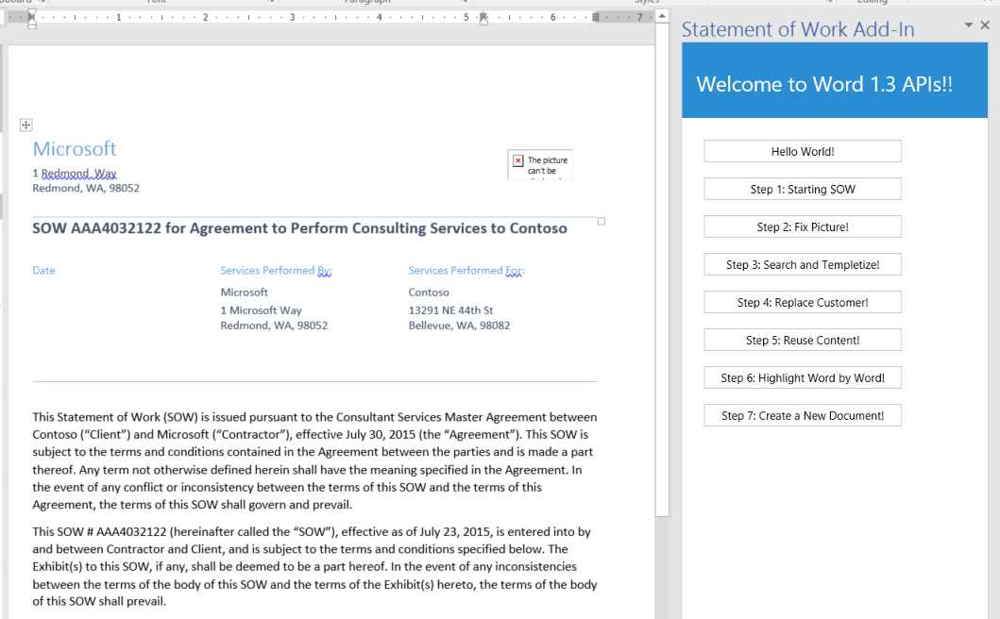
	

7. You have now finished Exercise 2 and it is time to move on to Exercise 3. Don't feel overhelmed with the OOXML file you inserted; if you want to master how to handle OOXML we recommend you to read [this](https://msdn.microsoft.com/en-us/library/office/dn423225.aspx) article.

## Exercise 3: Learning how to handle inline Pictures in Word by replacing an existing image in the document.
*In this exercise you will continue working on the Visual Studio solution for the StatementOfWork add-in you created on in the previous exercise. You will extend the add-in's capabilities by adding JavaScript code to replace an image in the  active Word document by using the inlinePicture object members. This exercise is cummulative and assumes you completed Exercise 2.*

1. Please note how the inserted SOW has a badly formatted picture **highlighted in red below**. This is intentional and you will fix this image in this exercise.

	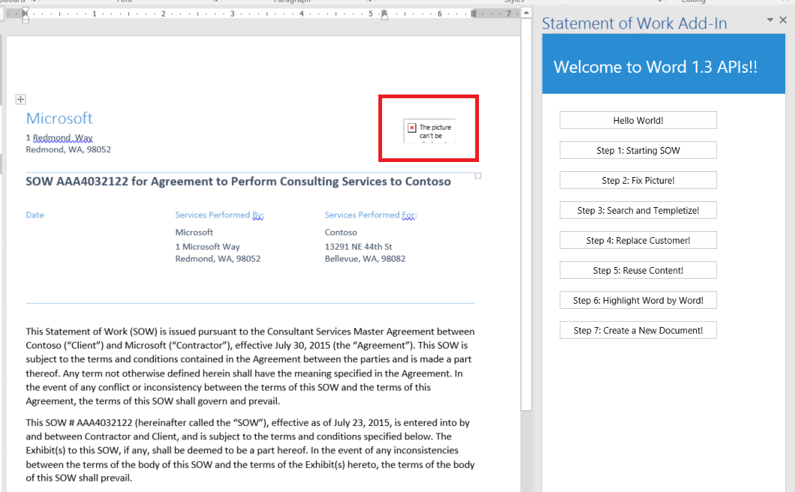


2. Go back to Visual Studio, make sure you are using the StatementOfWord project.

3. In the Solution Explorer, double-click on **Home.js** to open this JavaScript file.
4. Add the following code to the **onFixPicture** function:

	````javascript
	 function onFixPicture() {
        // my strategy to change the pic here is the following
        //a. will get the collection of images within the body.
        //b. will grab the first image within the collection and replace it with a new image.

        //this example is using methods shipped on the 1.2 requirement set. specificlaly the insertInlinePicture method supported on the inlinePicture object to replace the image.....
        if (Office.context.requirements.isSetSupported("WordApi", "1.2")) {
            Word.run(function (context) {
                // gets the inlinePictures collection for the document.
                var pics = context.document.body.inlinePictures;
                context.load(pics);
                return context.sync()
                    .then(function () {
                        var mybase64 = getImageAsBase64();
                        pics.items[0].insertInlinePictureFromBase64(mybase64, "replace");
                        return context.sync()
                            .then(function () {
                                showNotification("Task Complete!");
                            })
                    })
            })
            .catch(function (myError) {
                //otherwise we handle the exception here!
                showNotification("Error", myError.message);
            })
        }
        else {
            showNotification("Error. This functionality requires Word with at least January update!! (check  builds 6741+)");
        }
    }
	````
	

4. Note that the code is checking if the host (Word) actually supports the 1.2 requirements set. This is important to check because in order to replace an image, the  **inlinePicture.insertInlinePictureFromBase64** method is needed and this was shipped as part of the 1.2 requirement set. Note that by traversing the **inlinePictures collection**, we get the first image and then we are replacing it with the correct one.
5. Test your work by pressing F5 to start a debug session and then click the **Step 1: Starting SOW** button. After the document gets inserted click on the  **Step 2: Fix Picture!** button to try your code. The image should be replaced and the document should look like this:

	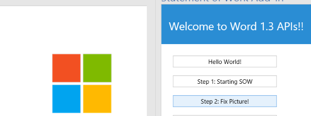 


5. Congratulations! In this exercise, you learned how to navigate through the inline pictures on a document and learned how to replace images! Let's continue with Exercise 4!

## Exercise 4: Using Search and inserting Content Controls
*In this exercise, you will continue working on the Visual Studio solution for the StatementOfWork add-in you created on in the previous steps. You will extend the add-in's capabilities by adding JavaScript code to search for content in the document and add content controls. Content controls are a key building block in Word development and enables developers to insert 'placeholders' in the document that can be later identified and replaced with different content. This exercise is cummulative and assumes you completed  Exercise 2.*

1. A common scenario in Word development is reusing documents to create new ones. A "Statement of Work" (SOW) is a very good example of this. By replacing a few fields, an existing SOW may be a completely new SOW instance. To illustrate that point, we will implement a simple example on how a template can be created. 

2. Go back to Visual Studio, make sure you are using the StatementOfWord project.

3. In the Solution Explorer, double-click on **Home.js** to open this JavaScript file.
4. Add the following code to the **onSearchAndTempletize** function:

	````javascript
function onSearchAndTempletize() {
        // on this method I actually want to create kind of a template. Will start by searching "Contoso". Then I will wrap each instance with a content control
        // I will also change the format of each search instance...

        Word.run(function (ctx) {
            var results = ctx.document.body.search("Contoso");
            ctx.load(results);
            // we need to sync to get the search results/
            return ctx.sync()
            .then(function () {
                //once we have the results we navigate through each occurrence and change a few things, as well as wrapping with a content control.
                for (var i = 0; i < results.items.length; i++) {
                    results.items[i].font.color = "#FF0000"    // Change color to Red
                    results.items[i].font.highlightColor = "#FFFF00";
                    results.items[i].font.bold = true;
                    var cc = results.items[i].insertContentControl();
                    cc.tag = "customer";  // this is an important piece of code, later on the exercise I will retrieve all the content controls with this tag and replace the content.
                    cc.title = "Customer Name";
                }
                return ctx.sync()  // OK ready! lets send it to the host for processing :)
            })
            .then(function () {
                showNotification("Task Complete!");
            })
            .catch(function (myError) {
                showNotification("Error", myError.message);
            })
        });


    } 
	````
	

4. Note that the code is searching for "Contoso", the search method returns a collection of ranges matching the search criteria, the code iterates through that collection and wraps each instance with a content control. Note that you are adding each content control a tag with a "customer" title, this is important as we will use this information in the next exercise to replace the content of all the content controls with this tag with a new customer.  

5. Test your work by pressing F5 to start a debug session and then click the **Step 1: Starting SOW** button. After the starting document gets inserted, click on the  **Step 3: Search and Templetize!** button to try your code. Each "Contoso" instance should be wrapped with a content control and with a yellow highlight. For visibility purposes we are also adding a red font color and yellow highlight to each search result instance. Your document should look like this after you click on the Step 1 and Step 3 buttons:


	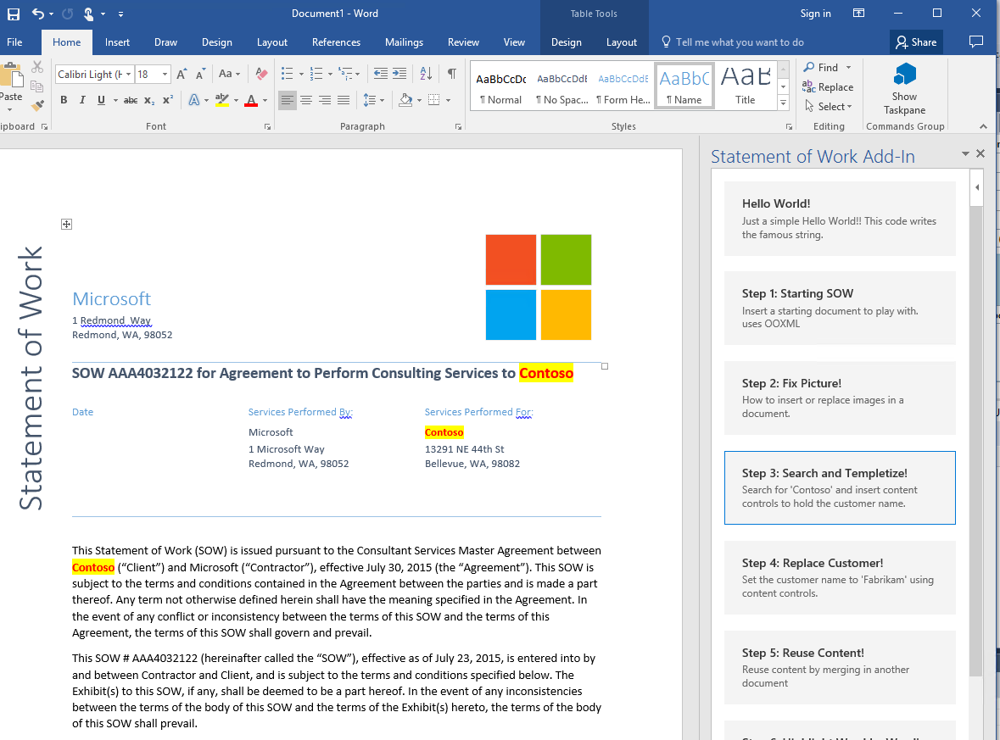 
	


9. Make sure to select any of the 'Contoso' search instances and verify they were tagged as 'customer'. To check this make sure that the Developer tab in the Word ribbon is activated. Go to File->Options->Customize Ribbon  and make sure in the right panel that 'Developer' is selected.

	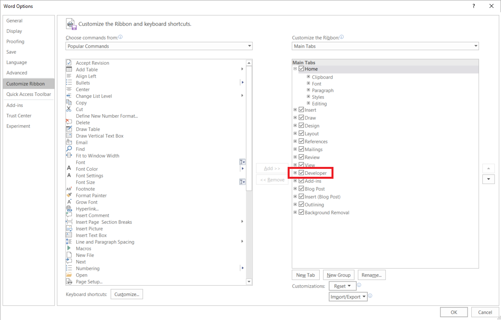 


10. Then, while having the cursor within any 'Contoso' instance, click on the Developer tab and then on 'Properties'. You will see each content control has the 'customer' tag.

	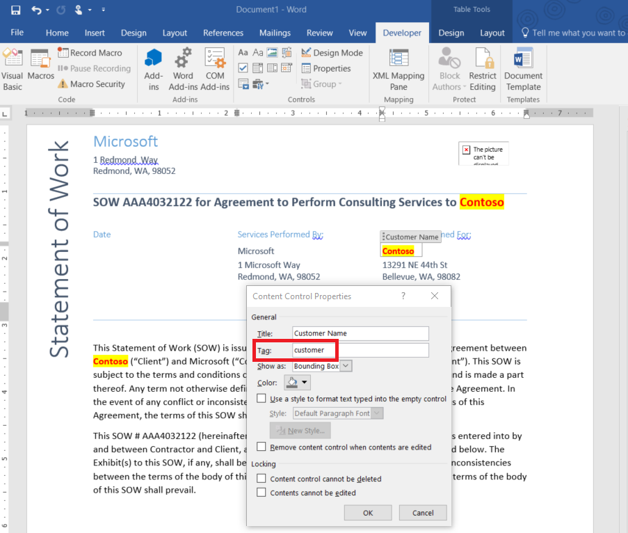 


5. Congratulations! In this exercise you learned how to use the search API and how to insert and tagged content controls, as well as changing formatting attributes. Let's continue with Exercise 5!


## Exercise 5: Changing content of tagged Content Controls!
*In this exercise, you will continue working on the Visual Studio solution for the StatementOfWork add-in you created in the previous steps. You will extend the add-in's capabilities by adding JavaScript code to replace content in tagged content controls. Content controls are a key building block in Word development and enable developers to insert 'placeholders' in the document that can be later identified and replaced with different content. This exercise is cummulative and assumes you completed  Exercises 2 and 4.*

1. A common scenario in Word development is reusing documents to create new ones. A "Statement of Work" (SOW) is a very good example of this. By replacing a few fields an existing SOW may be a completely new SOW instance. To illustrate that point, now that we created a template in the previous exercise, we will now change all content controls tagged as 'customer' with 'Fabrikam'. Note that this can very well come from data stored in an external system, like a CRM, ERP, etc. The idea is to generate a new instance of a document with a new customer. 

2. Go back to Visual Studio, make sure you are using the StatementOfWord project.

3. In the Solution Explorer, double click on **Home.js** to open this JavaScript file.
4. Add the following code to the **onaddChangeCustomer** function:

	````javascript
Word.run(function (ctx) {
            var ccs = ctx.document.contentControls.getByTag("customer");
            ctx.load(ccs, { select: 'text', expand: 'font' }); // i want to change the font highlight color, so i need to expand font. note i can also do select" 'font/highlightColor', but not in the mood :)
            return ctx.sync()  // lets get all the content controls with the above tag
            .then(function () {
                //lets iterate and change!!!
                for (var i = 0; i < ccs.items.length; i++) {
                    ccs.items[i].insertText("Fabrikam", "replace");
                    ccs.items[i].font.highlightColor = "#FFFFFF";
                }

            })
            .then(function () { showNotification("Task Complete!"); })
            .catch(function (myError) { showNotification("Error", myError.message); })
        });


    } 
	````
	

4. Note that the code is first getting all the content controls tagged as 'customer', then iterates each of the ocurrences and changes the content and the formatting information.

5. Test your work by pressing F5 to start a debug session and then click the **Step 1: Starting SOW** button. After the document gets inserted, click on the  **Step 3: Search and Templetize!** to create a template. Now try your code by clicking on **Step 4: Replace Customer!** Each "Contoso" instance should be replaced with 'Fabrikam' and look like the following image:

	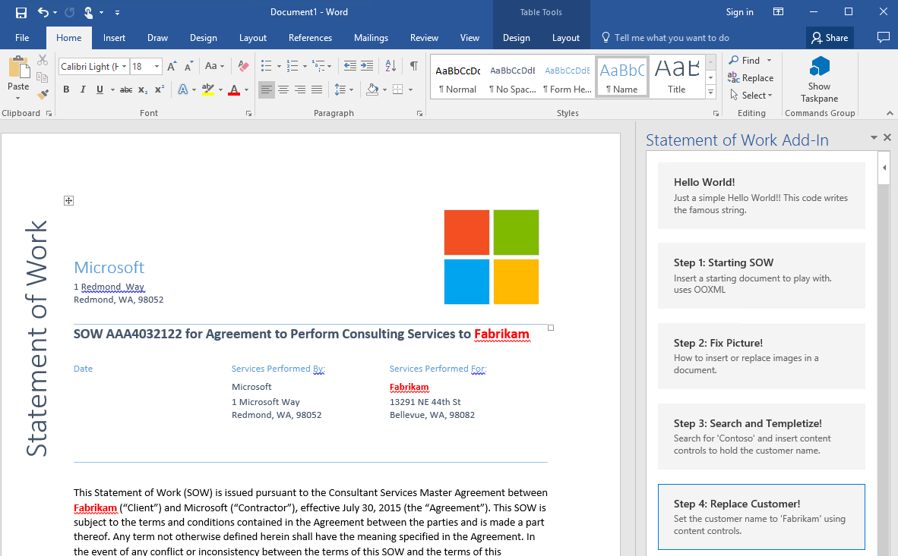 
	

5. Congratulations! In this exercise you learned how to get content controls by its tag and replace their content! Let's continue with Exercise 6!


## Exercise 6: Reusing content by inserting other Word documents!
*In this exercise, you will continue working on the Visual Studio solution for the StatementOfWork add-in you created in the previous steps. You will extend the add-in's capabilities by adding JavaScript code to insert an existing Word (docx) file at the end of the current document. This exercise is cummulative and assumes you completed  Exercise 2.*

1. A common scenario in Word development is reusing documents by  inserting them into new ones. In this exercise, we will add an existing Word File into a content control with a commonly used table of costs for the statement of work (reusing content from other documents). 

2. Go back to Visual Studio, make sure you are using the StatementOfWord project.

3. In the Solution Explorer, double click on **Home.js** to open this JavaScript file.
4. Add the following code to the **onaaddReuseContent** function:

	````javascript
 if (Office.context.requirements.isSetSupported("WordApi", "1.2")) { 
 // this functionality is included in the 1.2 requirement set, so we need to verify if it exists.
            Word.run(function (context) {
                var newParagraph = context.document.body.insertParagraph("Costs", "end");
                newParagraph.style = "Heading 1";
                context.document.body.insertParagraph("", "end");
                var myBase64File = getDocumentAsBase64(); // gets a docx file as base64
                context.document.body.insertFileFromBase64(myBase64File, "end");
                return context.sync();
            })
             .catch(function (myError) {
                 //otherwise we handle the exception here!
                 showNotification("Error", myError.message);
             })
        }
        else {
            //if you reach this code it means that the Word executing this code does not yet support the 1.2 requirement set. In this case you can also insert a paragraph and then insert the document on the paragraph.

            showNotification("Error. This functionality requires Word with at least January update!! (check  builds 6568+)");

        }

    } 
	````
	

4. Note that the code is getting a sample docx file encoded as base64 (which is the format the insertFile method expects), then iterates each of the ocurrences and changes the content and the formatting information. Note that in the interest of time, the code is calling a method inserted on Exercise 2: **getDocumentAsBase64**  to simulate creating a base64 encoded based on an existing docx file.

5. Test your work by pressing F5 to start a debug session and then click the **Step 1: Starting SOW** button. After the document gets inserted, try your code by clicking  on the  **Step 5: Reuse Content!** to insert the file at the end of the document. Now try your code by clicking on **Step 4: Replace Customer!**. Each "Contoso" instance should be replaced with 'Fabrikam' and look like the following image:

	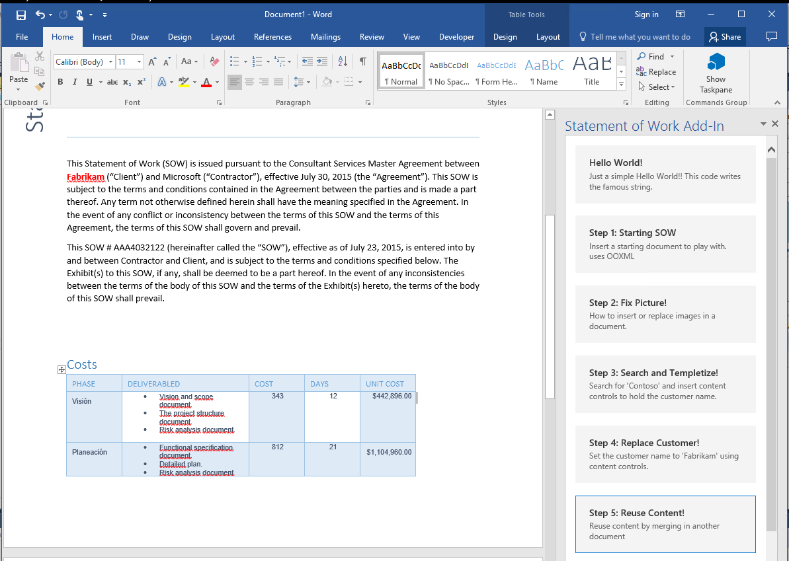 
	

5. Congratulations! In this exercise, you learned how to insert existing Word (docx) files into a document! Let's continue with Exercise 7!


# From now on, this lab is using the PREVIEW APIs for the Word JavaScript API 1.3 requirement set, currently supported as preview!

## Exercise 7: Granular access to ranges!

*In this exercise, you will continue working on the Visual Studio solution for the StatementOfWork add-in you created in the previous steps. You will extend the add-in's capabilities by adding JavaScript code to iterate through the words in a paragraph by using the range manipulation functionalities available in the API. This exercise is cummulative and assumes you completed  Exercise 2.*

1. Go back to Visual Studio, make sure you are using the StatementOfWord project.

2. In the solution explorer double click on  **Home.html** file.
3. Make sure to be using the preview location of Office.js which **https://appsforoffice.microsoft.com/lib/beta/hosted/office.js**, so your head element should be like: (make sure to comment out the other Office.js reference)
	````html
	<head>
    <meta charset="UTF-8" />
    <meta http-equiv="X-UA-Compatible" content="IE=Edge" />
    <title></title>
    <script src="../../Scripts/jquery-1.9.1.js" type="text/javascript"></script>

    <link href="../../Content/Office.css" rel="stylesheet" type="text/css" />

    
   <!-- <script src="https://appsforoffice.microsoft.com/lib/1/hosted/office.js" type="text/javascript"></script>  -->
        <script src="https://appsforoffice.microsoft.com/lib/beta/hosted/office.js" type="text/javascript"></script>   

    <!-- To enable offline debugging using a local reference to Office.js, use:                        -->
    <!-- <script src="../../Scripts/Office/MicrosoftAjax.js" type="text/javascript"></script>  -->
    <!-- <script src="../../Scripts/Office/1/office.js" type="text/javascript"></script>  -->

    <link href="../App.css" rel="stylesheet" type="text/css" />
    <script src="../App.js" type="text/javascript"></script>

    <link href="Home.css" rel="stylesheet" type="text/css" />
    <script src="Home.js" type="text/javascript"></script>
	</head>
	````

3. Now lets add some code to highlight word by word the 3rd paragraph. In the Solution Explorer, double click on **Home.js** to open this JavaScript file.
4. Add the following code to the **onaddHighlights** function:

	````javascript
    Word.run(function (ctx) {
            var myParagraphs = ctx.document.body.paragraphs;
            ctx.load(myParagraphs);
            return ctx.sync()
                            .then(function () {
                                var myWords = myParagraphs.items[3].splitTextRanges([" "], false, false);
                                ctx.load(myWords, { expand: 'font' });
                                ctx.sync().then(function () {

                                    var i = 0;
                                    var originalSize = myWords.items[i].font.size;
                                    ctx.sync();

                                    function delayCallback() {
                                        if (i < myWords.items.length) {
                                            if (i >= 1)
                                                myWords.items[i - 1].font.highlightColor = "#FFFFFF";
                                            myWords.items[i].font.highlightColor = "#FFFF00";
                                            myWords.items[i].font.size = originalSize * 1.30;
                                            i++;
                                            return ctx.sync().then(function () { setTimeout(delayCallback, 100) });
                                        }
                                    };

                                    delayCallback();
                                });
                            })

        }).catch(function (myError) {
        });
	````
	

4. This code sample is implementing both highlight and increase the font size word by word of the last paragraph of the document. SO once we have a handle of that paragrpah we are using the *splitTextRanges* methods to get, as a collection of ranges, each word (by spacifying a space (" ") delimiter. once we have the Range collection we are traversining it in order to hichlight word by word.

5. Test your work by pressing F5 to start a debug session and then click the **Step 1: Starting SOW** button. After the starting document gets inserted, try your code by clicking  on the  **Step 6: Highlight Word by Word!** to start the animation. Notice how each word will get highlighted in the last paragraph!

	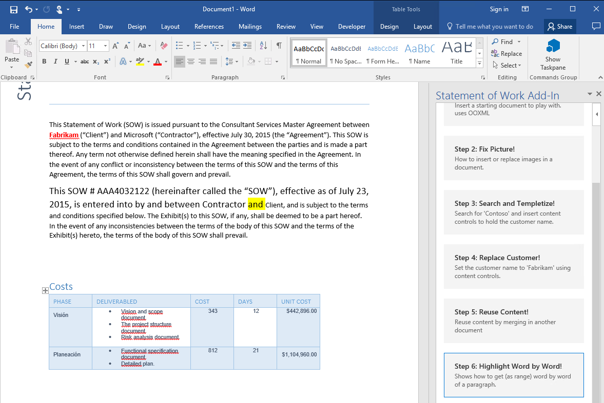 
	

5. Congratulations! In this exercise, you learned how to split a paragraph into multiple ranges and traversing the ranges collection! Let's continue with Exercise 8!

## Exercise 8: Creating and opening a new Word document!

*In this exercise, you will continue working on the Visual Studio solution for the StatementOfWork add-in you created in the previous steps. You will extend the add-in's capabilities by adding JavaScript code to create an open a new Word document . Make sure to have completed Excercise 2 as we need the getDocumentAsBase64 method, we will use that Word document as a starter.*

1. Go back to Visual Studio, make sure you are using the StatementOfWord project.

2. Make sure you are using the Preview Office.js CDN.  In the solution explorer double click on  **Home.html** file. Check the  location of preview  Office.js which **https://appsforoffice.microsoft.com/lib/beta/hosted/office.js**,  your head element should be like: (make sure to comment out the other Office.js reference)
	````html
	<head>
    <meta charset="UTF-8" />
    <meta http-equiv="X-UA-Compatible" content="IE=Edge" />
    <title></title>
    <script src="../../Scripts/jquery-1.9.1.js" type="text/javascript"></script>

    <link href="../../Content/Office.css" rel="stylesheet" type="text/css" />

    
   <!-- <script src="https://appsforoffice.microsoft.com/lib/1/hosted/office.js" type="text/javascript"></script>  -->
        <script src="https://appsforoffice.microsoft.com/lib/beta/hosted/office.js" type="text/javascript"></script>   

    <!-- To enable offline debugging using a local reference to Office.js, use:                        -->
    <!-- <script src="../../Scripts/Office/MicrosoftAjax.js" type="text/javascript"></script>  -->
    <!-- <script src="../../Scripts/Office/1/office.js" type="text/javascript"></script>  -->

    <link href="../App.css" rel="stylesheet" type="text/css" />
    <script src="../App.js" type="text/javascript"></script>

    <link href="Home.css" rel="stylesheet" type="text/css" />
    <script src="Home.js" type="text/javascript"></script>
	</head>
	````

3. Now lets add some code to create and open a new document. In the Solution Explorer, double click on **Home.js** to open this JavaScript file.
4. Add the following code to the **onaddOpenDoc** function:

	````javascript
    Word.run(function (context) {
            var myNewDoc = context.application.createDoc(getDocumentAsBase64());
            context.load(myNewDoc);

            return context.sync()
                .then(function () {
                    var myParagraph = myNewDoc.body.insertParagraph("Hello World This is a new Document!!!", "end");
                    myParagraph.font.bold = true;
                    myParagraph.font.name = "Courier new";
                  
                    myNewDoc.open();
                    context.sync();
                }).catch(function (myError) {
                    //otherwise we handle the exception here!
                    showNotification("Error", myError.message);
                })

        }).catch(function (myError) { showNotification("Error", myError.message); });

	````
	

4. This code basically creates a new document, using an existing doc (base64 encoded) as a starting doc (this doc is optional). Then adds a paragraph at the end of the document by using the API and finally opens the document. (Note that after the document is opened, no other operations can be send to it).

5. Test your work by pressing F5 to start a debug session and then click the **Step 7: Create a New Document** button. You will see that a new document is created and opened !

	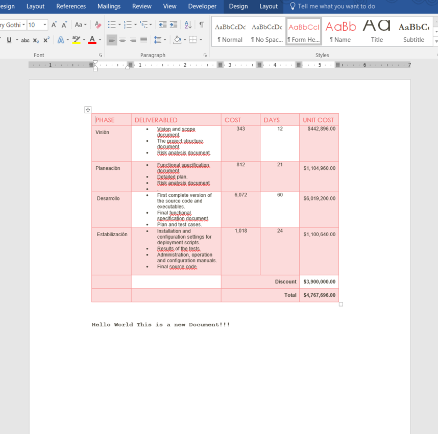 
	

5. Congratulations! In this exercise, you learned how to create and open new Word documents!


Congratulations on finishing the New Word APIs Lab!!

