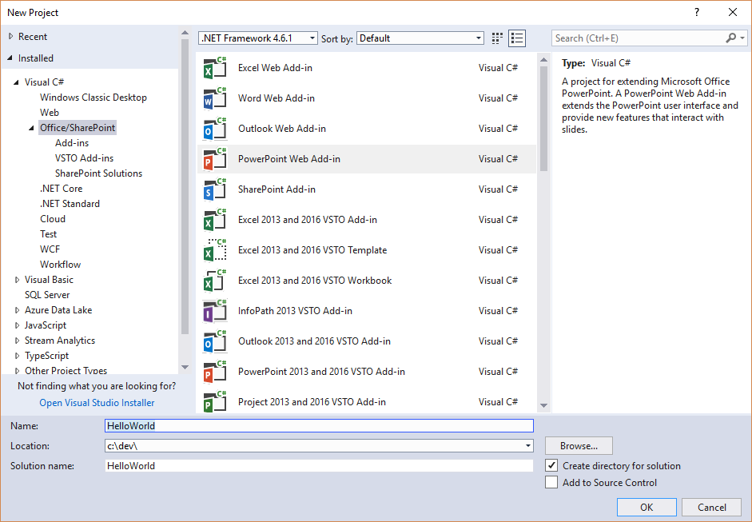
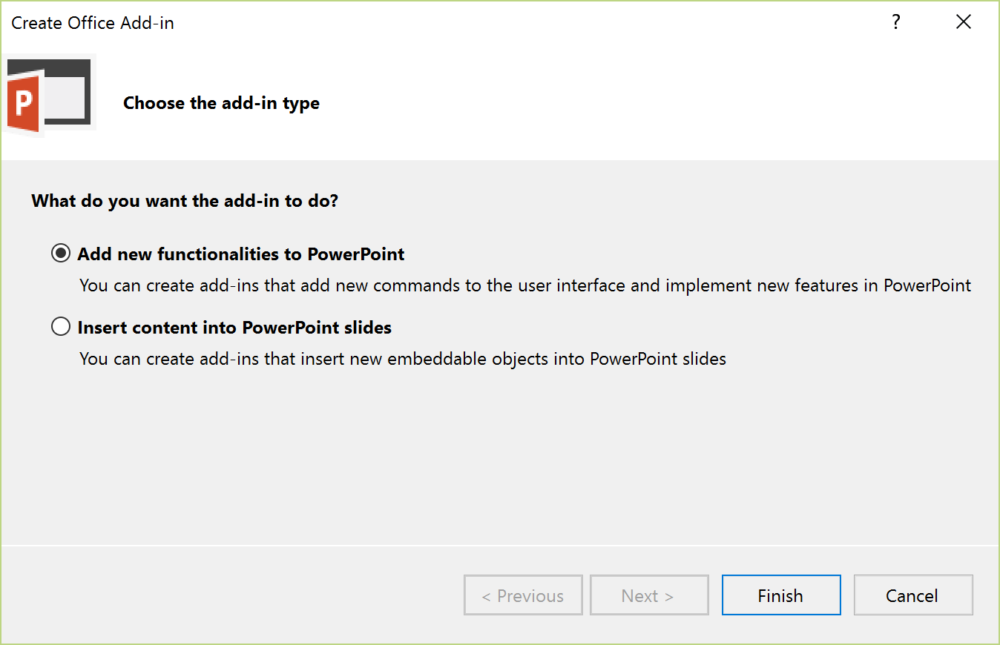
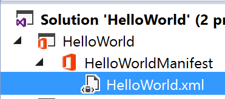
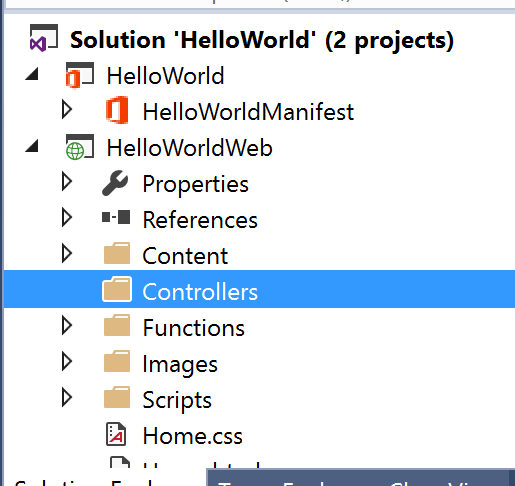
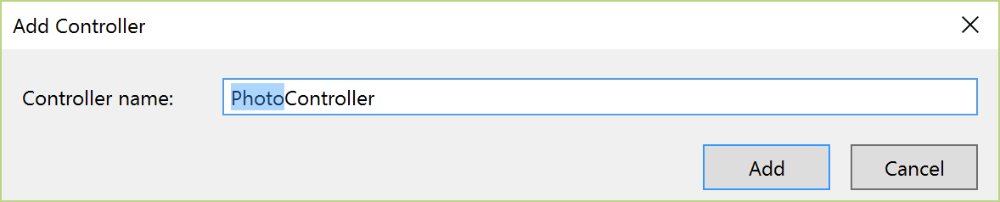
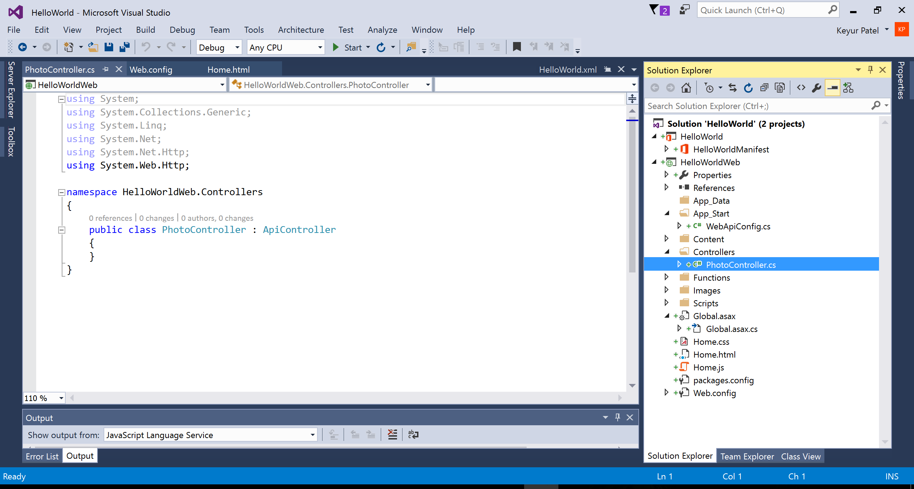
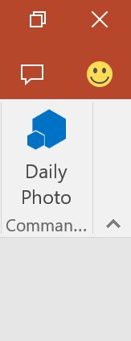
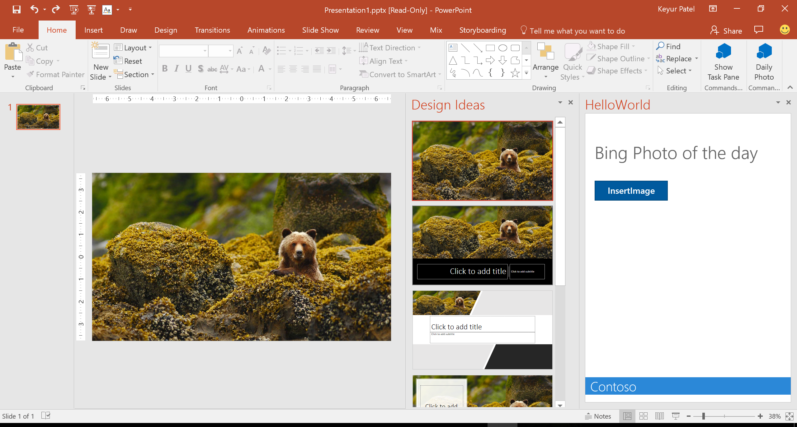

# Create your first PowerPoint add-in

Office Add-ins let you add your solution where ever they run. In PowerPoint, add-ins can help you build richer presentations.

This quick start will start with an excersize that will guide you through creating a PowerPoint add-in starting from Visual Studio. We will use Bing.com's Photo of the day. This add-in will expose you to the tools we use to create add-ins and the Office.js 1.1 API. In particular, we'll use the document.setSelectedDataAsync API to insert pictures into the user's current PowerPoint deck and customize the User Interface with Add-in Commands.

##### Prerequisites: 

1. Before you can start, you must have installed Office 2016 and Visual Studio 2015 Update 1.
2. You must have the Office Developer Tools installed in Visual Studio 2015.

## Instructions

### Excersize 1: Create your first add-in
*In this exercise you will learn how to use Visual Studio to create your first add-in and you will learn about the files that are created for you.  You will also learn about how to customize buttons on the ribbon. *

1. Launch Visual Studio 2015 as administrator.
2. From the **File** menu select the **New Project** command. When the **New Project** dialog appears, select the **PowerPoint Add-in** project template from the **Office/SharePoint** template folder as shown below. Name the new project **HelloWorld** and click **OK** to create the new project.

    

3. When you create a new **PowerPoint Add-in** project, Visual Studio prompts you with the Choose the add-in type page of the Create Office Add-in dialog. This is the point where you select the type of Add-in you want to create. Leave the default setting with the radio button titled **Add new functionalities to PowerPoint** and select Finish to continue.

    

4. Visual Studio will create the project. There are a few parts that great created for you:
	- A manifest xml file - this holds the metadata that your add-in needs to run in Office, including how it will present itself on the ribbon
	- A HelloWorldWeb project with a Home.html and Home.js - The HelloWorldWeb project in the solution contains the html and javascript you need to run your office add-in.
5. Use the Solution Explorer to drill down into the **HelloWorld.xml** file.

    

6. Now, find the xml block that looks like this. Take a minute and read through it as it describes how Add-ins can integrate with the Office UI. The example below demonstrates how an add-in can add a button to the PowerPoint Ribbon's Home tab.

	```XML
        <!-- PrimaryCommandSurface==Main Office Ribbon. -->
            <ExtensionPoint xsi:type="PrimaryCommandSurface">
                <!-- Use OfficeTab to extend an existing Tab. Use CustomTab to create a new tab. -->
                <OfficeTab id="TabHome">
                <!-- Ensure you provide a unique id for the group. Recommendation for any IDs is to namespace using your company name. -->
                <Group id="Contoso.Group1">
                    <!-- Label for your group. resid must point to a ShortString resource. -->
                    <Label resid="Contoso.Group1Label" />
                    <!-- Icons. Required sizes 16,32,80, optional 20, 24, 40, 48, 64. Strongly recommended to provide all sizes for great UX. -->
                    <!-- Use PNG icons and remember that all URLs on the resources section must use HTTPS. -->
                    <Icon>
                    <bt:Image size="16" resid="Contoso.tpicon_16x16" />
                    <bt:Image size="32" resid="Contoso.tpicon_32x32" />
                    <bt:Image size="80" resid="Contoso.tpicon_80x80" />
                    </Icon>

                    <!-- Control. It can be of type "Button" or "Menu". -->
                    <Control xsi:type="Button" id="Contoso.TaskpaneButton">
                    <Label resid="Contoso.TaskpaneButton.Label" />
                    <Supertip>
                        <!-- ToolTip title. resid must point to a ShortString resource. -->
                        <Title resid="Contoso.TaskpaneButton.Label" />
                        <!-- ToolTip description. resid must point to a LongString resource. -->
                        <Description resid="Contoso.TaskpaneButton.Tooltip" />
                    </Supertip>
                    <Icon>
                        <bt:Image size="16" resid="Contoso.tpicon_16x16" />
                        <bt:Image size="32" resid="Contoso.tpicon_32x32" />
                        <bt:Image size="80" resid="Contoso.tpicon_80x80" />
                    </Icon>

                    <!-- This is what happens when the command is triggered (E.g. click on the Ribbon). Supported actions are ExecuteFuncion or ShowTaskpane. -->
                    <Action xsi:type="ShowTaskpane">
                        <TaskpaneId>ButtonId1</TaskpaneId>
                        <!-- Provide a url resource id for the location that will be displayed on the task pane. -->
                        <SourceLocation resid="Contoso.Taskpane.Url" />
                    </Action>
                    </Control>
                </Group>
                </OfficeTab>
            </ExtensionPoint>
	```
    
9. Let's modify the button to say "Hello world" instead of "Show Taskpane". Find the following element in the file

	```XML
		<Title resid="Contoso.TaskpaneButton.Label" />
	```
10. This indicates the label of the title is stored in a string resource named **Contoso.TaskpaneButton.Label**.
11. Scroll down until you find the short string resource with that label.
12. Now, set the DefaultValue attribute to *Daily Photo*.


### Excersize 2: Get the Photo of the day from Bing and insert it

*In this excersize, we will continue where you left of above. You will learn more about add-in commands and learn how to customize the add-in command on the ribbon.*

1. Let's update the **Home.html**.  Find the div with the id **content-main**. It will look like the following

    ```HTML
        <div id="content-main">
                <div class="padding">
                    <p class="ms-font-xxl ms-fontColor-neutralSecondary ms-fontWeight-semilight">Add home screen content here.</p>
                    <p class="ms-font-m-plus ms-fontColor-neutralTertiary">For example: </p>
                    <button class="ms-Button ms-Button--primary" id="get-data-from-selection">
                        <span class="ms-Button-icon"><i class="ms-Icon ms-Icon--plus"></i></span>
                        <span class="ms-Button-label">Get data from selection</span>
                        <span class="ms-Button-description">Gets the selected data and displays it.</span>
                    </button>
                    <br /><br /><br />
                    <div class="ms-font-m"><a target="_blank" class="ms-Link ms-Link--hero" href="https://go.microsoft.com/fwlink/?LinkId=276812">Find more samples online...</a></div>
                </div>
            </div>
    ```

1. Replace that with:

    ```HTML
        <div id="content-main">
            <div class="padding">
                <p class="ms-font-xxl ms-fontColor-neutralSecondary ms-fontWeight-semilight">Bing Photo of the day</p>

                <button class="ms-Button ms-Button--primary" id="get-photo-of-the-day">
                    <span class="ms-Button-icon"><i class="ms-Icon ms-Icon--plus"></i></span>
                    <span class="ms-Button-label">InsertImage</span>
                    <span class="ms-Button-description">Gets the photo of the day that shows on Bing.com's home page and adds it to the slide.</span>
                </button>
            </div>
        </div>
    ```

1. Next, we'll replace the ENTIRE contents of the **Home.js** file with the following:

    ```js   
         /// <reference path="/Scripts/FabricUI/MessageBanner.js" />

         (function () {
            "use strict";

            var messageBanner;

            // The initialize function must be run each time a new page is loaded.
            Office.initialize = function (reason) {
                $(document).ready(function () {
                    // Initialize the FabricUI notification mechanism and hide it
                    var element = document.querySelector('.ms-MessageBanner');
                    messageBanner = new fabric.MessageBanner(element);
                    messageBanner.hideBanner();

                    $('#get-photo-of-the-day').click(insertImageFromBing);
                });
            };

            function insertImageFromBing() {

                //Get image from from webservice. 
                //The service should fetch the photo return it as a base 64 embedded string
                $.ajax({
                    url: "/api/Photo/", success: function (result)
                    {            
                        insertImageFromBase64String(result);
                    }, error: function (xhr, status, error) {

                        showNotification("Fail", "oops something went wrong");
                    }
                });
            }

            //This function uses the Office JavaScript API to add content to the Slide
            function insertImageFromBase64String(image) {
                  //TODO
            }

            // Helper function for displaying notifications
            function showNotification(header, content) {
                $("#notificationHeader").text(header);
                $("#notificationBody").text(content);
                messageBanner.showBanner();
                messageBanner.toggleExpansion();
            }
        })();
    ```

1. Next, we will create the web service to make the call to get Bing's photo of the day.
1. Add a new folder to the **HelloWorldWeb** project named **Controllers**.  

	  

1. Right-click on the **Controllers** folder and select **Add > New Scaffolded Item...**.
1. In the **Add Scaffold** dialog, select **Web API 2 Controller - Empty** and click the **Add** button.  

	  

1. On the **AddController** dialog, enter a name of **PhotoController** and click the **Add** button. 

	  

1. You should now see that the Web API controller has been added to a file named **PhotoController.cs**. You can also see that Visual Studio has added a few extra files such as **Global.asax** and **WebApiConfig.cs** to provide support for the Web API.  

	  

1. Examine what's inside **PhotoController.cs**. You can see that there is an **ApiController**-derived class named **VideosController** which is initially empty.

	```c#
	using System;
	using System.Collections.Generic;
	using System.Linq;
	using System.Net;
	using System.Net.Http;

	namespace HelloWorldWeb.Controllers
	{
	    public class PhotoController : ApiController
	    {
	    }
	}
	```

1. Let's replace the contents of the file with the code to call the Bing Service.  

    ````c#
    using System;
    using System.IO;
    using System.Net;
    using System.Text;
    using System.Web.Http;
    using System.Xml;

    namespace HelloWorldWeb.Controllers
    {
        public class PhotoController : ApiController
        {
            public string Get()
            { 
                //you can also set format=js to get a JSON response back. To keep things concise, we'll use XML.
                string url = "http://www.bing.com/HPImageArchive.aspx?format=xml&idx=0&n=1";

                //create the request
                HttpWebRequest request = (HttpWebRequest)WebRequest.Create(url);
                WebResponse response = request.GetResponse();

                using (Stream responseStream = response.GetResponseStream())
                {
                    //process the result
                    StreamReader reader = new StreamReader(responseStream, Encoding.UTF8);
                    string result = reader.ReadToEnd();

                    //parse the xml response and to get the URL 
                    XmlDocument doc = new XmlDocument();
                    doc.LoadXml(result);
                    string photoURL = "http://bing.com" + doc.SelectSingleNode("/images/image/url").InnerText;

                    //fetch the photo and return it as a Base64Encoded string
                    return getPhotoFromURL(photoURL); 
                }
            }

            private string getPhotoFromURL(string imageURL)
            {
                var webClient = new WebClient();
                byte[] imageBytes = webClient.DownloadData(imageURL);
                return Convert.ToBase64String(imageBytes);
            }
        }
    }
    ````
    
1. Now, let's go back to **Home.js** and add in the call to insert the image.  Replace the **insertImageFromBase64String** function with the following:
    ```js
        function insertImageFromBase64String(image) {

            //Call Office.js to insert it into the document. You can also pass in imageTop and imageLeft parameters.
            Office.context.document.setSelectedDataAsync(image, {
                coercionType: Office.CoercionType.Image
            },
            function (asyncResult) {
                if (asyncResult.status === Office.AsyncResultStatus.Failed) {
                    showNotification("error", asyncResult.error.message);
                }
            });
        }
    ```

1. Press F5 to start the project. When Powerpoint loads, click the *Daily Photo* button on the home tab.

	  

1. Then click the insert image button and you should see the Bing Photo of the Day added.
1. You can then use the designer in PowerPoint to customize the slide deck with designs based on the photo.

	  
    
Congrats on completing this quick start challenge!

## BONUS: Insert photos of charts stored in a user's OneDrive
One common scenario that may come to mind is to connect PowerPoint to Excel data. 

1. Check out the **Excel Rest API** quick start and see how to use the Microsoft Graph
1. Try out this code sample at  http://aka.ms/excel-chart-picker which lets you insert pictures of charts from Excel files stored in OneDrive.
