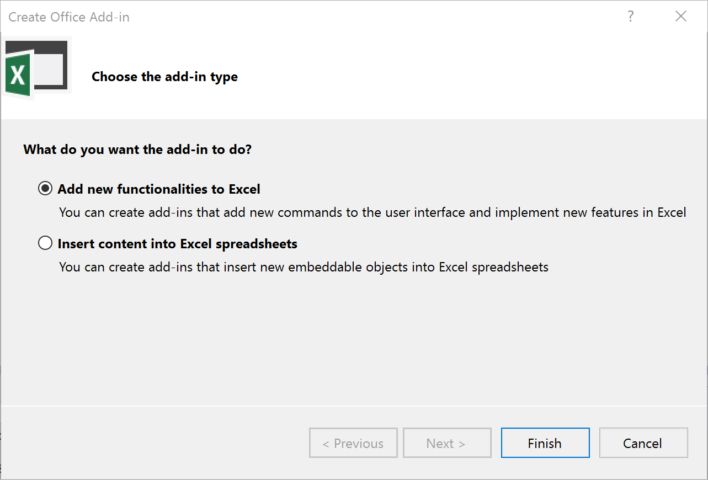

##Build an Expense Report with the new Excel JavaScript APIs in Office 2016
In this exercise, you will create an Excel add-in that uses the Excel JavaScript API included in Excel 2016. 

> **Note**: For this exercise you must have Excel 2016 Preview, or a later version, installed. Refer to the prerequisites at the beginning of this lab for links on where to obtain Office 2016.

###Part 1: Create a basic add-in
1. Launch Visual Studio 2015 as administrator.
1. From the **File** menu select the **New Project** command. When the **New Project** dialog appears, select the **Excel Add-in** project template from the **Office/SharePoint** template folder, as shown below. Name the new project **ExpenseReport** and click **OK** to create the new project.
	

1. When you create a new Office Add-ins project, Visual Studio prompts you with the **Choose the add-in type** page of the **Create Office Add-in** dialog. This is the point where you select the type of add-in you want to create. Leave the default setting with the radio button titled **Add new functionalities to Excel** and select **Finish** to continue.

	

6. Open **ExpenseReport.xml**. Now, find the XML block that looks like this. Take a minute and read through it as it describes how add-ins can integrate with the Office UI. The example below demonstrates how an add-in can add a button to the Excel ribbon's Home tab.

	```XML
        <!-- PrimaryCommandSurface==Main Office Ribbon. -->
            <ExtensionPoint xsi:type="PrimaryCommandSurface">
                <!-- Use OfficeTab to extend an existing Tab. Use CustomTab to create a new tab. -->
                <OfficeTab id="TabHome">
                <!-- Ensure you provide a unique id for the group. Recommendation for any IDs is to namespace using your company name. -->
                <Group id="Contoso.Group1">
                    <!-- Label for your group. resid must point to a ShortString resource. -->
                    <Label resid="Contoso.Group1Label" />
                    <!-- Icons. Required sizes 16,32,80, optional 20, 24, 40, 48, 64. Strongly recommended to provide all sizes for great UX. -->
                    <!-- Use PNG icons and remember that all URLs on the resources section must use HTTPS. -->
                    <Icon>
                    <bt:Image size="16" resid="Contoso.tpicon_16x16" />
                    <bt:Image size="32" resid="Contoso.tpicon_32x32" />
                    <bt:Image size="80" resid="Contoso.tpicon_80x80" />
                    </Icon>

                    <!-- Control. It can be of type "Button" or "Menu". -->
                    <Control xsi:type="Button" id="Contoso.TaskpaneButton">
                    <Label resid="Contoso.TaskpaneButton.Label" />
                    <Supertip>
                        <!-- ToolTip title. resid must point to a ShortString resource. -->
                        <Title resid="Contoso.TaskpaneButton.Label" />
                        <!-- ToolTip description. resid must point to a LongString resource. -->
                        <Description resid="Contoso.TaskpaneButton.Tooltip" />
                    </Supertip>
                    <Icon>
                        <bt:Image size="16" resid="Contoso.tpicon_16x16" />
                        <bt:Image size="32" resid="Contoso.tpicon_32x32" />
                        <bt:Image size="80" resid="Contoso.tpicon_80x80" />
                    </Icon>

                    <!-- This is what happens when the command is triggered (E.g. click on the Ribbon). Supported actions are ExecuteFuncion or ShowTaskpane. -->
                    <Action xsi:type="ShowTaskpane">
                        <TaskpaneId>ButtonId1</TaskpaneId>
                        <!-- Provide a url resource id for the location that will be displayed on the task pane. -->
                        <SourceLocation resid="Contoso.Taskpane.Url" />
                    </Action>
                    </Control>
                </Group>
                </OfficeTab>
            </ExtensionPoint>
	```
    
9. Let's modify the button to say "Expense Report" instead of "Show Taskpane". Find the following element in the file.

	```XML
		<Title resid="Contoso.TaskpaneButton.Label" />
	```
10. This indicates that the label of the title is stored in a string resource named **Contoso.TaskpaneButton.Label**.
11. Scroll down until you find the **ShortString** string resource with that label.
12. Now, set the DefaultValue attribute to *Expense Report*. Your XML should look like this: 

	```XML
		<bt:String id="Contoso.TaskpaneButton.Label" DefaultValue="Expense Report" />
	```
        
13. Press F5 to try your changes. You should see you add-in deploy in Excel and a button appear on the Home Tab. Don't worry if you don't see the label updated, this is a known issue with this build. 

###Part 2: Add Excel JavaScript API code
1. Reference the Excel JavaScript API in the add-in:
	1. Locate and open the homepage for the add-in: **Home.html**.
	1. Immediately after the reference to `Office.js` in the `<head>` portion of the page, add the following script reference to the Excel JavaScript API beta CDN:

		````html
    <script src="https://appsforoffice.microsoft.com/lib/beta/hosted/office.js"></script>
		````

	> **Note:** Eventually the all Excel JavaScript APIs will be merged into the single `Office.js` file so this step will not be necessary, but in the 1.2 API preview timeframe it is required as an extra step.

1. Now update the UI for the add-in:
	1. Locate the `<body>` section of the page within the `home.html` file.
	1. Replace the contents of the `<body>` with the following markup:

		````html
	    <div id="content-main">
        <div class="padding">
            <br />

            <button class="ms-Button ms-Button--primary" id="insertData">
                <span class="ms-Button-icon"><i class="ms-Icon ms-Icon--plus"></i></span>
                <span class="ms-Button-label" id="button-text">Insert Data</span>
                <span class="ms-Button-description" id="button-desc">Inseart Data, add a table and adjust layout</span>
            </button>
        <br />
            <br />
            <button class="ms-Button ms-Button--primary" id="sort">
                <span class="ms-Button-icon"><i class="ms-Icon ms-Icon--plus"></i></span>
                <span class="ms-Button-label" id="button-text">Sort</span>
                <span class="ms-Button-description" id="button-desc">Sort my data based on transaction date</span>
            </button>
            <br />
            <br />
            <button class="ms-Button ms-Button--primary" id="filter">
                <span class="ms-Button-icon"><i class="ms-Icon ms-Icon--plus"></i></span>
                <span class="ms-Button-label" id="button-text">Filter</span>
                <span class="ms-Button-description" id="button-desc">Only show my transtions in fuel and education</span>
            </button>
            <br />
            <br />
            <button class="ms-Button ms-Button--primary" id="report">
                <span class="ms-Button-icon"><i class="ms-Icon ms-Icon--plus"></i></span>
                <span class="ms-Button-label" id="button-text">Report</span>
                <span class="ms-Button-description" id="button-desc">Create a report on my spending and Protect the report </span>
            </button>
        </div>
    </div>
		````

1. The next step is to code the business logic for the add-in.
	1. Locate the **Home.js** file.
	1. Remove all the sample code except the add-in initialization code so all that is left is the following:

		````javascript
(function () {
    "use strict";


    // The initialize function must be run each time a new page is loaded.
    Office.initialize = function (reason) {
        $(document).ready(function () {
            // Initialize the FabricUI notification mechanism and hide it
            var element = document.querySelector('.ms-MessageBanner');
            messageBanner = new fabric.MessageBanner(element);
            messageBanner.hideBanner();


            // attach click handlers to the workbook
            // TODO-1

            // TODO-2

            // TODO-3

            // TODO-4

            return;

            

        });
    }

    // Helper function for treating errors
    function errorHandler(error) {
        // Always be sure to catch any accumulated errors that bubble up from the Excel.run execution
        showNotification("Error", error);
        console.log("Error: " + error);
        if (error instanceof OfficeExtension.Error) {
            console.log("Debug info: " + JSON.stringify(error.debugInfo));
        }
    }

    // Helper function for displaying notifications
    function showNotification(header, content) {
        $("#notificationHeader").text(header);
        $("#notificationBody").text(content);
        messageBanner.showBanner();
        messageBanner.toggleExpansion();
    }
})();

		````


1. Now add a function that will add data:
	1. Replace the comment `// TODO-1` with the following jQuery code that creates a click event handler on one of the buttons in the `home.html` page you added previously:


		````javascript
			 $('#insertData').click(insertData);
		````


	1. Next, add the following function.

		Notice how the code in this function is very different from the code in the previous exercises. The Excel  JavaScript API uses a context (`Excel.run()`) to allow you to batch multiple operations (such as `context.workbook.worksheets.add()`) that will be sent to the hosting Excel client application for processing at one time using the `context.sync()` method:


		````javascript
		  function insertData() {
        Excel.run(function (ctx) {

        	// Get the current worksheet
            var sheet = ctx.workbook.worksheets.getActiveWorksheet();

            //Rename the current Worsheet to Data
            sheet.name = "Data";

            //Insert Data
            var range = sheet.getRange("A1:E11");
            range.values = [[
            "Date",
            "Merchant",
            "Category",
            "Sub-Category",
            "Amount"],
			  [
			    "01/12/2014",
			    "WHOLE FOODS MARKET",
			    "Merchandise & Supplies",
			    "Groceries",
			   "84.99"
			  ],
			  [
			    "01/13/2014",
			    "COSTCO GAS",
			    "Transportation",
			    "Fuel",
			   "52.20"
			  ],
			  [
			    "01/13/2014",
			    "COSTCO WHOLESALE",
			    "Merchandise & Supplies",
			    "Wholesale Stores",
			   "163.67"
			  ],
			  [
			    "01/13/2014",
			    "ITUNES",
			    "Merchandise & Supplies",
			    "Internet Purchase",
			   "9.83"
			  ],
			  [
			    "01/13/2014",
			    "SMITH BROTHERS FARMS INC",
			    "Merchandise & Supplies",
			    "Groceries",
			   "21.45"
			  ],
			  [
			    "01/14/2014",
			    "SHELL",
			    "Transportation",
			    "Fuel",
			    "44.00"
			  ],
			  [
			    "01/14/2014",
			    "WHOLE FOODS MARKET",
			    "Merchandise & Supplies",
			    "Groceries",
			   "17.98"
			  ],
			  [
			    "01/15/2014",
			    "BRIGHT EDUCATION SERVICES",
			    "Other",
			    "Education",
			   "59.92"
			  ],
			  [
			    "01/15/2014",
			    "BRIGHT EDUCATION SERVICES",
			    "Other",
			    "Education",
			   "59.92"
			  ],
			  [
			    "01/17/2014",
			    "SMITH BROTHERS FARMS INC-HQ",
			    "Merchandise & Supplies",
			    "Groceries",
			   "21.45"
			  ]];

			//Autofit row height and column width
            range.getEntireColumn().format.autofitColumns();
            range.getEntireRow().format.autofitRows();

            // Add a table
            var table = ctx.workbook.tables.add("Data!A1:E11", true);
            return ctx.sync().then(function () {
           });
        }).catch(function (error) {
            console.log("Error: " + error);
            if (error instanceof OfficeExtension.Error) {
                console.log("Debug info: " + JSON.stringify(error.debugInfo));
            }
        });
    }

		````

1. Now add functionality to sort data based on transaction date:
	1. Go back to the `Office.initialize` statement and replace the comment `// TODO-2` with the following jQuery code that creates a click handler for the button that will add a range of unformatted data to the current worksheet:

	````javascript
            $('#sort').click(sort);
	````

	1. Next, add the following function.

	````javascript
		     function sort() {
	        Excel.run(function (ctx) {
	            var sheet = ctx.workbook.worksheets.getActiveWorksheet();
	
	            // Only Sort the range that has data
	            var sortRange = sheet.getRange("A1:E1").getEntireColumn().getUsedRange();
	            // Apply sorting on the first column and in descending order
	            sortRange.sort.apply([
	            {
	                key: 0,
	                ascending: false,
	            },
	            ]);
	            return ctx.sync().then(function () {
	            })
	        }).catch(function (error) {
	            console.log("Error: " + error);
	            if (error instanceof OfficeExtension.Error) {
	                console.log("Debug info: " + JSON.stringify(error.debugInfo));
	            }
	        });
	    }
	````

1. Then we add functionality to filter data. We only want to focus on the transaction in the sub-category of Fuel and Education.
	1. Go back to the `Office.initialize` statement and replace the comment `// TODO-3` with the following jQuery code that creates a click handler for the button that will add a range of unformatted data to the current worksheet:

	````javascript
	  $('#filter').click(filter);
	````

	1. Next, add the following function.

		Notice how the code works with ranges in a similar way to the last function, but this one assigns some formats to the range's `numberFormats` property:

	````javascript
	    function filter() {
	        Excel.run(function (ctx) {
	            var sheet = ctx.workbook.worksheets.getActiveWorksheet();
	            var table = sheet.tables.getItemAt(0);
	
	            //Apply a value filter on the 4th column, which is sub-category. We want to focus on transactions in the category of Fuel and Education
	            var filter = table.columns.getItemAt(3).filter;
	            filter.applyValuesFilter(["Fuel","Education"]);
	            return ctx.sync().then(function () {
	            })
	        }).catch(function (error) {
	            console.log("Error: " + error);
	            if (error instanceof OfficeExtension.Error) {
	                console.log("Debug info: " + JSON.stringify(error.debugInfo));
	            }
	        });
	    }
	````

1. Next we add functionality to use Excel formulas and charting to generate a report and then protect the report from editing. Here we first create a new sheet named "Summary", then create a summary table with total spendings based on Category. We then add a chart to visualize the data. Finally we protect the sheet from further changes.
	1. Go back to the `Office.initialize` statement and replace the comment `// TODO-4` with the following jQuery code that creates a click handler for the button that will add a range of unformatted data to the current worksheet:

	````javascript
	  $('#report').click(report);
	````
	1. Next, add the following function.

		Notice how the code works with ranges in a similar way to the last function, but this one assigns some formats to the range's `numberFormats` property:

	````javascript
	 function report() {
            Excel.run(function (ctx) {
            //Add a new worksheet
            var sheet = ctx.workbook.worksheets.add("Summary");
            //Activate the worksheet
            sheet.activate();

            // Use Excel formulas to calculate the total spending based on categories
            var sumRange = sheet.getRange("A1:B6");
            sumRange.values = [['Category', 'Total'],
            ['Groceries', '=SUMIF( Data!D2:D100, "Groceries", Data!E2:E100 )'],
            ['Fuel', '=SUMIF( Data!D2:D100, "Fuel", Data!E2:E100 )'],
            ['Wholesale Store', '=SUMIF( Data!D2:D100, "Wholesale Stores", Data!E2:E100 )'],
            ['Internet Purchase', '=SUMIF( Data!D2:D100, "Internet Purchase", Data!E2:E100 )'],
            ['Education', '=SUMIF( Data!D2:D100, "Education", Data!E2:E100 )']];

            //Add a Table
            ctx.workbook.tables.add("Summary!A1:B6", true);

            // Add a pie chart
            var chartRange = sheet.getRange("A1:B6");
            var chart = ctx.workbook.worksheets.getItem("Summary").charts.add("Pie", chartRange);

            //Update the chart title
            chart.title.text = "Spending based on catagory";

            // Protect the report from editing
            sheet.protection.protect();

            return ctx.sync().then(function () {

            })
            .then(ctx.sync);
        }).catch(function (error) {
            console.log("Error: " + error);
            if (error instanceof OfficeExtension.Error) {
                console.log("Debug info: " + JSON.stringify(error.debugInfo));
            }
        });
    }
	````


###Part 3: Test the Add-in end to end
1. Now deploy the Excel add-in to the local Excel client: 
	1. Select the **ExpenseReport** project within the **Solution Explorer** tool window.
	2. Within the **Properties** window, set the **Start Action** selector to **Office Desktop Client** and press **F5** to start the project.
	3. Visual Studio will launch the Excel desktop client and create a new Excel workbook. 
	
2. Launch your add-in by clicking the **Show Taskpane** button on the Ribbon. This button is defined in your add-in manifest. You can change the label if you want by edditing the manifest.xml file in your project.  

3. On the taskpane, click the button **Insert Data**. 

	Notice how Excel update the worksheet nanme to "Data", inserted my transaction data and added a table on top of my data.

4. Now, click the button **Sort**.

	Notice how Excel sorted my transactions based on date, the latest transaction is on top now.
	
5. Now, click the button **Filter**.
	Notice how Excel filtered my transactions based on sub-category, now only transactions under Education and Fuel are shown.

6. Finally, click the button **Report**.

	Notice how Excel summarized my transactions with formulas and created a pie chart to visualize my spending.

**Congratulations! You've now written an Excel add-in that uses the new Excel JavaScript API.**

