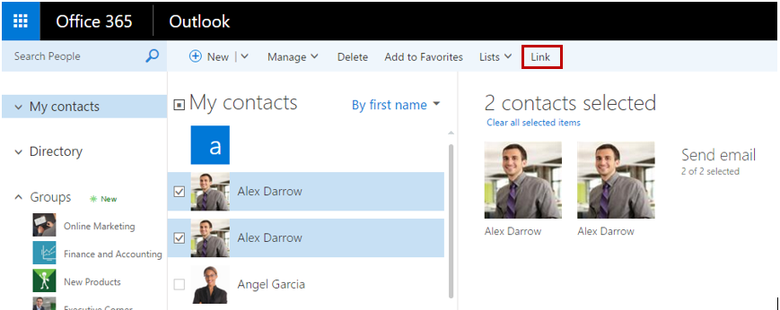

# Deep Dive into the Microsoft Graph for Office 365 People
In this lab, you will use Microsoft Graph to work with Office 365 People as part of an ASP.NET MVC5 application.

## Prerequisites
1. You must have an Office 365 tenant and Microsoft Azure subscription to complete this lab. If you do not have one, the lab for **O3651-7 Setting up your Developer environment in Office 365** shows you how to obtain a trial.
1. You must have access to an Exchange mailbox within an Office 365 developer tenancy.
1. You must have Visual Studio 2015 with Update 1 installed.
2. You must have the Graph AAD Auth v2 Started Project template installed.


## Exercise 1: Interact with Office 365 People using the Browser
In this exercise, you will use the browser to explore Office 365 People. For this lab we've created the following user ahead of time:

	- Katie Jordan (KatieJ@<tenantid>.onmicrosoft.com)

Using her account, you will explore Katie's interactions and learn who are the most important people to her. The information leaned in this exploration will be used in later exercises.

### Explore the Mailbox 
1. Within a browser, navigate to the **https://mail.office365.com** site & login as Katie Jordan.

    ```
    User Name: KatieJ@<tenantid>.onmicrosoft.com
    Password:  pass@word1
    ```
  
2. Using the **Search Mail and People** box:
    1. Discover who Katie communicates with most by entering the following query:

      ```
      From:(Garth Fort) OR To:(Garth Fort)
     ```
    
        Notice the high number of results.
    
   2. Next, try:
   
     ```
     From:(Online Marketing) OR To:(Online Marketing)
      ```
    
        Again, notice the high number of results.

    
    3. Finally, enter the following query:
    
      ```
      From:("Sales Team") OR To:("Sales Team")
      ```
    
       Notice their are fewer results in this case.
    
3. Navigate to the **Sent Items** folder.
4. Open the first mail thread *XT2000 Launch Commercial*.
5. Notice the participants in the thread: 
    - Online Marketing 
    - Anne Wallace
    - Garth Fort
    - Aziz Hassouneh
  
5. Skim the thread, notice the repeated reference to the **XT2000 Launch**.
	  

### Explore Contacts
Click the *waffle* icon in the top-left corner to open the App Launcher and click the **People** tile.

#### Link Contacts

1. Examine the two contact entries for **Alex Darrow**. Notice they each have different email addresses.
2. Select both entries by clicking on the check box to the left of their name.
3. Click on the **Link** button in the ribbon to Merge the two Alex Darrow contacts. 

    

4. Notice there is now only one Alex Darrow contact entry which contains both email addresses.

#### Create a Contact

1. Click on the **New** button in the ribbon.
2. Create a contact with the following properties:

    ```
    First Name: Kat
    Last Name: Larson
    Email: KatLarson@<tenantid>.onmicrosoft.com
    ```


## Exercise 2: Create a new project using Azure Active Directory v2 authentication
