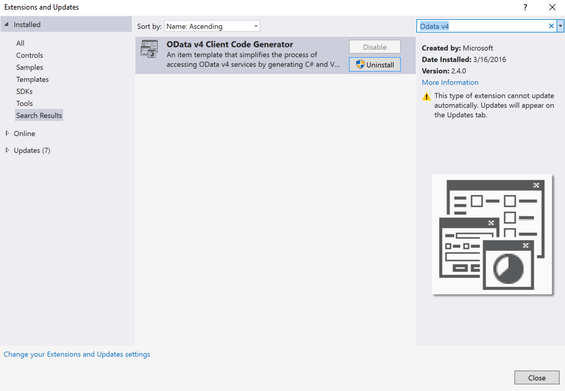
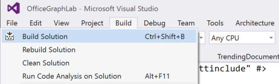
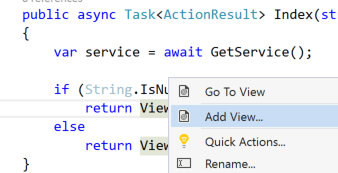
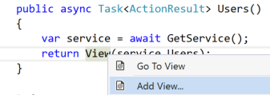

# Insights from Microsoft Graph
In this lab, you will use Microsoft Graph to connect to insights in the Office Graph. You will build an ASP.NET MVC 5 application that retrieves documents trending around users in your Office 365 tenant.

## Get an Office 365 developer environment
To complete the exercises below, you will require an Office 365 developer environment. Use the Office 365 tenant that you have been provided with for Tech Ready.

## Prerequisites

2. You must have the OData v4 Client Code Generator addin installed. 
   1. In Visual Studio go to Tools -> Extensions and Updates, Select "Online" from the left-most treeview then search for "OData v4 Client Code Generator"
   2. Click Download and then Install once the extension downloads.

 
   

## Exercise 1: Create a new project using Azure Active Directory authentication

In this first step, you will create a new ASP.NET MVC project using the
**Graph AAD Auth v2 Starter Project** template and log in to your app and generate access tokens
for calling the Graph API.

1. Launch Visual Studio 2015 and select **New**, **Project**.
  1. Search the installed templates for **Graph** and select the
    **Graph AAD Auth v2 Starter Project** template.
  1. Name the new project **OfficeGraphLab** and click **OK**.
  1. Open the **Web.config** file and find the **appSettings** element. This is where you will need to add your appId and app secret you will generate in the next step.
  
1. Launch the Application Registration Portal by opening a browser and navigating to **apps.dev.microsoft.com**
   to register a new application.
  1. Sign into the portal using your Office 365 work account username and password. The **Graph AAD Auth v2 Starter Project** template allows you to sign in with either a Microsoft account or an Office 365 for business account, but the "trending around" feature currently works only with business and school accounts.
  1. Click **Add an App** and type **OfficeGraphLab** for the application name.
  1. Copy the **Application Id** and paste it into the value for **ida:AppId** in your project's **Web.config** file.
  1. Under **Application Secrets** click **Generate New Password** to create a new client secret for your app.
  1. Copy the displayed app password and paste it into the value for **ida:AppSecret** in your project's **web.config** file.
  1. Modify the **ida:AppScopes** value to include the required `User.Read`, `User.ReadBasic.All`, `Files.Read`,  and `Sites.Read.All` scopes.

  ```xml
  <configuration>
    <appSettings>
      <!-- ... -->
      <add key="ida:AppId" value="paste application id here" />
      <add key="ida:AppSecret" value="paste application password here" />
      <!-- ... -->
      <!-- Specify scopes in this value. Multiple values should be comma separated. -->
      <add key="ida:AppScopes" value="User.Read, User.ReadBasic.All, Files.Read, Sites.Read.All" />
    </appSettings>
    <!-- ... -->
  </configuration>
  ```
1. Add a redirect URL to enable testing on your localhost.
  1. Right click on **OfficeGraphLab** and click on **Properties** to open the project properties.
  1. Click on **Web** in the left navigation.
  1. Copy the **Project Url** value.
  1. Back on the Application Registration Portal page, click **Add Platform** and then **Web**.
  1. Paste the value of **Project Url** into the **Redirect URIs** field.
  1. Scroll to the bottom of the page and click **Save**.

1. Set Startup page to Signout page (to avoid stale token error) 
  1. Right-click **OfficeGraphLab** and click **Properties** to open the project properties.
  1. Click **Web** in the left navigation.
  1. Under **Start Action** Choose **Specific Page** option and Type its value as **Account/SignOut**  
   
1. Press F5 to compile and launch your new application in the default browser.
  1. Once the Graph and AAD Auth Endpoint Starter page appears, click **Sign in** and login to your Office 365 account.
  1. Review the permissions the application is requesting, and click **Accept**.
  1. Now that you are signed into your application, exercise 1 is complete!
   
## Exercise 2: Add a reference to the Graph API beta namespace

1. Right-click the project and select **Add -> New item**.
   1. Select **Visual C# -> Code -> OData Client**.
   2. Name the file Graph.tt and click **Add**.
2. Edit the Graph.tt file
   1. Edit **MetadataDocumentUri** to be `https://graph.microsoft.com/beta/$metadata`
   2. Edit **NamespacePrefix** to be `OfficeGraphLab.Service`
3. Click **Build -> Build solution**.

 

## Exercise 3: Change the page layout
In this exercise, you will extend the page layout so that it displays a new link leading to Insights in the header.
  
1. Back in Visual Studio, click the Stop button to stop the site.
2. Update **_Layout** file to add a link to **Insights** and **Users**:
   1. Open the **_Layout.cshtml** file found in the **Views/Shared** folder.
   2. Locate the part of the file that includes links at the top of the page:
      
        ````asp
          <ul class="nav navbar-nav">
            <li>@Html.ActionLink("Home", "Index", "Home")</li>
            <li>@Html.ActionLink("About", "About", "Home")</li>
            <li>@Html.ActionLink("Contact", "Contact", "Home")</li>
            <li>@Html.ActionLink("Graph API", "Graph", "Home")</li>
          </ul>
        ````

   3. Update that navigation to have two new links (the **Insights** and **Users** links added below). 
    Feel free to also remove the **Graph API** link:

        ````asp
          <ul class="nav navbar-nav">
            <li>@Html.ActionLink("Home", "Index", "Home")</li>
            <li>@Html.ActionLink("About", "About", "Home")</li>
            <li>@Html.ActionLink("Contact", "Contact", "Home")</li>
            <li>@Html.ActionLink("Insights", "Index", "Trending")</li>
            <li>@Html.ActionLink("Users", "Users", "Trending")</li>
          </ul>
        ````

        > The links will not work just yet. We'll add some functionality to the pages later.

## Exercise 4: Create a controller for displaying trending documents
In this exercise, you will code the **TrendingController** of the MVC application to display trending documents.

1. Right-click the **Controllers** folder and choose **Add** > **New Scaffolded Item...**.
   1. In the **Add Scaffold** dialog, select **MVC 5 Controller - Empty**.
   2. Click **Add**.
   3. When prompted for a name, enter **TrendingController**.
   4. Click **Add**.
1. Copy the following `using` statements to the top of the **TrendingController** file, replacing the existing ones:

    ````c#
    using OfficeGraphLab.Auth;
    using OfficeGraphLab.Service;
    using OfficeGraphLab.TokenStorage;
    using System;
    using System.Configuration;
    using System.Threading.Tasks;
    using System.Web.Mvc;
    ````

1. Add the following helper functions that will handle authentication to the TrendingController class.

    ````c#
    public async Task<string> GetToken()
    {
        string userObjId = System.Security.Claims.ClaimsPrincipal.Current
            .FindFirst("http://schemas.microsoft.com/identity/claims/objectidentifier").Value;

        SessionTokenCache tokenCache = new SessionTokenCache(userObjId, HttpContext);

        string tenantId = System.Security.Claims.ClaimsPrincipal.Current
            .FindFirst("http://schemas.microsoft.com/identity/claims/tenantid").Value;

        string authority = "common";

        AuthHelper authHelper = new AuthHelper(authority, ConfigurationManager.AppSettings["ida:AppId"],
            ConfigurationManager.AppSettings["ida:AppSecret"], tokenCache);

        return await authHelper.GetUserAccessToken(Url.Action("Index", "Home", null, Request.Url.Scheme));
    }

    public Service.GraphService GetService(string token)
    {
        Service.GraphService service = new Service.GraphService(new Uri("https://graph.microsoft.com/beta/"));
        service.BuildingRequest += (sender, e) => e.Headers.Add("Authorization", "Bearer " + token);
        return service;
    }
    ````

1. Add an action method for retrieving trending documents to the **TrendingController** class. The method will be able to retrieve trending documents of the currently logged in user as well as of other users on your Office 365 account.
  1. **Replace** the **Index** method with the following code to retrieve trending documents.
      
    ````c#
    [Authorize]
    public async Task<ActionResult> Index(string userId)
    {
        var token = await GetToken();
        if (!string.IsNullOrEmpty(token))
        {
            var service = GetService(token);
            if (String.IsNullOrEmpty(userId))
                return View(service.Me.TrendingAround);
            else
                return View(service.Users.ByKey(userId).TrendingAround);
        }
        return RedirectToAction("SignOut", "Account");
    }
   
    ````
   2. Save the file.
   
**Note that you have to replace the default Index() method with the one above.**

Now that we have a controller, we need a view that displays the trending documents!

## Exercise 5: Create a page for displaying trending documents
1. Create a view to display trending documents.
   1. Within the `TrendingController` class, right click the first `View()` method at the end of the `Index()` action and select **Add View**.
   
   
   
   2. Make sure the following properties are entered in the **Add View** dialog:
      1. View Name: **Index**.
      2. Template: **Empty (without model)**.
        
        > Leave all other fields blank & unchecked.
      
   3. Click **Add**.
   4. Within the **Views/Trending/Index.cshtml** file, delete all the code in the file and replace it with the following code:
      
      ````html
      @model IEnumerable<OfficeGraphLab.Service.DriveItem>
      @{
          ViewBag.Title = "Trending Documents";
      }
      <h2>Trending Documents</h2>
      @if (Model.Any())
      {
          <table class="table">
              <tr>
                  <th>
                      @Html.DisplayName("Document Name")
                  </th>
              </tr>
              @foreach (var item in Model)
              {
                  <tr>
                     <td>
                        @Html.DisplayFor(modelItem => item.Name)
                     </td>
                     <td>
                        <a href="@Html.DisplayFor(modelItem => item.WebUrl)" target="_blank">Download</a>
                     </td>
                  </tr>
              }
          </table>
      }
      else
      {
          <p>No trending documents for this user.</p>
      }
      ````  
   5. Save the file.   
   6. Test the view by pressing Ctrl (Command) + F5. Sign in again if prompted.
   7. Return back to Visual Studio.
  
Now we have a page that displays trending documents ready. Let's now list the users in your Office 365 tenant and see their trending documents!

## Exercise 6: Displaying documents trending around other users
1. Add an action method and a view to handle displaying documents trending around a specific user:
   1. In the **TrendingController.cs** file, add an action method named **Users** with the following code:

    ````c#
    [Authorize]
    public async Task<ActionResult> Users()
    {
        var token = await GetToken();
        if (!string.IsNullOrEmpty(token))
        {
            var service = GetService(token);
            return View(service.Users);
        }
        return RedirectToAction("SignOut", "Account");         
    }
    ````
   2. Save the file.    
    > When developing your own web application,  you'd most likely want to create a new controller for this action. Keeping the action in one controller is OK for the purpose of our demo, though.

1. Create a view to display users.    
   1. Within the `TrendingController` class, right click the `View(service.Users)` at the end of the `Users()` action method  that you just created and select **Add View**.
   
   
   
   2. Make sure the following properties are entered in the **Add View** dialog.
      1. View Name: **Users**.
      2. Template: **Empty (without model)**.
        
        > Leave all other fields blank & unchecked.
      
   3. Click **Add**.
2. Within the **Views/Trending/Users.cshtml** file, delete all the code in the file and replace it with the following code:
   ````html
   @model IEnumerable<OfficeGraphLab.Service.User>
   @{
      ViewBag.Title = "Users";
   }
   <h2>Users</h2>
   <table class="table">
      <tr>
         <th>
            @Html.DisplayName("User Name")
         </th>
         <th>
            @Html.DisplayName("Mail")
         </th>
         <th>
         </th>
      </tr>

      @foreach (var item in Model)
      {
         <tr>
            <td>
               @Html.DisplayFor(modelItem => item.DisplayName)
            </td>
            <td>
               @Html.DisplayFor(modelItem => item.Mail)
            </td>
            <td>
               @Html.ActionLink("See Trending Documents", "Index", new { userId = item.Id })
            </td>
         </tr>
      }
   </table>
  ````
3. Save the file.  
       
1. Test the new view:
   1. Launch the application with **Ctrl (Command) + F5**. Sign in again if prompted.
   2. Once the application is loaded click the **Users** link in the top menu bar.
   3. You should see a couple of users from your Office 365 tenant.
   4. Click on **See Trending Documents** next to one of the users, for example Garth.
   5. You will see a number of documents currently trending around the current user.
   6. Close the browser window and return to Visual Studio.

Congratulations! You have created an MVC application that displays documents trending around users! Stay tuned for our new, richer Trending API. Released in a few weeks!

## Next Steps and Additional Resources:  
- See our blog post on Office Graph.
- See this training and more on `http://dev.office.com/`
- Learn about and connect to the Microsoft Graph at `https://graph.microsoft.io`
