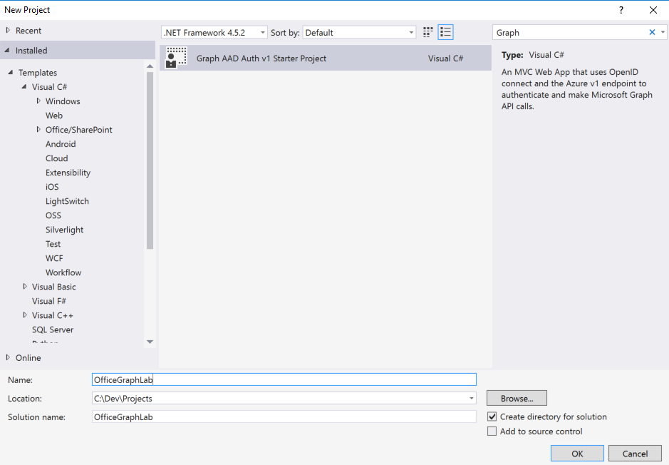

# WORK IN PROGRESS
# TEST ME IF YOU'VE GOT A MINUTE
# TODO:
2. Still getting auth exception?
4. Formatting in lists is off.
5. Screenshots.
6. Explain why we're adding the Odata Client file.
7. Will this be printed? Can we add links to our blog posts for more info on the new Trending API and Office Graph?

# Lab 20: Insights from Microsoft Graph
In this lab, you will use Microsoft Graph to connect to insights and rich relationships calculated in the Office Graph. You will build an ASP.NET MVC 5 application that retrieves documents trending around you and a specific users.

## Prerequisites

2. You must have the OData v4 Client Code Generator addin installed. 
   1. In Visual Studio go to Tools -> Extensions and Updates, Select "Online" from the left-most treeview then search for "Odata v4 Client Code Generator" and click install

 
   

## Exercise 1: Create a new project and authenticate using Azure Active Directory v1 authentication

In this first exercise, you will create a new ASP.NET MVC project using the
**Graph AAD Auth v1 Start Project** template and log in with your Office 365 administrator account.

1. Launch Visual Studio 2015 and select **New** -> **Project**.
   1. Search the installed templates for **Graph** and select
      **Graph AAD Auth v1 Starter Project**
   2. Name the new project **OfficeGraphLab**
   3. Click **OK**.

 

4. Press F5 to launch your new application in the default browser.
   1. Once the Graph and AAD v1 Auth Endpoint Starter page appears, click **Sign in** and login with the Office 365 account that was provided to your for this lab.
   2. Review the permissions the application is requesting, and click **Accept**.
   3. Now that you are signed in, you can start building the application and querying the Microsoft Graph!
   
## Exercise 2: Add a reference to the Graph API beta namespace

1. Right-click the project and select **Add item**.
   1. Select **Visual C# -> Code -> Odata Client**.
   2. Name the file Graph.tt and click **Add**.
2. Edit the Graph.tt file
   1. Edit **MetadataDocumentUri** to be "https://graph.microsoft.com/beta/$metadata"
   2. Edit **NamespacePrefix** to be "OfficeGraphLab.Service"
3. Click **Build -> Build solution** the project

 

## Exercise 3: Change the page layout
In this exercise, you will extend the page layout so that it displays a new link leading to Insights in the header.
  
1. Back in Visual Studio, click the Stop button to stop the site.
2. Update **_Layout** file to add a link to **Insights** and **Users**:
  1. Open the **_Layout.cshtml** file found in the **Views/Shared** folder.
    1. Locate the part of the file that includes links at the top of the page:
      
        ````asp
        <div class="navbar-collapse collapse">
          <ul class="nav navbar-nav">
            <li>@Html.ActionLink("Home", "Index", "Home")</li>
            <li>@Html.ActionLink("About", "About", "Home")</li>
            <li>@Html.ActionLink("Contact", "Contact", "Home")</li>
            <li>@Html.ActionLink("Graph API", "Graph", "Home")</li>
          </ul>
          @Html.Partial("_LoginPartial")
        </div>
        ````

    2. Update that navigation to have two new links (the **Insights** and **Users** links added below):

        ````asp
        <div class="navbar-collapse collapse">
          <ul class="nav navbar-nav">
            <li>@Html.ActionLink("Home", "Index", "Home")</li>
            <li>@Html.ActionLink("About", "About", "Home")</li>
            <li>@Html.ActionLink("Contact", "Contact", "Home")</li>
            <li>@Html.ActionLink("Graph API", "Graph", "Home")</li>
            <li>@Html.ActionLink("Insights", "Index", "Trending")</li>
            <li>@Html.ActionLink("Users", "Insights", "Trending")</li>
          </ul>
          @Html.Partial("_LoginPartial")
        </div>
        ````

        > The links will not work just yet. We'll add some functionality to the page later.

## Exercise 4: Create a controller for displaying trending documents
In this exercise, you will code the **TrendingController** of the MVC application to display trending documents.

1. Right-click the **Controllers** folder and select **Add/Controller**.
   1. In the **Add Scaffold** dialog, select **MVC 5 Controller - Empty**.
   2. Click **Add**.
   3. When prompted for a name, enter **TrendingController**.
   4. Click **Add**.
1. Within the **TrendingController** file, add the following `using` statements to the top of the file:

    ````c#
    using OfficeGraphLab.Auth;
    using OfficeGraphLab.Service;
    using OfficeGraphLab.TokenStorage;
    using System;
    using System.Configuration;
    using System.Threading.Tasks;
    using System.Web.Mvc;
    ````

1. Add the following helper functions that will handle authentication to the TrendingController class.

    ````c#
    public async Task<string> GetToken()
    {
        string userObjId = System.Security.Claims.ClaimsPrincipal.Current
            .FindFirst("http://schemas.microsoft.com/identity/claims/objectidentifier").Value;

        SessionTokenCache tokenCache = new SessionTokenCache(userObjId, HttpContext);

        string tenantId = System.Security.Claims.ClaimsPrincipal.Current
            .FindFirst("http://schemas.microsoft.com/identity/claims/tenantid").Value;

        string authority = string.Format(ConfigurationManager.AppSettings["ida:AADInstance"], tenantId, "");

        AuthHelper authHelper = new AuthHelper(authority, ConfigurationManager.AppSettings["ida:AppId"],
            ConfigurationManager.AppSettings["ida:AppSecret"], tokenCache);

        return await authHelper.GetUserAccessToken(Url.Action("Index", "Home", null, Request.Url.Scheme));
    }

    public async Task<Service.GraphService> GetService()
    {
        string token = await GetToken();
        Service.GraphService service = new Service.GraphService(new Uri("https://graph.microsoft.com/beta/"));
        service.BuildingRequest += (sender, e) => e.Headers.Add("Authorization", "Bearer " + token);
        return service;
    }
    ````

1. Add an action method for retrieving trending documents. The method will be able to retrieve trending documents of the currently logged in user as well as of other users on your Office 365 account.
  1. **Replace** the **Index** method with the following code to retrieve trending documents.
      
    ````c#
    [Authorize]
    public async Task<ActionResult> Index(string userId)
    {            
        var service = await GetService();

        if (String.IsNullOrEmpty(userId))
            return View(service.Me.TrendingAround);
        else
            return View(service.Users.ByKey(userId).TrendingAround);
    }
   
    ````

Now that we have a controller, we need a view that displays the trending documents!

## Exercise 5: Code the MVC application that displays documents trending around you
1. Create a view to display trending documents.
   1. Within the `TrendingController` class, right click the first `View()` method at the end of the `Index()` action and select **Add View**.
   2. Within the **Add View** dialog, set the following values:
      1. View Name: **Index**.
      2. Template: **Empty (without model)**.
        
        > Leave all other fields blank & unchecked.
      
      3. Click **Add**.
   3. Within the **Views/Trending/Index.cshtml** file, delete all the code in the file and replace it with the following code:
      
      ````html
      @model IEnumerable<OfficeGraphLab.Service.DriveItem>
      @{
         ViewBag.Title = "Trending Documents";
      }
      <h2>Trending Documents</h2>
      <table class="table">
      <tr>
         <th>
            @Html.DisplayName("Document Name");
         </th>
         <th>
            @Html.DisplayName("Last modified by");
         </th>
      </tr>

         @foreach (var item in Model)
         {
            <tr>
               <td>
                  @Html.DisplayFor(modelItem => item.Name)
               </td>
               <td>
                  @Html.DisplayFor(modelItem => item.LastModifiedBy)
               </td>
            </tr>
         }
      </table>
      ````  
1. Test the new view:
  1. In **Visual Studio**, press F5 to launch your new application in the default browser.
  2. Once the application is loaded click the **Insights** link in the top menu bar.
  3. Verify that your application displays trending documents from your Office 365 account.  
  4. Close the browser window, terminate the debugging session and return to Visual Studio.
  
While viewing your trending documents is interesting, we can go further and see what document are trending around other users! Let's make sure that we can do that now.

## Exercise 6: Make the MVC application display documents trending around other users
1. Add an action method and view to handle displaying documents trending around a specific user:
  1. In the **TrendingController.cs** file, add an action method named **Users** with the following code:

    ````c#
    [Authorize]
    public async Task<ActionResult> Users()
    {
        var service = await GetService();
        return View(service.Users);
    }
    ````
    > When developing your own web application,  you'd most likely want to create a new controller for this action. Keeping the action in one controller is OK for the purpose of our demo, though.

1. Create a view to display users.    
   1. Within the `TrendingController` class, right click the `View(service.Users)` at the end of the `Users()` action method  that you just created and select **Add View**.
   2. In the **Add View** dialog, set the following options on the dialog and click **Add**.
      1. View Name: **Insights**.
      2. Template: **Empty (without model)**.
        
        > Leave all other fields blank & unchecked.
      
      3. Click **Add**.
2. Within the **Views/Trending/Users.cshtml** file, delete all the code in the file and replace it with the following code:
   ````html
   @model IEnumerable<OfficeGraphLab.Service.User>
   @{
      ViewBag.Title = "Users";
   }
   <h2>Users</h2>
   <table class="table">
      <tr>
         <th>
            @Html.DisplayName("User Name")
         </th>
         <th>
            @Html.DisplayName("Mail")
         </th>
         <th>
         </th>
      </tr>

      @foreach (var item in Model)
      {
         <tr>
            <td>
               @Html.DisplayFor(modelItem => item.DisplayName)
            </td>
            <td>
               @Html.DisplayFor(modelItem => item.Mail)
            </td>
            <td>
               @Html.ActionLink("See Trending Documents", "Index", new { userId = item.Id })
            </td>
         </tr>
      }
   </table>
  ````
       
1. Test the new view:
  1. In **Visual Studio**, hit **F5** to begin debugging.
  2. Once the application is loaded click the **Users** link in the top menu bar.
  3. You should see a couple of users from your Office 365 account.
  4. Click the **See Trending Documents** next to one of the users.
  5. You will see a number of documents currently trending around the current user.
  6. Close the browser window, terminate the debugging session and return to Visual Studio.

Congratulations! You have created an MVC application that displays documents trending around users! Stay tuned for our new, richer Trending API. Released in a few weeks!

## Next Steps and Additional Resources:  
- See our blog posts on Office Graph and the new Trending API.
- See this training and more on http://dev.office.com/
- Learn about and connect to the Microsoft Graph at https://graph.microsoft.io
