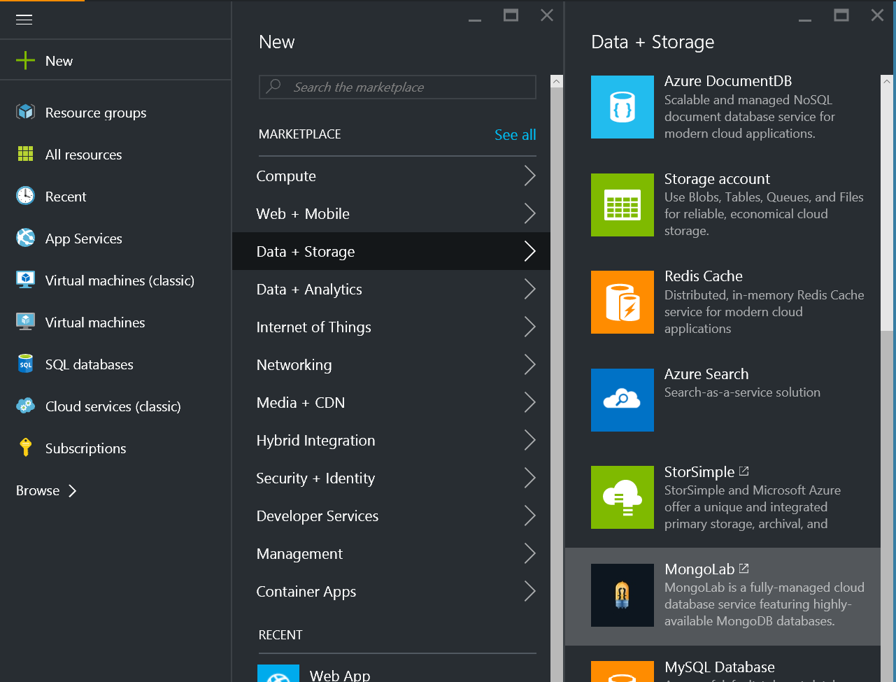
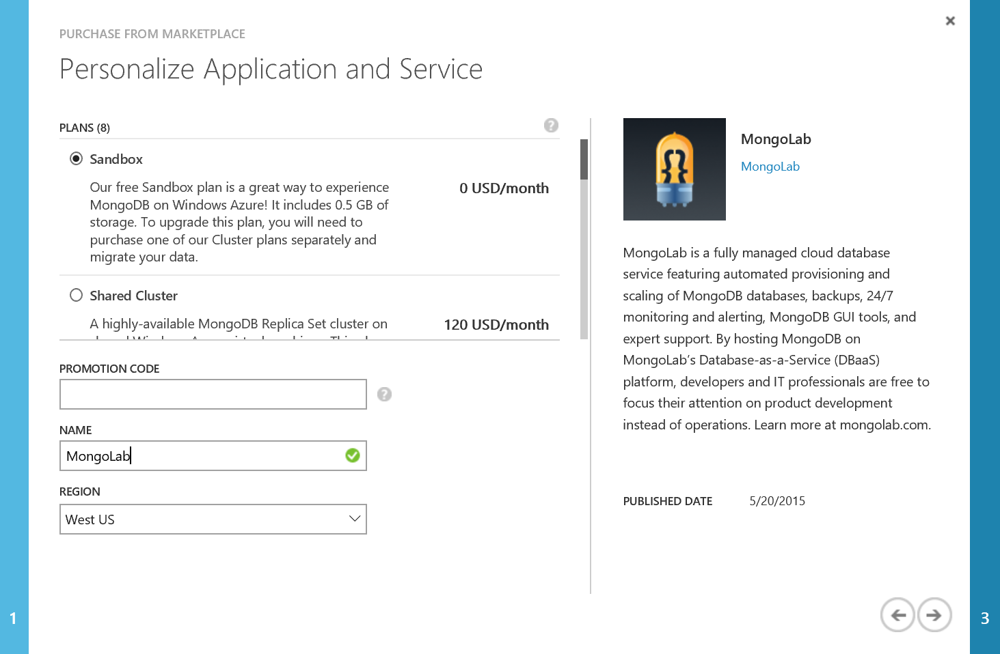
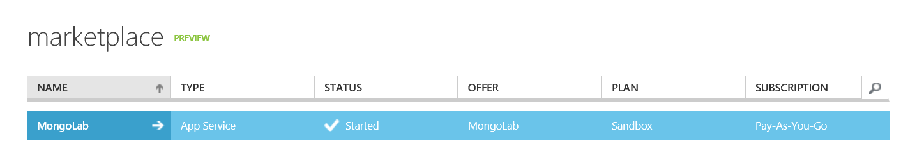
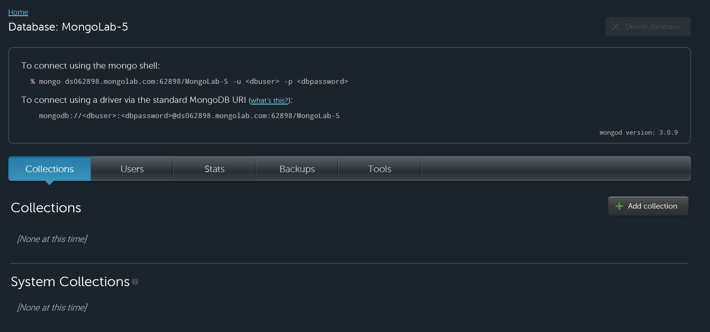
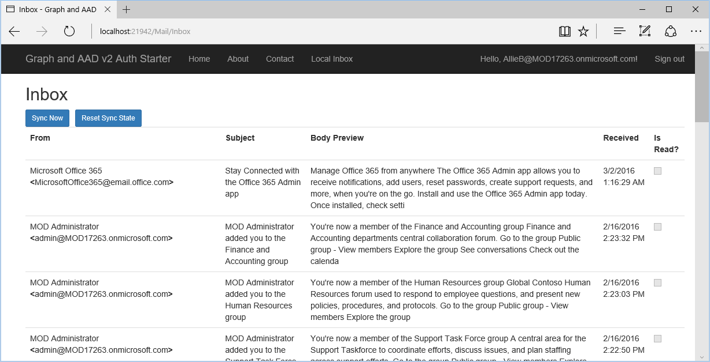
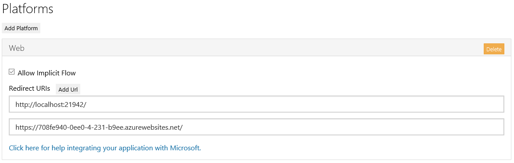
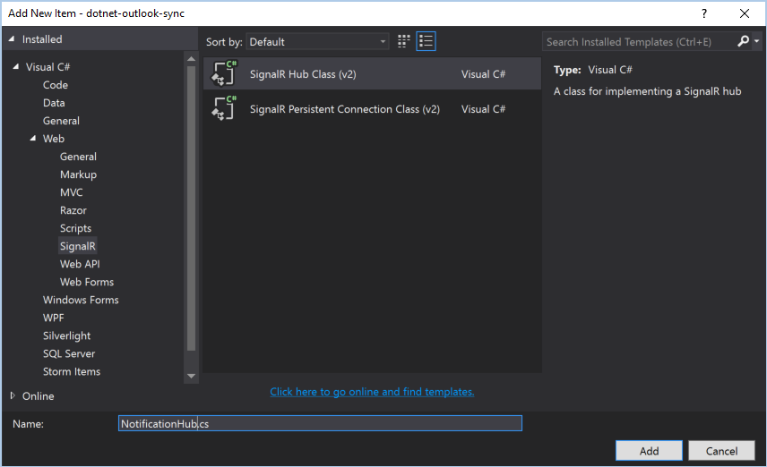

# Synchronize Outlook data with your application
In this lab, you will use the Outlook Mail REST API to synchronize messages from a user's inbox with a MongoDB database.

## Overview 
The Outlook Mail REST API now has the capabilities to synchronize messageswith your application's data store. This allows your app to retrieve only the changes to a message collection since the last sync.

This can be paired with the Outlook Notifications API to get near real-time updates and keep your data store in constant sync with the user's mailbox.


## Get an Office 365 developer environment
To complete the exercises below, you will require an Office 365 developer environment. Use the Office 365 tenant that you have been provided with for Microsoft Ignite.

## Exercise 1: Create a new project using Azure Active Directory v2 authentication

In this first step, you will create a new ASP.NET MVC project using the
**Graph AAD Auth v2 Start Project** template, register a new application
in the developer portal, and log in to your app and generate access tokens
for calling the Graph API.

1. Start Visual Studio 2015 and select **New**, **Project**.
  1. Search the installed templates for **Graph** and select the
    **Graph AAD Auth v2 Starter Project** template.
  1. Name the new project **InboxSync** and choose **OK**.
  1. Open the **Web.config** file and find the **appSettings** element. This is where you will need to add your appId and app secret you will generate in the next step.
1. Start the Application Registration Portal by opening your browser and navigating to **apps.dev.microsoft.com**
   to register a new application.
  1. Sign into the portal using your Office 365 username and password.
  1. Choose **Add an App** and type **Inbox Sync Demo** for the application name.
  1. Copy the **Application Id** and paste it into the value for **ida:AppId** in your project's **web.config** file.
  1. Under **Application Secrets** choose **Generate New Password** to create a new client secret for your app.
  1. Copy the displayed app password and paste it into the value for **ida:AppSecret** in your project's **web.config** file.
  1. Modify the **ida:AppScopes** value to include the required `https://outlook.office.com/mail.read` scope.

  ```xml
  <configuration>
    <appSettings>
      <!-- ... -->
      <add key="ida:AppId" value="paste application id here" />
      <add key="ida:AppSecret" value="paste application password here" />
      <!-- ... -->
      <!-- Specify scopes in this value. Multiple values should be comma separated. -->
      <add key="ida:AppScopes" value="https://outlook.office.com/mail.read" />
    </appSettings>
    <!-- ... -->
  </configuration>
  ```
1. Add a redirect URL to enable testing on your localhost.
  1. Right-click on **InboxSync** and choose **Properties** to open the project properties.
  1. Choose **Web** in the left navigation.
  1. Copy the **Project Url** value.
  1. Back on the Application Registration Portal page, choose **Add Platform** and then **Web**.
  1. Paste the value of **Project Url** into the **Redirect URIs** field.
  1. Scroll to the bottom of the page and choose **Save**.

1. Press F5 to compile and start your new application in the default browser.
  1. Once the Graph and AAD v2 Auth Endpoint Starter page appears, choose **Sign in** and login to your Office 365 account.
  1. Review the permissions the application is requesting, and choose **Accept**.
  1. Now that you are signed into your application, exercise 1 is complete!
  
## Exercise 2: Configure MongoDB and access the database

In this exercise, you will configure a MongoDB database and add code to the project to access the database.

### Sign up for a MongoDB sandbox database

This app will work with any MongoDB database, so if you already have access to a MongoDB database you can use it. However, if you do not, you can easily sign up for a free sandbox database.

If you have an Azure subscription, you can sign up using the following steps.

> If you do not have an Azure subscription, you can visit the MongoLab website and sign up for an account. Once you've signed up you can create a sandbox database hosted on Azure. 

1. Open your browser and browse to https://ms.portal.azure.com. Login with your Azure subscription account.
1. In the left navigation bar, choose the **New** button. Choose the **Data + Storage**, then locate and choose on the **MongoLab** app.
 
1. In the new browser window/tab that opens, scroll through the list of Developer Services and locate the **MongoLab** service. Choose the **Next** button.

1. Select the **Sandbox** plan and optionally change the **Region** to a region close to you, then choose the **Next** button.

1. Review your purchase details and review the legal terms. Choose **Purchase**.
1. On the next screen, after a few moments, the **Status** field should update to **Started**. Choose the **MongoLab** item.

1. Choose the **Go to the MongoLab website for the next steps** link.

Once you've signed up and created a database, you can get the connection details from the MongoLab website.



1. On the MongoLab website, locate the **To connect using a driver via the standard MongoDB URI** section of the page and copy the MongoDB URI. It will look similar to `mongodb://<dbuser>:<dbpassword>@ds026989.mongolab.com:26989/MongoLab-2`.
1. Open the **Web.config** file in Visual Studio. Immediately after the `<add key="ida:AppScopes" value="https://outlook.office.com/mail.read" />` line, add the following, replacing the `YOUR MONGODB URI HERE` placeholder with the MongoDB URI you copied in the previous step.

  ```xml
  <add key="mongoUri" value="YOUR MONGODB URI HERE" />
  ```
  
1. Switch back to the MongoLab website and choose **Users**, then choose **Add database user**. Enter a value for the username and password and choose **Create**.
1. In **Web.config**, replace `<dbuser>` with the username you just created, and `<dbpassword>` with the password.
1. In **Web.config**, immediately after the `<add key="mongoUri"...` line, add the following, replacing `YOUR MONGODB DATABASE NAME HERE` with the name of your database. The name of the database is the last portion of the MongoDB URI after the right-most `/`.

  ```xml
  <add key="mongoDB" value="YOUR MONGODB URI HERE" />
  ```
  
### Add database access code

1. Install the MongoDB driver and the PagedList library. On the **Tools** menu, choose **NuGet Package Manager**, then **Package Manager Console**. In the console, enter the following commands.

  ```powershell
  Install-Package MongoDB.Driver
  Install-Package PagedList.Mvc
  ```
  
1. Right-click the **Models** folder and choose **Add**, then **Class**. Name the class 'User' and choose **Add**. Replace the entire contents of the file with the following.

  ```csharp
  using System;
  using MongoDB.Bson;

  namespace InboxSync.Models
  {
    public class User
    {
      public ObjectId Id { get; set; }
      public string Email { get; set; }
      public DateTime TokenExpires { get; set; }
      public string AccessToken { get; set; }
      public string RefreshToken { get; set; }
      public string SyncState { get; set; }
    }
  }
  ```

1. Right-click the **Models** folder and choose **Add**, then **Class**. Name the class 'Message' and choose **Add**. Replace the entire contents of the file with the following.

  ```csharp
  using System;
  using MongoDB.Bson;
  using System.ComponentModel.DataAnnotations;

  namespace InboxSync.Models
  {
    public class EmailAddress
    {
      [DisplayFormat(ConvertEmptyStringToNull = true, NullDisplayText = "*no name*")]
      public string Name { get; set; }
      [DisplayFormat(ConvertEmptyStringToNull = true, NullDisplayText = "*no email*")]
      public string Address { get; set; }
    }
    public class FromField
    {
      public EmailAddress EmailAddress { get; set; }
    }

    public class Message
    {
      public ObjectId Id { get; set; }
      public ObjectId Owner { get; set; }
      public string OutlookId { get; set; }
      [DisplayFormat(ConvertEmptyStringToNull = true, NullDisplayText = "*no body*")]
      public string BodyPreview { get; set; }
      public FromField From { get; set; }
      public bool IsRead { get; set; }
      public DateTime ReceivedDateTime { get; set; }
      [DisplayFormat(ConvertEmptyStringToNull = true, NullDisplayText = "*no subject*")]
      public string Subject { get; set; }
    }
  }
  ```
    
1. Right-click the **InboxSync** project and choose **Add**, then **New Folder**. Name the new folder `Helpers`.
1. Right-click the **Helpers** folder and choose **Add**, then **Class**. Name the class `UserManager` and choose **Add**. Replace the entire contents of the file with the following.

  ```csharp
  using System;
  using System.Collections.Generic;
  using System.Threading.Tasks;

  using MongoDB.Bson;
  using MongoDB.Driver;

  using InboxSync.Models;
  using InboxSync.Auth;

  namespace InboxSync.Helpers
  {
    // This class manages all of the user data stored in the database.
    public class UserManager
    {
      // Configuration information for the database connection
      private static string mongoUri = System.Configuration.ConfigurationManager.AppSettings["mongoUri"];
      private static string mongoDB = System.Configuration.ConfigurationManager.AppSettings["mongoDB"];

      private static MongoClient mongo = new MongoClient(mongoUri);
      private static IMongoDatabase database = mongo.GetDatabase(mongoDB);
      private static IMongoCollection<User> userCollection = database.GetCollection<User>("users");
      private static IMongoCollection<Message> messageCollection = database.GetCollection<Message>("messages");

      // Gets a user by ID
      public static async Task<User> GetUserById(string userId)
      {
        var idFilter = Builders<User>.Filter.Eq("Id", new ObjectId(userId));
        return await userCollection.Find(idFilter).FirstOrDefaultAsync();
      }

      // Processes a token response object and updates the user's record.
      // If the user doesn't exist in the database, it will create a record.
      public static async Task<User> AddOrUpdateUser(string email, TokenRequestSuccessResponse tokenResponse)
      {
        // Create a filter to find the record with this email
        var emailFilter = Builders<User>.Filter.Eq("Email", email);

        // See if the user exists
        User user = await userCollection.Find(emailFilter).FirstOrDefaultAsync();
        if (null != user)
        {
          // User exists, update tokens and expire time
          var update = Builders<User>.Update.Set("AccessToken", tokenResponse.AccessToken)
            .Set("RefreshToken", tokenResponse.RefreshToken)
            .Set("TokenExpires", DateTime.UtcNow.AddSeconds(Int32.Parse(tokenResponse.ExpiresIn) - 300));

          var result = await userCollection.UpdateOneAsync(emailFilter, update);
        }
        else
        {
          // User does not exist, create a new user and add to the database
          user = new User()
          {
            Email = email,
            AccessToken = tokenResponse.AccessToken,
            RefreshToken = tokenResponse.RefreshToken,
            TokenExpires = DateTime.UtcNow.AddSeconds(Int32.Parse(tokenResponse.ExpiresIn) - 300)
          };

          await userCollection.InsertOneAsync(user);
        }

        return user;
      }

      // Gets the user's total count of messages in the database
      // This is used to enable the PagedList to calculate the appropriate number
      // of pages without retrieving all of the messages each time it loads a new page.
      public static async Task<long> GetUsersMessageCount(string userId)
      {
        var ownerFilter = Builders<Message>.Filter.Eq("Owner", new ObjectId(userId));
        return await messageCollection.Find(ownerFilter).CountAsync();
      }

      // Gets the users's current "page" of messages from the database
      public static async Task<List<Message>> GetUsersMessages(string userId, int pageSize, int pageNum)
      {
        var ownerFilter = Builders<Message>.Filter.Eq("Owner", new ObjectId(userId));
        var sort = Builders<Message>.Sort.Descending("ReceivedDateTime");

        return await messageCollection.Find(ownerFilter)
                                      .Sort(sort)
                                      .Limit(pageSize)
                                      .Skip((pageNum - 1) * pageSize)
                                      .ToListAsync();
      }
    }
  }
  ```
  
1. Open the **Startup.cs** file. Add the following using directive to the top of the file.

  ```csharp
  using InboxSync.Helpers;
  ```
  
1. Locate the `OnAuthorizationCodeReceived` function and add the following lines to the end of the function.

  ```csharp
  var user = await UserManager.AddOrUpdateUser(principal.FindFirst("preferred_username").Value, response);
  httpContext.Session["user_id"] = user.Id.ToString();
  ```

1. Right-click the **Controllers** folder and choose **Add** > **New Scaffolded Item...**. 
2. In the **Add Scaffold** dialog, select **MVC 5 Controller - Empty**, and choose **Add**.
3. In the **Add Controller** dialog, name the controller `MailController` and choose **Add**. 
3. Replace the entire contents of the file with the following.

  ```csharp
  using System.Threading.Tasks;
  using System.Web.Mvc;
  using System.Security.Claims;

  using InboxSync.Models;
  using InboxSync.Helpers;
  using InboxSync.Auth;

  using PagedList;

  namespace InboxSync.Controllers
  {
    public class MailController : Controller
    {
      // GET: Mail
      [System.Web.Mvc.Authorize]
      public ActionResult Index()
      {
        return RedirectToAction("Inbox");
      }

      // GET: Mail/Inbox
      [System.Web.Mvc.Authorize]
      public async Task<ActionResult> Inbox(int? page)
      {
        // The user's database ID record
        string userId = (string)Session["user_id"];

        int pageSize = 20;
        int pageNumber = (page ?? 1);

        // Get the total count of messages for the user (for calculating number of pages)
        long totalCount = await UserManager.GetUsersMessageCount(userId);

        // Get the current page of messages
        var messages = await UserManager.GetUsersMessages(userId, pageSize, pageNumber);

        // Return a PagedList to the view
        return View(new StaticPagedList<Message>(messages, pageNumber, pageSize, (int)totalCount));
      }
    }
  }
  ```
  
1. Expand the **Views/Shared** folder in the project. Open the **_Layout.cshtml** file found in the **Views/Shared** folder.
  1. Locate the part of the file that includes a few links at the top of the
      page. It should look similar to the following code:

    ```asp
      <ul class="nav navbar-nav">
          <li>@Html.ActionLink("Home", "Index", "Home")</li>
          <li>@Html.ActionLink("About", "About", "Home")</li>
          <li>@Html.ActionLink("Contact", "Contact", "Home")</li>
          <li>@Html.ActionLink("Graph API", "Graph", "Home")</li>
      </ul>
    ```

  1. Update that navigation to replace the "Graph API" link with "Local Inbox"
      and connect this to the controller you just created.

    ```asp
      <ul class="nav navbar-nav">
          <li>@Html.ActionLink("Home", "Index", "Home")</li>
          <li>@Html.ActionLink("About", "About", "Home")</li>
          <li>@Html.ActionLink("Contact", "Contact", "Home")</li>
          <li>@Html.ActionLink("Local Inbox", "Inbox", "Mail")</li>
      </ul>
    ```
  
1. Open the **Content/Site.css**. Add the following to the bottom of the file.

  ```css
  .sync-form {
      float: left;
      margin-right: 10px;
  }
  ```
  
1. Expand the **Views** folder. Right-click the **Mail** folder and choose **Add**, then **MVC 5 View Page (Razor)**. Name the page `Inbox` and choose **OK**. Replace the entire contents of the file with the following.

  ```asp
  @model PagedList.IPagedList<InboxSync.Models.Message>
  @using PagedList.Mvc;

  <link href="~/Content/PagedList.css" rel="stylesheet" type="text/css" />

  @{
    ViewBag.Title = "Inbox";
  }

  <h2>Inbox</h2>

  <table class="table">
      <tr>
          <th>
              From
          </th>
          <th>
              Subject
          </th>
          <th>
              Body Preview
          </th>
          <th>
              Received
          </th>
          <th>
              Is Read?
          </th>
      </tr>

      @foreach (var item in Model)
      {
      <tr>
          <td>
              @Html.DisplayFor(modelItem => item.From.EmailAddress.Name) <strong>&lt;</strong>@Html.DisplayFor(modelItem => item.From.EmailAddress.Address)<strong>&gt;</strong>
          </td>
          <td>
              @Html.DisplayFor(modelItem => item.Subject)
          </td>
          <td>
              @Html.DisplayFor(modelItem => item.BodyPreview)
          </td>
          <td>
              @Html.DisplayFor(modelItem => item.ReceivedDateTime)
          </td>
          <td>
              @Html.DisplayFor(modelItem => item.IsRead)
          </td>
      </tr>
      }

  </table>
  <br />
  Page @(Model.PageCount < Model.PageNumber ? 0 : Model.PageNumber) of @Model.PageCount

  @Html.PagedListPager(Model, page => Url.Action("Inbox", new { page }))
  ```
  
## Exercise 3: Add message sync

Now let's add the ability to sync messages from the user's inbox into the database.

1. In Visual Studio's Solution Explorer, right-click the **Helpers** folder and choose **Add**, then **Class**. Enter `OutlookHelper` for the class name and choose **Add**.
1. Add the following `using` directives to the top of the file:
  ```csharp
  using System.Net.Http;
  using System.Threading.Tasks;
  using Newtonsoft.Json.Linq;
  ```
1. Add the following code to the `OutlookHelper` class:

  ```csharp
  // Used to set the base API endpoint, e.g. "https://outlook.office.com/api/beta"
  public string ApiEndpoint { get; set; }
  // Used to set the X-AnchorMailbox header, which helps to efficiently route
  // API requests to the correct server
  public string AnchorMailbox { get; set; }

  public OutlookHelper()
  {
    // Set default endpoint
    ApiEndpoint = "https://outlook.office.com/api/beta";
    AnchorMailbox = string.Empty;
  }
  ```
This code defines the `ApiEndpoint` and `AnchorMailbox` properties, and a simple constructor to set default values. 

1. Add the following method to the `OutlookHelper` class:

  ```csharp
  // Used to make a REST API call to a URL
  public async Task<HttpResponseMessage> MakeApiCall(string method, string token, string apiUrl,
    string userEmail, string payload, string[] preferHeaders)
  {
    using (var httpClient = new HttpClient())
    {
      var request = new HttpRequestMessage(new HttpMethod(method), apiUrl);

      // Headers
      request.Headers.Authorization = 
        new System.Net.Http.Headers.AuthenticationHeaderValue("Bearer", token);
      request.Headers.UserAgent.Add(
        new System.Net.Http.Headers.ProductInfoHeaderValue("dotnet-outlook-nosdk", "1.0"));
      request.Headers.Accept.Add(
        new System.Net.Http.Headers.MediaTypeWithQualityHeaderValue("application/json"));
      request.Headers.Add("client-request-id", Guid.NewGuid().ToString());
      request.Headers.Add("return-client-request-id", "true");
      request.Headers.Add("X-AnchorMailbox", userEmail);

      if (preferHeaders != null)
      {
        foreach (string header in preferHeaders)
        {
          request.Headers.Add("Prefer", header);
        }
      }

      // Content
      if ((method.ToUpper() == "POST" || method.ToUpper() == "PATCH") &&
          !string.IsNullOrEmpty(payload))
      {
        request.Content = new StringContent(payload);
        request.Content.Headers.ContentType.MediaType = "application/json";
      }

      var apiResult = await httpClient.SendAsync(request);
      return apiResult;
    }
  }
  ```
This method makes a REST API call to a given URL. We'll use this generic method to build more specific methods.

1. Add the following method to the `OutlookHelper` class:

  ```csharp
  // Used to sync inbox messages
  public async Task<JObject> SyncInbox(string email, string accessToken, string deltaToken, string skipToken)
  {
    string syncEndpoint = this.ApiEndpoint + "/Me/MailFolders/Inbox/Messages";

    // Set up query parameters
    string query = "?$select=Subject,ReceivedDateTime,From,BodyPreview,IsRead&$orderby=ReceivedDateTime+desc";

    // Append sync state if present
    if (!string.IsNullOrEmpty(deltaToken))
    {
      // deltaToken is used to start a new sync after a prior sync completed
      query += "&$deltatoken=" + deltaToken;
    }
    else if (!string.IsNullOrEmpty(skipToken))
    {
      // skipToken is used during a sync when there are more results than the max page size
      query += "&$skiptoken=" + skipToken;
    }

    syncEndpoint += query;

    // Set the odata.track-changes to enable sync
    // Set the sync page size to 20 items
    string[] preferences = {
      "odata.track-changes",
      "odata.maxpagesize=20"
    };

    HttpResponseMessage syncResult = await this.MakeApiCall("GET", accessToken, 
      syncEndpoint, email, null, preferences);

    string response = await syncResult.Content.ReadAsStringAsync();

    return JObject.Parse(response);
  }
  ```
This method impelements the actual sync call. There are a few important features to note:

  - The code sets the `$select` parameter in the query, so the returned results will be limited to only the fields that we store in the database.
  - The code sets the `$orderby` to `ReceivedDateTime desc` to ensure that the sync will process newer items first.
  - The code sets the `odata.track-changes` value in the `Prefer` header, which enables sync functionality.
  - The code sets the `odata.maxpagesize=20` value in the `Prefer` header, which causes the server to return at most 20 items for each sync request.
  - The code appends a `$deltatoken` or `$skiptoken` parameter to the query, as appropriate.
  
  ---
  ### About `$deltatoken` and `$skiptoken`
  
  Sync "state" is managed by the `$deltatoken` and `$skiptoken` values in requests. The `$deltatoken` is usually used when starting a new sync request **after** the application has done an initial sync. It tells the server the point in time that the app last synced, so it can compute the differences. The `$skiptoken` value is a value returned by the server when there are more changes than can be returned in the results set. For example, this code sets the max page size to 20. If there are more than 20 new items on the server when the application next syncs, the first request will return 20 items and a `$skiptoken`. The app then makes another request, passing the `$skiptoken`, to get the next page of results.
  
  You can read more about these values at http://msdn.microsoft.com/en-us/office/office365/api/mail-rest-operations#Synchronizemessagespreview.
  
  ---  
  
1. Open the **Helpers\UserManager.cs** file. Add the following `using` directives to the top of the file:

  ```csharp
  using System.Web;
  using System.Collections.Specialized;
  using Newtonsoft.Json.Linq;
  using System.Text.RegularExpressions;
  ```
  
1. Add the following method to the `UserManager` class:

  ```csharp
  public static async Task SyncUsersInbox(string userId)
  {
    User user = await GetUserById(userId);

    if (null != user)
    {
      OutlookHelper outlook = new OutlookHelper();
      outlook.AnchorMailbox = user.Email;

      // If we have no prior sync state, do an intial sync. This sync always 
      // returns a deltatoken, even if there are more results on the server. 
      // You must always do another sync after the initial sync.
      bool isInitialSync = string.IsNullOrEmpty(user.SyncState);
      bool syncComplete = false;
      string newSyncState = user.SyncState;
      string newSkipToken = string.Empty;

      while (!syncComplete)
      {
        var syncResults = await outlook.SyncInbox(user.Email, user.AccessToken, newSyncState, newSkipToken);

        // Do updates (add/delete/update)
        await ParseSyncItems(user.Id, (JArray)syncResults["value"]);

        // Is there a skip token?
        if (null != syncResults["@odata.nextLink"])
        {
          // There are more results, need to call again
          // nextLink is a URL which has a $skiptoken parameter
          string nextLink = (string)syncResults["@odata.nextLink"];
          string query = new UriBuilder(nextLink).Query;
          NameValueCollection queryParams = HttpUtility.ParseQueryString(query);

          if (string.IsNullOrEmpty(queryParams["$skiptoken"]))
          {
            throw new Exception(
              "Failed to find $skiptoken in nextLink value in sync response. Try resetting sync state.");
          }

          newSyncState = string.Empty;
          newSkipToken = queryParams["$skiptoken"];
        }

        else if (null != syncResults["@odata.deltaLink"])
        {
          // Delta link is a URL which has a $deltatoken parameter
          string deltaLink = (string)syncResults["@odata.deltaLink"];
          string query = new UriBuilder(deltaLink).Query;
          NameValueCollection queryParams = HttpUtility.ParseQueryString(query);

          if (string.IsNullOrEmpty(queryParams["$deltatoken"]))
          {
            throw new Exception(
              "Failed to find $deltatoken in deltaLink value in sync response. Try resetting sync state.");
          }
          
          newSkipToken = string.Empty;
          newSyncState = queryParams["$deltatoken"];
          if (isInitialSync)
          {
            isInitialSync = false;
          }
          else
          {
            syncComplete = true;
          }
        }
        else
        {
          // No deltaLink or nextLink, something's wrong
          throw new Exception("Failed to find either a deltaLink or nextLink value in sync response. Try resetting sync state.");
        }
      }

      // Save new sync state to the user's record in database
      var idFilter = Builders<User>.Filter.Eq("Id", new ObjectId(userId));
      var userUpdate = Builders<User>.Update.Set("SyncState", newSyncState);

      var result = await userCollection.UpdateOneAsync(idFilter, userUpdate);
    }
  }
  ```
This method issues sync requests to the API until there are no more results. It follows the sequence documented on MSDN:  

  - If there is no delta token or skip token, the request is considered an initial sync request.
  - If the response contains a skip token, there are more results on the server and the method makes another request.
  - If the response contains a delta token, the method stops issuing requests **unless** it is the initial sync request.
  - Once the method stops issuing requests, it saves the delta token value in the user's entry in the database.
  
1. Add the following method to the `UserManager` class:

  ```csharp
  private static async Task ParseSyncItems(ObjectId userId, JArray syncItems)
  {
    List<string> deleteIds = new List<string>();
    List<Message> newMessages = new List<Message>();

    foreach(JObject syncItem in syncItems)
    {
      // First check if this is a delete
      // Deletes look like:
      // {
      //   "@odata.context": "https://...",
      //   "id": "Messages('AAMk...')"
      //   "reason": "deleted"
      // }

      if (null != syncItem["reason"] && 
          ((string)syncItem["reason"]).ToLower().Equals("deleted"))
      {
        string rawid = (string)syncItem["id"];
        string outlookId = Regex.Matches(rawid, @"'([^' ]+)'")[0].Groups[1].Value;
        // Add the ID to the list of delete IDs
        deleteIds.Add(outlookId);
      }
      else
      {
        // If there's no "reason" in the item, it's
        // either an update or a new item.
        // There is no indicator in the JSON that tells us if it's an update or
        // not, so we need to figure that out ourselves.

        string outlookId = (string)syncItem["Id"];
        var outlookIdFilter = Builders<Message>.Filter.Eq("OutlookId", outlookId);

        // See if there's an item with the Outlook ID
        var existingMsg = await messageCollection.Find(outlookIdFilter).FirstOrDefaultAsync();
        if (null != existingMsg)
        {
          // UPDATE (only contains updated fields)
          // For example, marking a message read:
          // {
          //   "@odata.id": "https://...",
          //   "Id": "AAMk..."
          //   "IsRead": "true"
          // }
          UpdateDefinition<Message> update = null;
          foreach (var val in syncItem)
          {
            if (!val.Key.Equals("@odata.id") && !val.Key.Equals("Id"))
            {
              string newVal = val.Value.ToString();
              update = (null == update) ? Builders<Message>.Update.Set(val.Key, newVal) : update.Set(val.Key, newVal);
            }
          }

          var updateResult = await messageCollection.UpdateOneAsync(outlookIdFilter, update);
        }
        else
        {
          // No existing record, create a new message
          // and add it to our list to bulk insert
          Message newMessage = new Message()
          {
            BodyPreview = (string)syncItem["BodyPreview"],
            // Draft messages can have a null From field
            From = (JTokenType.Null != syncItem["From"].Type) ? new FromField()
            {
              EmailAddress = new EmailAddress()
              {
                Name = (string)syncItem["From"]["EmailAddress"]["Name"],
                Address = (string)syncItem["From"]["EmailAddress"]["Address"]
              }
            } : null,
            IsRead = (bool)syncItem["IsRead"],
            OutlookId = outlookId,
            Owner = userId,
            ReceivedDateTime = DateTime.Parse((string)syncItem["ReceivedDateTime"]),
            Subject = (string)syncItem["Subject"]
          };

          newMessages.Add(newMessage);       
        }
      }
    }

    if (newMessages.Count > 0)
    {
      await messageCollection.InsertManyAsync(newMessages);
    }

    if (deleteIds.Count > 0)
    {
      var deleteFilter = Builders<Message>.Filter.In("OutlookId", deleteIds);
      var deleteResult = await messageCollection.DeleteManyAsync(deleteFilter);
    }
  }
  ```
This method takes the array of sync items returned by the API and updates the database accordingly. Any messages marked as deleted are added to a list and deleted in one batch. Non-deletes are first tried as updates to existing items. If the item isn't found in the database, a new item is created and added to a list to be added to the database in one batch.

1. Add the following method to the `UserManager` class:

  ```csharp
  public static async Task ResetSyncState(string userId)
  {
    // Remove all messages owned by the user (so resync doesn't duplicate)
    var deleteFilter = Builders<Message>.Filter.Eq("Owner", new ObjectId(userId));
    var deleteResult = await messageCollection.DeleteManyAsync(deleteFilter);

    // Clear the sync state on the user
    var idFilter = Builders<User>.Filter.Eq("Id", new ObjectId(userId));
    var userUpdate = Builders<User>.Update.Set("SyncState", string.Empty);

    var result = await userCollection.UpdateOneAsync(idFilter, userUpdate);
  }
  ```
This method removes all of the messages owned by the user from the database, and clears their sync state.

1. Open the **Controllers\MailController.cs** file. Add the following method to the `MailController` class:

  ```csharp
  // POST Mail/SyncInbox
  [HttpPost]
  [System.Web.Mvc.Authorize]
  public async Task<ActionResult> SyncInbox()
  {
    if (null == Session["user_id"])
    {
      return Redirect("/");
    }

    string userId = (string)Session["user_id"];
    try
    {
      await UserManager.SyncUsersInbox(userId);
    }
    catch (System.Exception ex)
    {
      TempData["error_message"] = ex.Message;
      return RedirectToAction("Index", "Error", new { message = ex.Message });
    }

    return RedirectToAction("Inbox");
  }
  ```
This function implements the `/Mail/SyncInbox` route in our app. It does the sync then refreshes the view of the database copy of the Inbox.

1. Add the following method to the `MailController` class:

  ```csharp
  // POST Mail/ResetSyncState
  [HttpPost]
  [System.Web.Mvc.Authorize]
  public async Task<ActionResult> ResetSyncState()
  {
    if (null == Session["user_id"])
    {
      return Redirect("/");
    }

    string userId = (string)Session["user_id"];
    await UserManager.ResetSyncState(userId);

    return RedirectToAction("Inbox");
  }
  ```
This function implements the `/Mail/ResetSyncState` route in our app. It does the sync then refreshes the view of the database copy of the Inbox.

1. The last step is to add buttons to the view of the database copy of the Inbox to invoke the `/Mail/SyncInbox` and `/Mail/ResetSyncState` routes. Open the **Views\Mail\Inbox.cshtml** file and add the following code after the `<h2>Inbox</h2>` line:

  ```asp
  <p>
      @using (Html.BeginForm("SyncInbox", "Mail", FormMethod.Post, new { @class="sync-form" }))
      {
          <input type="submit" value="Sync Now" class="btn btn-primary btn-sm"/>
      }
      @using (Html.BeginForm("ResetSyncState", "Mail", FormMethod.Post, new { @class = "sync-form" }))
      {
          <input type="submit" value="Reset Sync State" class="btn btn-primary btn-sm" onclick="return confirm('Are you sure you want to reset your sync state and remove all of your messages from the database?');" />
      }
  </p>
  ```

1. Save all of your changes and restart the app. Login as before, and choose the **Local Inbox** link in the top nav bar.

1. Choose the **Sync Now** button. If you have a large number of messages in your inbox this may take some time to complete. The view should refresh with a list of messages.

  

At this point you can experiment with making changes to messages in the Inbox and syncing again. For example, you can mark messages as read, delete messages, or send new messages to yourself. After making changes, if you choose the **Sync Now** button you should see the changes show up in the app.

## Exercise 4 (Optional): Add a notification webhook

---
In this section you will implement a web hook in the app. In order for the web hook to function, it must be published on an internet-facing web server. Running the application locally won't work for this part of the exercise.

This exercise will take you through steps to publish the app to an Azure App Services web site. However, you can deploy this to any other internet-facing web server if you wish.

---

### Publish the app to Azure

1. Browse to https://tryappservice.azure.com/ to create a temporary test site. Choose **Web App** as the app type, then choose **Next**. Change the language dropdown to **C#**, then choose **ASP.NET Empty Site** and choose **Create**. Sign in with an account to complete the creation process.
1. When the site is created, copy the site URL, then choose the **Download publishing profile** link and save the file to the local machine.

  

1. Open the **Startup.cs** file, and change the value of `RedirectUri` in `OpenIdConnectAuthenticationOptions` to the URL of the new site:

  ```csharp
  ...
  ResponseType = "code id_token",
  RedirectUri = "https://708fe940-0ee0-4-231-b9ee.azurewebsites.net/",
  PostLogoutRedirectUri = "/",
  ...
  ```
  
1. In Visual Studio, open the **Build** menu and choose **Publish InboxSync**.
1. Select **Import** under **Select a publish target**. Browse to the publishing profile you downloaded in the previous step. Choose the **Validate Connection** button to make sure the settings work.
1. Choose the **Settings** item in the left navigation. Expand **File Publish Options** and put a check in the **Remove additional files at destination** checkbox.
1. Choose **Publish** to publish the app to Azure. Once the publishing process is complete, a new browser window will open to the newly published site.
1. In order for authentication to work, you need to add the URL of the new site to the app registration on https://apps.dev.microsoft.com. Edit the app registration you created earlier. Choose the **Add Url** button in the **Redirect URIs** section. Add the URL of your new site, then choose **Save**. It should look similar to this:

  

At this point you should be able to browse to your Azure web site and log in. The app should work just as it did on your local machine.

### Add the webhook

In this section we'll implement a webhook along with the code to subscribe for notifications to be sent to the webhook. We'll also add SignalR to the project, which will be used to notify the client to refresh its view.

1. Open the **Helpers\OutlookHelper.cs** file. Add the following methods to the `OutlookHelper class:
  
  ```csharp
  // Used to create a notification subscription on the user's inbox
  public async Task<JObject> CreateInboxSubscription(string email, string accessToken, string notificationUrl)
  {
    string subscribeEndpoint = this.ApiEndpoint + "/Me/Subscriptions";

    // Build the JSON payload
    var subscription = new JObject(
      new JProperty("@odata.type", "#Microsoft.OutlookServices.PushSubscription"),
      new JProperty("Resource", this.ApiEndpoint + "/Me/MailFolders/Inbox/Messages"),
      new JProperty("NotificationURL", notificationUrl),
      // We want to be notified if anything is new, changed, or deleted
      new JProperty("ChangeType", "Created, Updated, Deleted")
    );

    // POST the JSON to the /Subscriptions endpoint
    HttpResponseMessage subscribeResult = await this.MakeApiCall("POST", accessToken, subscribeEndpoint, email, subscription.ToString(), null);

    string response = await subscribeResult.Content.ReadAsStringAsync();

    return JObject.Parse(response);
  }

  // Used to delete a subscription
  public async Task DeleteSubscription(string email, string accessToken, string subscriptionId)
  {
    string unsubscribeEndpoint = this.ApiEndpoint + "/Me/Subscriptions/" + subscriptionId;

    HttpResponseMessage unsubscribeResult = await this.MakeApiCall("DELETE", accessToken, unsubscribeEndpoint, email, null, null);
  }
  ```

1. Open the **Models\User.cs** file and add the following fields to the `User` class:

  ```csharp
  public string SubscriptionId { get; set; }
  public DateTime SubscriptionExpires { get; set; }
  public string SignalRConnection { get; set; }
  ```
  
1. Open the **Helpers\UserManager.cs** file and add the following methods to the `UserManager` class:

  ```csharp
  // Creates a notification subscription on the user's inbox and
  // saves the subscription ID on the user in the database
  public static async Task SubscribeForInboxUpdates(string userId, string notificationUrl)
  {
    var idFilter = Builders<User>.Filter.Eq("Id", new ObjectId(userId));
    var user = await userCollection.Find(idFilter).FirstOrDefaultAsync();

    if (null != user && string.IsNullOrEmpty(user.SubscriptionId))
    {
      OutlookHelper outlook = new OutlookHelper();
      outlook.AnchorMailbox = user.Email;

      JObject subscription = await outlook.CreateInboxSubscription(user.Email, user.AccessToken, notificationUrl);

      var update = Builders<User>.Update.Set("SubscriptionId", (string)subscription["Id"])
        .Set("SubscriptionExpires", DateTime.Parse((string)subscription["SubscriptionExpirationDateTime"]));

      var result = await userCollection.UpdateOneAsync(idFilter, update);
    }
  }

  // Deletes the notification subscription for the user
  public static async Task UnsubscribeForInboxUpdates(string userId)
  {
    var idFilter = Builders<User>.Filter.Eq("Id", new ObjectId(userId));
    var user = await userCollection.Find(idFilter).FirstOrDefaultAsync();

    if (null != user && !string.IsNullOrEmpty(user.SubscriptionId))
    {
      OutlookHelper outlook = new OutlookHelper();
      outlook.AnchorMailbox = user.Email;

      await outlook.DeleteSubscription(user.Email, user.AccessToken, user.SubscriptionId);

      var update = Builders<User>.Update.Set("SubscriptionId", string.Empty)
        .Set("SubscriptionExpires", DateTime.UtcNow);

      var result = await userCollection.UpdateOneAsync(idFilter, update);
    }
  }

  public static async Task<bool> IsUserSubscribed(string userId)
  {
    var user = await GetUserById(userId);
    return !string.IsNullOrEmpty(user.SubscriptionId);
  }

  // Looks up the user by the subscription ID and does a sync
  // on that user's inbox
  public static async Task<string> UpdateInboxBySubscription(string subscription)
  {
    if (!string.IsNullOrEmpty(subscription))
    {
      var subscriptionFilter = Builders<User>.Filter.Eq("SubscriptionId", subscription);
      var user = await userCollection.Find(subscriptionFilter).FirstOrDefaultAsync();

      if (null != user)
      {
        await SyncUsersInbox(user.Id.ToString());
        return user.Id.ToString();
      }
    }
    return string.Empty;
  }

  // Saves a SignalR connection ID to the user in the database
  public static async Task UpdateUserSignalRConnection(string userId, string connectionId)
  {
    var idFilter = Builders<User>.Filter.Eq("Id", new ObjectId(userId));
    var update = Builders<User>.Update.Set("SignalRConnection", connectionId);
    var result = await userCollection.UpdateOneAsync(idFilter, update);
  }

  // Gets the user's SignalR connection ID
  public static async Task<string> GetUserSignalRConnection(string userId)
  {
    var user = await GetUserById(userId);

    if (null != user)
    {
      return user.SignalRConnection;
    }

    return null;
  }
  ```
  
1. Right-click the **Helpers** folder in Solution Explorer and choose **Add**, then **Class**. Enter `OutlookNotification` for the class name and choose **Add**. Replace the entire contents of the file with the following code:

  ```csharp
  using Newtonsoft.Json;

  namespace InboxSync.Helpers
  {
    public class OutlookNotification
    {
      public string SubscriptionId { get; set; }
    }

    public class NotificationPayload
    {
      [JsonProperty("value")]
      public OutlookNotification[] Notifications { get; set; }
    }
  }
  ```
  
1. Open the **Controllers\MailController.cs** file and add the following `using` directives to the top of the file:

  ```csharp
  using System.IO;
  using Newtonsoft.Json;
  using Microsoft.AspNet.SignalR;
  using InboxSync.Hubs;
  ```
  
1. Locate the `Inbox` method in the `MailController` class. Add the following lines after the line `string userId = (string)Session["user_id"];`:

   ```csharp
   ViewBag.UserId = userId;
   ViewBag.IsSubscribed = await UserManager.IsUserSubscribed(userId);
   ```
   
1. Add the following methods to the `MailController` class:

  ```csharp
  // POST Mail/Subscribe
  [HttpPost]
  [System.Web.Mvc.Authorize]
  public async Task<ActionResult> Subscribe()
  {
    if (null == Session["user_id"])
    {
      return Redirect("/");
    }

    string userId = (string)Session["user_id"];

    string notificationUrl = Url.Action("Notify", "Mail", null, Request.Url.Scheme);
    await UserManager.SubscribeForInboxUpdates(userId, notificationUrl);

    return RedirectToAction("Inbox");
  }

  // POST Mail/Subscribe
  [HttpPost]
  [System.Web.Mvc.Authorize]
  public async Task<ActionResult> Unsubscribe()
  {
    if (null == Session["user_id"])
    {
      return Redirect("/");
    }

    string userId = (string)Session["user_id"];

    await UserManager.UnsubscribeForInboxUpdates(userId);

    return RedirectToAction("Inbox");
  }

  // POST Mail/Notify
  [HttpPost]
  public async Task<ActionResult> Notify(string validationToken)
  {
    // Check if this is a validation request.
    if (!string.IsNullOrEmpty(validationToken))
    {
      // To validate return the validationToken back in the response
      return Content(validationToken, "text/plain");
    }

    // If it's not a validation request, then this is a notification.

    Stream postBody = Request.InputStream;
    postBody.Seek(0, SeekOrigin.Begin);
    string notificationJson = new StreamReader(postBody).ReadToEnd();

    NotificationPayload notification = JsonConvert.DeserializeObject<NotificationPayload>(notificationJson);

    string userId = await UserManager.UpdateInboxBySubscription(notification.Notifications[0].SubscriptionId);

    if (!string.IsNullOrEmpty(userId))
    {
      var hub = GlobalHost.ConnectionManager.GetHubContext<NotificationHub>();
      string connId = await UserManager.GetUserSignalRConnection(userId);
      hub.Clients.Client(connId).refreshInboxPage();
    }

    return Content("");
  }
  ```
The `Subscribe` and `Unsubscribe` methods handle creating and deleting a subscription. The `Notify` method implements the webhook that the Outlook Notification service will POST notifications to.

1. Open the **Views\Mail\Inbox.cshtml** file. Add the following code immediately below the closing curly brace (`}`) of the `@using (Html.BeginForm("ResetSyncState",...)` form definition:

  ```asp
  <input type="hidden" id="user-id" value="@ViewBag.UserId"/>
  @using (Html.BeginForm("Subscribe", "Mail", FormMethod.Post, new { @class = "sync-form" }))
  {
      if (ViewBag.IsSubscribed)
      {
      <input type="submit" value="Subscribe for updates" class="btn btn-primary btn-sm" disabled />
      }
      else
      {
      <input type="submit" value="Subscribe for updates" class="btn btn-primary btn-sm" />
      }
  }
  @using (Html.BeginForm("Unsubscribe", "Mail"))
  {
      if (ViewBag.IsSubscribed)
      {
      <input type="submit" value="Unsubscribe for updates" class="btn btn-primary btn-sm" />
      }
      else
      {
      <input type="submit" value="Unsubscribe for updates" class="btn btn-primary btn-sm" disabled />
      }
  }
  ```
  
  1. On the **Tools** menu, choose **Nuget Package Manager**, then **Package Manager Console**. Enter the following command in the Package Manager Console:

    ```PowerShell
    Install-Package Microsoft.AspNet.SignalR
    ```
    
1. Right-click the `InboxSync` project in Solution Explorer and choose **Add**, then **New Folder**. Name the folder `Hubs`.
1. Right-click the `Hubs` folder and choose **Add**, then **New Item**. On the left-hand side, expand **Visual csharp**, then **Web**, and select **SignalR**. Choose the **SignalR Hub Class (v2)** template. Enter `NotificationHub`` for the name and choose **Add**. 

  
  
1. Replace the entire contents of the file with the following code:

  ```csharp
  using Microsoft.AspNet.SignalR;
  using InboxSync.Helpers;
  using System.Threading.Tasks;

  namespace InboxSync.Hubs
  {
    public class NotificationHub : Hub
    {
      public async Task RegisterUserConnection(string userId)
      {
        await UserManager.UpdateUserSignalRConnection(userId, Context.ConnectionId);
      }
    }
  }
  ```
  
1. Open the **Startup.cs** file and locate the `Configuration` method. Add the following call to the method.

  ```csharp
  app.MapSignalR();
  ```
  
1. Open the **Views\Mail\Inbox.cshtml** file. Add the following code to the end of the file.

  ```asp
  @section scripts {
      <!--Reference the SignalR library. -->
      <script src="~/Scripts/jquery.signalR-2.2.0.min.js"></script>
      <!--Reference the autogenerated SignalR hub script. -->
      <script src="~/signalr/hubs"></script>
      <script>
          $(function () {
              // Reference the auto-generated proxy for the hub.
              var notif = $.connection.notificationHub;
              // Create a function that the hub can call back to display messages.
              notif.client.refreshInboxPage = function () {
                  location.reload();
              };
              
              // Start the connection.
              $.connection.hub.start().done(function () {
                  notif.server.registerUserConnection($('#user-id').val());
              });
          });
      </script>
  }
  ```
  
  1. Save all changes. Open the **Build** menu and choose **Publish InboxSync**. Choose **Publish**.
  
    ---
    **Note:** You may receive a warning about conflicting assemblies when publishing after adding the SignalR library. If so, double-click the warning in the Visual Studio **Error List** and choose **Yes** when asked if you want to fix the conflicts. After the conflict is fixed, attempt to publish the app again.
    
    ---
  
### Test the webhook

Now that the app is published with the webhook, you can test that notifications are working. 

1. Browse to the published app and login. Choose on the **Inbox** link in the top navigation bar.
1. Choose the **Sync Now** button to sync your inbox.
1. Choose the **Subscribe for updates** button to create a subscription.
1. In a separate browser window or tab, open `https://outlook.office.com` and login with the same user.
1. Try different actions in the Outlook Web app to generate notifications. For example:
  - Mark a message as read or unread
  - Delete messages
  - Send yourself a new message
1. Verify that the app refreshes its view and reflects the changes.

Congratulations! In this exercise you have created an MVC application that uses the Outlook REST API to sync a user's inbox to a MongoDB, and uses webhooks to get notified of changes and sync the changes!
