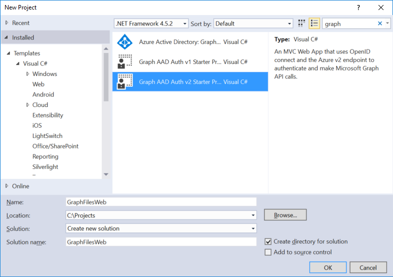
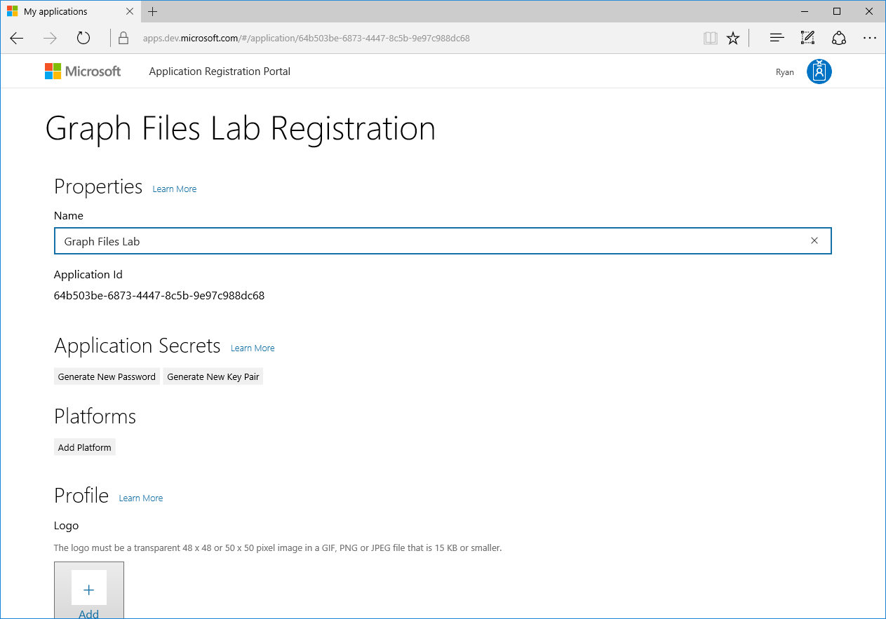
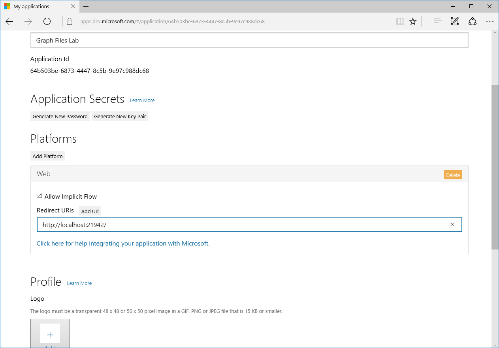

# Connect to files in OneDrive with the Microsoft Graph


In this lab, learn how to access, upload, and download files from OneDrive and OneDrive for Business using the Microsoft Graph, AAD v2 end point, and ASP.NET MVC 5.

## Overview
Through Microsoft Graph API, you can access files in OneDrive, OneDrive for
Business, and Office Groups, by accessing the **drive** property of a user or
group entity. You can navigate the hierarchy of a drive by path or by enumerating
the contents of folders

## Get an Office 365 developer environment
To complete the exercises below, you will require an Office 365 developer environment. Use the Office 365 tenant that you have been provided with for Microsoft Ignite.

## Exercise 1: Create a new project using Azure Active Directory v2 authentication

In this first step, you will create a new ASP.NET MVC project using the
**Graph AAD Auth v2 Starter Project** template, register a new application
in the developer portal, and log on to your app and generate access tokens
for calling the Graph API.

1. Launch Visual Studio 2015 and select **New** > **Project**.
   1. Search the installed templates for **Graph** and select the
      **Graph AAD Auth v2 Starter Project** template.
   2. Name the new project **GraphFilesWeb** and click **OK**.
   3. Open the **Web.config** file and find the **appSettings** element. This is
      where you will need to add your appId and app secret you will generate in the next step.

    

2. Launch the Application Registration Portal by opening your browser and navigating to **apps.dev.microsoft.com**
   to register a new application.
      1. Sign in to the portal using your Office 365 user name and password.
      2. Click **Add an App** and type **Graph Files Quick Start** for the application name.
      3. Copy the **Application Id** and paste it into the value for **ida:AppId** in your project's **web.config** file.
      3. Under **Application Secrets**, click **Generate New Password** to create a new client secret for your app.
      4. Copy the displayed app password and paste it into the value for **ida:AppSecret** in your project's **web.config** file.
      5. Modify the **ida:AppScopes** value to include the required `https://graph.microsoft.com/files.readwrite` scope.

    

    ```xml
    <configuration>
      <appSettings>
        <!-- ... -->
        <add key="ida:AppId" value="paste application id here" />
        <add key="ida:AppSecret" value="paste application password here" />
        <!-- ... -->
        <!-- Specify scopes in this value. Multiple values should be comma separated. -->
        <add key="ida:AppScopes" value="https://graph.microsoft.com/user.read,https://graph.microsoft.com/files.readwrite" />
      </appSettings>
      <!-- ... -->
    </configuration>
    ```
3. Add a redirect URL to enable testing on your localhost.
   1. Right-click **GraphFilesWeb** and click **Properties** to open the project properties.
   2. Click **Web** in the left navigation.
   3. Copy the **Project Url** value.
   4. Back on the Application Registration Portal page, click **Add Platform** and then **Web**.
   5. Paste the value of **Project Url** into the **Redirect URIs** field.
   6. Scroll to the bottom of the page and click **Save**.

    

4. Press F5 to compile and launch your new application in the default browser.
   1. When the Graph and AAD v2 Auth Endpoint Starter page appears, click **Sign in** and log on to your Office 365 account.
   2. Review the permissions the application is requesting, and click **Accept**.
   3. Now that you are signed in to your application, exercise 1 is complete!
   4. Make sure to stop debugging before continuing to exercise 2.

## Exercise 2: Access OneDrive for Business files through Microsoft Graph

In this exercise, you will build on exercise 1 to connect to the Microsoft Graph
and perform CRUD operations associated with the files in OneDrive for Business
or OneDrive.

### Create the Files controller and use the Microsoft Graph

1. Add a reference to the Microsoft Graph SDK to your project.
  1. In the **Solution Explorer**, right-click the **GraphFilesWeb** project and select **Manage NuGet Packages...**.
  2. Click **Browse** and search for **Microsoft.Graph**.
  3. Select **Microsoft Graph Client Library** and click **Install**.
  4. Review the terms and click **I Accept** when prompted with the license agreement.

2. Create a new controller to process the requests for files and send them to Graph API.
  1. Find the **Controllers** folder under **GraphFilesWeb**, right-click it and select **Add** > **New Scaffolded Item...**.
  2. In the **Add Scaffold** dialog, select **MVC 5 Controller - Empty**, and choose **Add**.
  3. Change the name of the controller to **FilesController** and click **Add**.

3. **Add** the following reference to the top of the `FilesController` class.

    ```csharp
    using System.Configuration;
    using System.Threading.Tasks;
    using Microsoft.Graph;
    using GraphFilesWeb.Auth;
    using GraphFilesWeb.TokenStorage;
    ```

4. Add the following code to the `FilesController` class to initialize a new
   **GraphServiceClient** and generate an access token for the Graph API:

    ```csharp
    private GraphServiceClient GetGraphServiceClient()
    {
        string userObjId = AuthHelper.GetUserId(System.Security.Claims.ClaimsPrincipal.Current);
        SessionTokenCache tokenCache = new SessionTokenCache(userObjId, HttpContext);

        string authority = string.Format(ConfigurationManager.AppSettings["ida:AADInstance"], "common", "");

        AuthHelper authHelper = new AuthHelper(
            authority,
            ConfigurationManager.AppSettings["ida:AppId"],
            ConfigurationManager.AppSettings["ida:AppSecret"],
            tokenCache);

        // Request an accessToken and provide the original redirect URL from sign-in
        GraphServiceClient client = new GraphServiceClient(new DelegateAuthenticationProvider(async (request) =>
        {
            string accessToken = await authHelper.GetUserAccessToken(Url.Action("Index", "Home", null, Request.Url.Scheme));
            request.Headers.TryAddWithoutValidation("Authorization", "Bearer " + accessToken);
        }));

        return client;
    }
    ```

5. **Replace** the existing `Index()` method in the `FilesController` class with this
   version which returns a view of items in the root of the user's OneDrive.

    ```csharp
    [Authorize]
    public async Task<ActionResult> Index(int? pageSize, string nextLink)
    {
        var client = GetGraphServiceClient();

        pageSize = pageSize ?? 25;

        var request = client.Me.Drive.Root.Children.Request().Top(pageSize.Value);
        if (nextLink != null)
        {
            request = new DriveItemChildrenCollectionRequest(nextLink, client, null);
        }

        try 
        {
           var results = await request.GetAsync();
           
           if (null != results.NextPageRequest)
           {
               ViewBag.NextLink = results.NextPageRequest.GetHttpRequestMessage().RequestUri;
           }
           else
           {
              ViewBag.NextLink = null;
           }

           return View(results);
        }
        catch (ServiceException ex)
         {
             if (ex.Error.Code == "InvalidAuthenticationToken") { return new EmptyResult(); }
             return RedirectToAction("Index", "Error", new { message = ex.Error.Message });
         }
    }
    ```

6. Add the following code to the `FilesController` to delete a file from the user's OneDrive.

    ```csharp
    [Authorize]
    public async Task<ActionResult> Delete(string itemId, string etag)
    {
        var client = GetGraphServiceClient();

        // Build a request and set the If-Match header with the etag
        var request = client.Me.Drive.Items[itemId].Request(new List<Option> { new HeaderOption("If-Match", etag) });

        // Submit the delete request
        await request.DeleteAsync();

        return Redirect("/Files");
    }
    ```

7. Add the following code to the `FilesController` to upload a new file to the user's OneDrive.

    ```csharp
    [Authorize]
    public async Task<ActionResult> Upload()
    {
        var client = GetGraphServiceClient();

        foreach (string key in Request.Files)
        {
            var fileInRequest = Request.Files[key];
            if (fileInRequest != null && fileInRequest.ContentLength > 0)
            {
                var filename = System.IO.Path.GetFileName(fileInRequest.FileName);
                var request = client.Me.Drive.Root.Children[filename].Content.Request();
                var uploadedFile = await request.PutAsync<DriveItem>(fileInRequest.InputStream);
            }
        }

        return Redirect("/Files");
    }
    ```

### Create the files view

In this section you'll wire up the Controller you created in the previous section
to an MVC view that will display the contents of the OneDrive folder selected.

1. Locate the **Views/Shared** folder in the project.
2. Open the **_Layout.cshtml** file found in the **Views/Shared** folder.
    1. Locate the part of the file that includes a few links at the top of the
       page. It should look similar to the following code:

    ```asp
      <ul class="nav navbar-nav">
          <li>@Html.ActionLink("Home", "Index", "Home")</li>
          <li>@Html.ActionLink("About", "About", "Home")</li>
          <li>@Html.ActionLink("Contact", "Contact", "Home")</li>
          <li>@Html.ActionLink("Graph API", "Graph", "Home")</li>
      </ul>
    ```

    2. Update that navigation to replace the "Graph API" link with "OneDrive Files"
       and connect this to the controller you just created.

    ```asp
      <ul class="nav navbar-nav">
          <li>@Html.ActionLink("Home", "Index", "Home")</li>
          <li>@Html.ActionLink("About", "About", "Home")</li>
          <li>@Html.ActionLink("Contact", "Contact", "Home")</li>
          <li>@Html.ActionLink("OneDrive Files", "Index", "Files")</li>
      </ul>
    ```

3. Create a new **View** for OneDrive Files:
   1. Find the **Views\Files** folder in the project.
   2. Right-click the **Files** folder and select **Add** > **New Item**.
   3. Select **MVC 5 View Page (Razor)**, change the file name to **Index.cshtml**, and click **Add**.

4. **Replace** all of the code in the **Files/Index.cshtml** with the following:

    ```asp
      @model IEnumerable<Microsoft.Graph.DriveItem>

      @{ ViewBag.Title = "My Files"; }

      <h2>My Files</h2>

      <div class="row" style="margin-top:50px;">
          <div class="col-sm-12">
              <div class="table-responsive">
                  <table id="filesTable" class="table table-striped table-bordered">
                      <thead>
                          <tr>
                              <th></th>
                              <th>ID</th>
                              <th>Name</th>
                              <th>Created</th>
                              <th>Modified</th>
                          </tr>
                      </thead>
                      <tbody>
                          @foreach (var file in Model)
                          {
                              <tr>
                                  <td>
                                      @{
      //Place delete control here
                                      }
                                  </td>
                                  <td>
                                      @file.Id
                                  </td>
                                  <td>
                                      <a href="@file.WebUrl">@file.Name</a>
                                  </td>
                                  <td>
                                      @file.CreatedDateTime
                                  </td>
                                  <td>
                                      @file.LastModifiedDateTime
                                  </td>
                              </tr>
                                          }
                      </tbody>
                  </table>
              </div>
              <div class="btn btn-group-sm">
                  @{
                      //Place Paging controls here
                  }
              </div>

              // Place upload controls here
          </div>
      </div>
    ```

5. In **Visual Studio**, hit **F5** to begin debugging.
6. When prompted, log in with your Office 365 Account.
7. Click the link **OneDrive Files** on the top of the home page.
8. Verify that your application displays files from the user's OneDrive.
9. Stop debugging. You've connected your app to OneDrive files through Graph API!

### Paging through the results
1. **Add** the following code under the comment `Place Paging controls here` in **Index.cshtml**.

    ```csharp
    Dictionary<string, object> attributes2 = new Dictionary<string, object>();
    attributes2.Add("class", "btn btn-default");

    if (null != ViewBag.NextLink)
    {
      RouteValueDictionary routeValues3 = new RouteValueDictionary();
      routeValues3.Add("nextLink", ViewBag.NextLink);
      @Html.ActionLink("Next Page", "Index", "Files", routeValues3, attributes2);
    }
    ```
2. Press **F5** to start debugging.
3. Click the **Next** button to page through results. Use the browser's back button to return to previous pages.

### Uploading a file

1. Add the following code to the bottom of the **Index.cshtml** file to create
   an upload control.

    ```asp
     <div class="row" style="margin-top:50px;">
         <div class="col-sm-12">
             @using (Html.BeginForm("Upload", "Files", FormMethod.Post, new { enctype = "multipart/form-data" }))
             {
                 <input type="file" id="file" name="file" class="btn btn-default" />
                 <input type="submit" id="submit" name="submit" value="Upload" class="btn btn-default" />
             }
         </div>
     </div>
    ```

2. Press **F5** to begin debugging.
3. Test uploading a new file and ensure it appears in the folder list.

### Delete an item

1. In the **Index.cshtml** file under **Views/Files** folder, **add** the
   following code under the comment `Place delete control here`.

  ```csharp
      Dictionary<string, object> attributes1 = new Dictionary<string, object>();
      attributes1.Add("class", "btn btn-warning");

      RouteValueDictionary routeValues1 = new RouteValueDictionary();
      routeValues1.Add("itemId", file.Id);
      routeValues1.Add("etag", file.ETag);
      @Html.ActionLink("X", "Delete", "Files", routeValues1, attributes1);
  ```

2. Press **F5** to begin debugging.
3. Test the delete functionality in the application by deleting a file.

**Congratulations!** In this exercise you have created an MVC application that uses
Microsoft Graph to view and manage files in OneDrive!
