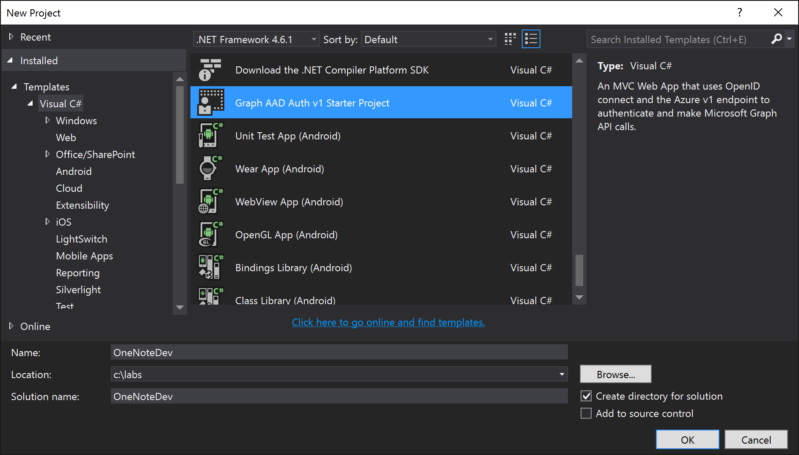

# Microsoft Graph for OneNote Services
In this lab, you will use Microsoft Graph to program against the Office 365 OneNote Service as part of an ASP.NET MVC5 application.

## Get an Office 365 developer environment
To complete the exercises below, you will require an Office 365 developer environment. Navigate to https://tryoffice.azurewebsites.net and use the code `BuildChallenge` to get an administrator username and password to one. 

## Exercise 1: Use the Microsoft Graph API to access Notebooks in OneDrive for Business (Office 365)
In this exercise you will use the Microsoft Graph API to access OneNote notebooks that are stored in the user's OneDrive for Business in Office 365.

Your user must have at least one OneNote notebook with a section and a page.

### Create an ASP.NET MVC application
1. Open Visual Studio and select **File / New / Project**. 

1. In the **New Project** dialog, select **Templates / Visual C# / Graph AAD Auth v1 Starter Project**. If you don't see the template, try searching for *Graph*. The starter project template scaffolds some auth infrastructure for you.
   
1. Name the new project **OneNoteDev**, and then click **OK**.  
    
   > **Note**: Make sure you use the exact same name that is specified in these instructions for your Visual Studio project. Otherwise, your namespace name will differ from the one in these instructions and your code will not compile.
 
    

1. Build the solution (**Build / Build Solution**) to restore the NuGet packages required by the project. This should remove all of the solution's initial red squigglies.
    
1. At this point you can test the authentication flow for your application. In Visual Studio, press **F5**. The browser will automatically open to the start page for the web application.

   > **Note:** If you receive an error that indicates ASP.NET could not connect to the SQL database, please see the [SQL Server Database Connection Error Resolution document](../../SQL-DB-Connection-Error-Resolution.md) to quickly resolve the issue. 

1. Click the **Click here to sign in** button, and sign in with your Office 365 administrator account. If prompted, consent to the requested permissions.

   You will be redirected back to your web application. Notice that your email address displays at the top of the page next to the **Sign out** link.
  
1. In Visual Studio, press **Shift+F5** to stop debugging.

Congratulations... at this point your app is configured with Azure AD and leverages OpenID Connect and OWIN to facilitate the authentication process!

### Create the Notebook Repository
In this step you will create a repository class that will handle all communication with the Microsoft Graph API to interact with notebooks in your OneDrive for Business store.

1. To simplify working with the REST services, we will use the popular [JSON.NET](http://www.newtonsoft.com/json) JSON framework for .NET.
	1. In Solution Explorer, right-click the project's **Models** folder and choose **Add / New Folder**. Name the folder **JsonHelpers**.
	
	1. Copy all the C# files provided with this lab, located in the [\\\O3653\O3653-7 Deep Dive into the Office 365 APIs for OneNote services\Labs\Labfiles](Labs/Labfiles/JsonHelpers) folder, into the **JsonHelpers** folder that you just added to your project.

    1. Right-click the **JsonHelpers** folder and choose **Add / Existing Item**. Select all the files you just copied to the folder and click **Add**.

		> **Note:** These files were created using the handy utility in Visual Studio: [Paste JSON as Classes](http://blogs.msdn.com/b/webdev/archive/2012/12/18/paste-json-as-classes-in-asp-net-and-web-tools-2012-2-rc.aspx).

1. Create model objects for the OneNote notebook, section, and page:
	1. Add a new class named **Notebook** to the **Models** folder in the project.
	
	1. Replace the **Notebook** class with the following code:

	   ```c#
	public class Notebook
	{
		public Notebook()
		{
			Sections = new List<Section>();
		}

		public string Id { get; set; }
		public string Name { get; set; }
		public string NotebookUrl { get; set; }
		public string ClientUrl { get; set; }
		public string WebUrl { get; set; }
		public bool IsDefault { get; set; }
		public DateTime CreatedDateTime { get; set; }
		public DateTime LastModifiedDateTime { get; set; }
		public string SectionsUrl { get; set; }
		public string SectionGroupsUrl { get; set; }
		public List<Section> Sections { get; set; }
	}
	   ```

	1. Add a new class named **Section** to the **Models** folder in the project.
	
	1. Replace the **Section** class with the following code:

	   ```c#
	public class Section
	{
		public Section()
		{
			Pages = new List<NotePage>();
		}

		public string Id { get; set; }
		public string Name { get; set; }
		public DateTime CreatedDateTime { get; set; }
		public DateTime LastModifiedDateTime { get; set; }
		public string PagesUrl { get; set; }
		public List<NotePage> Pages { get; set; }
	}
	   ```

	1. Add a new class named **NotePage** to the **Models** folder in the project.
	
	1. Replace the **NotePage** class with the following code:

	   ```c#
	public class NotePage
	{
		public string Id { get; set; }
		public string Name { get; set; }
		public DateTime CreatedDateTime { get; set; }
		public DateTime LastModifiedDateTime { get; set; }
		public string ContentUrl { get; set; }
		public string Content { get; set; }
		public string PageUrl { get; set; }
		public string WebUrl { get; set; }
		public string ClientUrl { get; set; }
	}
	   ```

1. Create the repository class for communicating with the OneNote service using the Microsoft Graph API.
	1. Add a new class to the **Models** folder named **NotebookRepository**.
	
	1. Ensure the following `using` statements are present at the top of the **NotebookRepository** class:

		````c#
    using System.Collections.Generic;
    using System.Linq;
    using System.Threading.Tasks;
    using System.Net.Http;
    using Newtonsoft.Json;
		````

	1. Add the following private fields and class constructor to the **NotebookRepository** class:

		````c#
        private HttpClient _client;

        private string _msGraphResourceId = string.Empty;
        private string _msGraphEndpoint = string.Empty;

        public NotebookRepository(string accessToken)
        {
            _client = new HttpClient();
            _client.DefaultRequestHeaders.Add("Accept", "application/json");

            // set the access token on all requests to the Microsoft Graph API
            _client.DefaultRequestHeaders.Add("Authorization", "Bearer " + accessToken);

            _msGraphEndpoint = "https://graph.microsoft.com/beta";
            _msGraphResourceId = "https://graph.microsoft.com/";
        }
		````

	1. Add the **GetNotebooks** method to the **NotebookRepository** class. This gets a list of all OneNote notebooks from the currently logged in user's OneDrive for Business store.

		````c#
        public async Task<IEnumerable<Notebook>> GetNotebooks()
        {

            // create query
            var query = _msGraphEndpoint + "/me/notes/notebooks";

            // create request
            var request = new HttpRequestMessage(HttpMethod.Get, query);

            // issue request & get response
            var response = await _client.SendAsync(request);
            string responseString = await response.Content.ReadAsStringAsync();
            var jsonResponse = JsonConvert.DeserializeObject<JsonHelpers.NotebooksJson>(responseString);

            // convert to model object
            var notebooks = new List<Notebook>();

            // check for null if the user's OneDrive for Business is not provisioned
            if (jsonResponse.Notebooks != null)
            {
                foreach (var notebook in jsonResponse.Notebooks)
                {
                    var item = new Notebook
                    {
                        Id = notebook.Id,
                        Name = notebook.Name,
                        NotebookUrl = notebook.NotebookUrl,
                        IsDefault = notebook.IsDefault,
                        CreatedDateTime = notebook.CreatedTime,
                        LastModifiedDateTime = notebook.LastModifiedTime,
                        SectionsUrl = notebook.SectionsUrl,
                        SectionGroupsUrl = notebook.SectionGroupsUrl,
                        ClientUrl = notebook.Links.OneNoteClientUrl.href,
                        WebUrl = notebook.Links.OneNoteWebUrl.href
                    };

                    notebooks.Add(item);
                }
            }

            return notebooks.OrderBy(n => n.Name).ToList();
        }
		````

	1. Add the **GetNotebook** method to the **NotebookRepository** class. This gets a single notebook based on the specified ID.

		````c#
        public async Task<Notebook> GetNotebook(string notebookid)
        {

            // create query
            var query = string.Format("{0}/me/notes/notebooks/?$top=1&$filter=id eq '{1}'", _msGraphEndpoint, notebookid);

            // create request
            var request = new HttpRequestMessage(HttpMethod.Get, query);

            // issue request & get response
            var response = await _client.SendAsync(request);
            string responseString = await response.Content.ReadAsStringAsync();
            var jsonResponse = JsonConvert.DeserializeObject<JsonHelpers.NotebooksJson>(responseString).Notebooks[0];

            // convert to model object
            var notebook = new Notebook
            {
                Id = jsonResponse.Id,
                Name = jsonResponse.Name,
                NotebookUrl = jsonResponse.NotebookUrl,
                IsDefault = jsonResponse.IsDefault,
                CreatedDateTime = jsonResponse.CreatedTime,
                LastModifiedDateTime = jsonResponse.LastModifiedTime,
                SectionsUrl = jsonResponse.SectionsUrl,
                SectionGroupsUrl = jsonResponse.SectionGroupsUrl,
                ClientUrl = jsonResponse.Links.OneNoteClientUrl.href,
                WebUrl = jsonResponse.Links.OneNoteWebUrl.href
            };

            return notebook;
        }
		````

	1. Add the **GetNotebookSections** methods to the **NotebookRepository** class. This gets all the sections in the specified notebook.

		````c#
        public async Task<Notebook> GetNotebookSections(string notebookid)
        {
            var notebook = await GetNotebook(notebookid);
            return await GetNotebookSections(notebook);
        }

        public async Task<Notebook> GetNotebookSections(Notebook notebook)
        {

            // create query
            var query = notebook.SectionsUrl;

            // create request
            var request = new HttpRequestMessage(HttpMethod.Get, query);

            // issue request & get response
            var response = await _client.SendAsync(request);
            string responseString = await response.Content.ReadAsStringAsync();
            var jsonResponse = JsonConvert.DeserializeObject<JsonHelpers.SectionsJson>(responseString);

            // convert to model object
            foreach (var item in jsonResponse.Sections)
            {
                var section = new Section
                {
                    Id = item.Id,
                    Name = item.Name,
                    CreatedDateTime = item.CreatedTime,
                    LastModifiedDateTime = item.LastModifiedTime,
                    PagesUrl = item.PagesUrl
                };
                notebook.Sections.Add(section);
            }

            return notebook;
        }
		````
        
    1. Add the **GetNotebookPages** methods to the **NotebookRepository** class. This loads all the pages within the specified section.

		````c#
        public async Task<Notebook> GetNotebookPages(string notebookid, string sectionid)
        {
            var notebook = await GetNotebook(notebookid);
            notebook = await GetNotebookSections(notebook);
            return await GetNotebookPages(notebook, sectionid);
        }

        public async Task<Notebook> GetNotebookPages(Notebook notebook, string sectionid)
        {

            // create query for the specified section...
            var section = notebook.Sections.First(s => s.Id == sectionid);

            // create request to get all the pages in the section
            var request = new HttpRequestMessage(HttpMethod.Get, section.PagesUrl);

            // issue request & get response
            var response = await _client.SendAsync(request);

            // convert to JSON object
            string responseString = await response.Content.ReadAsStringAsync();
            var jsonPages = JsonConvert.DeserializeObject<JsonHelpers.PagesJson>(responseString);

            // loop through all pages
            foreach (var jsonPage in jsonPages.Pages)
            {
                // convert pages to model objects
                var page = new NotePage
                {
                    Id = jsonPage.Id,
                    Name = jsonPage.Title,
                    CreatedDateTime = jsonPage.CreatedTime,
                    LastModifiedDateTime = jsonPage.LastModifiedTime,
                    PageUrl = jsonPage.PageUrl,
                    ClientUrl = jsonPage.Links.OneNoteClientUrl.href,
                    WebUrl = jsonPage.Links.OneNoteWebUrl.href,
                    ContentUrl = jsonPage.ContentUrl
                };

                // get the body of the page
                request = new HttpRequestMessage(HttpMethod.Get, page.ContentUrl);
                response = await _client.SendAsync(request);
                page.Content = await response.Content.ReadAsStringAsync();

                // add page to section
                section.Pages.Add(page);
            }

            return notebook;
        }
		````

	1. And finally, add the **DeletePage** method to the **NotebookRepository** class. This deletes a specified page.

		````c#
        public async Task DeletePage(string id)
        {

            // create query
            var query = string.Format("{0}/me/notes/pages/{1}", _msGraphEndpoint, id);

            // create request
            var request = new HttpRequestMessage(HttpMethod.Delete, query);

            // issue request & get response
            await _client.SendAsync(request);
        }
		````

### Add Navigation
In this step you will create a link on the home page to navigate to notebooks list page.

1. Open the **_Layout.cshtml** file found in the **Views / Shared** folder.
    1. Locate the navigation links and add a **Notebooks** link, as shown below:

    ````asp
    <ul class="nav navbar-nav">
        <li>@Html.ActionLink("Home", "Index", "Home")</li>
        <li>@Html.ActionLink("About", "About", "Home")</li>
        <li>@Html.ActionLink("Contact", "Contact", "Home")</li>
        <li>@Html.ActionLink("Graph API", "Graph", "Home")</li>
        <li>@Html.ActionLink("Notebooks", "Index", "Notebook")</li>
    </ul>
    ````
    
### Add Notebook Controller and View
In this step you will create the ASP.NET MVC controller and view for OneNote notebooks.

1. Right-click the **Controllers** folder in the project and select **Add / Controller**.
	1. In the **Add Scaffold** dialog, select **MVC 5 Controller - Empty**.
	
	1. Click **Add**.
	
	1. When prompted for a name, enter **NotebookController**.
	
	1. Click **Add**.
	
1. In the **NotebookController** class, add the following **using** statements:

	````c#
using System.Configuration;
using System.Threading.Tasks;
using OneNoteDev.Auth;
using OneNoteDev.Models;
using OneNoteDev.TokenStorage;
	````

1. Replace the **Index** action with the following code to support viewing all notebooks:

    ````c#
    [Authorize]
    public async Task<ActionResult> Index()
    {
        // Get an access token for the request.
        string userObjId = System.Security.Claims.ClaimsPrincipal.Current.FindFirst("http://schemas.microsoft.com/identity/claims/objectidentifier").Value;
        SessionTokenCache tokenCache = new SessionTokenCache(userObjId, HttpContext);
        string tenantId = System.Security.Claims.ClaimsPrincipal.Current.FindFirst("http://schemas.microsoft.com/identity/claims/tenantid").Value;
        string authority = string.Format(ConfigurationManager.AppSettings["ida:AADInstance"], tenantId, "");

        AuthHelper authHelper = new AuthHelper(authority, ConfigurationManager.AppSettings["ida:AppId"], ConfigurationManager.AppSettings["ida:AppSecret"], tokenCache);
        string accessToken = await authHelper.GetUserAccessToken("/Notebook/Index");

        // Make the request.
        var repository = new NotebookRepository(accessToken);
        var myNotebooks = await repository.GetNotebooks();

        return View(myNotebooks);
    }
    ````

1. Now add a view to render a list of the notebooks.
	1. Right-click in the **Index** method and select **Add View**.
	
    1. Within the **Add View** dialog, set the following values:
	
        - View Name: **Index**.
        - Template: **List**.
        - Model class: **Notebook (OneNoteDev.Models)**.
        - Create as partial view: **checked**
        - Reference script libraries: **unchecked**
		
    1. Click **Add**.
	
1. Replace all of the code in the file with the following:

	````html
	@model IEnumerable<OneNoteDev.Models.Notebook>

	<h1>
	  OneNote Notebooks
	</h1>

	<table class="table">
	  <tr>
	    <th>
	      @Html.DisplayNameFor(model => model.Name)
	    </th>
	    <th>
	      @Html.DisplayNameFor(model => model.CreatedDateTime)
	    </th>
	    <th>
	      @Html.DisplayNameFor(model => model.LastModifiedDateTime)
	    </th>
	    <th></th>
	  </tr>

	  @foreach (var item in Model) {
	    <tr>
	      <td>
	        @Html.DisplayFor(modelItem => item.Name)
	      </td>
	      <td>
	        @Html.DisplayFor(modelItem => item.CreatedDateTime)
	      </td>
	      <td>
	        @Html.DisplayFor(modelItem => item.LastModifiedDateTime)
	      </td>
	      <td>
	        @Html.RouteLink("View Sections", "Section", new { notebookid = item.Id, action = "Index" })
	      </td>
	    </tr>
	  }
	</table>
	````

### Add Section Controller and View
In this step you will create the ASP.NET MVC controller and view for OneNote notebook sections.

1. Right-click the **Controllers** folder in the project and select **Add / Controller**.
	1. In the **Add Scaffold** dialog, select **MVC 5 Controller - Empty**.
	
	1. Click **Add**.
	
	1. When prompted for a name, enter **SectionController**.
	
	1. Click **Add**.
	
1. In the **SectionController** class, add the following **using** statements:

	````c#
using System.Configuration;
using System.Threading.Tasks;
using OneNoteDev.Auth;
using OneNoteDev.Models;
using OneNoteDev.TokenStorage;
	````

1. Replace the **Index** action with the following code to support viewing all notebook sections:

    ````c#
    [Authorize]
    public async Task<ActionResult> Index(string notebookid)
    {
        // Get an access token for the request.
        string userObjId = System.Security.Claims.ClaimsPrincipal.Current.FindFirst("http://schemas.microsoft.com/identity/claims/objectidentifier").Value;
        SessionTokenCache tokenCache = new SessionTokenCache(userObjId, HttpContext);
        string tenantId = System.Security.Claims.ClaimsPrincipal.Current.FindFirst("http://schemas.microsoft.com/identity/claims/tenantid").Value;
        string authority = string.Format(ConfigurationManager.AppSettings["ida:AADInstance"], tenantId, "");

        AuthHelper authHelper = new AuthHelper(authority, ConfigurationManager.AppSettings["ida:AppId"], ConfigurationManager.AppSettings["ida:AppSecret"], tokenCache);
        string accessToken = await authHelper.GetUserAccessToken("/Section/Index");
            
        // Make the request.
        var repository = new NotebookRepository(accessToken);
        var notebook = await repository.GetNotebookSections(notebookid);

        ViewBag.CurrentNotebookTitle = notebook.Name; ViewBag.CurrentNotebookId = notebook.Id;

        return View(notebook.Sections.OrderBy(s => s.Name).ToList());
    }
    ````

1. Now add a view to render a list of the notebook sections.
	1. Right-click in the **Index** method and select **Add View**.
	
    1. Within the **Add View** dialog, set the following values:
        - View Name: **Index**.
        - Template: **List**.
        - Model class: **Section (OneNoteDev.Models)**.
        - Create as partial view: **checked**
        - Reference script libraries: **unchecked**
		
    1. Click **Add**.
	
1. Replace all of the code in the file with the following:

	````html
	@model IEnumerable<OneNoteDev.Models.Section>

	<h1>
	  Sections within Notebook: @ViewBag.CurrentNotebookTitle
	</h1>

	<table class="table">
	  <tr>
	    <th>
	      @Html.DisplayNameFor(model => model.Name)
	    </th>
	    <th>
	      @Html.DisplayNameFor(model => model.CreatedDateTime)
	    </th>
	    <th>
	      @Html.DisplayNameFor(model => model.LastModifiedDateTime)
	    </th>
	    <th></th>
	  </tr>

	  @foreach (var item in Model) {
	    <tr>
	      <td>
	        @Html.DisplayFor(modelItem => item.Name)
	      </td>
	      <td>
	        @Html.DisplayFor(modelItem => item.CreatedDateTime)
	      </td>
	      <td>
	        @Html.DisplayFor(modelItem => item.LastModifiedDateTime)
	      </td>
	      <td>
	        @Html.RouteLink("View Pages", "Page", new { notebookid = ViewBag.CurrentNotebookId, sectionid = item.Id, action = "Index" })
	      </td>
	    </tr>
	  }
	</table>
	````

1. For this controller you will need to create a special route.
	1. Open the file **App_Start / RouteConfig.cs**.
	
	1. Add the following code above the existing *default* route:

		````c#
		routes.MapRoute(
		  "Section",
		  "Notebooks/{notebookid}/Section/{action}",
		  new { controller = "Section", action = "Index" }
		);
		````

### Add Pages Controller and View
In this step you will create the ASP.NET MVC controller and view for pages within OneNote notebook sections.

1. Right-click the **Controllers** folder in the project and select **Add / Controller**.
	1. In the **Add Scaffold** dialog, select **MVC 5 Controller - Empty**.
	
	1. Click **Add**.
	
	1. When prompted for a name, enter **PageController**.
	
	1. Click **Add**.
	
1. In the **PageController** class, add the following **using** statements:

	````c#
using System.Configuration;
using System.Threading.Tasks;
using OneNoteDev.Auth;
using OneNoteDev.Models;
using OneNoteDev.TokenStorage;
	````

1. Replace the **Index** action with the following code to support viewing all pages within a notebook section:

	````c#
    [Authorize]
    public async Task<ActionResult> Index(string notebookid, string sectionid)
    {   
            
        // Get an access token for the request.
        string userObjId = System.Security.Claims.ClaimsPrincipal.Current.FindFirst("http://schemas.microsoft.com/identity/claims/objectidentifier").Value;
        SessionTokenCache tokenCache = new SessionTokenCache(userObjId, HttpContext);
        string tenantId = System.Security.Claims.ClaimsPrincipal.Current.FindFirst("http://schemas.microsoft.com/identity/claims/tenantid").Value;
        string authority = string.Format(ConfigurationManager.AppSettings["ida:AADInstance"], tenantId, "");

        AuthHelper authHelper = new AuthHelper(authority, ConfigurationManager.AppSettings["ida:AppId"], ConfigurationManager.AppSettings["ida:AppSecret"], tokenCache);
        string accessToken = await authHelper.GetUserAccessToken("/Page/Index");

        // Make the request.
        var repository = new NotebookRepository(accessToken);
        var notebook = await repository.GetNotebookPages(notebookid, sectionid);

        ViewBag.CurrentNotebookTitle = notebook.Name;
        ViewBag.CurrentNotebookId = notebook.Id;

        var section = notebook.Sections.First(s => s.Id == sectionid);
 
        ViewBag.CurrentSectionTitle = section.Name;

        return View(section.Pages);
    }
	````

1. Add the **Delete** action to support deleting a page:

	````c#
    [Authorize]
    public async Task<ActionResult> Delete(string id)
    {

        // Get an access token for the request.
        string userObjId = System.Security.Claims.ClaimsPrincipal.Current.FindFirst("http://schemas.microsoft.com/identity/claims/objectidentifier").Value;
        SessionTokenCache tokenCache = new SessionTokenCache(userObjId, HttpContext);
        string tenantId = System.Security.Claims.ClaimsPrincipal.Current.FindFirst("http://schemas.microsoft.com/identity/claims/tenantid").Value;
        string authority = string.Format(ConfigurationManager.AppSettings["ida:AADInstance"], tenantId, "");

        AuthHelper authHelper = new AuthHelper(authority, ConfigurationManager.AppSettings["ida:AppId"], ConfigurationManager.AppSettings["ida:AppSecret"], tokenCache);
        string accessToken = await authHelper.GetUserAccessToken("/Page/Delete");

        // Make the request.
        var repository = new NotebookRepository(accessToken);
        if (id != null)
        {
            await repository.DeletePage(id);
        }
        return Redirect("/");
    }
	````

1. Now add a view to render a list of the notebook pages.
	1. Right-click in the **Index** method and select **Add View**.
	
    1. Within the **Add View** dialog, set the following values:
        - View Name: **Index**.
        - Template: **List**.
        - Model class: **NotePage (OneNoteDev.Models)**.
        - Create as partial view: **checked**
        - Reference script libraries: **unchecked**
		
    1. Click **Add**.
	
1. Replace all of the code in the file with the following:

	````html
	@model IEnumerable<OneNoteDev.Models.NotePage>

	<h1>
	  Pages within Notebook: @ViewBag.CurrentNotebookTitle, Section: @ViewBag.CurrentSectionTitle
	</h1>

	<table class="table">
	  <tr>
	    <th>
	      @Html.DisplayNameFor(model => model.Name)
	    </th>
	    <th>
	      @Html.DisplayNameFor(model => model.CreatedDateTime)
	    </th>
	    <th>
	      @Html.DisplayNameFor(model => model.LastModifiedDateTime)
	    </th>
	    <th></th>
	  </tr>

	  @foreach (var item in Model) {
	    <tr>
	      <td>
	        @Html.DisplayFor(modelItem => item.Name)
	      </td>
	      <td>
	        @Html.DisplayFor(modelItem => item.CreatedDateTime)
	      </td>
	      <td>
	        @Html.DisplayFor(modelItem => item.LastModifiedDateTime)
	      </td>
	      <td>
	        <a href="@item.WebUrl" target="_blank">View in OneNote Web Client</a> |
	        @Html.ActionLink("Delete", "Delete", new { id = item.Id })
	      </td>
	    </tr>
	  }
	</table>
	````

1. For this controller you will need to create a special route.
	1. Open the file **App_Start / RouteConfig.cs**.
	
	1. Add the following code above the route you previously added for the sections:

		````c#
		routes.MapRoute(
		  "Page",
		  "Notebooks/{notebookid}/Section/{sectionid}/{action}",
		  new { controller = "Page", action = "Index", id = UrlParameter.Optional }
		);
		````

### Test the Application
The last step is to test the application you just created! First, make sure you have at least one notebook with a section and a page.

1. Press **F5** in Visual Studio to launch the application.

 > **Note:** If you receive an error that indicates ASP.NET could not connect to the SQL database, please see the [SQL Server Database Connection Error Resolution document](../../SQL-DB-Connection-Error-Resolution.md) to quickly resolve the issue. 

1. When the browser loads, click the **Click here to sign in** button and sign in using your Office 365 administrator credentials if you're not already signed in.

	After logging in you will be taken back to your ASP.NET MVC application. 

1. Click the **Notebooks** link in the top navigation bar. You will see a list of notebooks that are currently in your OneDrive for Business store listed.

1. Click one of the notebook's **View Sections** links. You will see a list of the sections within the selected notebook.

1. Click one of the section's **View Pages** links. You will see a list of the pages within that section.

1. Click one of the page's **View in OneNote Web Client** links to see a new browser window load the notebook's page within the browser.

1. Go back to your application and click one of the page's **Delete** links. The page will be deleted and you will be taken back to the homepage of the application. If you navigate back to the list of pages within the section, you will see the page is no longer listed.

Congratulations! You have created an ASP.NET MVC application that uses the Microsoft Graph to interact with OneNote Notebooks found within a user's OneDrive for Business store.


