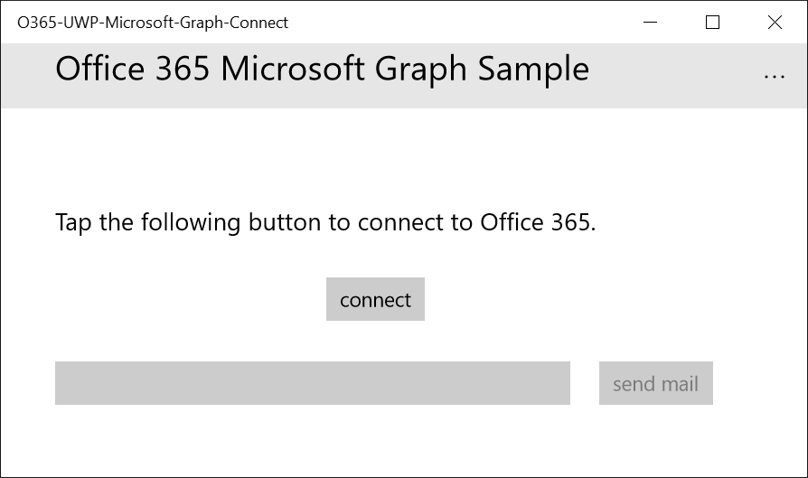

# Connect to the Microsoft Graph from a Windows Universal App


<a name="introduction"></a>
##Introduction

In this Code Challenge, you'll create a simple Windows Universal app (UWP) that accesses a user's Outlook email account through the Microsoft Graph.

You'll use the Microsoft Graph SDK to handle user authentication and manipulation of the data returned by the Microsoft Graph. In addition, you'll see how to use the v2.0 authentication endpoint, which enables you to code a single authentication flow that handles users signing in with either their personal or work or school Microsoft accounts.

###What the sample app does

The app you'll build requires the user to sign in with either their personal or work or school Microsoft account. The app then authenticates the user. The user can then have the app connect to their Outlook email account, and have the app send a sample email from their account to the specified recipient.



## Get a work or school or personal Microsoft account

To complete the exercises below, you will need one of the following accounts:
- An Office 365 developer environment. Navigate to **tryoffice.azurewebsites.net** in a browser to sign-in and use the code BuildChallenge to get an administrator username and password to one.
- A personal Microsoft email account, such as `user@live.com` or `user@outlook.com`. Visit [Outlook.com](http://outlook.com) to create a new personal account if necessary.

<a name="create"></a>
##Exercise 1: Create the app

First, you need to create the app project itself.

1. In Visual Studio 2015, from the **File** menu, choose **New** > **Project**.
2. In the **New Project** dialog box, in the left pane, choose **Templates** > **Visual C#** > **Windows** > **Universal** . Make sure the **Blank App (Universal Windows)** template is selected in the middle pane.  Name your project **Microsoft_Graph_UWP_Connect_SDK**, and choose the folder path where you want to save the solution. 
3. Choose **OK**.
 

<a name="graphSDK"></a>
##Exercise 2: Add the Microsoft Graph SDK to your app

Next, you'll use the NuGet Package Manager to add the Microsoft Graph SDK and Microsoft Graph OAuth 2.0 provider to your project.

1. In **Solution Explorer**, choose the project, and from the short-cut menu, choose **Manage NuGet Packages...**
2. In the **NuGet** dialog box, in the Search box, enter Microsoft.Graph.
	The Microsoft.Graph package should be displayed in the search results.
3. Choose the Microsoft.Graph package. 
4. In the package details pane, make sure your project is checked, and then choose **Install**.
	The Microsoft.Graph package is installed.
4. In **Solution Explorer**, expand the **Reference** node. You should see a reference to `Microsoft.Graph`.

	In addition, the package has been added as a dependency in the project's `project.json` file:
	
	```
	{
  	"dependencies": {
    	"Microsoft.Graph": "1.0.5-rc",
    	"Microsoft.NETCore.UniversalWindowsPlatform": "5.0.0"
  	},
  	
  	...
	}
	```

<a name="register"></a>
##Exercise 3: Register and configure the app

Next, you will register the app with the v2.0 authentication endpoint, so that it can authenticate users' Microsoft accounts. During registration, the v2.0 authentication service assigns your app an application ID and redirect URI. 

The app id is a unique identifier for your app. The redirect URI is a unique URI provided by Windows 10 for each application to ensure that messages sent to that URI are only sent to that application. 

You must then configure your app with these properties.

###Register the app with the v2.0 authentication endpoint

1. Sign into the [App Registration Portal](https://apps.dev.microsoft.com/) using either your personal or work or school account.
2. Select **Add an app**.
3. Enter a name for the app, and select **Create application**.
	
	The registration page displays, listing the properties of your app.
 
4. Under **Platforms**, choose **Add platform**.
5. Choose **Mobile platform**.
6. Copy both the Client Id (App Id) and Redirect URI values to the clipboard. You'll need to specify these values in your app configuration.
7. Choose **Save**.

<a name="configure"></a>
###Configure the app to use the v2.0 authentication endpoint

**Note:** If you see any errors while installing packages during step 2, make sure the local path where you placed the solution is not too long/deep. Moving the solution closer to the root of your drive resolves this issue.

After you've loaded the solution in Visual Studio, configure the sample to use the client id and redirectURI that you registered:

1. In the **Solution Explorer**, double-click the App.xaml file.
2. In the App.xaml file, in the Application element, add a new element named Application.Resources that contains your app's client id and redirectURI values.
	
	The Application element should now look like this, except with your specific client id specified for the ClientID value:
	```
	<Application
	x:Class="Microsoft_Graph_UWP_Connect_SDK.App"
	xmlns="http://schemas.microsoft.com/winfx/2006/xaml/presentation"
   	xmlns:x="http://schemas.microsoft.com/winfx/2006/xaml"
   	xmlns:local="using:Microsoft_Graph_UWP_Connect_SDK"
   	RequestedTheme="Light">
	
	<Application.Resources>
		<!-- Add your client id here. -->
		<x:String x:Key="ida:ClientID"></x:String>
		<x:String x:Key="ida:ReturnUrl">urn:ietf:wg:oauth:2.0:oob</x:String>
    	</Application.Resources>
	
	</Application>
```
<a name="addAuthFiles"></a>
## Exercise 4: Add files to handle authentication

Next, you'll include files in your project that will handle the authentication process.

###Add the Authentication folder and its files

1. In **Solution Explorer**, choose the project and, from the short-cut menu, choose **Add** > **New Folder**.
2. Name the folder Authentication.
3. Choose the Authentication folder and, from the short-cut menu, choose **Add** > **Existing item**.
4. Navigate to the folder in this Code Challenge named Authentication, and choose all the files contained in it:
	- AccountSession.cs
	- AppConfig.cs
	- IOAuthRequestStringBuilder.cs
	- OAuth2AuthenticationProvider.cs
	- OAuthErrorHandler.cs
	- OAuthRequestStringBuilder.cs
5. Choose **Add**.

###Add the Web folder and its files

1. In **Solution Explorer**, choose the project and, from the short-cut menu, choose **Add** > **New Folder**.
2. Name the folder Web.
3. Choose the Web folder and, from the short-cut menu, choose **Add** > **Existing item**.
4. Navigate to the folder in this Code Challenge named Web, and choose all the files contained in it:
	- IWebAuthenticationUi.cs
	- WebAuthenticationBrokerWebAuthenticationUi.cs
5. Choose **Add**.

###Add the Constants file
1. In **Solution Explorer**, choose the project and, from the short-cut menu, choose **Add** > **Existing Item**.
4. Navigate to the root directory of this Code Challenge, and choose the Constants.cs file. Click **Add**.

<a name="createFiles"></a>
## Exercise 5: Create helper classes for authentication and sending email

Next, you'll add two helper classes: one that handles authenticating the user, and another that composes and sends the sample email the app creates.

### Create the AuthenticationHelper class

1. In the **Solution Explorer**, choose the project, and from the short-cut menu, choose **Add** > **Class**. 
2. Name the new class **AuthenticationHelper.cs**, and choose **Add**.
3. Add using directives for the Microsoft.Graph and Microsoft.Graph.Authentication namespaces:
	
	```	
	using Microsoft.Graph.Authentication;
	using Microsoft.Graph;
	```
	
4. In the class definition, add code that authenticates the app and sets its permissions to read and write email. 

	The finished class should look like this:

	```

//Copyright (c) Microsoft. All rights reserved. Licensed under the MIT license.
//See LICENSE in the project root for license information.

using System;
using System.Diagnostics;
using System.Net.Http;
using System.Linq;
using System.Threading.Tasks;
using Windows.Security.Authentication.Web;
using Windows.Security.Authentication.Web.Core;
using Windows.Security.Credentials;
using Windows.Storage;
using Microsoft.Graph.Authentication;
using Microsoft.Graph;

namespace Microsoft_Graph_UWP_Connect_SDK
{
    internal static class AuthenticationHelper
    {
        // The Client ID is used by the application to uniquely identify itself to the v2.0 authentication endpoint.
        static string clientId = App.Current.Resources["ida:ClientID"].ToString();

        static string returnUrl = App.Current.Resources["ida:ReturnUrl"].ToString();

        private static GraphServiceClient graphClient = null;

        // Get a Graph client.
        public static async Task<GraphServiceClient> GetAuthenticatedClientAsync()
        {
            if (graphClient == null)
            {
                var authenticationProvider = new OAuth2AuthenticationProvider(
                    clientId,
                    returnUrl,
                    new string[]
                    {
                        "offline_access",
                        "https://graph.microsoft.com/User.Read",
                        "https://graph.microsoft.com/Mail.Send",
                    });

                await authenticationProvider.AuthenticateAsync();

                graphClient = new GraphServiceClient(authenticationProvider);
            }

            return graphClient;
        }

        /// <summary>
        /// Signs the user out of the service.
        /// </summary>
        public static void SignOut()
        {
            graphClient = null;

        }

    }
}


	```

### Create the MailHelper class

1. In the **Solution Explorer**, choose the project, and from the short-cut menu, choose **Add** > **Class**. 
2. Name the new class **MailHelper.cs**, and choose **Add**.
3. Add using directives for the additional namespaces you'll need to reference:

	```		
	using System.Net.Http;
	using Microsoft.Graph;
	using System.Net.Http.Headers;
	```
		
4. In the class definition, add code that composes the sample email and sends it. 

	The finished class should look like this:

```
using System;
using System.Collections.Generic;
using System.Linq;
using System.Text;
using System.Threading.Tasks;
using System.Net.Http;
using Microsoft.Graph;
using System.Net.Http.Headers;

namespace Microsoft_Graph_UWP_Connect_SDK
{
    class MailHelper
    {
        /// <summary>
        /// Compose and send a new email.
        /// </summary>
        /// <param name="subject">The subject line of the email.</param>
        /// <param name="bodyContent">The body of the email.</param>
        /// <param name="recipients">A semicolon-separated list of email addresses.</param>
        /// <returns></returns>
        internal async Task ComposeAndSendMailAsync(string subject,
                                                            string bodyContent,
                                                            string recipients)
        {

            // Prepare the recipient list
            string[] splitter = { ";" };
            var splitRecipientsString = recipients.Split(splitter, StringSplitOptions.RemoveEmptyEntries);
            List<Recipient> recipientList = new List<Recipient>();

            foreach (string recipient in splitRecipientsString)
            {
                recipientList.Add(new Recipient { EmailAddress = new EmailAddress { Address = recipient.Trim() } });
            }

            try
            {
                var graphClient = await AuthenticationHelper.GetAuthenticatedClientAsync();

                var email = new Message
                {
                    Body = new ItemBody
                    {
                        Content = bodyContent,
                        ContentType = BodyType.Html,
                    },
                    Subject = subject,
                    ToRecipients = recipientList,
                };

                try
                {
                    await graphClient.Me.SendMail(email, true).Request().PostAsync();
                }
                catch (ServiceException exception)
                {
                    throw new Exception("We could not send the message: " + exception.Error == null ? "No error message returned." : exception.Error.Message);
                }


            }

            catch (Exception e)
            {
                throw new Exception("We could not send the message: " + e.Message);
            }
        }
    }
}
```


### Add a resource file 

Next, you'll add a resource file that contains strings used in the app UI, as well as the sample email the app sends.

1. In **Solution Explorer**, choose the **Assets** folder, and from the short-cut menu, choose **Add** > **Existing Item**.
2. Navigate to the **Resources.rsw** file, located in the Assets folder of this repo. Choose **Add**.

	The Resources file is added to the Assets folder.

<a name="createMain"></a>
## Exercise 6: Create the app UI and code

Now it's time to create the UI for the app, as well as the code the event handlers that enable the user to sign in and send email.

###Create the app UI

1. In the **Solution Explorer**, double-click the **MainPage.xaml** file to open it in the editor pane.
2. In the main page grid, add the UI elements the app requires. This includes a button to sign the user into their account, a text box for displaying relevant information, a text box for specifying who to send the sample email to, and a button that actually composes and sends the email:

```
    <Grid>
        <Grid.RowDefinitions>
            <RowDefinition Height="60"/>
            <RowDefinition Height="Auto"/>
            <RowDefinition Height="Auto"/>
            <RowDefinition Height="Auto"/>
            <RowDefinition Height="Auto"/>
            <RowDefinition Height="Auto"/>
            <RowDefinition Height="*"/>
        </Grid.RowDefinitions>
        <Grid.ColumnDefinitions>
            <ColumnDefinition Width="40"/>
            <ColumnDefinition Width="Auto"/>
            <ColumnDefinition Width="*"/>
        </Grid.ColumnDefinitions>
        <ProgressBar x:Name="ProgressBar" Visibility="Collapsed" Grid.Row="0" Grid.ColumnSpan="3" IsIndeterminate="True" Margin="0,10"/>
        <TextBlock Grid.Row="1" Grid.Column="1"  x:Name="InfoText" VerticalAlignment="Center" HorizontalAlignment="Left" FontSize="{ThemeResource TextStyleLargeFontSize}" TextWrapping="Wrap" Width="750" Margin="0,10"/>
        <Button Grid.Row="2" Grid.Column="1" x:Name="ConnectButton"  Content="connect"  Click="ConnectButton_Click" Margin="200,20,0,20"/>
        <StackPanel Orientation="Horizontal" Grid.Row="3" Grid.Column="1" HorizontalAlignment="Left" Margin="0,10">
            <TextBox x:Name="EmailAddressBox" AcceptsReturn="False" Height="{Binding  ActualHeight, ElementName=MailButton}" IsEnabled="False" Width="380"/>
            <Button  x:Name="MailButton" Content="send mail" IsEnabled="False" HorizontalAlignment="Center" Click="MailButton_Click" Margin="21,0,0,0"/>
        </StackPanel>
        <TextBlock Grid.Row="4" Grid.Column="1" x:Name="MailStatus" HorizontalAlignment="Left"  TextWrapping="Wrap"  Margin="0,10"/>

    </Grid>
```

3.  Finally, add UI elements for the top command bar of the app:

	```
    <Page.TopAppBar>
        <CommandBar >
            <CommandBar.Content>
                <TextBlock Grid.Row="0" Grid.Column="1" x:Name="appTitle" Text="Microsoft Graph Connect Sample"
                       HorizontalAlignment="Center" 
                       VerticalAlignment="Center" 
                       TextWrapping="Wrap"
                       FontSize="{ThemeResource TextStyleExtraLargeFontSize}" Margin="40,0,0,0"
                       />
                
            </CommandBar.Content>
            <AppBarButton Icon="Cancel" Label="disconnect" Visibility="Collapsed" Click="Disconnect_Click" x:Name="DisconnectButton"/>
        </CommandBar>
    </Page.TopAppBar>
	```

	When you're done, the MainPage.xaml file should look like this:

```

    <Page
    x:Class="Microsoft_Graph_UWP_Connect_SDK.MainPage"
    xmlns="http://schemas.microsoft.com/winfx/2006/xaml/presentation"
    xmlns:x="http://schemas.microsoft.com/winfx/2006/xaml"
    xmlns:local="using:Microsoft_Graph_UWP_Connect_SDK"
    xmlns:d="http://schemas.microsoft.com/expression/blend/2008"
    xmlns:mc="http://schemas.openxmlformats.org/markup-compatibility/2006"
    mc:Ignorable="d">

    <Grid>
        <Grid.RowDefinitions>
            <RowDefinition Height="60"/>
            <RowDefinition Height="Auto"/>
            <RowDefinition Height="Auto"/>
            <RowDefinition Height="Auto"/>
            <RowDefinition Height="Auto"/>
            <RowDefinition Height="Auto"/>
            <RowDefinition Height="*"/>
        </Grid.RowDefinitions>
        <Grid.ColumnDefinitions>
            <ColumnDefinition Width="40"/>
            <ColumnDefinition Width="Auto"/>
            <ColumnDefinition Width="*"/>
        </Grid.ColumnDefinitions>
        <ProgressBar x:Name="ProgressBar" Visibility="Collapsed" Grid.Row="0" Grid.ColumnSpan="3" IsIndeterminate="True" Margin="0,10"/>
        <TextBlock Grid.Row="1" Grid.Column="1"  x:Name="InfoText" VerticalAlignment="Center" HorizontalAlignment="Left" FontSize="{ThemeResource TextStyleLargeFontSize}" TextWrapping="Wrap" Width="750" Margin="0,10"/>
        <Button Grid.Row="2" Grid.Column="1" x:Name="ConnectButton"  Content="connect"  Click="ConnectButton_Click" Margin="200,20,0,20"/>
        <StackPanel Orientation="Horizontal" Grid.Row="3" Grid.Column="1" HorizontalAlignment="Left" Margin="0,10">
            <TextBox x:Name="EmailAddressBox" AcceptsReturn="False" Height="{Binding  ActualHeight, ElementName=MailButton}" IsEnabled="False" Width="380"/>
            <Button  x:Name="MailButton" Content="send mail" IsEnabled="False" HorizontalAlignment="Center" Click="MailButton_Click" Margin="21,0,0,0"/>
        </StackPanel>
        <TextBlock Grid.Row="4" Grid.Column="1" x:Name="MailStatus" HorizontalAlignment="Left"  TextWrapping="Wrap"  Margin="0,10"/>

    </Grid>
    <Page.TopAppBar>
        <CommandBar >
            <CommandBar.Content>
                <TextBlock Grid.Row="0" Grid.Column="1" x:Name="appTitle" Text="Microsoft Graph Connect Sample"
                       HorizontalAlignment="Center" 
                       VerticalAlignment="Center" 
                       TextWrapping="Wrap"
                       FontSize="{ThemeResource TextStyleExtraLargeFontSize}" Margin="40,0,0,0"
                       />
                
            </CommandBar.Content>
            <AppBarButton Icon="Cancel" Label="disconnect" Visibility="Collapsed" Click="Disconnect_Click" x:Name="DisconnectButton"/>
        </CommandBar>
    </Page.TopAppBar>
</Page>

```


###Create the app code

1. In the **Solution Explorer**, double-click the **MainPage.xaml.cs** file to open it in the editor pane.
2. Add the following code to the MainPage.xaml.cs file. We'll discuss this code in more detail when you've completed and tested the app.


```
using System;
using System.Collections.Generic;
using System.IO;
using System.Linq;
using System.Runtime.InteropServices.WindowsRuntime;
using System.Threading.Tasks;
using Windows.ApplicationModel.Resources;
using Windows.ApplicationModel.Resources.Core;
using Windows.Foundation;
using Windows.Foundation.Collections;
using Windows.UI.Xaml;
using Windows.UI.Xaml.Controls;
using Windows.UI.Xaml.Controls.Primitives;
using Windows.UI.Xaml.Data;
using Windows.UI.Xaml.Input;
using Windows.UI.Xaml.Media;
using Windows.UI.Xaml.Navigation;
using Windows.Storage;


namespace Microsoft_Graph_UWP_Connect_SDK
{
    /// <summary>
    /// An empty page that can be used on its own or navigated to within a Frame.
    /// </summary>
    public sealed partial class MainPage : Page
    {
        private string _mailAddress;
        private string _displayName = null;
        private MailHelper _mailHelper = new MailHelper();
        public static ApplicationDataContainer _settings = ApplicationData.Current.RoamingSettings;

        public MainPage()
        {
            this.InitializeComponent();
        }

        protected override void OnNavigatedTo(NavigationEventArgs e)
        {
            // Developer code - if you haven't registered the app yet, we warn you. 
            if (!App.Current.Resources.ContainsKey("ida:ClientID"))
            {
                InfoText.Text = ResourceLoader.GetForCurrentView().GetString("NoClientIdMessage");
                ConnectButton.IsEnabled = false;
            }
            else
            {
                InfoText.Text = ResourceLoader.GetForCurrentView().GetString("ConnectPrompt");
                ConnectButton.IsEnabled = true;
            }
        }

        /// <summary>
        /// Signs in the current user.
        /// </summary>
        /// <returns></returns>
        public async Task<bool> SignInCurrentUserAsync()
        {
            var graphClient = await AuthenticationHelper.GetAuthenticatedClientAsync();

            if (graphClient != null)
            {
                var user = await graphClient.Me.Request().GetAsync();
                string userId = user.Id;
                _mailAddress = user.UserPrincipalName;
                _displayName = user.DisplayName;
                return true;
            }
            else
            {
                return false;
            }

        }


        private async void ConnectButton_Click(object sender, RoutedEventArgs e)
        {
            ProgressBar.Visibility = Visibility.Visible;
            if (await SignInCurrentUserAsync())
            { 
                InfoText.Text = "Hi " + _displayName + "," + Environment.NewLine + ResourceLoader.GetForCurrentView().GetString("SendMailPrompt");
                MailButton.IsEnabled = true;
                EmailAddressBox.IsEnabled = true;
                ConnectButton.Visibility = Visibility.Collapsed;
                DisconnectButton.Visibility = Visibility.Visible;
                EmailAddressBox.Text = _mailAddress;
            }
            else
            {
                InfoText.Text = ResourceLoader.GetForCurrentView().GetString("AuthenticationErrorMessage");
            }

            ProgressBar.Visibility = Visibility.Collapsed;
        }

        private async void MailButton_Click(object sender, RoutedEventArgs e)
        {
            _mailAddress = EmailAddressBox.Text;
            ProgressBar.Visibility = Visibility.Visible;
            MailStatus.Text = string.Empty;
            try
            {
                await _mailHelper.ComposeAndSendMailAsync(ResourceLoader.GetForCurrentView().GetString("MailSubject"), ComposePersonalizedMail(_displayName), _mailAddress);
                MailStatus.Text = string.Format(ResourceLoader.GetForCurrentView().GetString("SendMailSuccess"), _mailAddress);
            }
            catch (Exception)
            {
                MailStatus.Text = ResourceLoader.GetForCurrentView().GetString("MailErrorMessage");
            }
            finally
            {
                ProgressBar.Visibility = Visibility.Collapsed;
            }
            
        }

        // <summary>
        // Personalizes the email.
        // </summary>
        public static string ComposePersonalizedMail(string userName)
        {
            return String.Format(ResourceLoader.GetForCurrentView().GetString("MailContents"), userName);
        }

        private void Disconnect_Click(object sender, RoutedEventArgs e)
        {
            ProgressBar.Visibility = Visibility.Visible;
            AuthenticationHelper.SignOut();
            ProgressBar.Visibility = Visibility.Collapsed;
            MailButton.IsEnabled = false;
            EmailAddressBox.IsEnabled = false;
            ConnectButton.Visibility = Visibility.Visible;
            InfoText.Text = ResourceLoader.GetForCurrentView().GetString("ConnectPrompt");
            this._displayName = null;
            this._mailAddress = null;
        }
    }
}
	
``` 

<a name="test"></a>
## Exercise 7: Test the app 

1. In Visual Studio 2015, from the **Debug** menu, choose **Start Debugging**.
	
	The app loads, and prompts you to sign in.
	
2. Sign in with either your personal or work or school Microsoft account.
	
	The v2.0 authentication service displays the permissions the app is requesting.
	
3. Select **Yes** to consent to giving the app the listed permissions.
4. Select **connect** to have the app connect to your email account. 
	
	The app accesses your email account and retrieves your email address.
	
5. Select **send email** to have the app send a sample email from your account.

###Summary of key methods

The code in the main page of the app is relatively straight-forward and self-explanatory, as the calls for authentication and email service actually occur in the helper classes. The main page code primarily consists of event handlers for the two buttons:

- **ConnectButton_Click**
	
	This method calls the **GetAuthenticatedClientAsync** method to acquire a **GraphClient** object representing the current user, which it uses to set user email address and display name. If this is successful, it also enables the **send mail** button and the text box where the user can enter an email address, and populates that text box with the user's own email address.

- **MailButton_Click**
	
	This method calls the **ComposeAndSendMailAsync** method, using the email address and display name variables set during **ConnectButton_Click**. If this method call is successful, it also updates the UI text accordingly.

With that in mind, it's worth looking at two methods in the helper classes in a little more detail:

- **GetAuthenticatedClientAsync**
	
	This method of the **AuthticationHelper** class authenticates the user with the v2.0 authentication service.

	It does this by creating an AppConfig object that specifies the app client ID, return URL, and the scopes requested by the app. It then uses this AppConfig object to construct an **OAuth2AuthenticationProvider** object, and calls the **AuthenticateAsync** method on the authentication provider. Finally, it creates a GraphClient object using the **OAuth2AuthenticationProvider** object.

	The **SignInCurrentUserAsync** method on the main page can then read user from this **GraphClient** object and set the user email address and display name.

- **ComposeAndSendMailAsync**

	This method of the **MailHelper** class uses the Microsoft Graph SDK to authenticate the user with the v2.0 authentication service, compose a sample email, and then send the email using the user's account.

	It does this by declaring a **GraphClient** object and setting it equal to the return value of **AuthenticationHelper.GetAuthenticatedClientAsync**. The method then composes the sample email, using various objects in the **Microsoft.Graph** namespace. Finally, it calls the **SendMail** method.


<a name="additional-resources"></a>
## Additional resources ##

- [Microsoft Graph overview](http://graph.microsoft.io)
- [Office 365 API code samples and videos](https://msdn.microsoft.com/office/office365/howto/starter-projects-and-code-samples)
- [Office developer code samples](http://dev.office.com/code-samples)
- [Office dev center](http://dev.office.com/)

Connect with us on [Stack Overflow](http://stackoverflow.com/questions/tagged/office365+or+microsoftgraph). Tag your questions with [MicrosoftGraph] and [office365].

## Copyright
Copyright (c) 2016 Microsoft. All rights reserved.


