#Skype for Business Office 365 Add-in

Note to internal bug bash participants:  The Skype for Business Online APIs currently have a private Allowed List of ClientIDs and tenants (will be removed some time next week before //build).  That just means you will need to use a specific tenant and ClientID to test out this lab.  Please use the following:

Tenant: danewman.onmicrosoft.com
ClientID for app: 98267106-694b-4df2-8e06-fbbafd8a90e7
Log in to webpage with user: david@danewman.onmicrosoft.com 07Apples
Log in to Skype for Business Client with user auburys@danewman.onmicrosoft.com 07Apples


In this lab you will get hands-on experience developing an Excel add-in with Skype for Business integration.  The sample add-in will allow an Office 365 user to perform the following from within Excel:
1.  Sign into Skype for Business.
2.  See other Office 365 user contact information and presence.
3.  Chat with Office 365 users.
4.  Start Skype for Business client to escalate to audio/video.
5.  Publish add-in to the Office 365 tenant app store.

>**Prerequisites:** Before beginning the lab, the following items will be needed:
>1.  Visual Studio 2013 and above.
>2.  At least (2) Office 365 user credentials.
>3.  Each user have the other user added to his or her contacts.
>4.  Skype for Business Client application.
>5.  A web application created in Azure to host the add-in [https://azure.microsoft.com/en-us/documentation/articles/web-sites-dotnet-get-started/]
>6.  Publish profile settings from the Azure web application [https://msdn.microsoft.com/en-us/library/dn385850(v=nav.70).aspx]

##Setting up the code
1.  Open Visual Studio and click **File>Open>Project/Solution**.
2.  Navigate to `C:\\Projects\SkypeO365\ExcelAddIn\ExcelAddIn.sln`.
3.  Right-click the ExcelAddIn App for Office project and Select **Add>Existing Item**.
4.  Browse to `C:\\ExcelTemplates\TestExcel.xlsx` and click OK.
5.  Click the ExcelAddIn App for Office project.  In the properties window, set the Start Document to **TestExcel.xlsx**.
6.  Press **F5** or **the Start Button** in Visual Studio.  The Excel sheet should appear.
7.  On the top navigation, click the **Insert** tab and select **My Add-ins**.
8.  In the **Developer Add-in** section, click your application name.

	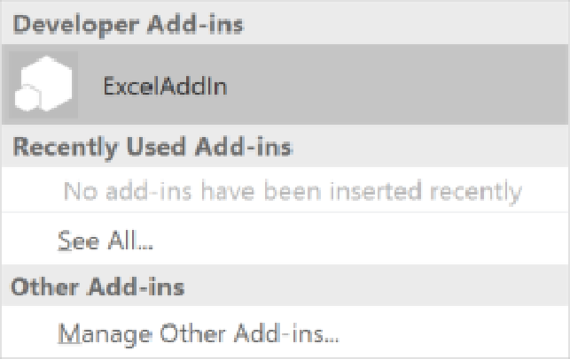

9.  The add in should now appear in the right task pane.  Click close and save your Excel file.
6.  Navigate to [https://msdn.microsoft.com/en-us/office/office365/howto/add-common-consent-manually] to create your application in Azure and attain your **Client ID**.  Note this ID as it will be used later in the lab.
7.  Add your http://localhost address to your RedirectURI's in Azure.  
8.  Double-click on the ExcelAddIn App for Office project.
9.  Set the Display name to **Skype for Business Excel Add In**
8.  Press **F5** or **the Start Button** in Visual Studio.  The Excel sheet should appear:
    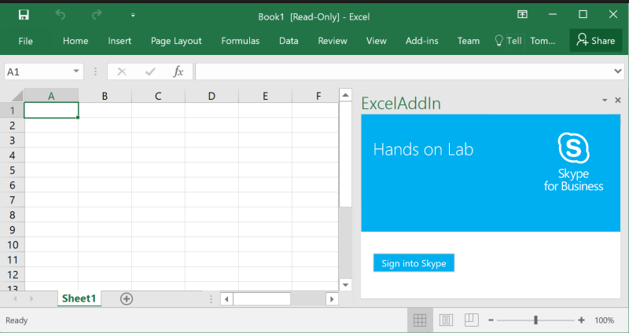

##Signing into Skype for Business
This section will instruct a user on how to add code to your application in order to connect to Skype for Business.

1.  Copy the Client ID from above and paste into `ExcelWebApp\App\Home\Scripts\Config.js`replacing the text after **clientId:**.

2.  Open the `ExcelWebApp\App\Home\Scripts\Home.js` file.
3.  Remove the `function getDataFromSelection()` from the js file.
4.  Remove all content from inside `Office.initialize` except the document.ready:
```javascript
 // The initialize function must be run each time a new page is loaded
    Office.initialize = function (reason) {
        $(document).ready(function () {
        });
    };
```

5.  Create a **showSkypeLogin()** method:
```javascript
 function showSkypeLogin() {
        var url = config.authLink +
               '&client_id=' + config.clientId +
               '&redirect_uri=' + config.redirect_uri +
               '&resource=' + config.authResource;
        console.log('login url: ' + url);
        location.assign(url);
    }
```
This method will display the standard azure authentication page.  On successful username/password submission, the Azure login will redirect the user to the specified URI (**redirect_uri**) from the **showSkypeLogin()** query string.

6.  Add the sign in button click event:
```javascript
 Office.initialize = function (reason) {
        $(document).ready(function () {
            $('#signinbtn-email').click(showSkypeLogin);
});
}
```

7.  Press F5 or the "Start Debug" button in Visual Studio to test bringing up the Azure authentication page.  You should see the following view in the add-in pane:
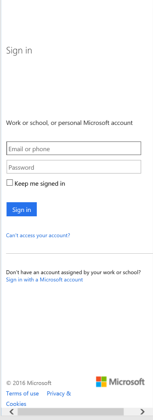
Close the Excel sheet.

8.  Create the following **pageLoading()** function to display the Skype Loading gif:
```javascript
    function pageLoading() {
        $('#content-main').hide();
        $('#content-loading').show();
    }
```

9.  Add the **pageLoading()** method to initialize:

	```javascript
 	Office.initialize = function (reason) {
    	    $(document).ready(function () {
            $('#signinbtn-email').click(showSkypeLogin);
            pageLoading();
	});
	}
	```

10.  Add the access token hash code to retrieve the acess token from your login redirect:

    ```javascript
     Office.initialize = function (reason) {
            $(document).ready(function () {
                $('#signinbtn-email').click(showSkypeLogin);
                pageLoading();

                if (/^#access_token=/.test(location.hash)) {
                    access_token = location.hash.match(/\#(?:access_token)\=([\S\s]*?)\&/)[1];
                    console.log('accessToken: ' + access_token);
                    $('#accessToken').val(access_token);
                }
                else {
                    $('#content-main').show();
                    $('#content-loading').hide();
    }
    });
    }
    ```
This access token will authenticate the user when attempting to sign into Skype for Business.

11.  Add the Skype initialization code to your **$(document).ready()** function

	```javascript
    Skype.initialize({
    	apiKey: config.apiKeyCC
        }, function (api){
        	apiManager = api;
            client = apiManager.UIApplicationInstance;
            client.signInManager.state.changed(function(state){
            	$('#loginState').text(state);
            });
            if (access_token){
            	signIn();
            }
        }
    );
    ```
The initialize method is setting up the apiManager and client objects for use later in the application.  It's also setting up a listener to report the logged in user's State, which may be Signed Out, Signing in, and Signed In.

12.  Create the following new methods for displaying logged in presence:
```javascript
function setPresenceIcon(state) {
        switch (state) {
            case "Online":
                return "Images/available.png";
            case "Offline":
            case "Unknown":
            case "Hidden":
            default:
                return "Images/unknown.png";
            case "Busy":
                return "Images/busy.png";
            case "Idle":
            case "IdleOnline":
            case "Away":
            case "BeRightBack":
                return "Images/away.png";
            case "DoNotDisturb":
                return "Images/do-not-disturb.png";

        }
    }
```
The **setPresenceIcon(state)** method will return the image path to represent the presence returned from the Skype for Business Online SDK when you subscribe to your own presence.  Later, this same method can be used to display other user presence as well.
```javascript
 function showContacts() {
        $('.signIn').hide();
        $('.loggedIn').show();
        $('#content-main').show();
        $('#content-loading').hide();
    }
```
The **showContacts()** method will hide your loading gif and display the logged in user area of the add-in.  
```javascript
    function signIn() {
        var params =
     {
         "auth": access_token,
         "client_id": config.clientId,
         "origins": ["https://webdir.tip.lync.com/autodiscover/autodiscoverservice.svc/root"],
         "cors": true,
         "version": "sdk-samples/1.0.0"
     };
        if (client.signInManager.state() == 'SignedOut') {
            client.signInManager.signIn(
                params
            ).then(function () {
                showContacts();
            }, function (error) {
                console.log(
                    'Error signing in: '+ error || 'Cannot sign in');
            });
        }
        else {
            schowContacts();
        }
    }
```
The **signIn()** method will take the access_token value returned from the user's successful Azure login and pair it along with your clientId to authenticate the user's access to the Skype for Business Online SDK features.  On successful login, the user will be displayed with the logged in user name, email, and presence.  Also appearing, will be a section used later on for displaying other Skype user information in a section called **Contact Info**.

13.  Press F5 or Start Debugging.
14.  Click the "Sign into Skype" button and provide your credentials.  After submitting the credentials, you should see the Skype "Loading" animated gif and then be presented with the following screen:
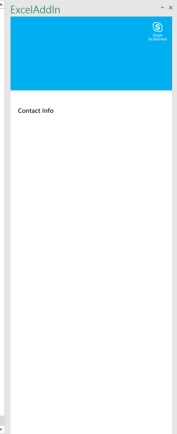.

##Setting up Excel Data

In this section the user will setup Excel data and create an excel function to using the Office 365 JavaScript API to read the Excel data.

1. Double-click `TestExcel.xlsx`
2. In **Column A**, add an existing user's email per row that has been setup for this demo.
3. Press Ctrl+S to save the file and then close.
4. Open the Home.js file.
5. Create the following methods in the `Home.js` file:

    ```javascript
     function excelClickHandler(eventArgs) {
            eventArgs.document.getSelectedDataAsync(Office.CoercionType.Text, function (asyncResult) {
                if (asyncResult.status == Office.AsyncResultStatus.Failed) {
                    $('#selectedText').text('error');
                }
                else {
                    $('#selectedText').text(asyncResult.value);
                }
            });
        }
    ```

    The **excelClickHandler(eventArgs)** method handles the **DcoumentSelectionChanged** event from the Office 365 javascript API.  The selected data will return a text value representing the text in the highlighted field in the spreadsheet.

    ```javascript
     Office.context.document.addHandlerAsync("documentSelectionChanged", excelClickHandler, function (result) {
                });
    ```

    Add the previous javascript to the **document.ready** function of your javascript.  Your document.ready should now look like the following:

    ```javascript
            $(document).ready(function () {
                Office.context.document.addHandlerAsync("documentSelectionChanged", excelClickHandler, function (result) {
                });
                $('#signinbtn-email').click(showSkypeLogin);
                pageLoading();
                if (/^#access_token=/.test(location.hash)) {
                    access_token = location.hash.match(/\#(?:access_token)\=([\S\s]*?)\&/)[1];
                    console.log('accessToken: ' + access_token);
                    $('#accessToken').val(access_token);
                }
                else {
                    $('#content-main').show();
                    $('#content-loading').hide();
                }
                Skype.initialize({
                    apiKey: config.apiKeyCC
                }, function (api) {
                    apiManager = api;
                    client = apiManager.UIApplicationInstance;
                    client.signInManager.state.changed(function (state) {
                        $('#loginState').text(state);
                    });
                    if (access_token) {
                        signIn();
                    }
                });
            });
    ```

##Retrieving Selected User Information
Now that the functionality for getting selected information from Excel is setup, the user can now pass that information into the Skype for Business Online SDK to retrieve other user information.

1. Create the **getSelectedEmployeeInfo(email)** method in the `Home.js` file.

    ```javascript
    function getSelectedEmployeeInfo(email) {
        if (email) {
            var emp = email;
            var query = client.personsAndGroupsManager.createPersonSearchQuery();
            query.text(emp);
            query.limit(1);
            query.getMore().then(function (results) {
                $('#contactInfo').show();
                results.forEach(function (item) {
                    var person = item.result;
                    $('#selectedName').text(person.displayName());
                    var avatar = person.avatarUrl();
                    //TODO: avatar URL is currently a 401 UNAUTHORIZED
                    //$('#selectedPhoto').attr("src", avatar);
                    $('#selectedPhoto').attr('src', 'Images/default.png');
                    var sip = person.id();
                    $('#selectedSIP').val(sip);
                    person.emails.get().then(function (e) {
                        e.forEach(function (email) {
                            $('#selectedEmail').text(email.emailAddress());
                        });
                    });
                    person.status.get().then(function (s) {
                        $('#selectedStatus').text(s);
                        $('#selectedPresenceIcon').attr('src', setPresenceIcon(s));
                    });
                    person.status.changed(function (newStatus) {
                        $('#selectedStatus').text(newStatus);
                        $('#selectedPresenceIcon').attr('src', setPresenceIcon(newStatus));
                    });
                    person.status.subscribe();
                    $('#selectedCall').attr('href', 'Callto:' + sip);
                    $('#selectedVideo').attr('href', 'Callto:' +sip);
                });
            });
        }
    }
    ```

    This method will search the people in the logged in user organization for the specified email passed into the method.  When a match is found, the application will retrieve the selected user display name, sip address (needed later to initiate a chat), email, and status.  In addition to getting the current status of the selected user, the application will listen for any status changes and update the UI with the change.

2. Find the **excelClickHandler(eventArgs)** method and replace it with the following code:

    ```javascript
    function excelClickHandler(eventArgs) {
            eventArgs.document.getSelectedDataAsync(Office.CoercionType.Text, function (asyncResult) {
                if (asyncResult.status == Office.AsyncResultStatus.Failed) {
                    $('#selectedText').text('broke');
                }
                else {
                    $('#selectedText').text(asyncResult.value);
                    getSelectedEmployeeInfo(asyncResult.value);
                }
            });
        }
        ```

    On successful cell selection now within the Excel sheet, this method will call the **getSelectedEmployeeInfo(email)** method and pass in the email value read from the cell.  The selected user information will eventually be displayed in the Contact Info section of the markup.

5. Run the code and login.
6. Once you are logged in, select an Excel cell with an email address.  Watch the right task pane updated with the selected user contact information:

	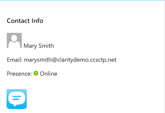

7. If you select another user, you will see the contact info update again in the task pane.

##Connecting to chat using the Conversation Control

A new feature in the Skype for Business Online SDK is the Conversation Control.  In this section, we'll cover creating and listening for new chat notifications as well as painting the conversation control into your HTML.

    
2. Create the **monitor(title, promise)** function in the `Home.js` file:

	```javascript
    function monitor(title, promise) {
        console.log(title, 'started');
        promise.then(function (res) {
            console.log(title, 'succeeded', res);
        }, function (err) {
            console.log(title, 'failed', err && err.stack || err);
            alert(title + ' failed:' + err);
        });
    }
    ```
    The monitor code will execute the promise.
    
2. Create the **startConversation()** method and the **endConversation()** method in the Home.js file:

    ```javascript
    function startConversation() {
            $('#conversation').show();
            $('.contact-info').hide();
            var chatSip = $('#selectedSIP').val();
            var uris = [chatSip];
            var container = document.getElementById(chatSip);
            if (!container) {
                container = document.createElement('div');
                container.id = chatSip;
                document.querySelector('#conversations').appendChild(container);
            }
            else {
                document.querySelector('#conversations').removeChild(container);
            }
                var promise = apiManager.renderConversation(container, { modalities: ['Chat'], participants: uris });
                monitor('start conversation', promise);
        }

    function endConversation() {
        $('#conversation').hide();
        $('.contact-info').show();
        apiManager.UIApplicationInstance.conversationsManager.conversations.get().then(function (conversationsArray) {
            if (conversationsArray && conversationsArray.length > 0) {
                conversationsArray.forEach(function (element, index, array) {
                    console.log("Closing existed conversation...");
                    var convo = apiManager.UIApplicationInstance.conversationsManager.conversations(0);
                    convo.leave();
                    apiManager.UIApplicationInstance.conversationsManager.conversations.remove(element);
                });
            }
        });
    }
    
    function conversationHandler() {
        var test = '';
        client.conversationsManager.conversations.added(function (conversation) {
            conversation.selfParticipant.chat.state.when('Notified', function () {
                $('#conversation').show();
                $('.contact-info').hide();
                var id = conversation.participants(0).person.id();
                var container = document.getElementById(id);
                if (!container) {
                    container = document.createElement('div');
                    container.id = id;
                    document.querySelector('#conversations').appendChild(container);
                }
                else {
                    document.querySelector('#conversations').removeChild(container);
                }
                var promise = apiManager.renderConversation(container, {
                    modalities: ['Chat'],
                    participants: [id]
                });
                monitor('start conversation', promise);
            });
        });

    }
    ```
    In the **startConversation()** method, the selected user sip address is created as an ID for a container to hold the conversation control markup.  The renderConversation method requires that a chat modality be specified, a participant sip to start the conversation, and a container to pain the control.
    
    The **endConversation()** method is removing the conversation from the conversation manager.
    
    The **conversationHandler()** method will listen for any incoming chat notifications and paint the conversation control when received.
    
	These methods will be hooked into the click actions of the buttons below:
    
    ```javascript
    $('#selectedChat').click(startConversation);
    $('#closeChat').click(endConversation);
            ```
    Add the previous two button click events to the **document.ready(function(){})** function.
    
    ```javascript
    conversationHandler();
    ```
    
    Add the **conversationHandler()** method to the **showContacts** method so the application will listen for incoming messages as soon as the user is logged in.
    
4. Press F5 or Start Debug to start the application.
5. Open the Skype for Business desktop client and login with another user.
6. In the Excel Add-in, click on that user in Excel.
7. Once you see the user information, click the chat icon
8. Type a message and press Enter.
9. Type a message in the Skype for Business Client and type enter.  You should see your first chat interaction.

	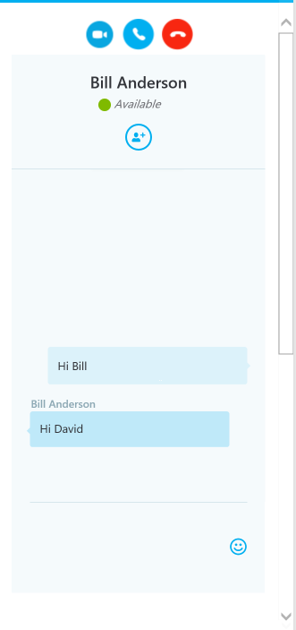
    
10. Close the chat by clicking the red phone button.
11. Select another user in Excel, click the chat icon, and then click the video icon.
12. A new Skype for Business Client window will open up ready to connect to the selected user.
13. The code responsible for launching the Skype for Business Client message window can be found in the **getSelectedEmployeeInfo(email)** method:

    ```javascript
    $('#selectedCall').attr('href', 'Callto:' + sip);
    $('#selectedVideo').attr('href', 'Callto:' +sip);
    ```
    **#selectedCall** and **#selectedVideo** are both anchor tags on the `Home.html` page.  What the code above is doing is adding a **Callto:sip:yourperson@example.com** to the anchor tag.  When clicking on these links, the callto is a command that launches the Skype for Business Client with a message directed to the sip specified in the command.  This is similar to a **mailto:** command that will start a users default email client from a web page.

##Publishing the Add-in

For other users in your organization to use the add-in you've just created, the add-in must be published to your tenants Office 365 App Store.  This section will guide the user on how to test the application in a browser and then publish it for others to use.

1. Right-click on the **ExcelAddIn** App for Office project and select Publish.
2. In the **Current Profile** drop down, select **New**.

	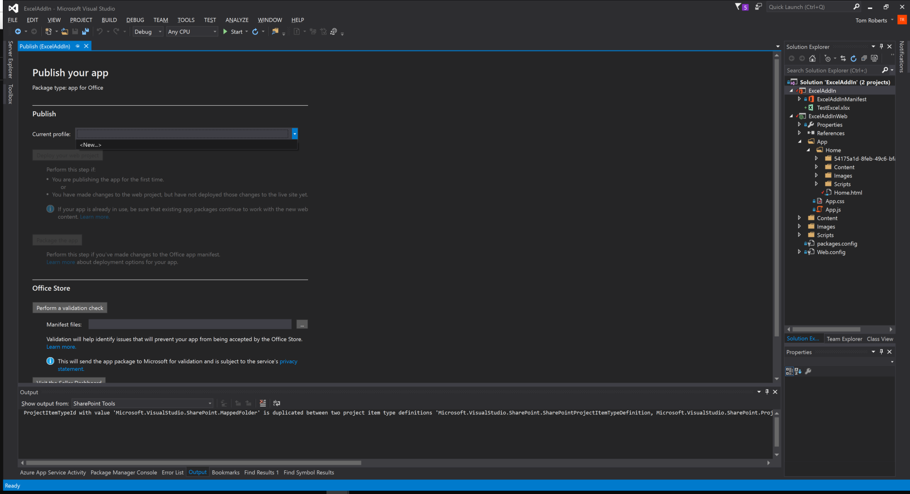

3. Select **Import publishing profile** and browse to the downloaded Azure Publish Profile from the pre-requisites.  Click Finish.

	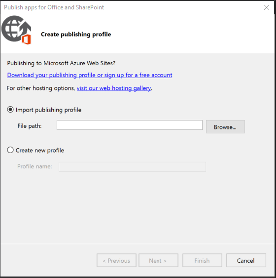

4. Double-click the ExcelAddinManifest file and make sure the source location is set to `https://[yourwebsitedomain]/App/Home/Home.html`
5. Add your O365 tenant domain to the AppDomains list on the ExcelAddInManifest>App Domains tab.

	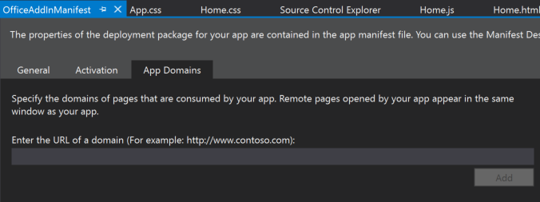

6. On the Publish screen, click the **Package the app** option.

	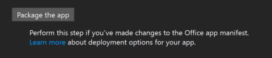

7. Next, click the **Deploy your web project** button on the Publish screen.

	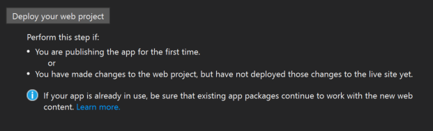

8. Use the Web Deploy Option and follow the wizard.
9. Follow the steps at this link to publish your add-in to the app catalog [https://msdn.microsoft.com/en-us/library/office/fp123515.aspx]

10. Login to the Office 365 portal [https://portal.officeppe.com].
11. Open a new Excel document.
12. On the Insert Tab, select **Add-ins**
13. Select the Add-in you just created.  You should now be able to use your add-in in Office 365.
