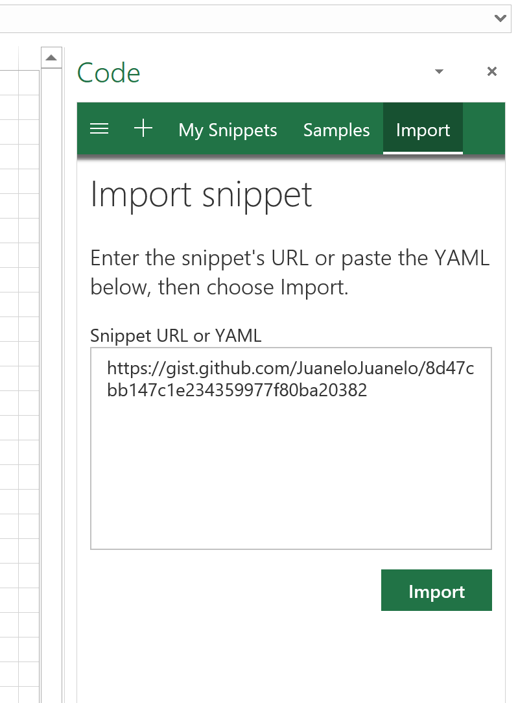
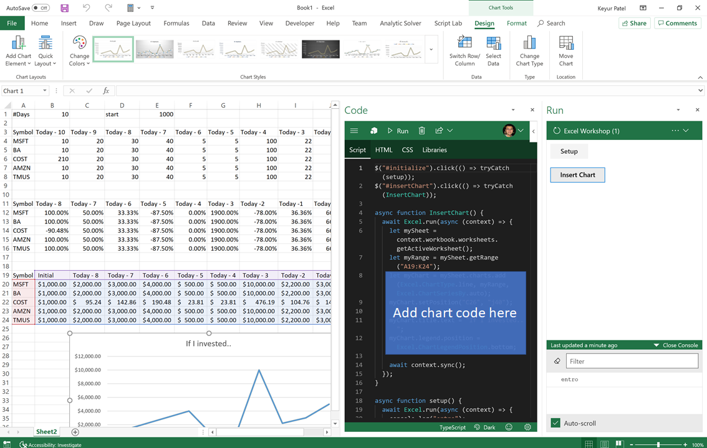
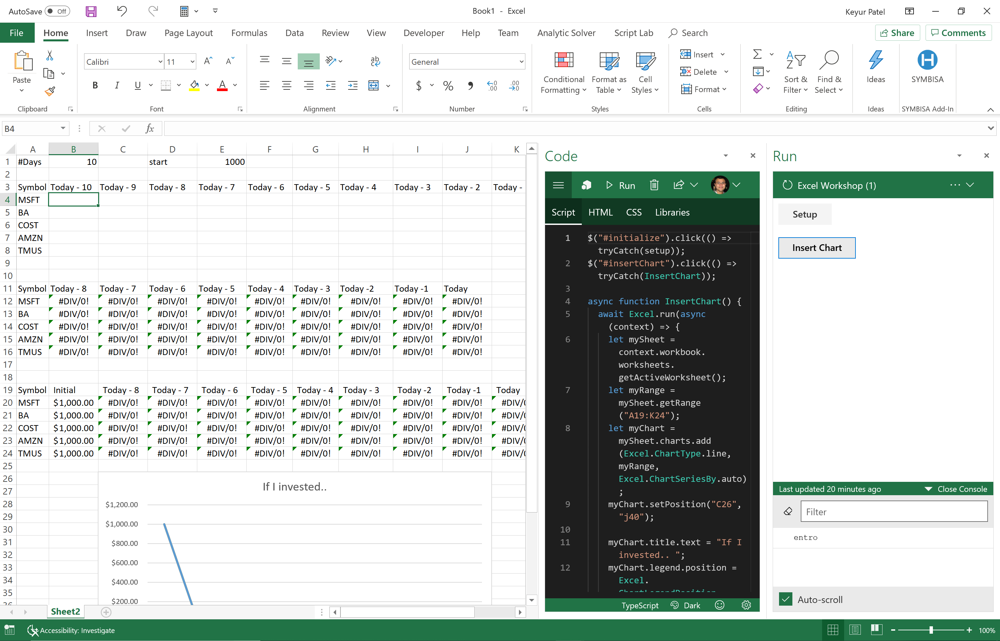
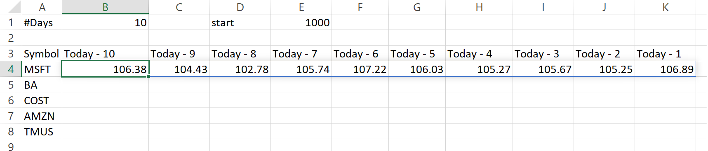
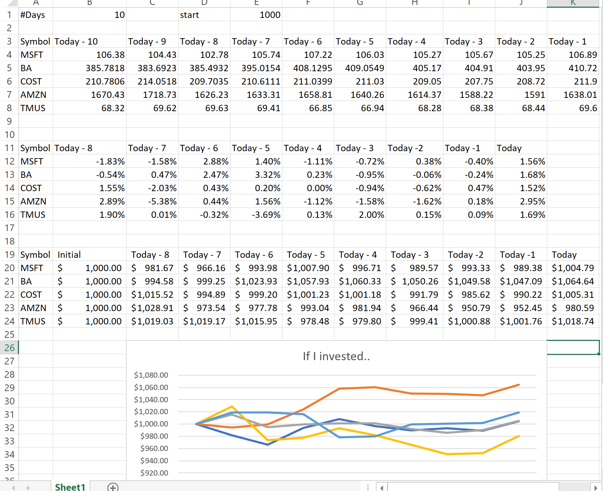

# Objectives
1.	Learn about the fundamentals of Dynamic Arrays
2.	Learn about Excel Add-ins and JavaScript Custom Functions
3.	Use the Dynamic Arrays, Custom Functions, and the Excel APIs to build a live stock quote dashboard

# Requirements
*	Please have the either:
       the latest Office Insiders build; or Office Monthly Channel (Microsoft) with this Regkey: **https://aka.ms/EnableDAKey**
*	Get the Dynamic Array Demo Workbook: **https://aka.ms/DADemo**
*	You will need to have the ScriptLab add-in installed. Click the [link](https://appsource.microsoft.com/en-us/product/office/WA104380862?src=office&corrid=e44124b9-e34d-4066-91e8-b6a47f385837&omexanonuid=195b3715-8256-4d6a-9650-b63032b39a0b&referralurl=) and click **Get It Now**; or in Excel click **Insert > Add-ins > Get Add-ins > Search for "Script Lab" and click install**)

# Step 1: Learn about Dynamic Arrays [10 minutes]
1.	Download the Dynamic Array Demo Workbook: **https://aka.ms/DADemo**
2.	Open in Excel
1.	In cell H5 enter: =UNIQUE(Sales[Product])
2.	In cell I5 enter: =SUMIF(Sales[Product],H5#,Sales[Units])
3.	In cell K5 enter: =FILTER(Sales,Sales[Region]=M2)

# Step 2: Create a report using the Excel APIs [10 minutes]
1.	Go to the Script Lab ribbon tab and select **Code**. Once Script Lab loads in the pane, select the hamburger menu on the top left, then **Import** to import a new snippet. 
2.	Copy and paste this URL into the sample: https://gist.github.com/JuaneloJuanelo/8d47cbb147c1e234359977f80ba20382 
       
       It should look like: 

3.	Click **Run** on the Script Lab Ribbon.
4.	Click **Setup** in the Run pane. You’ll see random stock values as well as a calculation of daily % gain/loss as well as a “How To" table at the end simulating a potential investment of 1000 USD. 
5.	Please spend a few minutes in Script Lab code window on Script Lab and analyze how the Workbook is initialized. Please note how to add values, formulas and formatting to the cells.
6.	Now the fun part. Add some sample code to add a Line chart with all the “A19:K24" values to visualize what investment would have been more successful. 
7.	HINT: Implement the InsertChart method.  (Please try it, but if you give up here is the solution https://gist.github.com/JuaneloJuanelo/bfe74669df303cbfcbe7efa4f34b1a21 )
If your code is successful you should see something like this:

# Step 3: Make the report dynamic with Excel Custom Functions [10 minutes]
1.	Using same workbook as above, Go to the Script Lab ribbon tab and select **Code**. Once Script Lab loads in the pane, select the hamburger menu on the top left, then **Import** to import a new snippet.
2.	Copy and paste this URL into the sample: https://gist.github.com/keyur32/bf7ec71a6e0c8bc9b19900a6d62f447a 
3.	Take a look at the function code. It’s a simple javascript function that makes a web request to the Azure Function endpoint, using the fetch api.
4.	Next, in the ribbon under the **ScriptLab** tab, click the **Functions** button to register your custom function using ScriptLab.
5.	You should see a note that the function registered successfully:
“=ScriptLab.ReadyDemo.StockQuotes(...)”
6.	In your workbook, delete cells B4:D8. It should look like this:  
7.	In cell B4, enter the function, =SCRIPTLAB.READYDEMO.STOCKQUOTES(A4, $B$1).  It should return an array like the following: 

8.	Fill down cell B4 to B8  (you can select B4:B8 and press Ctrl+D). You should see something like this: 
9.	Viola!  Now try changing B1 to the number 5, and see the the Custom Functions return that many days of data.

> Notes: 
> -	if you get #VALUE!, this may mean you do not have Dynamic Arrays feature enabled. Try setting the regkey again.  If you see #N/A!, you’ve hit a known bug and you may need to update your build of Office.
> -	The functions may be a bit slow to calculate. This is b/c you’re hitting Keyur’s Azure Function hosted on his personal azure subscription (so free tier, not production).  Also the function doesn’t employ any batching strategies as you normally should do. 
> -    If in ScriptLab, you get an error registering your function, you will need to restart Excel (it is a current known issue on the Microsoft and Insiders builds).

